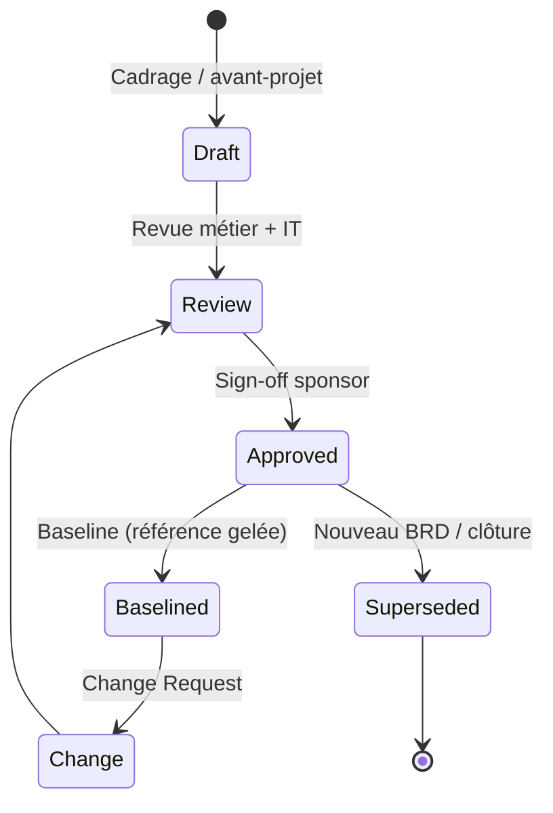
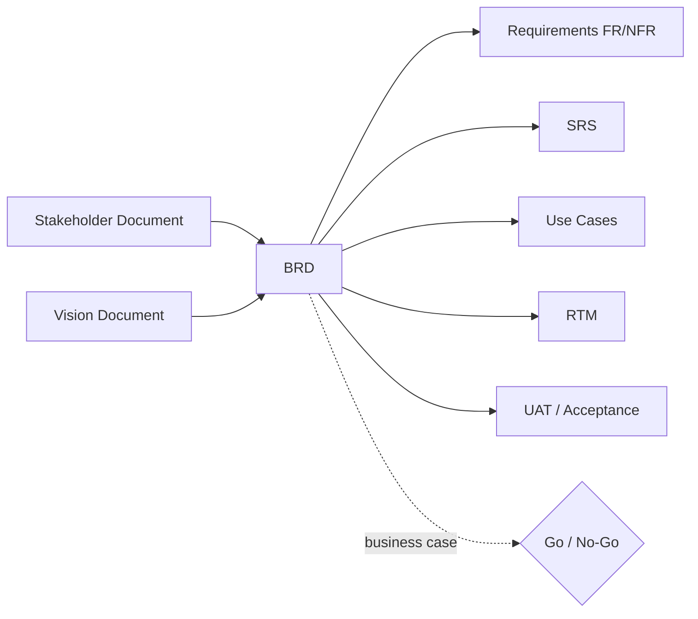
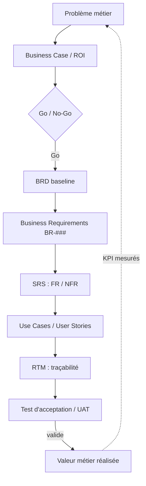

# BRD — Business Requirements Document

> 📁 Phase : ① Business & Requirements · 🏷️ Acronyme : **BRD** · 🔤 EN : _Business Requirements Document_

---

## 1. Définition & objectif

Le **BRD** est le document qui formalise **le problème métier à résoudre et le résultat attendu par l'organisation**, sans décrire _comment_ la solution sera construite. Il répond à la question « **Pourquoi lançons-nous ce projet et qu'attend le business ?** ».

C'est un document **orienté valeur** (business value), rédigé dans le langage des parties prenantes métier, qui sert de **contrat d'intention** entre le sponsor/le métier et l'équipe qui délivrera la solution.

| Ce qu'il EST                                        | Ce qu'il N'EST PAS             |
| --------------------------------------------------- | ------------------------------ |
| Un énoncé du besoin métier et de la valeur attendue | Une spécification technique    |
| Le « pourquoi » et le « quoi » de haut niveau       | Le « comment » (→ SRS, Design) |
| Un référentiel de décision (go/no-go, budget)       | Un backlog détaillé            |

---

## 2. Usage & utilité

- **Aligner** sponsors, métier et IT sur un même énoncé du problème et des objectifs.
- **Justifier l'investissement** : sert de base au _business case_ (ROI, coût de l'inaction).
- **Cadrer le périmètre** amont, avant tout engagement de conception/développement.
- **Servir de source** pour dériver les exigences détaillées (SRS), les use cases et le plan de test d'acceptation.
- **Arbitrer** en cas de conflit : on revient au BRD pour trancher « est-ce dans l'intention initiale ? ».

**Sans BRD** : périmètre flou, objectifs implicites, désalignement métier/IT, _scope creep_ incontrôlé.

---

## 3. Périmètre (in / out of scope)

**In scope**

- Contexte et problème métier, opportunité de marché.
- Objectifs business mesurables (SMART) et KPI de succès.
- Parties prenantes et leurs attentes de haut niveau.
- Besoins métier (_business requirements_, niveau `BR-###`).
- Périmètre fonctionnel macro (capacités attendues), hypothèses, contraintes, dépendances.
- Analyse coûts/bénéfices de haut niveau, risques majeurs.

**Out of scope**

- Exigences fonctionnelles détaillées → **SRS** / **Requirements FR**.
- Choix d'architecture, de technologie, d'implémentation → **SAD / HLD / LLD**.
- Détail des écrans, des données, des API → **Design / API Spec / Data Model**.
- Planning détaillé et affectation des ressources → plan projet.

---

## 4. Cycle de vie du document



- **Naissance** : phase d'**avant-projet / initiation** (idéation, cadrage).
- **Vie** : sert de référence pendant la phase requirements ; peut évoluer via **change requests** formels une fois _baselined_.
- **Fin** : archivé à la clôture du projet ou **remplacé** (_superseded_) par un nouveau BRD lors d'une évolution majeure. Il reste un document de traçabilité historique.

> ⚠️ En cadre agile, le BRD est souvent **plus léger et vivant** (voir §12), mais l'intention métier reste tracée.

---

## 5. Métiers / rôles concernés (RACI)

| Activité                          | Business Analyst | Sponsor / Product Owner | Métier (SME) | Architecte / Tech Lead | PMO |
| --------------------------------- | :--------------: | :---------------------: | :----------: | :--------------------: | :-: |
| Rédaction du BRD                  |      **R**       |            A            |      C       |           C            |  I  |
| Définition des objectifs business |        C         |         **R/A**         |      C       |           I            |  I  |
| Validation du périmètre           |        C         |          **A**          |      C       |           C            |  I  |
| Sign-off / approbation            |        I         |          **A**          |      C       |           I            |  I  |
| Gestion des changements           |      **R**       |            A            |      C       |           C            |  C  |

**R**esponsible · **A**ccountable · **C**onsulted · **I**nformed.

> Le **Business Analyst (BA)** est typiquement le rédacteur ; le **Sponsor** est le décideur (_accountable_).

---

## 6. Position & interactions avec les autres documents



| Document                     | Relation                                                                     |
| ---------------------------- | ---------------------------------------------------------------------------- |
| **Vision Document**          | Le BRD s'inscrit dans la vision produit ; parfois fusionnés (BRD & Vision).  |
| **Stakeholder Document**     | Fournit la liste et les attentes des parties prenantes reprises dans le BRD. |
| **SRS / Requirements**       | Dérivés du BRD : chaque `FR/NFR` doit tracer vers un `BR`.                   |
| **Use Cases / User Stories** | Traduisent les besoins métier en scénarios d'usage.                          |
| **RTM**                      | Trace `BR → FR → design → test`.                                             |
| **UAT**                      | Les critères d'acceptation métier découlent des objectifs du BRD.            |

---

## 7. Nommage & versionnement

- **Fichier / titre** : `BRD-<Projet>-v<Major.Minor>` — ex. `BRD-CustomerPortal-v1.2`.
- **Identifiants de besoins** : `BR-001`, `BR-002`… (stables, jamais réutilisés).
- **Versionnement** :
  - `v0.x` = _draft_ ; `v1.0` = première **baseline** approuvée.
  - Incrément **mineur** (`1.1`) : clarification sans changement de périmètre.
  - Incrément **majeur** (`2.0`) : changement de périmètre/objectifs (via CR).
- **Métadonnées d'en-tête** obligatoires : auteur, version, date, statut, approbateurs, historique des révisions.

---

## 8. Template vierge

```markdown
# BRD — <Nom du projet>

| Champ        | Valeur                                |
| ------------ | ------------------------------------- |
| Version      | v0.1                                  |
| Statut       | Draft / Review / Approved / Baselined |
| Auteur       | <BA>                                  |
| Sponsor      | <Nom>                                 |
| Date         | AAAA-MM-JJ                            |
| Approbateurs | <Noms>                                |

## 1. Historique des révisions

| Version | Date | Auteur | Description |
| ------- | ---- | ------ | ----------- |

## 2. Résumé exécutif (Executive Summary)

<3-5 lignes : problème, solution proposée, valeur attendue.>

## 3. Contexte & énoncé du problème

<Situation actuelle, douleur, opportunité, coût de l'inaction.>

## 4. Objectifs business & KPI de succès

| ID    | Objectif (SMART) | Indicateur (KPI) | Cible | Échéance |
| ----- | ---------------- | ---------------- | ----- | -------- |
| OBJ-1 |                  |                  |       |          |

## 5. Parties prenantes (résumé)

| Partie prenante | Rôle | Attente principale |
| --------------- | ---- | ------------------ |

## 6. Périmètre

### 6.1 In scope

### 6.2 Out of scope

## 7. Besoins métier (Business Requirements)

| ID     | Besoin | Priorité (MoSCoW) | Justification / valeur |
| ------ | ------ | ----------------- | ---------------------- |
| BR-001 |        | Must              |                        |

## 8. Hypothèses, contraintes & dépendances

## 9. Risques majeurs

| ID  | Risque | Impact | Probabilité | Mitigation |
| --- | ------ | ------ | ----------- | ---------- |

## 10. Analyse coûts / bénéfices (haut niveau)

## 11. Critères de succès & d'acceptation (macro)

## 12. Glossaire & références
```

---

## 9. Exemple rempli

```markdown
# BRD — Portail Client Self-Service

| Champ   | Valeur               |
| ------- | -------------------- |
| Version | v1.0                 |
| Statut  | Approved             |
| Auteur  | A. Martin (BA)       |
| Sponsor | Dir. Relation Client |
| Date    | 2026-03-14           |

## 3. Contexte & énoncé du problème

70 % des demandes clients (suivi de commande, facture) passent par le centre d'appel,
générant 12 000 appels/mois à ~4,50 € l'appel. Le NPS stagne à 22. Les clients
réclament un accès 24/7 en autonomie.

## 4. Objectifs business & KPI

| ID    | Objectif                    | KPI                                | Cible | Échéance  |
| ----- | --------------------------- | ---------------------------------- | ----- | --------- |
| OBJ-1 | Réduire les appels de suivi | Volume d'appels « suivi commande » | −40 % | T+9 mois  |
| OBJ-2 | Améliorer la satisfaction   | NPS                                | ≥ 35  | T+12 mois |
| OBJ-3 | Réduire le coût de service  | Coût de traitement/demande         | −30 % | T+12 mois |

## 7. Besoins métier

| ID     | Besoin                                                           | Priorité | Valeur               |
| ------ | ---------------------------------------------------------------- | -------- | -------------------- |
| BR-001 | Le client doit consulter le statut de ses commandes en autonomie | Must     | −appels              |
| BR-002 | Le client doit télécharger ses factures                          | Must     | conformité + −appels |
| BR-003 | Le client doit ouvrir un ticket de réclamation en ligne          | Should   | NPS                  |

## 9. Risques majeurs

| ID  | Risque                     | Impact | Prob. | Mitigation                         |
| --- | -------------------------- | ------ | ----- | ---------------------------------- |
| R-1 | Adoption faible du portail | Élevé  | Moyen | Campagne d'onboarding + incitation |
```

---

## 10. Checklist de revue

- [ ] Le **problème métier** est énoncé sans présupposer de solution technique.
- [ ] Chaque **objectif est SMART** et associé à un **KPI mesurable**.
- [ ] Le **périmètre** distingue clairement _in scope_ / _out of scope_.
- [ ] Chaque **besoin `BR-###`** est unique, atomique et priorisé (MoSCoW).
- [ ] Les **parties prenantes** clés sont identifiées et ont validé.
- [ ] Les **hypothèses, contraintes et dépendances** sont explicites.
- [ ] Les **risques majeurs** sont listés avec mitigation.
- [ ] Le document est **sans jargon technique** non défini (glossaire présent).
- [ ] **Sign-off du sponsor** obtenu ; historique des révisions à jour.
- [ ] Traçabilité amont (**Stakeholder/Vision**) et aval (**SRS**) possible.

---

## 11. Anti-patterns & pièges

| Anti-pattern                                               | Pourquoi c'est un problème                            | Correctif                          |
| ---------------------------------------------------------- | ----------------------------------------------------- | ---------------------------------- |
| 🩹 **Solutionnisme** : décrire _comment_ (technos, écrans) | Verrouille la conception trop tôt, brouille le besoin | Rester au niveau « quoi/pourquoi » |
| 🎯 **Objectifs vagues** (« améliorer l'expérience »)       | Non mesurable, non arbitrable                         | Rendre SMART + KPI                 |
| 📚 **BRD fleuve** de 80 pages                              | Personne ne le lit, il périme vite                    | Concision, annexer les détails     |
| 🔁 **Doublon SRS/BRD**                                     | Confusion des responsabilités                         | BRD = métier, SRS = système        |
| 🕳️ **Périmètre implicite** (pas de _out of scope_)         | _Scope creep_ garanti                                 | Lister explicitement l'exclu       |
| 🧊 **Document mort** jamais mis à jour après baseline      | Décisions basées sur un doc périmé                    | Gouvernance de changement (CR)     |
| 👤 **Sponsor absent** de la validation                     | Aucun _accountable_, projet orphelin                  | Sign-off formel                    |

---

## 12. Variantes par industrie / contexte

| Contexte                                                       | Spécificités du BRD                                                                                                                                                           |
| -------------------------------------------------------------- | ----------------------------------------------------------------------------------------------------------------------------------------------------------------------------- |
| **SaaS / Web (agile)**                                         | Souvent allégé ou fusionné avec un _Product Brief_ / _One-Pager_ / _Lean Canvas_. L'intention métier vit dans les epics ; le BRD sert au cadrage initial et au business case. |
| **SI d'entreprise / ESN**                                      | BRD formel, gabarit imposé, sign-off multi-niveaux, base contractuelle (souvent lié à un appel d'offres / cahier des charges).                                                |
| **Systèmes critiques (médical, avionique, ferroviaire, auto)** | Le besoin métier se double d'**exigences réglementaires** (FDA, EASA, CENELEC, ISO 26262). Le BRD alimente la traçabilité normative et le _Safety Case_.                      |
| **Secteur public / marchés**                                   | Prend la forme d'un **cahier des charges fonctionnel (CdCF)** ou d'un **CCTP** ; valeur contractuelle forte.                                                                  |
| **Startup / early stage**                                      | Remplacé par un **Lean Canvas** / **PRD** léger ; priorité à la vitesse de validation.                                                                                        |

---

## 13. Standards & normes

- **BABOK® Guide** (IIBA) — _Business Analysis Body of Knowledge_ : cadre de référence pour les besoins métier et parties prenantes.
- **ISO/IEC/IEEE 29148:2018** — _Requirements engineering_ : distingue _business_, _stakeholder_, _system requirements_ (le BRD couvre les deux premiers niveaux).
- **ISO/IEC/IEEE 12207:2017** — processus du cycle de vie logiciel (processus _Business or Mission Analysis_).
- **PMBOK® / PRINCE2** — le BRD alimente le _Business Case_ et la charte de projet.
- **Cadre français** : _Cahier des Charges Fonctionnel_ (norme NF X50-151, analyse de la valeur).

---

## 14. Outillage recommandé

| Besoin                            | Outils                                                                                             |
| --------------------------------- | -------------------------------------------------------------------------------------------------- |
| Rédaction collaborative           | Confluence, Notion, Google Docs, Markdown + Git                                                    |
| Gestion d'exigences & traçabilité | Jira + plugins (Xray/Requirement Yogi), Azure DevOps, IBM DOORS/DOORS Next, Jama Connect, Polarion |
| Modélisation / cartographie       | Miro, Mural, Lucidchart, draw.io, Mermaid                                                          |
| Business case / KPI               | Tableur, Power BI, dashboards                                                                      |
| Cadrage produit                   | Lean Canvas, Product Brief templates, Aha!, ProductBoard                                           |

---

## 15. Diagramme — Du besoin métier à la traçabilité



---

> 🔎 **En une phrase** : le BRD dit **pourquoi** on fait le projet et **ce que le business attend** ; tout le reste (SRS, design, tests) en découle et doit y rester traçable.

⬅️ [Retour à l'index](../README.md) · ➡️ Suivant : [Vision Document](./02-vision-document.md)
