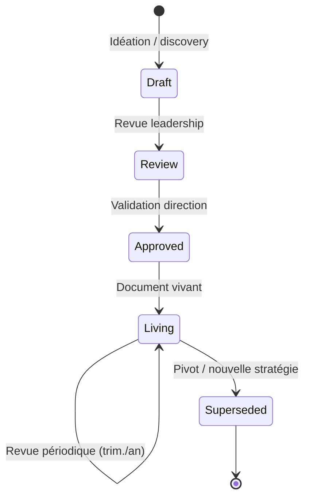
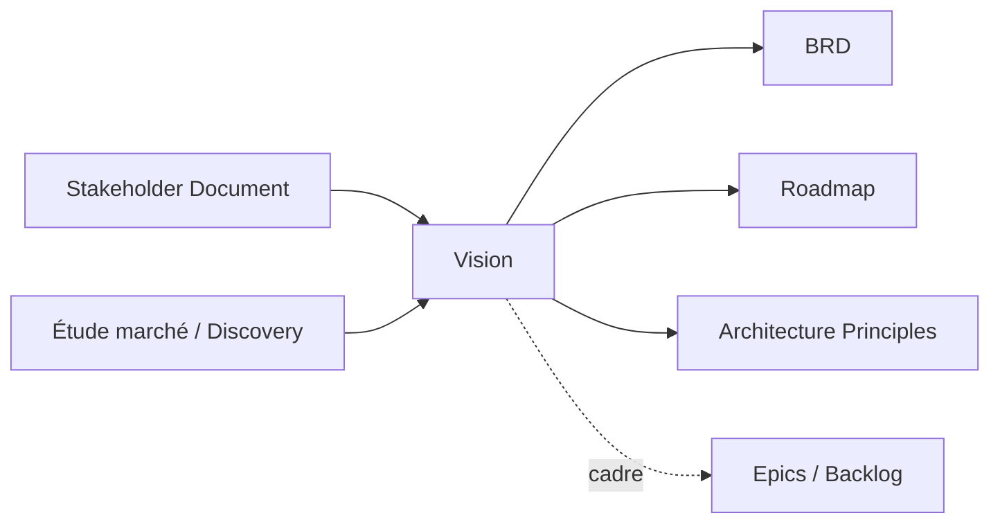
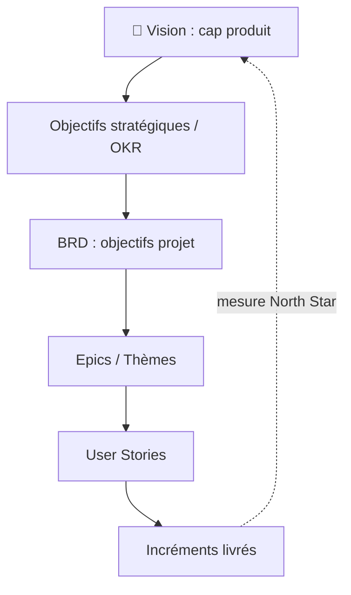

# Vision Document

> 📁 Phase : ① Business & Requirements · 🏷️ Acronyme : **Vision** · 🔤 EN : _Vision Document / Product Vision_

---

## 1. Définition & objectif

Le **Vision Document** décrit **l'état futur désiré** du produit ou du système : la raison d'être, le problème résolu, les utilisateurs cibles, la proposition de valeur et les capacités de haut niveau. Il répond à « **Où allons-nous et pourquoi ça vaut le coup ?** ».

C'est un document **inspirationnel et directionnel**, plus stable et plus long dans le temps que le BRD : il donne le **cap** que déclinent ensuite les besoins, les exigences et le backlog.

| Ce qu'il EST                          | Ce qu'il N'EST PAS               |
| ------------------------------------- | -------------------------------- |
| Le cap produit à moyen/long terme     | Une liste d'exigences détaillées |
| La proposition de valeur & le « why » | Une roadmap datée (planning)     |
| Un outil d'alignement & de motivation | Un document technique            |

---

## 2. Usage & utilité

- **Aligner** toutes les parties prenantes sur une direction commune et durable.
- **Guider les arbitrages** : une décision est-elle _au service de la vision_ ?
- **Motiver** les équipes (sens, mission).
- **Servir de cadre** au BRD, à la roadmap et aux epics.
- **Communiquer** en externe (investisseurs, clients) une ambition claire.

**Sans vision** : produit incohérent, décisions opportunistes, équipes désalignées, _feature factory_.

---

## 3. Périmètre (in / out of scope)

**In scope**

- Énoncé de vision (_vision statement_), mission.
- Problème adressé, opportunité, positionnement marché.
- Utilisateurs/segments cibles et personas de haut niveau.
- Proposition de valeur & différenciation (vs alternatives).
- Capacités/features de haut niveau (thèmes), objectifs stratégiques.
- Contraintes majeures, hypothèses stratégiques.

**Out of scope**

- Exigences détaillées → **BRD / SRS**.
- Roadmap datée et priorisation fine → _Roadmap / backlog_.
- Détail fonctionnel/technique → **Use Cases / SRS / Design**.

---

## 4. Cycle de vie du document



- **Naissance** : phase de **discovery / idéation**, avant ou avec le BRD.
- **Vie** : **document vivant** revu périodiquement (trimestriel/annuel) ; plus stable que le BRD.
- **Fin** : révisé en profondeur lors d'un **pivot** stratégique.

---

## 5. Métiers / rôles concernés (RACI)

| Activité                   | Product Owner / Manager | Sponsor / Direction |  BA   | UX / Design | Équipe / Tech Lead |
| -------------------------- | :---------------------: | :-----------------: | :---: | :---------: | :----------------: |
| Rédaction de la vision     |          **R**          |          A          |   C   |      C      |         I          |
| Validation stratégique     |            C            |        **A**        |   I   |      I      |         I          |
| Alimentation (insights)    |            C            |          C          | **R** |    **R**    |         C          |
| Diffusion & évangélisation |          **R**          |          C          |   I   |      I      |         I          |

**R**esponsible · **A**ccountable · **C**onsulted · **I**nformed.

> Le **Product Manager/Owner** porte la vision ; la **direction/sponsor** l'approuve.

---

## 6. Position & interactions avec les autres documents



| Document                    | Relation                                                     |
| --------------------------- | ------------------------------------------------------------ |
| **BRD**                     | Décline la vision en objectifs et besoins d'un projet donné. |
| **Stakeholder Document**    | Fournit les acteurs dont la vision doit servir les intérêts. |
| **Roadmap / Backlog**       | Séquence dans le temps ce que la vision décrit.              |
| **Architecture Principles** | Les principes techniques doivent soutenir la vision.         |

> 💡 Beaucoup d'organisations **fusionnent Vision + BRD** dans un « Vision & Scope Document » (cf. Karl Wiegers).

---

## 7. Nommage & versionnement

- **Fichier / titre** : `Vision-<Produit>-v<Major.Minor>` — ex. `Vision-CustomerPortal-v2.0`.
- **Versionnement** : incréments **majeurs rares** (changement de cap) ; mineurs pour ajustements.
- **Métadonnées** : version, date, propriétaire (product owner), horizon temporel visé.
- **Format court recommandé** : idéalement **1 à 3 pages**.

---

## 8. Template vierge

```markdown
# Vision — <Nom du produit>

| Champ        | Valeur            |
| ------------ | ----------------- |
| Version      | v1.0              |
| Propriétaire | <Product Manager> |
| Horizon      | <12-24 mois>      |
| Date         | AAAA-MM-JJ        |

## 1. Énoncé de vision (Vision Statement)

> Pour <clients cibles> qui <besoin/problème>,
> le <nom produit> est un <catégorie>
> qui <bénéfice clé / proposition de valeur>.
> Contrairement à <alternatives>,
> notre produit <différenciation>.
> (Format « elevator pitch » de Geoffrey Moore)

## 2. Mission & raison d'être

## 3. Problème & opportunité

## 4. Utilisateurs cibles & personas

| Persona | Besoin | Motivation |
| ------- | ------ | ---------- |

## 5. Proposition de valeur & différenciation

## 6. Objectifs stratégiques

| Objectif | Résultat clé (mesure) |
| -------- | --------------------- |

## 7. Capacités de haut niveau (thèmes / epics)

## 8. Contraintes & hypothèses stratégiques

## 9. Ce que le produit ne fera PAS (anti-scope)

## 10. Indicateurs de succès (North Star Metric)
```

---

## 9. Exemple rempli

```markdown
# Vision — Portail Client Self-Service

## 1. Énoncé de vision

> Pour nos clients B2C qui veulent gérer leurs commandes sans dépendre du support,
> le Portail Client est une plateforme self-service 24/7
> qui donne un accès instantané au suivi, aux factures et à l'assistance.
> Contrairement au centre d'appel, il offre autonomie et disponibilité permanente.

## 3. Problème & opportunité

Le support téléphonique est saturé et coûteux ; les clients modernes attendent
l'autonomie digitale. Opportunité : réduire les coûts ET améliorer la satisfaction.

## 6. Objectifs stratégiques

| Objectif          | Résultat clé                                         |
| ----------------- | ---------------------------------------------------- |
| Autonomie client  | 60 % des demandes traitées en self-service (24 mois) |
| Réduction de coût | −30 % coût de service                                |
| Satisfaction      | NPS ≥ 35                                             |

## 10. North Star Metric

% de clients actifs mensuels sur le portail.
```

---

## 10. Checklist de revue

- [ ] L'**énoncé de vision** est concis, mémorisable et orienté client.
- [ ] Le **problème** et l'**opportunité** sont clairs.
- [ ] Les **utilisateurs cibles** sont identifiés (personas).
- [ ] La **proposition de valeur** et la **différenciation** sont explicites.
- [ ] Les **objectifs stratégiques** sont associés à des **résultats mesurables**.
- [ ] Un **anti-scope** (ce que le produit ne fera pas) est présent.
- [ ] La vision est **stable** (pas une simple liste de features).
- [ ] Elle est **partagée et comprise** par les équipes.

---

## 11. Anti-patterns & pièges

| Anti-pattern                                | Problème                         | Correctif                                  |
| ------------------------------------------- | -------------------------------- | ------------------------------------------ |
| 📋 **Liste de features déguisée en vision** | Pas de cap, juste un backlog     | Recentrer sur le « why » et la valeur      |
| 🌫️ **Vision creuse** (« être le leader »)   | Non actionnable, non distinctive | Ancrer dans un problème client précis      |
| 🔒 **Vision figée** jamais relue            | Décorrélée du marché             | Revue périodique                           |
| 🙈 **Vision non diffusée**                  | Personne ne s'y réfère           | Évangélisation, affichage, onboarding      |
| ⏱️ **Confusion avec la roadmap**            | Mélange cap et planning          | Séparer vision (cap) et roadmap (séquence) |

---

## 12. Variantes par industrie / contexte

| Contexte                | Spécificités                                                                                                       |
| ----------------------- | ------------------------------------------------------------------------------------------------------------------ |
| **SaaS / Startup**      | Central : _Product Vision_ + _North Star Metric_ ; souvent un **Lean Canvas** ou **Vision Board** (Roman Pichler). |
| **Grand groupe / SI**   | Alignée sur la **stratégie d'entreprise** et l'_enterprise architecture_ (vision SI).                              |
| **Systèmes critiques**  | La vision intègre des **objectifs de sûreté/sécurité** comme valeur fondatrice.                                    |
| **Open source**         | Prend la forme d'un **manifeste / charte** de projet.                                                              |
| **Scaled Agile (SAFe)** | Artefact formel _Solution/Program Vision_, revu à chaque PI.                                                       |

---

## 13. Standards & normes

- **SAFe®** — _Vision_ comme artefact officiel (Program/Solution Vision).
- **Scrum** (implicite) — Product Goal (Scrum Guide 2020) proche de la vision.
- **Roman Pichler — Product Vision Board** ; **Geoffrey Moore — Elevator Pitch** (_Crossing the Chasm_).
- **Karl Wiegers — Vision & Scope Document** (_Software Requirements_).
- **ISO/IEC/IEEE 29148** — contexte des besoins (la vision cadre les _stakeholder needs_).

---

## 14. Outillage recommandé

| Besoin               | Outils                                                                  |
| -------------------- | ----------------------------------------------------------------------- |
| Cadrage vision       | Product Vision Board, Lean Canvas, Vision Template (Aha!, ProductBoard) |
| Rédaction & partage  | Confluence, Notion, slides, Markdown                                    |
| Alignement objectifs | OKR tools (Perdoo, Weekdone), roadmapping (Aha!, Productboard)          |
| Facilitation atelier | Miro, Mural                                                             |

---

## 15. Diagramme — La vision comme sommet de la pyramide



---

> 🔎 **En une phrase** : la Vision fixe **le cap durable** (le _why_ et le _where_) ; le BRD et le backlog en sont les déclinaisons temporelles et opérationnelles.

⬅️ [BRD](./01-brd-business-requirements-document.md) · ➡️ Suivant : [Stakeholder Document](./03-stakeholder-document.md)
