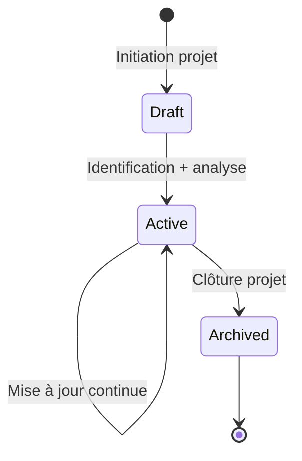
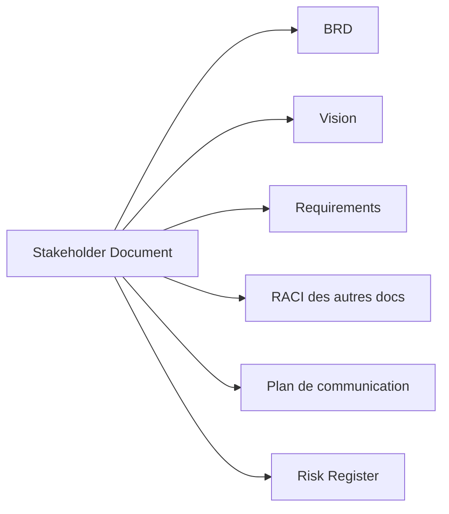
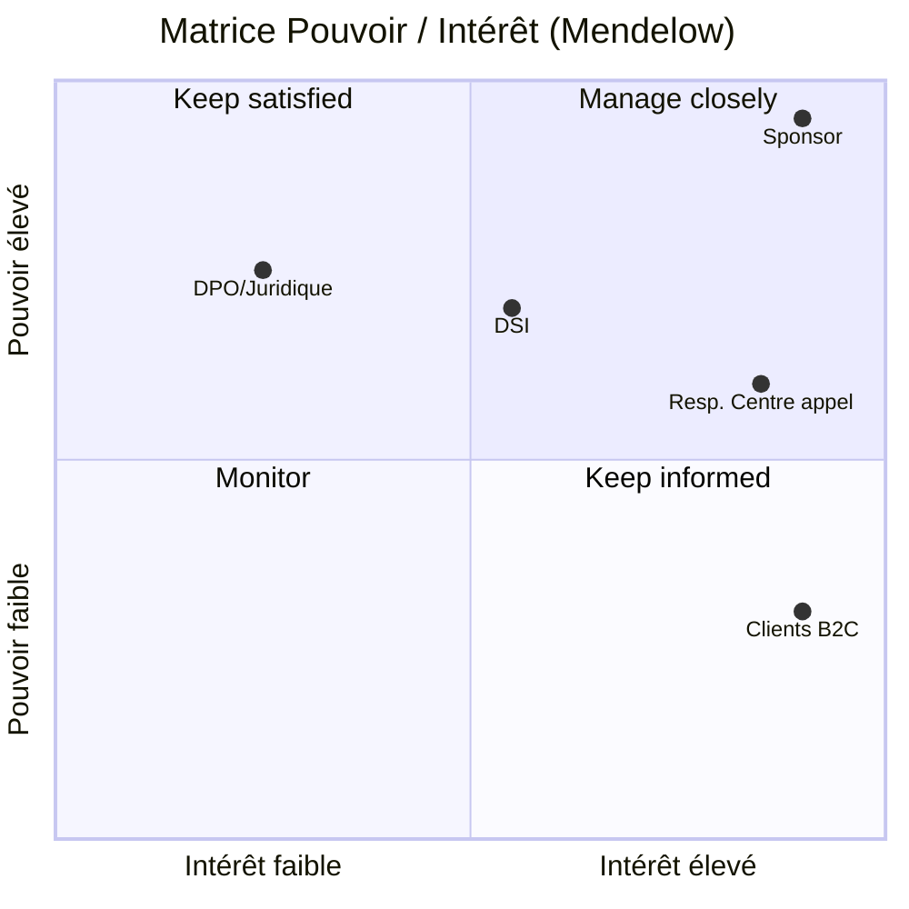

# Stakeholder Document

> 📁 Phase : ① Business & Requirements · 🏷️ Acronyme : **Stakeholder** · 🔤 EN : _Stakeholder Register / Stakeholder Analysis_

---

## 1. Définition & objectif

Le **Stakeholder Document** (registre + analyse des parties prenantes) recense **toutes les personnes, groupes ou organisations qui influencent le projet ou sont influencés par lui**, avec leurs intérêts, leur pouvoir, leurs attentes et la stratégie d'engagement associée. Il répond à « **Qui a un enjeu ici, et comment le gérer ?** ».

| Ce qu'il EST                                   | Ce qu'il N'EST PAS                          |
| ---------------------------------------------- | ------------------------------------------- |
| La cartographie des acteurs et de leurs enjeux | Un organigramme RH                          |
| Un outil de gestion d'engagement/communication | La liste des utilisateurs finaux uniquement |
| Une base pour recueillir les besoins           | Un document figé                            |

---

## 2. Usage & utilité

- **Identifier** exhaustivement qui consulter pour recueillir les besoins (rien oublié).
- **Prioriser** l'engagement selon pouvoir/intérêt (matrice).
- **Anticiper** les résistances et les soutiens (gestion du changement).
- **Planifier la communication** (qui, quoi, quand, comment).
- **Clarifier les responsabilités** (qui décide, qui valide) → alimente les RACI.

**Sans ce document** : parties prenantes oubliées, besoins manquants découverts trop tard, résistances non anticipées, échec d'adoption.

---

## 3. Périmètre (in / out of scope)

**In scope**

- Liste des parties prenantes (internes/externes, primaires/secondaires).
- Rôle, intérêts, attentes, craintes de chacune.
- Niveau de **pouvoir/influence** et d'**intérêt**.
- Attitude (soutien / neutre / opposé) et stratégie d'engagement.
- Canal et fréquence de communication ; contact/référent.

**Out of scope**

- Détail des besoins fonctionnels → **BRD / SRS**.
- Plan de communication opérationnel détaillé → _plan de com projet_.
- Données personnelles sensibles au-delà du strict nécessaire (⚠️ RGPD).

---

## 4. Cycle de vie du document



- **Naissance** : dès l'**initiation**, avant le recueil des besoins.
- **Vie** : **document vivant**, mis à jour à chaque évolution (nouveaux acteurs, changements d'attitude).
- **Fin** : archivé à la clôture ; les _lessons learned_ sur l'engagement sont capitalisées.

---

## 5. Métiers / rôles concernés (RACI)

| Activité                             | Chef de projet / PM |  BA   | Sponsor | Change Manager |
| ------------------------------------ | :-----------------: | :---: | :-----: | :------------: |
| Identification des parties prenantes |        **R**        | **R** |    C    |       C        |
| Analyse pouvoir/intérêt              |          C          | **R** |    A    |       C        |
| Stratégie d'engagement               |        **R**        |   C   |    A    |     **R**      |
| Mise à jour continue                 |        **R**        |   C   |    I    |       C        |

> Souvent porté conjointement par le **PM** (gouvernance) et le **BA** (recueil des besoins).

---

## 6. Position & interactions avec les autres documents



| Document               | Relation                                                        |
| ---------------------- | --------------------------------------------------------------- |
| **BRD / Vision**       | Reprend les attentes de haut niveau des acteurs identifiés ici. |
| **Requirements / SRS** | Chaque exigence devrait tracer vers une partie prenante source. |
| **RACI** (tous docs)   | Les rôles ici alimentent les matrices RACI.                     |
| **Risk Register**      | Une partie prenante opposée = un risque à suivre.               |

---

## 7. Nommage & versionnement

- **Fichier / titre** : `Stakeholder-Register-<Projet>-v<x.y>`.
- **Identifiants** : `STK-001`, `STK-002`…
- **Versionnement** : document vivant, versionné à chaque revue majeure ; historique daté.
- ⚠️ **Confidentialité** : contient des infos sensibles (attitudes, influence) → accès restreint, conformité **RGPD**.

---

## 8. Template vierge

```markdown
# Registre des parties prenantes — <Projet>

| Version | Date | Auteur | Confidentialité |
| ------- | ---- | ------ | --------------- |

## 1. Registre

| ID      | Partie prenante | Rôle/Fonction | Interne/Externe | Intérêt(s) | Attente principale | Pouvoir (1-5) | Intérêt (1-5) | Attitude              | Stratégie d'engagement | Canal / Fréquence | Référent |
| ------- | --------------- | ------------- | --------------- | ---------- | ------------------ | :-----------: | :-----------: | --------------------- | ---------------------- | ----------------- | -------- |
| STK-001 |                 |               |                 |            |                    |               |               | Soutien/Neutre/Opposé |                        |                   |          |

## 2. Matrice Pouvoir / Intérêt

(voir §15)

## 3. Stratégies d'engagement par quadrant

| Quadrant                        | Stratégie                      |
| ------------------------------- | ------------------------------ |
| Pouvoir élevé / Intérêt élevé   | Manage closely (gérer de près) |
| Pouvoir élevé / Intérêt faible  | Keep satisfied                 |
| Pouvoir faible / Intérêt élevé  | Keep informed                  |
| Pouvoir faible / Intérêt faible | Monitor                        |
```

---

## 9. Exemple rempli

```markdown
## 1. Registre — Portail Client Self-Service

| ID      | Partie prenante            | Rôle           | Int/Ext | Attente                  | Pouvoir | Intérêt | Attitude | Stratégie                       |
| ------- | -------------------------- | -------------- | ------- | ------------------------ | :-----: | :-----: | -------- | ------------------------------- |
| STK-001 | Dir. Relation Client       | Sponsor        | Interne | ROI, −coûts              |    5    |    5    | Soutien  | Manage closely                  |
| STK-002 | Responsable Centre d'appel | Manager        | Interne | Préserver emplois        |    3    |    5    | Opposé   | Manage closely + accompagnement |
| STK-003 | Clients B2C                | Utilisateurs   | Externe | Autonomie 24/7           |    2    |    5    | Soutien  | Keep informed (bêta, feedback)  |
| STK-004 | DPO / Juridique            | Conformité     | Interne | RGPD                     |    4    |    2    | Neutre   | Keep satisfied                  |
| STK-005 | DSI                        | Fournisseur IT | Interne | Sécurité, maintenabilité |    4    |    3    | Neutre   | Keep satisfied                  |
```

> Note : STK-002 (opposant à fort intérêt) est un **risque d'adoption** → à gérer de près via accompagnement au changement.

---

## 10. Checklist de revue

- [ ] Les parties prenantes **internes ET externes** sont couvertes.
- [ ] Les acteurs **indirects** (juridique, conformité, sécurité, exploitation) ne sont pas oubliés.
- [ ] Chaque acteur a un **intérêt** et une **attente** documentés.
- [ ] Le **pouvoir** et l'**intérêt** sont évalués (matrice à jour).
- [ ] L'**attitude** (soutien/opposition) et une **stratégie d'engagement** sont définies.
- [ ] Les **opposants influents** ont un plan de gestion (lien Risk Register).
- [ ] Un **référent/contact** est identifié pour chacun.
- [ ] La **confidentialité / RGPD** est respectée.

---

## 11. Anti-patterns & pièges

| Anti-pattern                                            | Problème                                   | Correctif                         |
| ------------------------------------------------------- | ------------------------------------------ | --------------------------------- |
| 👥 **Oublier les acteurs indirects** (ops, sécu, légal) | Exigences/contraintes découvertes tard     | Checklist transverse systématique |
| 🧊 **Registre figé**                                    | Ne reflète plus la réalité politique       | Revue régulière                   |
| 😶 **Ignorer les opposants**                            | Résistance non anticipée, échec d'adoption | Stratégie d'engagement dédiée     |
| 📢 **Communication uniforme** pour tous                 | Sur/sous-communication                     | Adapter par quadrant              |
| 🔓 **Divulgation d'infos sensibles** (attitudes)        | Conflit, non-conformité                    | Accès restreint                   |
| 🙋 **Confondre utilisateur et décideur**                | Mauvais interlocuteur pour valider         | Distinguer les rôles              |

---

## 12. Variantes par industrie / contexte

| Contexte                | Spécificités                                                                                                    |
| ----------------------- | --------------------------------------------------------------------------------------------------------------- |
| **Agile**               | Version allégée ; les stakeholders clés sont représentés par le **Product Owner** ; carte d'acteurs en atelier. |
| **Grand projet / SI**   | Registre formel, gouvernance, comité de pilotage (COPIL).                                                       |
| **Public / marchés**    | Parties prenantes réglementaires, usagers, élus, associations.                                                  |
| **Systèmes critiques**  | Ajout des **autorités de certification** (FDA, EASA, autorité ferroviaire) comme parties prenantes majeures.    |
| **Produit externe/B2C** | Segmentation clients/personas ; poids fort de l'utilisateur final.                                              |

---

## 13. Standards & normes

- **PMBOK® Guide (PMI)** — _Stakeholder Register_ & _Stakeholder Engagement Plan_, matrice Pouvoir/Intérêt.
- **BABOK® (IIBA)** — _Stakeholder Analysis_, matrices (RACI, Onion diagram).
- **ISO 21500 / ISO 21502** — management de projet, gestion des parties prenantes.
- **ISO/IEC/IEEE 29148** — les _stakeholder requirements_ dérivent de ces acteurs.
- **Mendelow's Matrix** — grille Pouvoir/Intérêt de référence.

---

## 14. Outillage recommandé

| Besoin                     | Outils                                                          |
| -------------------------- | --------------------------------------------------------------- |
| Registre                   | Tableur, Confluence, Notion, outils PM (MS Project, Smartsheet) |
| Cartographie visuelle      | Miro, Mural, Lucidchart (Onion diagram, Power/Interest grid)    |
| Engagement / communication | Plan de com, CRM interne, matrices RACI                         |
| Gestion du changement      | ADKAR, outils de change management                              |

---

## 15. Diagramme — Matrice Pouvoir / Intérêt



---

> 🔎 **En une phrase** : ce document répond à **« qui a un enjeu et comment l'embarquer »** — la base pour ne rater aucun besoin et anticiper les résistances.

⬅️ [Vision](./02-vision-document.md) · ➡️ Suivant : [Requirements (FR & NFR)](./04-requirements-fr-nfr.md)
