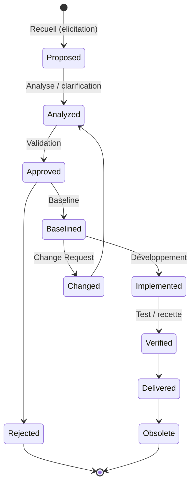
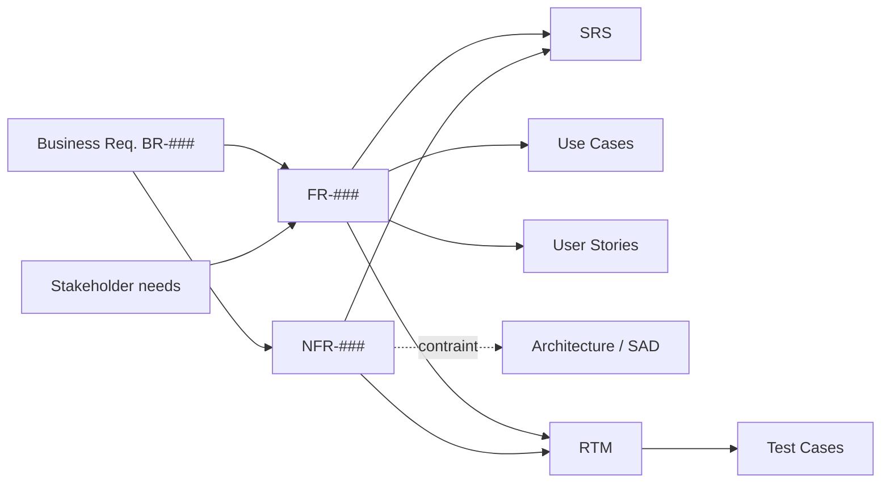
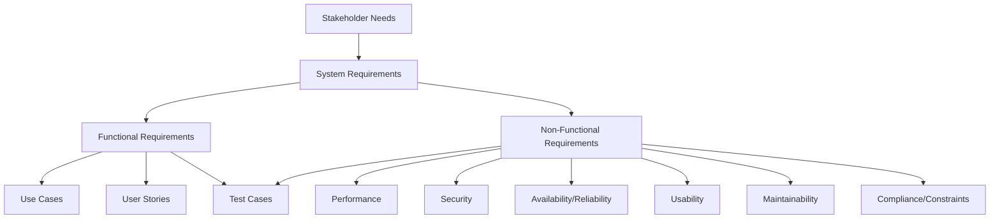

# Requirements — Functional (FR) & Non-Functional (NFR)

> 📁 Phase : ① Business & Requirements · 🏷️ Acronyme : **REQ / FR / NFR** · 🔤 EN : _Functional & Non-Functional Requirements_

---

## 1. Définition & objectif

Une **exigence (requirement)** est une **capacité ou condition que le système doit satisfaire**, formulée de façon vérifiable. On distingue :

- **FR — Functional Requirements** : _ce que le système fait_ (comportements, fonctions, règles métier). « Le système **doit** permettre à l'utilisateur de réinitialiser son mot de passe. »
- **NFR — Non-Functional Requirements** : _comment_ le système se comporte — ses **qualités** (performance, sécurité, disponibilité, ergonomie…). « 95 % des pages **doivent** répondre en < 500 ms. »

Elles répondent à « **Que doit faire le système, et avec quelles qualités ?** ».

|                  | FR                      | NFR                               |
| ---------------- | ----------------------- | --------------------------------- |
| Question         | _Quoi ?_                | _Comment bien ?_                  |
| Exemple          | Générer une facture PDF | Générer la facture en < 2 s       |
| Défaut si absent | Fonction manquante      | Système lent/inutilisable/non sûr |
| Test             | Fonctionnel             | Charge, sécurité, ergonomie…      |

---

## 2. Usage & utilité

- **Traduire** les besoins métier (`BR`) en conditions **précises et testables** pour le système.
- **Servir de contrat** de ce qui sera construit et vérifié.
- **Base de l'estimation**, de la conception, du test et de la recette.
- **Éviter l'ambiguïté** : chaque exigence est atomique, non ambiguë, vérifiable.

⚠️ Les **NFR sont les grands oubliés** : leur absence est une cause majeure d'échec en production (lenteur, pannes, failles).

---

## 3. Périmètre (in / out of scope)

**In scope**

- Exigences **fonctionnelles** (fonctions, règles métier, comportements, cas d'erreur).
- Exigences **non-fonctionnelles** (qualités mesurables, cf. taxonomie §12/§13).
- **Contraintes** (techniques, légales, standards imposés).
- Attributs par exigence : ID, priorité, source, critère d'acceptation, statut.

**Out of scope**

- Le **problème métier** de haut niveau → **BRD**.
- La **conception/solution** → **Design / SAD / HLD**.
- Les **scénarios narratifs** → **Use Cases / User Stories** (complémentaires).

---

## 4. Cycle de vie d'une exigence



- **Naissance** : recueil (_elicitation_) auprès des parties prenantes.
- **Vie** : analysée → validée → baselined → implémentée → **vérifiée** ; suit un **statut** tout au long.
- **Fin** : livrée puis éventuellement rendue **obsolète** par une évolution.

---

## 5. Métiers / rôles concernés (RACI)

| Activité              | BA / Requirements Engineer |   PO    | Architecte | Dev | QA / Test | Sponsor |
| --------------------- | :------------------------: | :-----: | :--------: | :-: | :-------: | :-----: |
| Recueil / rédaction   |           **R**            |    C    |     C      |  I  |     C     |    C    |
| Définition des NFR    |           **R**            |    C    |   **R**    |  C  |     C     |    A    |
| Priorisation          |             C              | **R/A** |     C      |  I  |     I     |    C    |
| Validation / baseline |             C              |    A    |     C      |  I  |     C     |  **A**  |
| Vérification (test)   |             I              |    I    |     I      |  C  |   **R**   |    I    |

**R**esponsible · **A**ccountable · **C**onsulted · **I**nformed.

> Les **NFR** exigent une forte implication de l'**architecte** (souvent des _architecturally significant requirements_).

---

## 6. Position & interactions avec les autres documents



| Document                     | Relation                                                      |
| ---------------------------- | ------------------------------------------------------------- |
| **BRD**                      | Source amont : chaque `FR/NFR` trace vers un `BR`.            |
| **SRS**                      | Conteneur formel qui **agrège** FR + NFR + contraintes.       |
| **Use Cases / User Stories** | Formes narratives des FR (complémentaires, pas concurrentes). |
| **Architecture / SAD**       | Fortement dirigée par les **NFR**.                            |
| **RTM / Test Cases**         | Chaque exigence doit être tracée et testée.                   |

---

## 7. Nommage & versionnement

- **Identifiants** : `FR-001`, `NFR-001` (ou par catégorie : `NFR-PERF-001`, `NFR-SEC-001`).
- **Règle d'or** : IDs **stables et jamais réutilisés** (même si l'exigence est supprimée).
- **Attributs recommandés** par exigence : ID, titre, description, **priorité (MoSCoW)**, source (`STK/BR`), **critère d'acceptation**, statut, version.
- **Formulation** : verbe normatif — _shall_ (obligatoire) / _should_ (recommandé) / _may_ (optionnel) ; en FR : **« doit / devrait / peut »**.

---

## 8. Template vierge

```markdown
## Exigence fonctionnelle

| Champ                 | Valeur                                                      |
| --------------------- | ----------------------------------------------------------- |
| ID                    | FR-001                                                      |
| Titre                 | <court>                                                     |
| Description           | Le système DOIT <action> [quand <condition>] afin de <but>. |
| Source                | BR-###, STK-###                                             |
| Priorité              | Must / Should / Could / Won't (MoSCoW)                      |
| Critère d'acceptation | <condition vérifiable / Given-When-Then>                    |
| Dépendances           | FR-###                                                      |
| Statut                | Proposed / Approved / Implemented / Verified                |

## Exigence non-fonctionnelle

| Champ                   | Valeur                                                       |
| ----------------------- | ------------------------------------------------------------ |
| ID                      | NFR-PERF-001                                                 |
| Catégorie               | Performance / Sécurité / Disponibilité / Utilisabilité / ... |
| Description             | <qualité> mesurable                                          |
| Métrique                | <grandeur mesurée>                                           |
| Cible                   | <valeur seuil>                                               |
| Condition               | <charge / contexte de mesure>                                |
| Méthode de vérification | Test de charge / audit / inspection                          |
| Priorité                | Must / Should ...                                            |
```

---

## 9. Exemple rempli

```markdown
## FR

| ID     | Description                                                                   | Source | Priorité | Critère d'acceptation                                                                                   |
| ------ | ----------------------------------------------------------------------------- | ------ | -------- | ------------------------------------------------------------------------------------------------------- |
| FR-012 | Le système doit permettre au client de télécharger une facture au format PDF. | BR-002 | Must     | Given un client authentifié, When il clique « Télécharger », Then un PDF conforme est produit en < 3 s. |
| FR-013 | Le système doit envoyer un e-mail de confirmation après paiement.             | BR-004 | Should   | E-mail reçu < 1 min, contenant n° de commande.                                                          |

## NFR

| ID           | Catégorie     | Description                        | Métrique               | Cible                    | Vérification               |
| ------------ | ------------- | ---------------------------------- | ---------------------- | ------------------------ | -------------------------- |
| NFR-PERF-001 | Performance   | Temps de réponse des pages         | p95 latence            | < 500 ms                 | Test de charge (500 users) |
| NFR-AVL-001  | Disponibilité | Disponibilité du portail           | Uptime mensuel         | ≥ 99,9 %                 | Monitoring / SLA           |
| NFR-SEC-001  | Sécurité      | Chiffrement des données en transit | Protocole              | TLS 1.2+                 | Audit / scan               |
| NFR-USE-001  | Utilisabilité | Prise en main sans formation       | Tâche « voir facture » | < 3 clics, succès ≥ 90 % | Test utilisateur           |
```

---

## 10. Checklist de revue (critères INVEST / SMART / IEEE)

Chaque exigence doit être :

- [ ] **Correcte** — reflète un besoin réel.
- [ ] **Non ambiguë** — une seule interprétation.
- [ ] **Complète** — rien d'implicite (cas d'erreur inclus).
- [ ] **Cohérente** — pas de conflit avec d'autres exigences.
- [ ] **Vérifiable / testable** — un test peut prouver sa satisfaction.
- [ ] **Atomique** — une seule exigence par énoncé (pas de « et »).
- [ ] **Traçable** — reliée à une source (`BR/STK`) et à un test.
- [ ] **Priorisée** (MoSCoW) et dotée d'un **critère d'acceptation**.
- [ ] Pour les **NFR** : **quantifiée** (métrique + seuil + condition de mesure).

---

## 11. Anti-patterns & pièges

| Anti-pattern                                          | Problème                     | Correctif                           |
| ----------------------------------------------------- | ---------------------------- | ----------------------------------- |
| 🌫️ **NFR non quantifiés** (« rapide », « convivial ») | Intestable, litige garanti   | Métrique + seuil + condition        |
| 🧩 **Exigence composite** (« doit A et B et C »)      | Impossible à tracer/tester   | Découper en exigences atomiques     |
| 🔮 **Solution imposée** dans l'exigence               | Sur-contrainte la conception | Décrire le besoin, pas la solution  |
| 🕳️ **NFR oubliées**                                   | Échecs en prod (perf, sécu)  | Checklist de catégories (ISO 25010) |
| ♻️ **Réutilisation d'ID**                             | Traçabilité cassée           | IDs stables, jamais recyclés        |
| 🤷 **« Le système gère X »** (verbe flou)             | Ambiguïté                    | Verbe précis + _doit/shall_         |
| 📉 **Pas de critère d'acceptation**                   | Recette subjective           | Given-When-Then systématique        |

---

## 12. Variantes par industrie / contexte

| Contexte                                               | Spécificités                                                                                                                               |
| ------------------------------------------------------ | ------------------------------------------------------------------------------------------------------------------------------------------ |
| **Agile**                                              | FR portées par **User Stories + critères d'acceptation** ; NFR souvent en _definition of done_ ou stories techniques.                      |
| **Systèmes critiques (DO-178C, ISO 26262, IEC 62304)** | Exigences **tracées bidirectionnellement**, dérivées en niveaux (system → software), vérification formelle, _safety requirements_ dédiées. |
| **Temps réel / embarqué**                              | NFR de **timing** (deadlines, WCET), mémoire, consommation, déterminisme.                                                                  |
| **SaaS / Web**                                         | NFR dominantes : **scalabilité, disponibilité (SLA/SLO), sécurité, performance**.                                                          |
| **Réglementé (finance, santé)**                        | NFR de **conformité, auditabilité, rétention, traçabilité** (RGPD, PCI-DSS, HIPAA).                                                        |

**Taxonomie NFR (ISO/IEC 25010 — « -ilities »)** : Performance efficiency, Compatibility, Usability, Reliability, Security, Maintainability, Portability, Functional suitability.

---

## 13. Standards & normes

- **ISO/IEC/IEEE 29148:2018** — ingénierie des exigences (caractéristiques d'une bonne exigence, cité en §10).
- **ISO/IEC 25010:2011** — modèle de **qualité produit** (taxonomie des NFR).
- **IEEE 830** (historique) — recommandations pour les SRS.
- **BABOK®** — techniques d'_elicitation_ et d'analyse.
- **RFC 2119** — sémantique de _MUST / SHOULD / MAY_.
- **Volere** (Robertson) — modèle de _requirements shell_ et _snow cards_.

---

## 14. Outillage recommandé

| Besoin                 | Outils                                                                         |
| ---------------------- | ------------------------------------------------------------------------------ |
| Gestion & traçabilité  | IBM DOORS/DOORS Next, Jama Connect, Polarion, Jira + Xray, Azure DevOps, ReqIF |
| Rédaction              | Confluence, Markdown, Volere templates                                         |
| NFR / qualité          | ISO 25010 checklists, tests : k6, JMeter, Gatling (perf), OWASP ZAP (sécu)     |
| Analyse & modélisation | Enterprise Architect, StarUML                                                  |

---

## 15. Diagramme — Taxonomie et dérivation des exigences



---

> 🔎 **En une phrase** : les **FR** disent _ce que_ le système fait, les **NFR** _à quel niveau de qualité_ — et les deux ne valent que si elles sont **atomiques, quantifiées et testables**.

⬅️ [Stakeholder](./03-stakeholder-document.md) · ➡️ Suivant : [SRS](./05-srs-software-requirements-specification.md)
