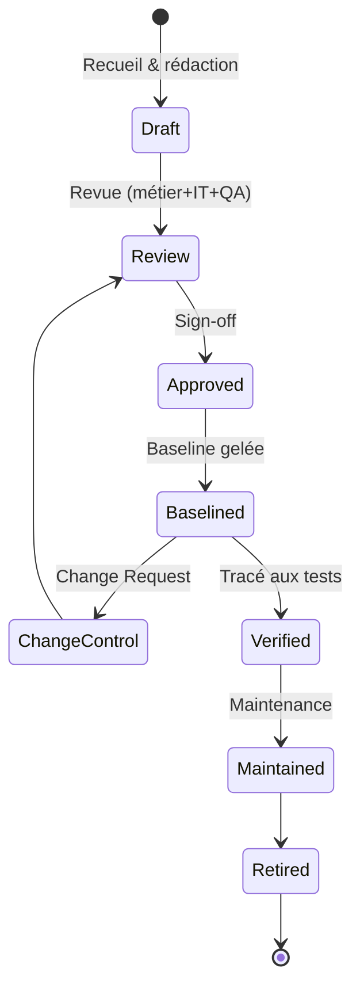
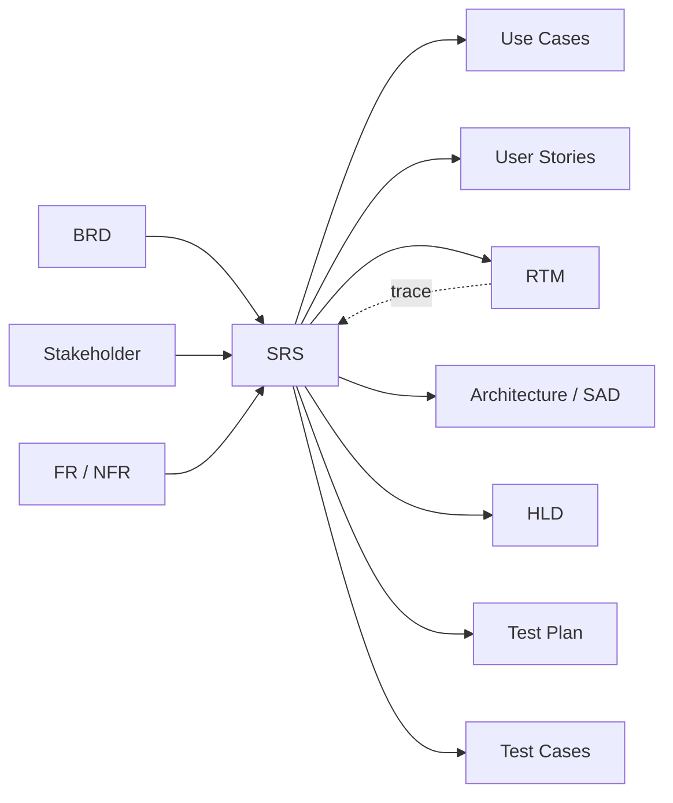
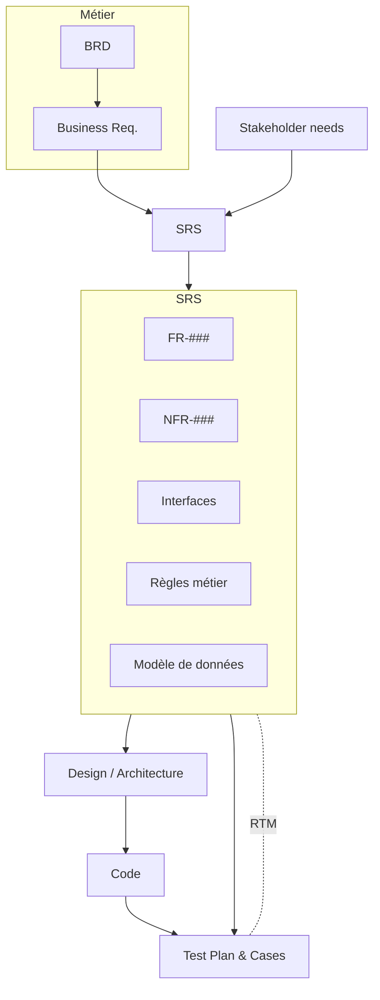

# SRS — Software Requirements Specification

> 📁 Phase : ① Business & Requirements · 🏷️ Acronyme : **SRS** · 🔤 EN : _Software Requirements Specification_

---

## 1. Définition & objectif

Le **SRS** est le document de référence **consolidé** qui spécifie **de façon complète et détaillée tout ce que le système logiciel doit faire et satisfaire** : exigences fonctionnelles, non-fonctionnelles, interfaces, contraintes et règles métier. Il répond à « **Quelle est la spécification complète et vérifiable du système à construire ?** ».

C'est le **pont** entre le monde métier (BRD) et le monde technique (Design). Il fait souvent **foi contractuellement**.

| Ce qu'il EST                                     | Ce qu'il N'EST PAS                  |
| ------------------------------------------------ | ----------------------------------- |
| La spécification système exhaustive & vérifiable | L'énoncé du besoin métier (→ BRD)   |
| Le « quoi » complet et détaillé                  | Le « comment » technique (→ Design) |
| Le référentiel de test et de recette             | Un backlog agile                    |

---

## 2. Usage & utilité

- **Référentiel unique** : source de vérité pour dev, test, recette, contrat.
- **Base de conception** : l'architecture et le design en découlent.
- **Base de test** : chaque exigence du SRS est vérifiée.
- **Support contractuel** : engage le fournisseur sur un périmètre précis.
- **Réduction du risque** : lève les ambiguïtés avant de coder (coût de correction ×100 en prod).

---

## 3. Périmètre (in / out of scope)

**In scope**

- Introduction : objet, portée, définitions, références.
- Description générale : contexte, fonctions, utilisateurs, contraintes, hypothèses.
- **Exigences spécifiques** : FR, NFR, interfaces (utilisateur, matériel, logiciel, communication).
- Règles métier, modèle de données conceptuel, exigences de qualité (ISO 25010).
- Critères de vérification / d'acceptation.

**Out of scope**

- Justification métier / ROI → **BRD**.
- Choix d'architecture et d'implémentation → **SAD / HLD / LLD**.
- Plan projet, planning, budget.

---

## 4. Cycle de vie du document



- **Naissance** : après le BRD, pendant la phase **requirements**.
- **Vie** : baselined puis soumis au **change control** ; sert de référence tout le projet.
- **Fin** : maintenu tant que le système vit, retiré à la décommission.

> En **cycle en V / waterfall**, le SRS est un jalon majeur signé avant conception. En **agile**, il est souvent remplacé par un backlog vivant (voir §12).

---

## 5. Métiers / rôles concernés (RACI)

| Activité                    | BA / Requirements Eng. | Architecte | PO / Métier |  QA   | Sponsor |
| --------------------------- | :--------------------: | :--------: | :---------: | :---: | :-----: |
| Rédaction                   |         **R**          |     C      |      C      |   C   |    I    |
| Exigences d'interface & NFR |           C            |   **R**    |      C      |   C   |    I    |
| Revue de vérifiabilité      |           C            |     C      |      C      | **R** |    I    |
| Approbation / baseline      |           C            |     C      |      A      |   C   |  **A**  |
| Change control              |         **R**          |     C      |      A      |   C   |    C    |

---

## 6. Position & interactions avec les autres documents



| Document                     | Relation                                            |
| ---------------------------- | --------------------------------------------------- |
| **BRD**                      | Source amont : le SRS raffine les `BR` en `FR/NFR`. |
| **FR/NFR**                   | Le SRS est leur **conteneur structuré** officiel.   |
| **Use Cases / User Stories** | Détaillent/illustrent les exigences du SRS.         |
| **Design (SAD/HLD/LLD)**     | Consomme le SRS comme entrée.                       |
| **Test Plan / Cases**        | Chaque exigence du SRS est couverte par un test.    |
| **RTM**                      | Assure la traçabilité SRS ↔ design ↔ tests.         |

---

## 7. Nommage & versionnement

- **Fichier / titre** : `SRS-<Système>-v<Major.Minor>`.
- **Numérotation d'exigences** : hiérarchique (`3.2.1`) ou `FR-###` / `NFR-###`.
- **Versionnement** : `v1.0` = baseline ; changements via **change control** documenté.
- **Métadonnées** : version, statut, approbateurs, historique, matrice de traçabilité liée.

---

## 8. Template vierge (structure IEEE 29148 / 830)

```markdown
# SRS — <Système> (v1.0)

## 1. Introduction

### 1.1 Objet (Purpose)

### 1.2 Portée (Scope)

### 1.3 Définitions, acronymes, abréviations

### 1.4 Références

### 1.5 Vue d'ensemble du document

## 2. Description générale (Overall Description)

### 2.1 Contexte / perspective produit

### 2.2 Fonctions principales

### 2.3 Caractéristiques des utilisateurs

### 2.4 Contraintes générales

### 2.5 Hypothèses & dépendances

## 3. Exigences spécifiques (Specific Requirements)

### 3.1 Exigences d'interface externe

    3.1.1 Interfaces utilisateur
    3.1.2 Interfaces matérielles
    3.1.3 Interfaces logicielles
    3.1.4 Interfaces de communication

### 3.2 Exigences fonctionnelles (FR-###)

### 3.3 Exigences non-fonctionnelles (NFR-###)

    3.3.1 Performance
    3.3.2 Sécurité
    3.3.3 Disponibilité / Fiabilité
    3.3.4 Utilisabilité
    3.3.5 Maintenabilité / Portabilité

### 3.4 Règles métier

### 3.5 Modèle de données (conceptuel)

## 4. Critères de vérification / acceptation

## 5. Annexes (glossaire, matrice de traçabilité)
```

---

## 9. Exemple rempli (extrait)

```markdown
# SRS — Portail Client Self-Service (v1.0)

## 1.1 Objet

Ce SRS spécifie les exigences du Portail Client permettant le suivi de commande,
la consultation de factures et l'ouverture de réclamations en self-service.

## 2.2 Fonctions principales

- Authentification et gestion de compte
- Suivi de commandes en temps réel
- Consultation et téléchargement de factures
- Ouverture et suivi de réclamations

## 3.2 Exigences fonctionnelles

| ID     | Description                                                           | Source | Priorité |
| ------ | --------------------------------------------------------------------- | ------ | -------- |
| FR-001 | Le système doit authentifier l'utilisateur par e-mail + mot de passe. | BR-001 | Must     |
| FR-012 | Le système doit permettre le téléchargement d'une facture PDF.        | BR-002 | Must     |

## 3.3.1 Performance

| ID           | Métrique              | Cible                   |
| ------------ | --------------------- | ----------------------- |
| NFR-PERF-001 | Latence p95 des pages | < 500 ms sous 500 users |

## 3.1.3 Interfaces logicielles

- Le système doit consommer l'API de facturation `Billing v2` (REST/JSON, OAuth2).
```

---

## 10. Checklist de revue

- [ ] Chaque section IEEE 29148 est présente et pertinente.
- [ ] Chaque exigence est **atomique, non ambiguë, vérifiable, tracée** (cf. fiche FR/NFR).
- [ ] Les **interfaces externes** (UI, matériel, logiciel, comm.) sont spécifiées.
- [ ] Les **NFR sont quantifiées** avec méthode de vérification.
- [ ] Les **règles métier** et cas d'erreur sont couverts.
- [ ] Aucune **décision de conception** n'est imposée sans justification.
- [ ] Le **glossaire** lève toute ambiguïté terminologique.
- [ ] La **matrice de traçabilité (RTM)** est reliée.
- [ ] **Cohérence interne** : pas d'exigences contradictoires.
- [ ] **Sign-off** obtenu ; baseline établie.

---

## 11. Anti-patterns & pièges

| Anti-pattern                                   | Problème                            | Correctif                      |
| ---------------------------------------------- | ----------------------------------- | ------------------------------ |
| 📚 **SRS pavé illisible** de 200 pages         | Non lu, périme vite                 | Concision, modularité, annexes |
| 🧊 **« Big design up front »** rigide          | Inadapté à l'incertitude            | Baseline incrémentale / agile  |
| 🔧 **Sur-spécification de la solution**        | Bride la conception                 | Rester au « quoi »             |
| 🕳️ **Interfaces oubliées**                     | Intégrations qui cassent            | Section 3.1 systématique       |
| 🌫️ **Ambiguïtés & « etc. »**                   | Interprétations divergentes         | Langage précis, glossaire      |
| 🔗 **Pas de traçabilité** vers BRD/tests       | Impossible de prouver la couverture | RTM dès le départ              |
| 🧟 **SRS jamais mis à jour** après changements | Divergence code/spec                | Change control discipliné      |

---

## 12. Variantes par industrie / contexte

| Contexte                                                         | Spécificités                                                                                                                 |
| ---------------------------------------------------------------- | ---------------------------------------------------------------------------------------------------------------------------- |
| **Waterfall / cycle en V**                                       | SRS formel, jalon contractuel signé avant conception.                                                                        |
| **Agile / SaaS**                                                 | Remplacé par **backlog + epics + stories** ; un SRS léger « vivant » peut subsister pour les parties stables/contractuelles. |
| **Systèmes critiques (DO-178C, IEC 62304, ISO 26262, EN 50128)** | SRS multi-niveaux (system/software), traçabilité bidirectionnelle obligatoire, vérification formelle, revue certifiée.       |
| **Marchés publics / ESN**                                        | Souvent = **cahier des charges** (CCTP), valeur contractuelle forte.                                                         |
| **Embarqué / temps réel**                                        | Fortes sections timing, ressources, sûreté de fonctionnement.                                                                |

---

## 13. Standards & normes

- **ISO/IEC/IEEE 29148:2018** — norme de référence pour les SRS (remplace **IEEE 830-1998**).
- **IEEE 830-1998** — modèle historique encore très utilisé (structure §8).
- **ISO/IEC/IEEE 12207** — processus du cycle de vie logiciel.
- **ISO/IEC 25010** — qualité (pour les NFR).
- **Domaines critiques** : **DO-178C** (avionique), **IEC 62304** (médical), **ISO 26262** (auto), **EN 50128** (ferroviaire).

---

## 14. Outillage recommandé

| Besoin               | Outils                                                         |
| -------------------- | -------------------------------------------------------------- |
| Rédaction structurée | Confluence, Markdown/AsciiDoc + Git, Word (gabarit IEEE)       |
| Gestion d'exigences  | IBM DOORS/DOORS Next, Jama Connect, Polarion, ReqIF, Jira+Xray |
| Traçabilité          | RTM auto (Jama, DOORS, Xray)                                   |
| Modélisation         | SysML/UML (Enterprise Architect, Cameo), Mermaid               |
| Revue                | outils de review (Confluence, PR Git)                          |

---

## 15. Diagramme — Le SRS, pivot entre besoin et solution



---

> 🔎 **En une phrase** : le SRS est **la spécification complète, détaillée et vérifiable** du système — le point où le besoin métier devient un contrat technique traçable.

⬅️ [Requirements FR/NFR](./04-requirements-fr-nfr.md) · ➡️ Suivant : [Use Cases](./06-use-cases.md)
