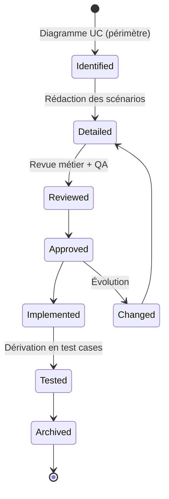
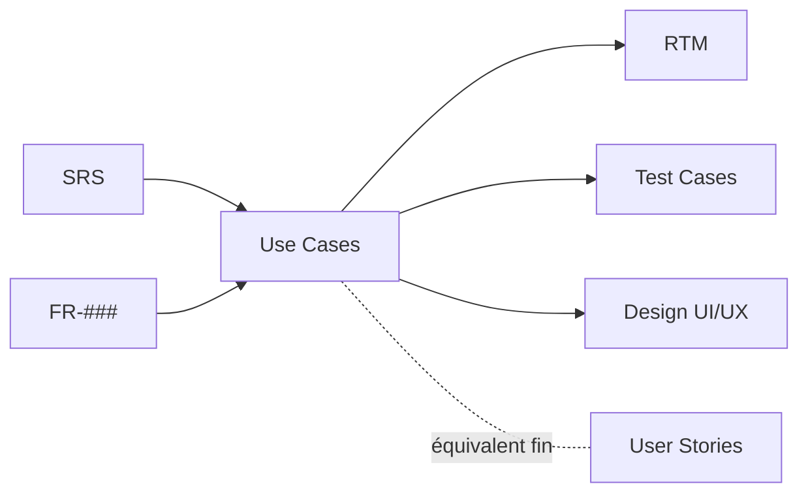
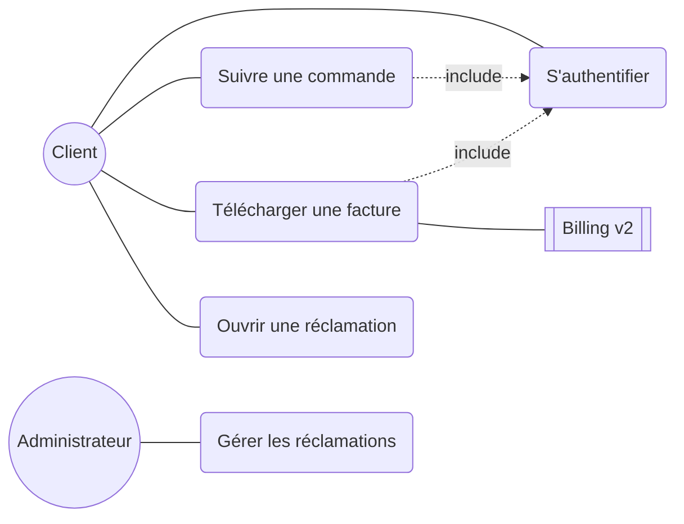

# Use Cases

> 📁 Phase : ① Business & Requirements · 🏷️ Acronyme : **UC** · 🔤 EN : _Use Cases_

---

## 1. Définition & objectif

Un **Use Case** décrit **une interaction complète entre un acteur et le système pour atteindre un objectif**, sous forme de **scénario structuré** (nominal + alternatifs + exceptions). Il répond à « **Comment un acteur utilise le système, étape par étape, pour obtenir un résultat ?** ».

C'est une forme **narrative et exhaustive** des exigences fonctionnelles : là où une FR dit _quoi_, le use case déroule _le chemin complet_ avec ses embranchements.

| Ce qu'il EST                                    | Ce qu'il N'EST PAS                 |
| ----------------------------------------------- | ---------------------------------- |
| Un scénario d'usage acteur↔système              | Une spécification d'écran (UI)     |
| Le comportement observable, cas d'erreur inclus | Une description technique interne  |
| Un pont vers les tests fonctionnels             | Une user story (plus fine, cf. §6) |

---

## 2. Usage & utilité

- **Rendre les exigences concrètes** : on « voit » l'usage, ce qui révèle les cas oubliés.
- **Découvrir les exceptions** : le flux alternatif force à penser aux erreurs.
- **Aligner métier et IT** : lisible par tous.
- **Dériver les tests** : chaque flux (nominal/alternatif) = des cas de test.
- **Cadrer le périmètre fonctionnel** via le **diagramme de use cases** (vue d'ensemble).

---

## 3. Périmètre (in / out of scope)

**In scope**

- Acteurs (primaires/secondaires) et leurs objectifs.
- Préconditions, postconditions, déclencheur.
- **Flux nominal** (chemin heureux), **flux alternatifs**, **exceptions**.
- Règles métier applicables, exigences spéciales.
- Diagramme de use cases (relations _include_, _extend_, généralisation).

**Out of scope**

- Détail d'implémentation / algorithmes → **Design / LLD**.
- Maquettes/UI détaillées → _design UX_ (le UC référence, ne spécifie pas).
- NFR quantifiées → **SRS / NFR**.

---

## 4. Cycle de vie du document



- **Naissance** : après/avec le SRS, souvent à partir du diagramme de use cases.
- **Vie** : détaillé, revu, tracé aux tests.
- **Fin** : archivé/maintenu avec le système. En agile, remplacé par stories.

---

## 5. Métiers / rôles concernés (RACI)

| Activité                   |  BA   | PO / Métier | Architecte | Dev |  QA   |
| -------------------------- | :---: | :---------: | :--------: | :-: | :---: |
| Identification (diagramme) | **R** |      C      |     C      |  I  |   I   |
| Rédaction des scénarios    | **R** |      C      |     I      |  C  |   C   |
| Validation métier          |   C   |    **A**    |     I      |  I  |   C   |
| Dérivation en tests        |   I   |      I      |     I      |  I  | **R** |

**R**esponsible · **A**ccountable · **C**onsulted · **I**nformed.

---

## 6. Position & interactions avec les autres documents



| Document         | Relation                                                                |
| ---------------- | ----------------------------------------------------------------------- |
| **SRS / FR**     | Les use cases **détaillent** les exigences fonctionnelles en scénarios. |
| **User Stories** | Alternative agile plus **granulaire** (un UC ≈ plusieurs stories).      |
| **Test Cases**   | Chaque flux (nominal + alternatifs) → cas de test.                      |
| **Design UI/UX** | Le UC guide les écrans sans les spécifier.                              |
| **RTM**          | Trace UC ↔ exigences ↔ tests.                                           |

> **UC vs User Story** : le UC est **complet** (tous les flux dans un doc) ; la story est **atomique et incrémentale** (une tranche de valeur). Voir [User Stories](./07-user-stories.md).

---

## 7. Nommage & versionnement

- **Identifiants** : `UC-001`, `UC-002`… + nom verbe-objet (« UC-012 Télécharger une facture »).
- **Nom** : toujours **verbe à l'infinitif + objet** du point de vue acteur.
- **Versionnement** : versionné avec le SRS ; statut (identifié/détaillé/approuvé).
- **Niveaux** (Cockburn) : _summary_ (☁️), _user-goal_ (🌊 sea level), _subfunction_ (🐟) — viser le **niveau objectif utilisateur**.

---

## 8. Template vierge (Cockburn étendu)

```markdown
## UC-### : <Verbe + objet>

| Champ               | Valeur            |
| ------------------- | ----------------- |
| ID                  | UC-###            |
| Acteur principal    | <rôle>            |
| Acteurs secondaires | <systèmes/rôles>  |
| Objectif / valeur   | <but de l'acteur> |
| Niveau              | User-goal         |
| Portée              | <système>         |
| Priorité            | Must / Should ... |
| Fréquence           | <estimation>      |

### Préconditions

- <état requis avant>

### Déclencheur (Trigger)

- <événement qui démarre>

### Flux nominal (Main Success Scenario)

1. L'acteur ...
2. Le système ...
3. ...

### Postcondition (succès)

- <état après succès>

### Flux alternatifs

- **A1** (à l'étape n) : <condition> → <étapes>

### Exceptions

- **E1** (à l'étape n) : <erreur> → <traitement>

### Règles métier / Exigences spéciales

- <BR-###, NFR-###>
```

---

## 9. Exemple rempli

```markdown
## UC-012 : Télécharger une facture

| Champ               | Valeur                              |
| ------------------- | ----------------------------------- |
| Acteur principal    | Client authentifié                  |
| Acteurs secondaires | Système de facturation (Billing v2) |
| Objectif            | Obtenir une facture au format PDF   |
| Priorité            | Must                                |
| Source              | FR-012, BR-002                      |

### Préconditions

- Le client est authentifié.
- Au moins une facture existe pour ce client.

### Déclencheur

- Le client sélectionne « Mes factures ».

### Flux nominal

1. Le client ouvre la page « Mes factures ».
2. Le système récupère la liste des factures via Billing v2.
3. Le système affiche la liste (date, montant, n°).
4. Le client clique « Télécharger » sur une facture.
5. Le système génère/récupère le PDF.
6. Le système transmet le PDF au navigateur.

### Postcondition

- Le PDF de la facture est téléchargé.

### Flux alternatifs

- **A1** (étape 3) : Aucune facture → le système affiche « Aucune facture disponible ».

### Exceptions

- **E1** (étape 2) : Billing v2 indisponible → message d'erreur + réessai possible ; log incident.
- **E2** (étape 5) : Échec de génération PDF → message + ticket support proposé.

### Exigences spéciales

- NFR-PERF-001 : génération < 3 s.
- NFR-SEC-001 : transfert en TLS.
```

---

## 10. Checklist de revue

- [ ] Le use case a un **acteur** et un **objectif** clairs (nommé verbe+objet).
- [ ] **Préconditions**, **déclencheur** et **postconditions** sont explicites.
- [ ] Le **flux nominal** est numéroté, du point de vue acteur↔système (pas d'interne).
- [ ] Les **flux alternatifs** et **exceptions** couvrent les cas d'erreur réalistes.
- [ ] Aucune **fuite d'implémentation** (pas d'algorithme, pas de SQL).
- [ ] Les **règles métier** et NFR pertinentes sont référencées.
- [ ] Le niveau est **user-goal** (ni trop haut, ni trop bas).
- [ ] Traçabilité vers **FR/SRS** et vers **Test Cases**.

---

## 11. Anti-patterns & pièges

| Anti-pattern                                     | Problème                         | Correctif                            |
| ------------------------------------------------ | -------------------------------- | ------------------------------------ |
| 🖥️ **Décrire l'UI** (« clique le bouton bleu »)  | Fige le design, périme vite      | Décrire l'intention, pas l'écran     |
| 🔩 **Fuite technique** (SQL, appels internes)    | Ce n'est plus observable acteur  | Rester au comportement externe       |
| 🌊 **Mauvais niveau** (trop détaillé/trop vague) | Illisible ou inutile             | Viser le user-goal (sea level)       |
| 🕳️ **Pas d'exceptions**                          | Les erreurs oubliées = bugs prod | Systématiser flux alt./exceptions    |
| 📚 **Use case fleuve** de 40 étapes              | Ingérable                        | Découper via _include_               |
| 👥 **Acteur = « le système »**                   | Confusion acteur/rôle            | Acteur = déclencheur externe         |
| ♊ **Doublon avec user stories**                 | Double maintenance               | Choisir l'approche selon le contexte |

---

## 12. Variantes par industrie / contexte

| Contexte               | Spécificités                                                                                                            |
| ---------------------- | ----------------------------------------------------------------------------------------------------------------------- |
| **Agile**              | Souvent remplacés par **user stories** ; les use cases restent utiles pour les **flux complexes** (paiement, workflow). |
| **UML / MDA**          | Diagrammes de use cases formels avec _include/extend/generalization_.                                                   |
| **Systèmes critiques** | Use cases exhaustifs incluant **misuse cases / abuse cases** (sécurité, safety).                                        |
| **B2B / workflow**     | Use cases multi-acteurs, longs processus, systèmes secondaires nombreux.                                                |
| **UX Design**          | Base des _user flows_ et _journey maps_.                                                                                |

> **Misuse cases** : variante orientée sécurité décrivant comment un acteur **hostile** tente de détourner le système (nourrit le Threat Model).

---

## 13. Standards & normes

- **UML** (OMG) — diagrammes de use cases (notation _include/extend_).
- **Alistair Cockburn — _Writing Effective Use Cases_** (niveaux, template de référence).
- **Ivar Jacobson** — inventeur des use cases (approche _Use-Case 2.0_, _use-case slices_).
- **ISO/IEC/IEEE 29148** — les use cases comme technique de spécification des exigences.
- **RUP** (Rational Unified Process) — méthode pilotée par les use cases.

---

## 14. Outillage recommandé

| Besoin                 | Outils                                                                |
| ---------------------- | --------------------------------------------------------------------- |
| Diagrammes UC          | PlantUML, Mermaid, Enterprise Architect, StarUML, draw.io, Lucidchart |
| Rédaction              | Confluence, Markdown, gabarits Cockburn                               |
| Traçabilité vers tests | Jira + Xray, Jama, Polarion                                           |
| Modélisation avancée   | Cameo/MagicDraw (SysML/UML), Visual Paradigm                          |

---

## 15. Diagramme — Vue de use cases (portail client)



---

> 🔎 **En une phrase** : un use case **déroule le scénario complet** d'un objectif utilisateur, cas d'erreur compris — il transforme une exigence abstraite en usage vérifiable.

⬅️ [SRS](./05-srs-software-requirements-specification.md) · ➡️ Suivant : [User Stories](./07-user-stories.md)
