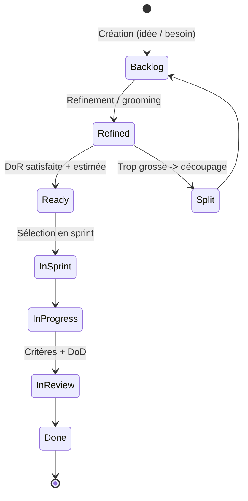
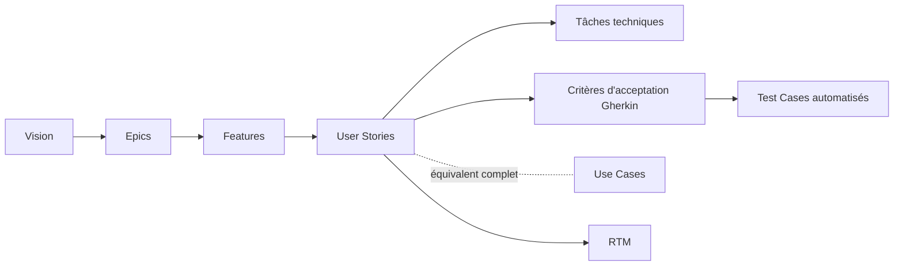

# User Stories

> 📁 Phase : ① Business & Requirements · 🏷️ Acronyme : **US** · 🔤 EN : _User Stories_

---

## 1. Définition & objectif

Une **User Story** est une **description courte d'une fonctionnalité du point de vue de l'utilisateur**, exprimant un besoin et sa valeur, servant de **support de conversation** plutôt que de spécification figée. Elle répond à « **Qui veut quoi, et pourquoi ?** ».

Format canonique (**Connextra**) :

> **En tant que** `<rôle>`, **je veux** `<action/fonction>`, **afin de** `<bénéfice/valeur>`.

Une story tient sur une carte et repose sur les **3 C** : **Card** (l'énoncé), **Conversation** (l'échange qui la précise), **Confirmation** (les critères d'acceptation).

| Ce qu'elle EST                                      | Ce qu'elle N'EST PAS            |
| --------------------------------------------------- | ------------------------------- |
| Une promesse de conversation, une tranche de valeur | Une spec détaillée figée        |
| Petite, incrémentale, priorisable                   | Un use case complet (tous flux) |
| Testable via critères d'acceptation                 | Une tâche technique isolée      |

---

## 2. Usage & utilité

- **Découper la valeur** en incréments livrables (sprint).
- **Prioriser** finement le backlog (valeur/effort).
- **Favoriser la collaboration** : la story est un point de départ de discussion, pas un contrat.
- **Estimer** (points, T-shirt sizing) et **planifier** les sprints.
- **Définir le « fait »** via critères d'acceptation + Definition of Done.

---

## 3. Périmètre (in / out of scope)

**In scope**

- L'énoncé (rôle, action, bénéfice).
- Les **critères d'acceptation** (souvent en **Gherkin** : Given-When-Then).
- Estimation, priorité, valeur métier.
- Rattachement à un **epic / thème / feature**.

**Out of scope**

- Le détail de conception/technique → tâches, Design Doc.
- Les NFR transverses → _definition of done_, stories techniques, SRS.
- Le scénario exhaustif multi-flux → **Use Case** (complémentaire).

---

## 4. Cycle de vie du document



- **Naissance** : ajoutée au **backlog** dès qu'un besoin émerge.
- **Vie** : **raffinée** (refinement), estimée, prête (_Definition of Ready_), réalisée en sprint.
- **Fin** : **Done** (critères + DoD) ; disparaît du backlog actif (tracée dans l'outil).

---

## 5. Métiers / rôles concernés (RACI)

| Activité                 | Product Owner | Équipe Dev | Scrum Master |  QA   | Stakeholders |
| ------------------------ | :-----------: | :--------: | :----------: | :---: | :----------: |
| Rédaction / priorisation |    **R/A**    |     C      |      I       |   C   |      C       |
| Critères d'acceptation   |     **R**     |     C      |      I       | **C** |      C       |
| Estimation               |       C       |   **R**    |      F       |   C   |      I       |
| Réalisation              |       I       |   **R**    |      F       |   C   |      I       |
| Validation (acceptation) |     **A**     |     C      |      I       |   R   |      C       |

**R**esponsible · **A**ccountable · **C**onsulted · **I**nformed.

_F = Facilitateur._ Le **PO** possède le backlog ; l'**équipe** estime et réalise ; le PO **accepte**.

---

## 6. Position & interactions avec les autres documents



| Document                       | Relation                                                               |
| ------------------------------ | ---------------------------------------------------------------------- |
| **Vision / Epics**             | Les stories déclinent epics → features → stories.                      |
| **Use Cases**                  | Équivalent narratif **complet** ; une story = une **tranche** d'un UC. |
| **Critères d'acceptation**     | Le « Confirmation » des 3C, souvent en **Gherkin** (→ BDD/tests).      |
| **Definition of Done / Ready** | Conditions de qualité transverses (cf. Lot 3).                         |
| **RTM**                        | Trace story ↔ epic ↔ test (traçabilité agile).                         |

> **Story vs Use Case** : story = **fine, conversationnelle, incrémentale** ; use case = **exhaustif, tous flux**. Complémentaires, pas concurrents.

---

## 7. Nommage & versionnement

- **Identifiants** : gérés par l'outil (`PROJ-1234` dans Jira/Azure DevOps).
- **Titre** : résumé de l'énoncé (« Télécharger une facture PDF »).
- **Pas de versionnement de document** : la story vit dans l'outil ; l'historique est tracé (changelog du ticket).
- **Découpage** (_story splitting_) : par workflow, règles métier, variations de données, CRUD, chemins heureux/erreurs (patterns SPIDR).

---

## 8. Template vierge

````markdown
### US : <titre>

**En tant que** <rôle>
**je veux** <action / fonctionnalité>
**afin de** <bénéfice / valeur>

**Épic / Feature :** <lien>
**Priorité :** <MoSCoW / rang backlog>
**Estimation :** <points>
**Valeur métier :** <indication>

#### Critères d'acceptation (Gherkin)

```gherkin
Scenario: <nom>
  Given <contexte initial>
  When <action>
  Then <résultat attendu>
```
````

#### Notes / dépendances / hors périmètre

- ...

````

---

## 9. Exemple rempli

```markdown
### US : Télécharger une facture PDF

**En tant que** client authentifié
**je veux** télécharger mes factures au format PDF
**afin de** les conserver et les transmettre à ma comptabilité

**Épic :** Espace Facturation
**Priorité :** Must
**Estimation :** 3 points
**Source :** FR-012 / BR-002

#### Critères d'acceptation
```gherkin
Scenario: Téléchargement réussi
  Given je suis authentifié et j'ai au moins une facture
  When je clique sur "Télécharger" pour une facture
  Then un fichier PDF conforme est téléchargé en moins de 3 secondes

Scenario: Aucune facture
  Given je suis authentifié et je n'ai aucune facture
  When j'ouvre "Mes factures"
  Then le message "Aucune facture disponible" s'affiche

Scenario: Service de facturation indisponible
  Given le service Billing est indisponible
  When j'ouvre "Mes factures"
  Then un message d'erreur avec option de réessai s'affiche
````

#### Notes

- Respecter NFR-SEC-001 (TLS) et NFR-PERF-001.

````

---

## 10. Checklist de revue — critères INVEST

Une bonne story est **INVEST** :

- [ ] **I**ndependent — réalisable indépendamment (couplage minimal).
- [ ] **N**egotiable — pas un contrat figé, ouverte à la discussion.
- [ ] **V**aluable — apporte de la valeur à un utilisateur/client.
- [ ] **E**stimable — l'équipe peut l'estimer.
- [ ] **S**mall — tient dans un sprint (sinon découper).
- [ ] **T**estable — critères d'acceptation vérifiables.

Et aussi :
- [ ] Format **rôle / action / bénéfice** respecté (le « afin de » est réel).
- [ ] **Critères d'acceptation** présents (Given-When-Then), erreurs incluses.
- [ ] Rattachée à un **epic/feature** et priorisée.
- [ ] **Definition of Ready** satisfaite avant d'entrer en sprint.

---

## 11. Anti-patterns & pièges

| Anti-pattern | Problème | Correctif |
|--------------|----------|-----------|
| 🔧 **Story technique déguisée** (« refactorer la DB ») sans valeur user | Pas de valeur métier visible | Exprimer la valeur, ou tâche/enabler assumé |
| 🐘 **Épic traité comme story** (trop gros) | Non livrable en 1 sprint | Découper (SPIDR) |
| 🈳 **« afin de » bidon** (« afin d'utiliser la fonction ») | Valeur non pensée | Trouver le vrai bénéfice |
| ❌ **Pas de critères d'acceptation** | « Done » subjectif | Gherkin systématique |
| 🧱 **Découpage par couche** (front/back/DB) | Aucune tranche livre de valeur | Découper en tranches verticales |
| 📜 **Story = mini-spec figée** | Perd l'esprit collaboratif (3C) | Garder la conversation |
| 🔗 **Stories fortement couplées** | Blocages, non priorisables | Viser l'indépendance |

---

## 12. Variantes par industrie / contexte

| Contexte | Spécificités |
|----------|--------------|
| **Scrum / Kanban** | Artefact central du backlog ; unité de planification. |
| **SAFe** | Hiérarchie **Epic → Capability → Feature → Story** ; enablers pour le technique. |
| **BDD** | Critères d'acceptation en **Gherkin** exécutables (Cucumber, SpecFlow). |
| **Systèmes critiques** | Les stories **ne remplacent pas** les exigences tracées/normatives ; usage complémentaire, traçabilité maintenue. |
| **Design / UX** | Couplées aux *job stories* (« When… I want to… so I can… ») et aux *user journeys*. |

> **Job Story** (alternative) : « **Quand** `<situation>`, **je veux** `<motivation>`, **afin de** `<résultat>` » — met l'accent sur le contexte plutôt que le persona.

---

## 13. Standards & normes

- **Scrum Guide (2020)** — cadre (Product Backlog, incréments) ; la story n'y est pas imposée mais standard de fait.
- **Bill Wake — INVEST** (2003) & **3 C (Ron Jeffries)**.
- **Mike Cohn — *User Stories Applied*** (référence).
- **Gherkin / BDD (Dan North, Cucumber)** — critères d'acceptation exécutables.
- **SAFe®** — hiérarchie backlog et *story splitting*.

---

## 14. Outillage recommandé

| Besoin | Outils |
|--------|--------|
| Backlog & stories | Jira, Azure DevOps, GitHub Issues/Projects, Trello, Linear, ClickUp |
| Critères d'acceptation / BDD | Cucumber, SpecFlow, Behave, Gauge |
| Estimation | Planning Poker (Scrum Poker), affinity estimation |
| Roadmap / epics | Aha!, Productboard, Jira Advanced Roadmaps |

---

## 15. Diagramme — De la vision à la story (hiérarchie backlog)

```mermaid
flowchart TD
    V[Vision] --> E1[Epic : Espace Facturation]
    E1 --> F1[Feature : Consultation factures]
    F1 --> US1[US : Lister mes factures]
    F1 --> US2[US : Télécharger une facture PDF]
    F1 --> US3[US : Filtrer par date]
    US2 --> AC[Critères d'acceptation Gherkin]
    US2 --> T1[Tâche : endpoint API]
    US2 --> T2[Tâche : bouton UI]
    AC --> TC[Tests automatisés BDD]
````

---

> 🔎 **En une phrase** : la user story est **une tranche de valeur négociable** centrée utilisateur — sa force n'est pas dans le texte mais dans la **conversation** et les **critères d'acceptation** qui la confirment.

⬅️ [Use Cases](./06-use-cases.md) · ➡️ Suivant : [RTM](./08-rtm-requirements-traceability-matrix.md)
