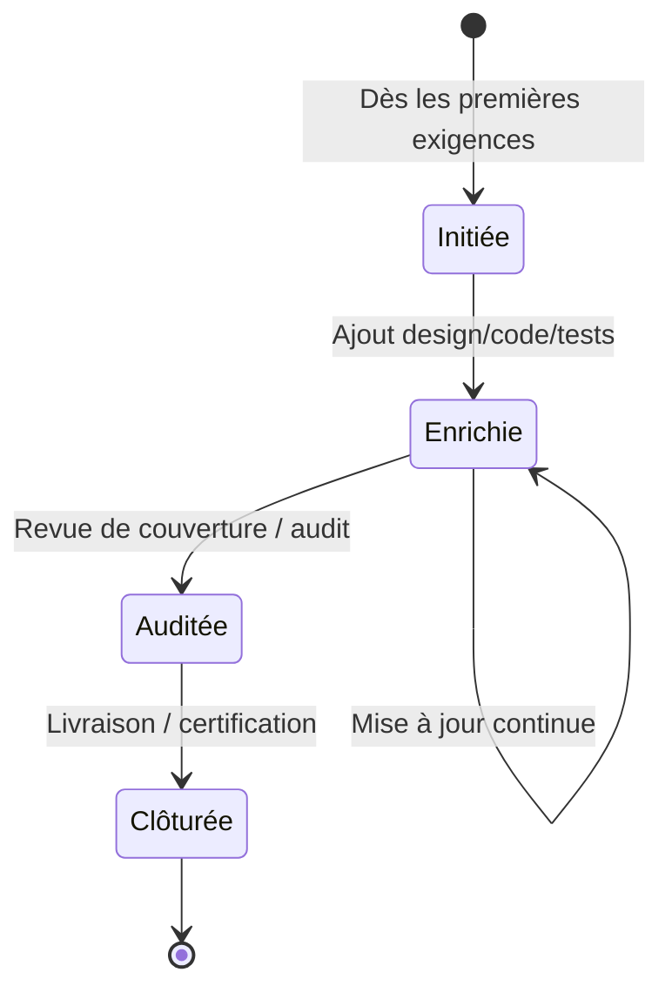
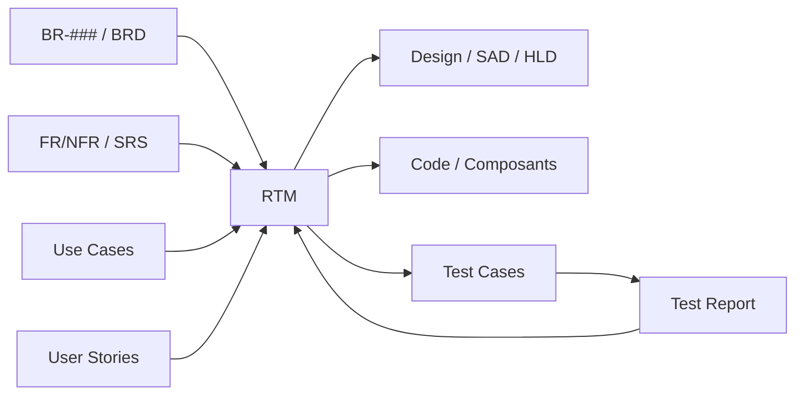
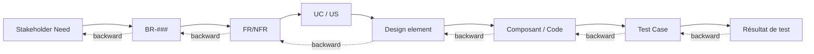

# RTM — Requirements Traceability Matrix

> 📁 Phase : ① Business & Requirements · 🏷️ Acronyme : **RTM** · 🔤 EN : _Requirements Traceability Matrix_

---

## 1. Définition & objectif

La **RTM** est une **matrice qui relie chaque exigence à ses origines (besoins) et à ses aboutissements (conception, code, tests, résultats)**. Elle répond à « **Chaque besoin est-il couvert, conçu, développé et testé — et rien de plus ?** ».

C'est le **fil rouge** de tout le cycle : elle rend la traçabilité **visible et vérifiable**, dans les deux sens.

| Ce qu'elle EST                    | Ce qu'elle N'EST PAS          |
| --------------------------------- | ----------------------------- |
| Le tissu conjonctif besoin ↔ test | Un document narratif          |
| Un outil de couverture & d'impact | Une liste d'exigences (→ SRS) |
| Une preuve de conformité          | Un planning                   |

**Traçabilité bidirectionnelle** :

- **Forward** (avant) : besoin → exigence → design → code → test. _Tout besoin est-il réalisé ?_
- **Backward** (arrière) : test → code → design → exigence → besoin. _Tout ce qui est construit répond-il à un besoin ?_ (détecte le _gold plating_).

---

## 2. Usage & utilité

- **Garantir la couverture** : aucun besoin oublié, aucun test orphelin.
- **Analyse d'impact** : « si je change `FR-012`, quels tests/composants sont touchés ? ».
- **Détecter le superflu** (_gold plating_) : du code/test sans exigence source.
- **Preuve d'audit / conformité** (indispensable en systèmes critiques et réglementés).
- **Piloter l'avancement** : % d'exigences conçues / codées / testées / passées.

---

## 3. Périmètre (in / out of scope)

**In scope**

- Liens entre : `BR` ↔ `FR/NFR` ↔ `UC/US` ↔ éléments de **design** ↔ **code/composant** ↔ **cas de test** ↔ **résultat**.
- Statut de couverture et de vérification par exigence.
- Éventuellement : priorité, risque, version.

**Out of scope**

- Le **contenu** des exigences → **SRS** (la RTM ne fait que **référencer** les IDs).
- Les résultats détaillés → **Test Report** (la RTM agrège le statut).

---

## 4. Cycle de vie du document



- **Naissance** : dès les premières exigences (souvent avec le SRS).
- **Vie** : **document vivant**, enrichi à chaque étape (design, code, test) ; idéalement **généré automatiquement** par l'outil d'ALM.
- **Fin** : figée à la livraison/certification comme preuve.

> ⚠️ Une RTM **maintenue à la main** est vite obsolète : privilégier la génération outillée.

---

## 5. Métiers / rôles concernés (RACI)

| Activité                           | BA / Req. Engineer | QA / Test Manager | Architecte |  Dev  | PMO / Audit |
| ---------------------------------- | :----------------: | :---------------: | :--------: | :---: | :---------: |
| Initialisation (besoins↔exigences) |       **R**        |         C         |     C      |   I   |      I      |
| Liens exigences↔tests              |         C          |       **R**       |     I      |   C   |      I      |
| Liens exigences↔design/code        |         C          |         I         |   **R**    | **R** |      I      |
| Analyse de couverture              |       **R**        |       **R**       |     C      |   I   |      A      |
| Revue / audit                      |         C          |         C         |     C      |   I   |    **A**    |

---

## 6. Position & interactions avec les autres documents



La RTM **agrège des références** vers presque tous les autres documents : c'est le **hub** de traçabilité du cycle de vie. Elle est alimentée par le SRS (amont) et le Test Report (aval).

---

## 7. Nommage & versionnement

- **Fichier / titre** : `RTM-<Projet>-v<x.y>`.
- **Convention d'IDs** : réutilise les IDs existants (`BR-###`, `FR-###`, `UC-###`, `TC-###`) — **ne jamais les recréer**.
- **Versionnement** : suit les baselines des exigences ; horodatage des mises à jour.
- **Générée** de préférence par l'outil (export daté) plutôt que maintenue manuellement.

---

## 8. Template vierge

```markdown
# RTM — <Projet>

| Req ID       | Description (réf.)  | Source (BR/STK) | Priorité | UC/US  | Élément de design | Composant / Code | Test Case(s)   | Statut test | Couverture |
| ------------ | ------------------- | --------------- | -------- | ------ | ----------------- | ---------------- | -------------- | ----------- | ---------- |
| FR-001       | Authentification    | BR-001          | Must     | UC-001 | HLD §3.2 AuthSvc  | auth-service     | TC-001, TC-002 | Pass        | ✅         |
| FR-012       | Téléch. facture PDF | BR-002          | Must     | UC-012 | HLD §4.1 Billing  | billing-adapter  | TC-020, TC-021 | Fail        | ⚠️         |
| NFR-PERF-001 | Latence p95 < 500ms | BR-000          | Must     | —      | SAD §5            | gateway          | TC-P-01        | Pass        | ✅         |
```

Colonnes recommandées : **Req ID · Source · Priorité · Use Case/Story · Design · Code · Test Case · Statut · Couverture**.

---

## 9. Exemple rempli (extrait — portail client)

```markdown
| Req ID       | Desc.                   | Source    | UC/US          | Design   | Composant       | Tests          | Statut | Couv.           |
| ------------ | ----------------------- | --------- | -------------- | -------- | --------------- | -------------- | ------ | --------------- |
| BR-001       | Suivi commande autonome | STK-001   | UC-002         | HLD §3   | order-svc       | TC-010..013    | Pass   | ✅              |
| FR-012       | Télécharger facture PDF | BR-002    | UC-012 / US-45 | HLD §4.1 | billing-adapter | TC-020, TC-021 | Fail   | ⚠️ TC-021 KO    |
| FR-013       | E-mail de confirmation  | BR-004    | UC-014         | HLD §4.3 | notif-svc       | TC-030         | Pass   | ✅              |
| NFR-PERF-001 | p95 < 500 ms            | BR-000    | —              | SAD §5   | api-gateway     | TC-P-01        | Pass   | ✅              |
| NFR-SEC-001  | TLS 1.2+                | BR-000    | —              | SAD §6   | ingress         | TC-S-01        | Pass   | ✅              |
| —            | (orphelin) export CSV   | ❌ aucune | —              | —        | export-svc      | TC-040         | Pass   | 🚩 gold plating |
```

> Lecture : `FR-012` a un test en échec (**couverture partielle**) ; la dernière ligne révèle un **composant sans exigence source** (gold plating à investiguer).

---

## 10. Checklist de revue

- [ ] **Chaque `BR`** est relié à ≥ 1 exigence (`FR/NFR`) — pas de besoin orphelin.
- [ ] **Chaque exigence** est reliée à ≥ 1 **cas de test** — couverture complète.
- [ ] **Chaque test** trace vers ≥ 1 exigence — pas de test orphelin.
- [ ] **Aucun composant/code** sans exigence source (détection _gold plating_).
- [ ] La traçabilité est **bidirectionnelle** (forward + backward).
- [ ] Les **IDs référencés existent** et ne sont pas dupliqués.
- [ ] Le **statut de couverture** (✅/⚠️/❌) est à jour.
- [ ] La matrice est **synchronisée** avec la dernière baseline d'exigences.
- [ ] Pour le réglementé : traçabilité **jusqu'au résultat de test** exécuté et daté.

---

## 11. Anti-patterns & pièges

| Anti-pattern                          | Problème                     | Correctif                         |
| ------------------------------------- | ---------------------------- | --------------------------------- |
| ✍️ **RTM maintenue à la main**        | Obsolète en jours, erreurs   | Générer via l'outil ALM           |
| ➡️ **Traçabilité unidirectionnelle**  | Rate le gold plating         | Assurer forward **et** backward   |
| 🧾 **RTM « pour cocher la case »**    | Remplie après coup, fausse   | Alimenter au fil de l'eau         |
| 🔗 **IDs incohérents / dupliqués**    | Liens cassés                 | IDs stables, source unique        |
| 🕳️ **Exigences non testées non vues** | Faux sentiment de couverture | Contrôle « chaque req a un test » |
| 📊 **Trop de colonnes inutiles**      | Ingérable                    | Colonnes essentielles seulement   |
| 🧊 **Jamais revue**                   | Décorrélée du réel           | Revue à chaque jalon              |

---

## 12. Variantes par industrie / contexte

| Contexte                                                         | Spécificités                                                                                                                      |
| ---------------------------------------------------------------- | --------------------------------------------------------------------------------------------------------------------------------- |
| **Agile**                                                        | Traçabilité **légère** : epic ↔ story ↔ test automatisé, via les liens de l'outil (Jira/Xray) plutôt qu'une matrice figée.        |
| **Systèmes critiques (DO-178C, IEC 62304, ISO 26262, EN 50128)** | RTM **obligatoire et exhaustive**, bidirectionnelle, jusqu'au code source et au résultat de test ; artefact de **certification**. |
| **Réglementé (santé, finance)**                                  | Preuve d'audit (FDA, PCI-DSS) ; traçabilité vers exigences réglementaires.                                                        |
| **SI d'entreprise**                                              | Matrice à mailles moyennes, souvent tenue dans l'outil d'exigences.                                                               |
| **Sécurité**                                                     | Trace _security requirements_ ↔ threat model ↔ tests de sécurité.                                                                 |

---

## 13. Standards & normes

- **ISO/IEC/IEEE 29148** — exige la **traçabilité bidirectionnelle** des exigences.
- **ISO/IEC/IEEE 12207 / 15288** — processus de gestion et traçabilité.
- **CMMI** — _Requirements Management (REQM)_ : la traçabilité est une pratique clé.
- **DO-178C / DO-331** (avionique), **IEC 62304** (médical), **ISO 26262** (auto), **EN 50128** (ferroviaire) — RTM obligatoire.
- **ISTQB** — couverture des exigences par les tests.

---

## 14. Outillage recommandé

| Besoin            | Outils                                                              |
| ----------------- | ------------------------------------------------------------------- |
| RTM générée (ALM) | IBM DOORS/DOORS Next, Jama Connect, Polarion, codeBeamer, Helix ALM |
| Agile             | Jira + Xray/Zephyr, Azure DevOps (liens de traçabilité)             |
| Léger / manuel    | Tableur (petits projets), Confluence + macros                       |
| Échange           | **ReqIF** (interop exigences), OSLC (liens outils)                  |

---

## 15. Diagramme — La chaîne de traçabilité



> **Forward** (plein) = couverture des besoins ; **Backward** (pointillé) = justification de tout ce qui est construit.

---

> 🔎 **En une phrase** : la RTM est **la preuve vivante et bidirectionnelle** que chaque besoin est conçu, codé et testé — et que rien n'est construit sans raison.

⬅️ [User Stories](./07-user-stories.md) · 🏠 [Retour à l'index](../README.md)
