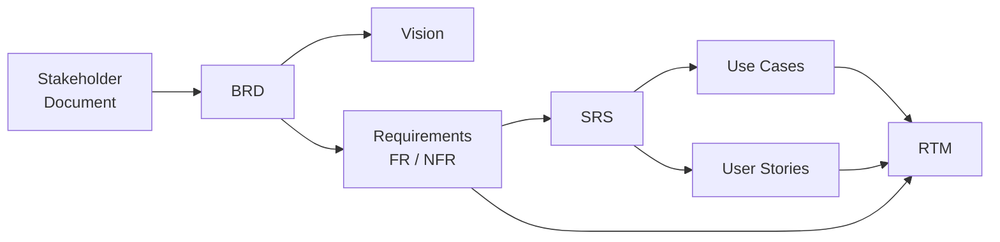

# ① Business & Requirements

> 📁 Lot 1 · 8 fiches · Toutes terminées ✅

Ce dossier couvre les documents produits **en amont du cycle de vie**, de la formulation du besoin métier jusqu'à la traçabilité complète des exigences. Ces artefacts répondent à la question fondamentale : **« Pourquoi fait-on ce projet, qu'attend-on, et comment s'en assurer ?** »

---

## Carte du lot

---

## Index des fiches

| #   | Acronyme        | Nom complet                              | Question clé                                          | Fiche                                                |
| --- | --------------- | ---------------------------------------- | ----------------------------------------------------- | ---------------------------------------------------- |
| 01  | **BRD**         | Business Requirements Document           | _Pourquoi ce projet ? Qu'attend le business ?_        | [→](./01-brd-business-requirements-document.md)      |
| 02  | **Vision**      | Vision Document                          | _Où va le produit à long terme ?_                     | [→](./02-vision-document.md)                         |
| 03  | **Stakeholder** | Stakeholder Document                     | _Qui a un enjeu et comment l'embarquer ?_             | [→](./03-stakeholder-document.md)                    |
| 04  | **FR / NFR**    | Functional & Non-Functional Requirements | _Que doit faire le système, et comment bien ?_        | [→](./04-requirements-fr-nfr.md)                     |
| 05  | **SRS**         | Software Requirements Specification      | _Spécification complète et vérifiable du système._    | [→](./05-srs-software-requirements-specification.md) |
| 06  | **UC**          | Use Cases                                | _Scénario complet acteur ↔ système, tous flux._       | [→](./06-use-cases.md)                               |
| 07  | **US**          | User Stories                             | _Tranche de valeur incrémentale centrée utilisateur._ | [→](./07-user-stories.md)                            |
| 08  | **RTM**         | Requirements Traceability Matrix         | _Chaque besoin est-il conçu, codé, testé ?_           | [→](./08-rtm-requirements-traceability-matrix.md)    |

---

## Relations avec les autres lots

| Vers                        | Ce que le Lot 1 fournit                                                   |
| --------------------------- | ------------------------------------------------------------------------- |
| **② Architecture & Design** | Exigences (SRS), NFR (contraintes architecturales), périmètre fonctionnel |
| **③ Quality & Dev**         | Definition of Done s'appuie sur les critères d'acceptation des US/UC      |
| **④ Test / V&V**            | Test Plan et Test Cases dérivent du SRS, UC, US via la RTM                |
| **⑤ Ops / Risk / Safety**   | Risk Register et Threat Model tracent vers les BR/NFR                     |
| **Tous les lots**           | La RTM est le fil de traçabilité transverse                               |

---

## Décisions de conception documentaire de ce lot

| Décision          | Justification                                                                             |
| ----------------- | ----------------------------------------------------------------------------------------- |
| BRD ≠ SRS         | Éviter la confusion métier/technique : le BRD dit _pourquoi_, le SRS dit _quoi en détail_ |
| UC ≠ User Stories | Complémentaires : UC = exhaustif multi-flux ; US = tranche incrémentale                   |
| NFR dans le SRS   | Les NFR sont des exigences système à part entière, pas des bonus                          |
| RTM = hub         | Aucun artefact n'agrège la traçabilité à lui seul — la RTM est ce hub                     |

---

⬅️ [Retour à l'index général](../README.md) · ➡️ Lot 2 : [Architecture & Design](../02-architecture-design/) _(à venir)_
