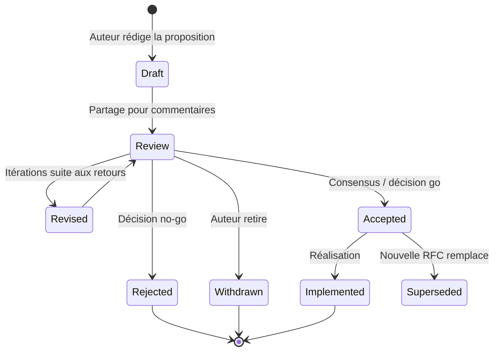
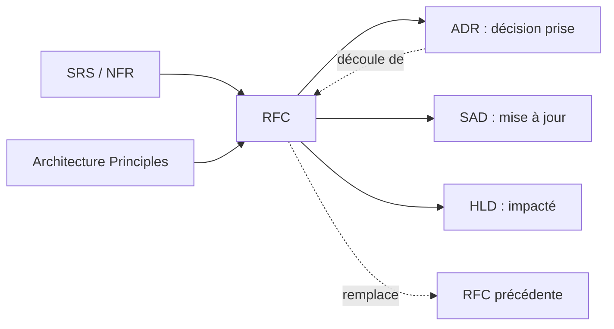
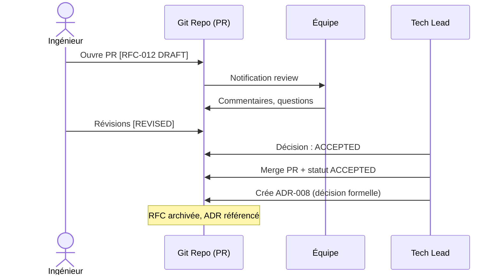

# RFC — Request for Comments

> 📁 Phase : ② Architecture & Design · 🏷️ Acronyme : **RFC** · 🔤 EN : _Request for Comments_

---

## 1. Définition & objectif

Un **RFC** (Request for Comments) est un **document de proposition** qui présente une idée, un changement technique ou architectural significatif, **avant** toute décision ou implémentation. Il invite explicitement la communauté technique à lire, critiquer et enrichir la proposition.

Le RFC répond à « **Voici ce que je propose de changer, pourquoi, et ce que j'ai écarté — qu'en pensez-vous ?** ».

> **Origine** : le terme vient des RFC de l'IETF (Internet Engineering Task Force), qui ont défini les protocoles fondamentaux d'Internet (TCP/IP, HTTP, TLS…) via ce processus ouvert. De nombreuses entreprises tech (Google, Meta, Rust, Notion, Oxide…) utilisent des RFC internes pour gouverner leurs décisions techniques.

| Ce qu'il EST                         | Ce qu'il N'EST PAS                 |
| ------------------------------------ | ---------------------------------- |
| Une proposition ouverte à discussion | Une décision prise (→ ADR)         |
| Un outil de collaboration async      | Un ticket Jira de tâche            |
| Un enregistrement du _raisonnement_  | Une spécification d'implémentation |

---

## 2. Usage & utilité

- **Aligner** l'équipe sur un changement significatif **avant** de le coder.
- **Collecter** des perspectives et des objections qu'on n'aurait pas anticipées seul.
- **Documenter le raisonnement** : dans 18 mois, on saura _pourquoi_ ce choix a été fait et quelles alternatives ont été examinées.
- **Éviter les mauvaises surprises** lors des code reviews (« personne ne m'a dit qu'on allait faire ça ! »).
- **Démocratiser** les décisions techniques : n'importe qui peut proposer.

**Quand utiliser un RFC vs un ADR ?**

```
RFC = avant la décision (proposition + débat)
ADR = après la décision (enregistrement de la décision prise)
```

Un RFC aboutit souvent à un ou plusieurs ADR.

---

## 3. Périmètre (in / out of scope)

**In scope**

- Problème à résoudre et motivation.
- Proposition détaillée (design, API, flux).
- Alternatives envisagées et raisons de leur rejet.
- Conséquences et risques.
- Questions ouvertes.

**Out of scope**

- La décision finale → **ADR**.
- L'implémentation détaillée → **LLD / Design Doc**.
- Les exigences métier → **BRD / SRS**.

---

## 4. Cycle de vie du document



- **Naissance** : quand un ingénieur identifie un changement significatif nécessitant un débat collectif.
- **Période de commentaires** : généralement **1 à 2 semaines** (window de review fixée à l'avance).
- **Clôture** : acceptée → ADR ; rejetée/retirée → archivée avec raisons.
- **Immortalité** : une RFC rejetée reste visible (valeur historique : « on a déjà essayé »).

---

## 5. Métiers / rôles concernés (RACI)

| Activité                     | Auteur (ingénieur) | Tech Lead / Architecte | Équipe | Product Owner |
| ---------------------------- | :----------------: | :--------------------: | :----: | :-----------: |
| Rédaction                    |       **R**        |           C            |   I    |       I       |
| Facilitation de la review    |         C          |         **R**          |   C    |       I       |
| Commentaires / objections    |         C          |           C            | **R**  |       C       |
| Décision (accepter/rejeter)  |         C          |         **A**          |   C    |       C       |
| Rédaction de l'ADR résultant |         C          |         **R**          |   C    |       I       |

**R**esponsible · **A**ccountable · **C**onsulted · **I**nformed.

> Tout le monde peut rédiger une RFC ; un rôle d'autorité (tech lead / architecte / comité) **valide ou rejette**.

---

## 6. Position & interactions avec les autres documents



| Document                    | Relation                                                                |
| --------------------------- | ----------------------------------------------------------------------- |
| **ADR**                     | Conséquence directe : la RFC est le débat, l'ADR est le verdict.        |
| **Architecture Principles** | Le RFC doit s'inscrire dans les principes — ou proposer de les réviser. |
| **SAD / HLD**               | Mis à jour une fois la RFC acceptée et l'ADR émis.                      |
| **SRS / NFR**               | Une RFC peut naître d'une contrainte NFR difficile à satisfaire.        |

---

## 7. Nommage & versionnement

- **Identifiants** : `RFC-###` séquentiel et global (jamais réutilisé). Ex. `RFC-042`.
- **Titre** : court, verbe d'action. Ex. `RFC-042: Migrate auth to OAuth2/PKCE`.
- **Statut** dans le titre ou l'en-tête : `[DRAFT]` / `[REVIEW]` / `[ACCEPTED]` / `[REJECTED]` / `[SUPERSEDED by RFC-###]`.
- **Stockage** : idéalement dans le dépôt Git (`docs/rfcs/RFC-042-auth-oauth2.md`) → traçabilité native, PR = période de commentaires.

---

## 8. Template vierge

```markdown
# RFC-### : <Titre court>

| Champ                    | Valeur                             |
| ------------------------ | ---------------------------------- |
| Auteur(s)                |                                    |
| Statut                   | DRAFT                              |
| Date de création         | AAAA-MM-JJ                         |
| Fin de période de review | AAAA-MM-JJ                         |
| RFC(s) liées             | RFC-###                            |
| ADR résultant            | ADR-### (à remplir après décision) |

---

## Résumé (TL;DR)

<3-5 phrases max. Ce que vous proposez, pourquoi, impact attendu.>

## Contexte & problème

<Situation actuelle. Pourquoi c'est un problème. Données/observations si possible.>

## Proposition

<Description détaillée de la solution proposée. Diagrammes, exemples de code, flux si nécessaire.>

## Alternatives considérées

| Alternative | Raison d'écartement |
| ----------- | ------------------- |
| Option A    |                     |
| Option B    |                     |

## Conséquences & risques

### Avantages

### Inconvénients / risques

### Impact sur les équipes / systèmes existants

## Questions ouvertes

- [ ] Question 1 ?
- [ ] Question 2 ?

## Plan d'implémentation (esquisse)

<Grandes étapes si la RFC est acceptée.>

---

## Journal de commentaires

| Date | Auteur | Commentaire | Réponse |
| ---- | ------ | ----------- | ------- |
```

---

## 9. Exemple rempli

```markdown
# RFC-012 : Découpler le service de facturation en microservice autonome

| Champ            | Valeur                   |
| ---------------- | ------------------------ |
| Auteur           | L. Durand (Backend Lead) |
| Statut           | ACCEPTED                 |
| Date de création | 2026-02-01               |
| Fin de review    | 2026-02-14               |
| ADR résultant    | ADR-008                  |

## Résumé

Le module de facturation est aujourd'hui couplé au monolithe du portail client.
Sa charge de génération PDF bloque le thread principal lors des pics de fin de mois.
Je propose de l'extraire en microservice indépendant avec une API REST interne.

## Problème

- 3 incidents P1 en Q4 2025 : timeout pages portail causés par génération PDF synchrone.
- Impossibilité de scaler indépendamment la facturation.
- NFR-PERF-001 (p95 < 500ms) non satisfaite lors des pics.

## Proposition

Créer `billing-service` (Node.js / Express) exposant :

- `GET /invoices/:customerId` — liste des factures
- `GET /invoices/:id/pdf` — génération async via queue

Le portail appelle le service via HTTP interne ; la génération PDF est mise en file (RabbitMQ).

## Alternatives

| Alternative                          | Rejet                                   |
| ------------------------------------ | --------------------------------------- |
| Cache agressif du PDF                | Ne résout pas les premières générations |
| Génération côté client (wkhtmltopdf) | Sécurité : accès aux données serveur    |

## Conséquences

✅ Scalabilité indépendante · ✅ NFR-PERF-001 satisfaite
⚠️ Complexité opérationnelle (nouveau service à déployer/monitorer)
⚠️ Latence réseau interne à mesurer
```

---

## 10. Checklist de revue

- [ ] Le **problème** est clairement énoncé avec données/observations.
- [ ] La **proposition** est suffisamment détaillée pour être évaluée.
- [ ] Les **alternatives** sont listées avec leurs raisons de rejet (pas juste l'option préférée).
- [ ] Les **conséquences** (positives et négatives) sont honnêtement décrites.
- [ ] Une **période de review** est fixée et communiquée.
- [ ] Le **statut** est à jour (`DRAFT → REVIEW → ACCEPTED/REJECTED`).
- [ ] Un **ADR est émis** une fois la décision prise.
- [ ] La RFC reste **archivée** (même si rejetée).

---

## 11. Anti-patterns & pièges

| Anti-pattern                      | Problème                                  | Correctif                                                   |
| --------------------------------- | ----------------------------------------- | ----------------------------------------------------------- |
| 🔒 **RFC = décision déjà prise**  | Simulation de débat ; démoralise l'équipe | Soumettre _avant_ d'avoir commencé à coder                  |
| 🌊 **Trop long / trop large**     | Personne ne lit, pas de feedback utile    | Découper en RFC ciblées ; TL;DR obligatoire                 |
| 🕳️ **Pas d'alternatives**         | Manque de rigueur intellectuelle          | Documenter au moins 2 alternatives                          |
| ⏱️ **Pas de deadline de review**  | La RFC reste ouverte indéfiniment         | Fixer une fenêtre (1–2 semaines)                            |
| 🧟 **RFC sans ADR résultant**     | La décision n'est pas tracée              | Systématiser le passage RFC → ADR                           |
| 😶 **Pas de retours de l'équipe** | Processus fantoche                        | RFC dans le repo Git = PR reviews = participation naturelle |

---

## 12. Variantes par industrie / contexte

| Contexte                    | Spécificités                                                                                                                      |
| --------------------------- | --------------------------------------------------------------------------------------------------------------------------------- |
| **Open source**             | RFC publiques (Rust RFC, TC39 proposals, Python PEP, PHP RFC) ; processus très formalisé avec états (`Pre-RFC`, `FCP`, `Merged`). |
| **Grande entreprise**       | Comité d'architecture (_Architecture Review Board_) qui statue sur les RFC.                                                       |
| **Startup / petite équipe** | RFC légère (1 page) dans un thread Slack/Notion + courte réunion.                                                                 |
| **Systèmes critiques**      | Le RFC devient une _Change Proposal_ formelle soumise à revue de sûreté.                                                          |
| **Standards (IETF/W3C)**    | RFC = standard lui-même ; processus multi-années avec consensus.                                                                  |

> **PEP (Python Enhancement Proposals)**, **TC39 Proposals** (JavaScript), **Rust RFCs**, **Vue RFCs** sont des exemples de systèmes RFC bien documentés à inspecter pour s'inspirer.

---

## 13. Standards & normes

- **IETF RFC Process** (RFC 2026, RFC 8729) — le processus originel.
- **RFC 2119** — sémantique `MUST/SHOULD/MAY` (réutilisable dans les propositions).
- Pratiques d'entreprise : [Rust RFC Process](https://github.com/rust-lang/rfcs), [Oxide RFC template](https://github.com/oxidecomputer/), Google Design Docs.

---

## 14. Outillage recommandé

| Besoin            | Outils                                                                       |
| ----------------- | ---------------------------------------------------------------------------- |
| Stockage & review | Git + Pull Requests (GitHub/GitLab) — commentaires inline = retours naturels |
| Templates         | Fichier TEMPLATE.md dans `docs/rfcs/`                                        |
| Suivi             | GitHub Issues / Notion / tableau de bord RFC avec statuts                    |
| Discussion async  | PR threads, Notion comments, Google Docs suggestions                         |

---

## 15. Diagramme — Cycle RFC → ADR



---

> 🔎 **En une phrase** : un RFC est une **invitation formelle à la pensée collective** — il force à écrire ses idées avant de coder, à exposer les alternatives, et laisse une trace durable du _pourquoi_.

⬅️ [Index du lot](./README.md) · ➡️ Suivant : [Architecture Principles](./02-architecture-principles.md)
