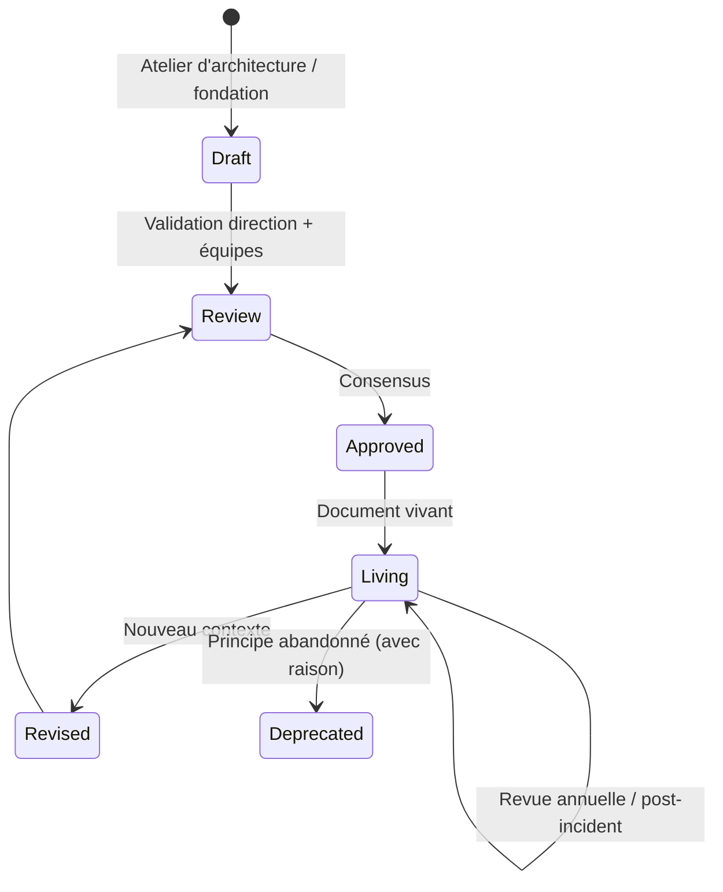
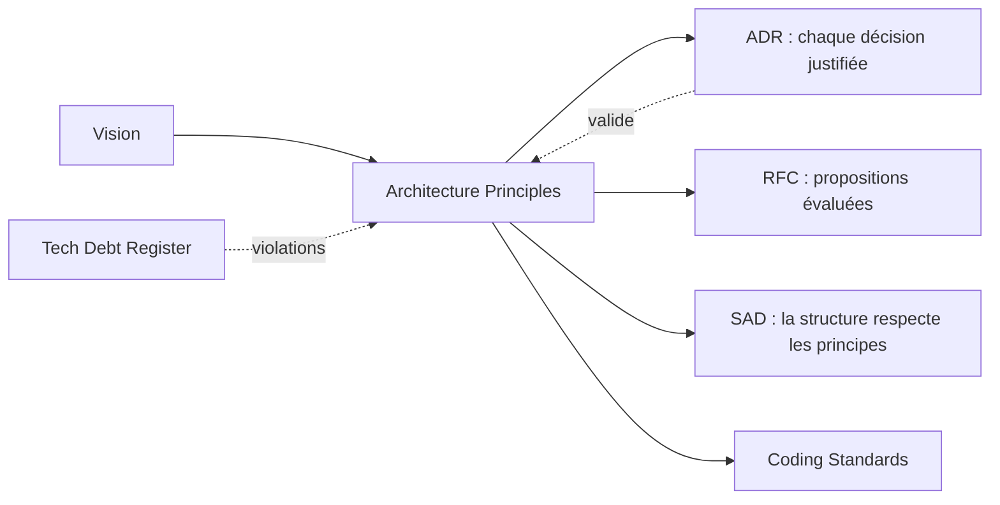
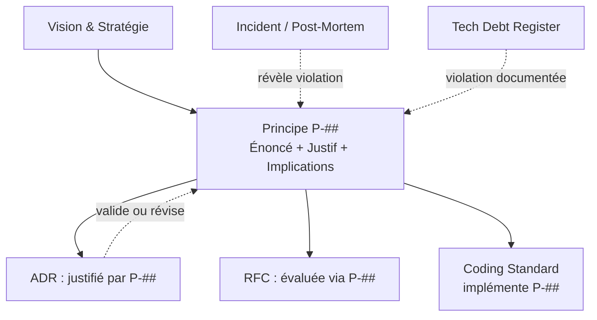

# Architecture Principles

> 📁 Phase : ② Architecture & Design · 🏷️ Acronyme : **Arch Principles** · 🔤 EN : _Architecture Principles_

---

## 1. Définition & objectif

Les **Architecture Principles** sont un ensemble de **règles directrices, formulées explicitement, qui gouvernent toutes les décisions architecturales et techniques** de l'organisation ou du système. Ils répondent à « **Quelles sont nos lois fondamentales de construction, qui s'appliquent à toutes les décisions ?** ».

Ce sont des principes _prescriptifs_ (ce qu'on doit faire) mais surtout _normatifs_ (ce qu'on valorise). Un principe est toujours formulé comme un **énoncé + justification + implication** — jamais comme une simple règle nue.

| Ce qu'ils SONT                    | Ce qu'ils NE SONT PAS              |
| --------------------------------- | ---------------------------------- |
| Des règles d'arbitrage durables   | Une liste de technologies choisies |
| Le « pourquoi » des décisions     | Des bonnes pratiques génériques    |
| Un outil d'alignement des équipes | Un document purement théorique     |

---

## 2. Usage & utilité

- **Arbitrer** les conflits de conception : « ces deux approches sont possibles — laquelle respecte nos principes ? »
- **Accélérer les décisions** : les équipes n'ont pas à remonter les arbitrages si les principes sont connus.
- **Onboarder** les nouveaux : comprendre les principes = comprendre l'ADN technique de l'organisation.
- **Justifier** les ADR et les RFC : « nous choisissons X car il respecte le principe P4 ».
- **Détecter les dettes** : une décision qui viole un principe → dette architecturale documentée.

---

## 3. Périmètre (in / out of scope)

**In scope**

- Principes **transverses** (s'appliquent à tout le système ou à toute l'organisation).
- Chaque principe : énoncé, justification, implications (ce que ça impose / ce que ça interdit), exceptions.

**Out of scope**

- Standards techniques précis (versions, bibliothèques) → _Tech Radar / Coding Standards_.
- Décisions spécifiques à un projet → **ADR**.
- Règles de code → **Coding Standards**.

---

## 4. Cycle de vie du document



- **Naissance** : à la fondation du projet ou de l'organisation ; souvent fruit d'un **atelier d'architecture** (event storming, architecture kata…).
- **Vie** : **document vivant**, revu annuellement ou après un incident/changement stratégique majeur.
- **Fin** : un principe peut être **déprécié** (mais jamais effacé — conserver la traçabilité).

---

## 5. Métiers / rôles concernés (RACI)

| Activité                 | Architecte | Tech Lead | CTO / Direction | Équipe Dev | PO  |
| ------------------------ | :--------: | :-------: | :-------------: | :--------: | :-: |
| Rédaction initiale       |   **R**    |   **R**   |        C        |     C      |  I  |
| Validation               |     C      |     C     |      **A**      |     C      |  I  |
| Application au quotidien |     C      |   **R**   |        I        |   **R**    |  I  |
| Revue périodique         |   **R**    |     C     |        A        |     C      |  C  |
| Exceptions / dérogations |   **R**    |     C     |      **A**      |     C      |  I  |

**R**esponsible · **A**ccountable · **C**onsulted · **I**nformed.

---

## 6. Position & interactions avec les autres documents



| Document               | Relation                                                         |
| ---------------------- | ---------------------------------------------------------------- |
| **Vision**             | Les principes traduisent la vision en règles opérationnelles.    |
| **ADR**                | Chaque ADR **cite le(s) principe(s)** qui guide(nt) la décision. |
| **RFC**                | Les RFC sont évaluées à l'aune des principes.                    |
| **Tech Debt Register** | Une violation de principe = une dette à documenter.              |

---

## 7. Nommage & versionnement

- **Fichier** : `architecture-principles.md` ou `P-###-nom-du-principe.md` si trop nombreux.
- **Identifiants** : `P-01`, `P-02`… — stables, référencés dans les ADR.
- **Versionnement** : date de dernière révision + historique ; changement majeur = nouvelle version.
- **Format** : document court (< 20 principes ; au-delà ils ne sont plus mémorisables).

---

## 8. Template vierge

```markdown
# Architecture Principles — <Système / Organisation>

_Version x.y — AAAA-MM-JJ_

## P-01 : <Titre du principe>

| Champ              | Valeur                                              |
| ------------------ | --------------------------------------------------- |
| Énoncé             | <1 phrase claire, affirmative>                      |
| Justification      | <Pourquoi ce principe ? Quel problème évite-t-il ?> |
| Implications       | <Ce que ce principe impose en pratique (concret)>   |
| Contre-exemples    | <Ce que ce principe interdit ou rend difficile>     |
| Exceptions connues | <Cas légitimes de dérogation + conditions>          |
| Référence          | ADR-###, P-###                                      |
```

---

## 9. Exemple rempli

```markdown
# Architecture Principles — Portail Client Self-Service

_Version 1.1 — 2026-03-01_

---

## P-01 : Design for failure

| Champ           | Valeur                                                                                                           |
| --------------- | ---------------------------------------------------------------------------------------------------------------- |
| Énoncé          | Tout composant est conçu en supposant que ses dépendances _peuvent_ être indisponibles.                          |
| Justification   | En environnement distribué, les pannes partielles sont inévitables. Un système non résilient propage les pannes. |
| Implications    | Circuit breakers, timeouts, retry avec backoff, graceful degradation.                                            |
| Contre-exemples | Appels synchrones bloquants sans timeout.                                                                        |
| Exceptions      | Opérations transactionnelles (paiement) : résilience spécifique via saga/compensating transactions.              |
| Référence       | ADR-003 (choix Resilience4j)                                                                                     |

---

## P-02 : API-first

| Champ           | Valeur                                                                                       |
| --------------- | -------------------------------------------------------------------------------------------- |
| Énoncé          | Toute fonctionnalité est exposée via une API contractualisée avant d'être implémentée.       |
| Justification   | Permet le développement parallèle front/back ; les API sont des produits dès leur naissance. |
| Implications    | OpenAPI spec versionnée en amont ; mock servers pour le développement frontend.              |
| Contre-exemples | Implémentation puis documentation rétroactive.                                               |
| Exceptions      | Scripts/outils internes non exposés.                                                         |
| Référence       | ADR-005 (OpenAPI 3.1)                                                                        |

---

## P-03 : Ownership clair par service

| Champ           | Valeur                                                                                                      |
| --------------- | ----------------------------------------------------------------------------------------------------------- |
| Énoncé          | Chaque service a une équipe propriétaire qui en est responsable de bout en bout (you build it, you run it). |
| Justification   | Éviter la « tragédie des communs » : sans owner, personne ne maintient.                                     |
| Implications    | CODEOWNERS, runbooks, alertes → équipe propriétaire.                                                        |
| Contre-exemples | Services partagés sans owner désigné.                                                                       |
| Exceptions      | Services de platform fournis par une équipe centrale dédiée.                                                |

---

## P-04 : Sécurité by design

...
```

---

## 10. Checklist de revue

- [ ] Chaque principe est un **énoncé affirmatif et mémorisable** (pas un paragraphe de prose).
- [ ] La **justification** explique le problème que le principe résout.
- [ ] Les **implications concrètes** sont présentes (qu'est-ce que ça change dans la pratique ?).
- [ ] Les **exceptions** sont explicites (sinon tout le monde contourne sans le dire).
- [ ] Le nombre de principes est **raisonnable** (≤ 15–20 pour être mémorisables).
- [ ] Les principes sont **opposables** entre eux (ils servent à trancher, pas à être toujours vrais).
- [ ] Les équipes les **connaissent** (diffusion, onboarding).
- [ ] Les ADR les **citent** effectivement.

---

## 11. Anti-patterns & pièges

| Anti-pattern                                     | Problème                               | Correctif                                                     |
| ------------------------------------------------ | -------------------------------------- | ------------------------------------------------------------- |
| 🌫️ **Principes génériques** (« soyons simples ») | Inutilisables pour arbitrer            | Formulation précise + contre-exemples                         |
| 📋 **Liste de technologies**                     | Périme vite, confond principe et outil | Principes tech-agnostiques                                    |
| 📚 **Trop de principes** (40+)                   | Personne ne les retient                | 10–15 max ; les autres → patterns/guidelines                  |
| 🧊 **Jamais cités dans les ADR**                 | Décoration ; non applicables           | Référencement systématique dans les ADR                       |
| 🔒 **Principes immuables**                       | Le contexte change                     | Revue annuelle, dépréciation explicite                        |
| 🙈 **Non diffusés**                              | Les équipes ne les connaissent pas     | Onboarding, wiki, affichage, référencés dans les PR templates |

---

## 12. Variantes par industrie / contexte

| Contexte                    | Spécificités                                                                                                               |
| --------------------------- | -------------------------------------------------------------------------------------------------------------------------- |
| **Enterprise / TOGAF**      | Principes d'architecture d'entreprise (business, data, application, technology layers) avec attributs formels (TOGAF ADM). |
| **Cloud-native**            | Principes : 12-factor app, stateless, immutable infrastructure, GitOps.                                                    |
| **DDD**                     | Principes autour des bounded contexts, des ubiquitous languages, du domain ownership.                                      |
| **Systèmes critiques**      | Principes de sûreté (safety by design, fail-safe, defense in depth) au même niveau que les principes techniques.           |
| **Agile / team topologies** | Principes d'organisation du système alignés sur les équipes (Conway's Law consciente).                                     |

---

## 13. Standards & normes

- **TOGAF® ADM** — Architecture Principles comme artefact formel de l'_Architecture Repository_.
- **ISO/IEC/IEEE 42010** — _Architecture Description_ : justification et rationalisation des décisions.
- **AWS Well-Architected Framework** — 6 pillars comme principes de référence (cloud).
- **Google SRE Book** — principes opérationnels (reliability, toil reduction).
- **12-Factor App** (Heroku/Heroku Alumni) — principes pour les applications cloud-native.

---

## 14. Outillage recommandé

| Besoin                | Outils                                                     |
| --------------------- | ---------------------------------------------------------- |
| Documentation         | Confluence, Notion, Markdown dans le repo (proche des ADR) |
| Atelier de définition | Architecture Kata (Ted Neward), Event Storming, Miro       |
| Diffusion             | Wiki d'équipe, onboarding checklist, template de PR        |
| Tech Radar associé    | ThoughtWorks Tech Radar, Zalando TechRadar template        |

---

## 15. Diagramme — Structure d'un principe et ses connexions



---

> 🔎 **En une phrase** : les Architecture Principles sont les **lois fondamentales** de l'ingénierie — ils font des règles implicites des règles explicites, et permettent aux équipes de décider seules en restant alignées.

⬅️ [RFC](./01-rfc-request-for-comments.md) · ➡️ Suivant : [SAD](./03-sad-software-architecture-document.md)
