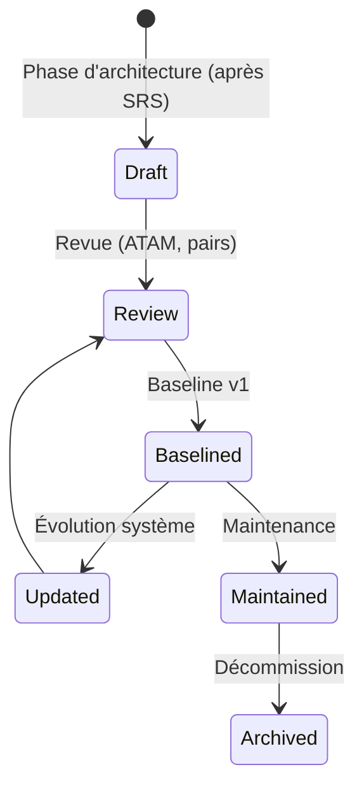
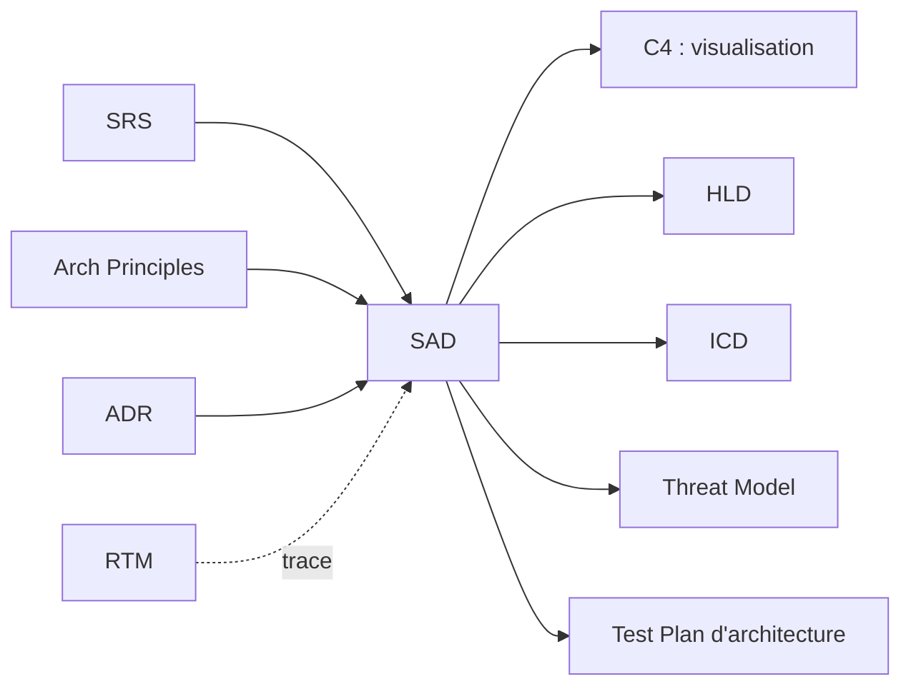
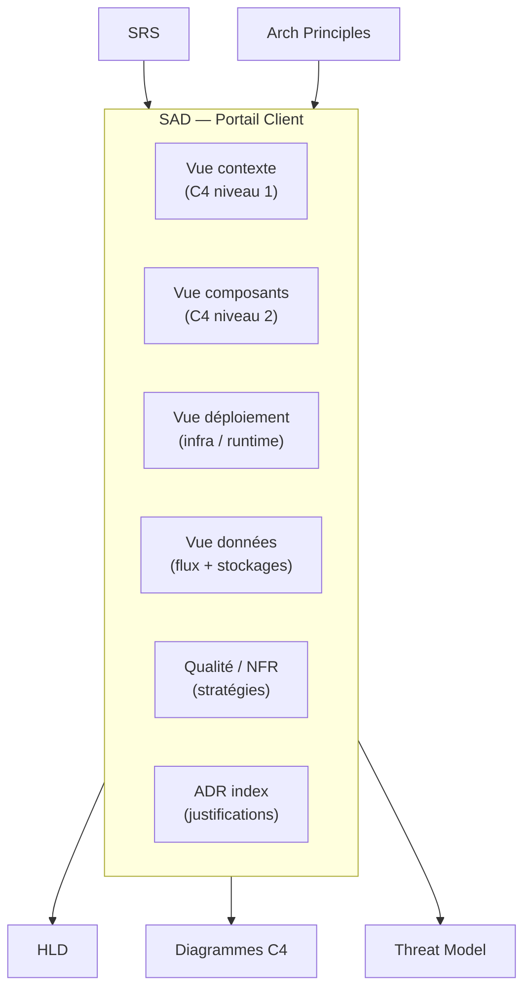

# SAD — Software Architecture Document

> 📁 Phase : ② Architecture & Design · 🏷️ Acronyme : **SAD** · 🔤 EN : _Software Architecture Document_

---

## 1. Définition & objectif

Le **SAD** est le document de référence qui décrit **l'architecture globale d'un système logiciel** : sa décomposition en composants, leurs responsabilités, leurs interactions, les décisions structurantes et leurs justifications. Il répond à « **Comment le système est-il organisé en grande maille, pourquoi, et quelles sont les contraintes structurantes ?** ».

C'est le document que le nouvel architecte ou ingénieur lit en premier pour comprendre le système dans son ensemble.

| Ce qu'il EST                            | Ce qu'il N'EST PAS                                |
| --------------------------------------- | ------------------------------------------------- |
| La vue architecturale de référence      | Le détail d'implémentation d'un composant (→ LLD) |
| La justification des choix structurants | Une spécification d'exigences (→ SRS)             |
| Un document vivant et narratif          | Un diagramme seul sans texte                      |

> **Noms alternatifs** : _Software Architecture Description (SAD)_, _System Architecture Document_, _Architecture Blueprint_, _Architecture Overview_.

---

## 2. Usage & utilité

- **Onboarding** : un nouveau venu comprend le système en 30 minutes.
- **Communication** : vocabulaire partagé entre équipes, avec le management, avec les auditeurs.
- **Arbitrage** : décisions de conception vérifiées par rapport à l'architecture décrite.
- **Évaluation** : ATAM/CBAM pour évaluer les tradeoffs (performance vs sécurité, etc.).
- **Impact analysis** : comprendre les conséquences d'un changement.
- **Conformité** : en systèmes critiques, artefact de certification.

---

## 3. Périmètre (in / out of scope)

**In scope**

- Contexte et objectifs architecturaux (NFR, contraintes).
- Vues architecturales : logique, composants/connecteurs, déploiement, données.
- Décisions et principes structurants (avec lien ADR).
- Risques architecturaux et stratégies de mitigation.
- Glossaire.

**Out of scope**

- Détail d'algorithmes/implémentation → **LLD / Design Doc**.
- Exigences métier → **SRS / BRD**.
- Planning / roadmap.

---

## 4. Cycle de vie du document



- **Naissance** : après la baseline SRS, en phase de conception.
- **Vie** : **document vivant**, mis à jour à chaque ADR impactant la structure ; versionné.
- **Fin** : archivé à la décommission du système (reste une référence historique).

---

## 5. Métiers / rôles concernés (RACI)

| Activité                   | Architecte | Tech Lead | Dev Senior | QA  |  PO   | Ops |
| -------------------------- | :--------: | :-------: | :--------: | :-: | :---: | :-: |
| Rédaction                  |   **R**    |     C     |     C      |  I  |   I   |  C  |
| Revue qualité archi        |   **R**    |   **R**   |     C      |  I  |   I   |  C  |
| Revue conformité exigences |     C      |     C     |     I      |  C  | **A** |  I  |
| Mise à jour                |   **R**    |     C     |     C      |  I  |   I   |  C  |

---

## 6. Position & interactions avec les autres documents



| Document                    | Relation                                                                        |
| --------------------------- | ------------------------------------------------------------------------------- |
| **SRS / NFR**               | Les NFR sont les _Architecturally Significant Requirements_ qui forment le SAD. |
| **Architecture Principles** | Le SAD applique et incarne les principes.                                       |
| **ADR**                     | Chaque décision structurante a son ADR ; le SAD **synthétise** leur résultat.   |
| **C4**                      | Les vues C4 sont les diagrammes du SAD.                                         |
| **HLD**                     | Le SAD est au niveau système ; le HLD est au niveau service/sous-système.       |
| **Threat Model**            | S'appuie sur la topologie décrite dans le SAD.                                  |

---

## 7. Nommage & versionnement

- **Fichier / titre** : `SAD-<Système>-v<Major.Minor>` ou `architecture-overview.md`.
- **Versionnement** : sémantique ; `v1.x` pour évolutions mineures (ajout composant), `v2.0` pour restructurations majeures.
- **Sections stables vs vivantes** : séparer les vues stables (principes) des vues dynamiques (déploiement actuel) pour faciliter la maintenance.

---

## 8. Template vierge (inspiré arc42 + IEEE 42010)

```markdown
# SAD — <Système> (v1.0)

## 1. Introduction

### 1.1 Objectif & portée

### 1.2 Parties prenantes et leurs préoccupations architecturales

### 1.3 Références (SRS, ADR index, Principles)

## 2. Contexte & périmètre système

### 2.1 Contexte métier

### 2.2 Contexte technique (environnement d'intégration)

_(Diagramme C4 niveau 1 — System Context)_

## 3. Contraintes & décisions structurantes

### 3.1 Contraintes (techniques, légales, organisationnelles)

### 3.2 Hypothèses

### 3.3 Principes architecturaux appliqués (ref. P-##)

## 4. Architecture logique (vue composants)

_(Diagramme C4 niveau 2 — Containers)_

### 4.1 Décomposition en composants/services

### 4.2 Responsabilités

### 4.3 Interactions & protocoles

## 5. Vue de déploiement (runtime)

_(Diagramme C4 niveau 4 ou deployment diagram)_

### 5.1 Infrastructure cible

### 5.2 Configuration réseau / sécurité

## 6. Vue des données

### 6.1 Flux de données (data flow)

### 6.2 Stockages et responsabilités

## 7. Attributs de qualité (NFR) & stratégies

| NFR | Stratégie architecturale | ADR |
| --- | ------------------------ | --- |

## 8. Décisions architecturales (index ADR)

## 9. Risques architecturaux

## 10. Glossaire
```

---

## 9. Exemple rempli (extrait)

```markdown
# SAD — Portail Client Self-Service (v1.2)

## 2. Contexte & périmètre

Le portail est un système web accessible aux clients B2C pour le suivi de commandes,
la facturation et les réclamations. Il s'intègre à 3 systèmes existants :
Order Management System (OMS), Billing v2, CRM.

## 4. Architecture logique

Le système est décomposé en 5 containers :

| Container            | Techno          | Responsabilité                            |
| -------------------- | --------------- | ----------------------------------------- |
| Web App (SPA)        | React 18        | Interface client                          |
| API Gateway          | Kong            | Routing, auth, rate limiting              |
| Customer API         | Node.js/Express | Orchestration des appels                  |
| Billing Service      | Node.js         | Génération PDF, facturation (cf. RFC-012) |
| Notification Service | Python          | E-mails, webhooks                         |

Interfaces externes : OMS (REST/JSON), Billing v2 (REST/JSON), CRM (SOAP/XML).

## 7. Stratégies NFR

| NFR                        | Stratégie                              | ADR              |
| -------------------------- | -------------------------------------- | ---------------- |
| NFR-PERF-001 (p95 < 500ms) | CDN, cache Redis, génération PDF async | ADR-003, ADR-008 |
| NFR-AVL-001 (99,9%)        | Déploiement multi-AZ, health checks    | ADR-006          |
| NFR-SEC-001 (TLS 1.2+)     | TLS terminé au Kong, mTLS interne      | ADR-009          |
```

---

## 10. Checklist de revue (ATAM)

- [ ] Toutes les **préoccupations des parties prenantes** sont adressées.
- [ ] Les **NFR structurantes** (performance, sécurité, disponibilité) sont explicitement traitées.
- [ ] Chaque décision majeure a un **ADR** associé.
- [ ] Les **interfaces externes** sont documentées.
- [ ] Les **risques architecturaux** sont identifiés.
- [ ] La vue de **déploiement** est présente.
- [ ] Le document est **compréhensible** sans contexte préalable (glossaire).
- [ ] Les **tradeoffs** sont explicites (pas de solution parfaite sans compromis).

---

## 11. Anti-patterns & pièges

| Anti-pattern                                  | Problème                            | Correctif                                          |
| --------------------------------------------- | ----------------------------------- | -------------------------------------------------- |
| 🖼️ **Diagramme seul sans texte**              | Incompréhensible hors contexte      | Texte + diagramme, toujours                        |
| 🧊 **SAD obsolète** (jamais mis à jour)       | Pire que l'absence de doc           | Processus : chaque ADR impactant → maj SAD         |
| 🔮 **Architecture aspirationnelle** ≠ réalité | Fausse confiance                    | Décrire l'existant, séparer les évolutions prévues |
| 📚 **Trop de détail** (niveau LLD)            | Ingérable, périme vite              | SAD = grandes mailles ; LLD pour le détail         |
| 🌫️ **Pas de justification** des choix         | Incompris, remis en question        | ADR pour chaque décision structurante              |
| 🧩 **Une seule vue**                          | Impossible de voir tous les aspects | Vues multiples (logique, déploiement, données…)    |

---

## 12. Variantes par industrie / contexte

| Contexte               | Spécificités                                                                             |
| ---------------------- | ---------------------------------------------------------------------------------------- |
| **arc42**              | Template standardisé en 12 chapitres, très utilisé en Europe. Recommandé pour sa clarté. |
| **IEEE 42010**         | Standard formel de description d'architecture avec _viewpoints_ et _views_.              |
| **TOGAF**              | Architecture Description dans l'ADM ; vues Business, Data, Application, Technology.      |
| **Systèmes critiques** | SAD formel, soumis à revue de sûreté ; artefact de certification (DO-178C, IEC 62304).   |
| **Microservices**      | SAD de système + SAD par domaine (DDD bounded context).                                  |
| **Cloud**              | Vues d'infrastructure as code, diagrammes AWS/Azure/GCP, FinOps.                         |

---

## 13. Standards & normes

- **ISO/IEC/IEEE 42010:2011** — _Systems and software engineering — Architecture description_ (standard de référence).
- **arc42** (Gernot Starke & Peter Hruschka) — template pragmatique dérivé de l'IEEE 42010.
- **TOGAF® ADM** — _Architecture Development Method_, vues BDAT.
- **RUP 4+1 views** (Philippe Kruchten) — vues logique, processus, physique, développement + cas d'usage.
- **AWS/Google/Azure Well-Architected Framework** — principes de référence par cloud provider.

---

## 14. Outillage recommandé

| Besoin                    | Outils                                                        |
| ------------------------- | ------------------------------------------------------------- |
| Rédaction & structuration | arc42 templates, Confluence + Structurizr, Markdown           |
| Diagrammes                | Structurizr (C4), PlantUML, Mermaid, draw.io, Lucidchart      |
| Évaluation architecture   | ATAM (Architecture Tradeoff Analysis Method)                  |
| Conformité                | Enterprise Architect, Sparx EA, Cameo Systems Modeler (SysML) |

---

## 15. Diagramme — Les vues du SAD



---

> 🔎 **En une phrase** : le SAD est **la carte du territoire** — il donne la vision globale, les composants, les interactions et les raisons des choix, pour que n'importe qui puisse naviguer dans le système sans se perdre.

⬅️ [Architecture Principles](./02-architecture-principles.md) · ➡️ Suivant : [C4 Model](./04-c4-model.md)
