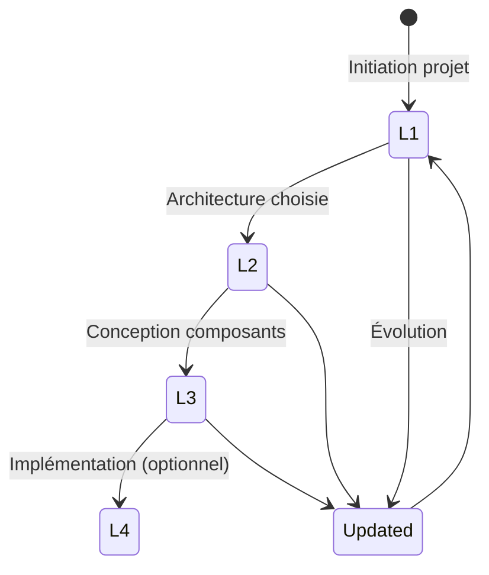
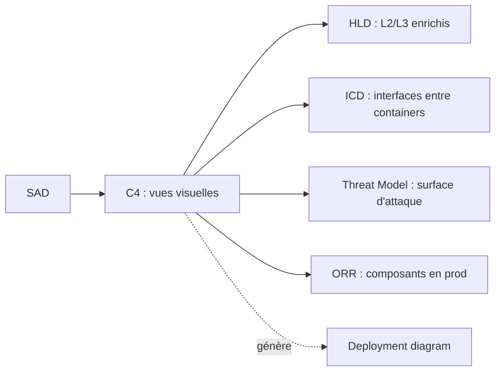
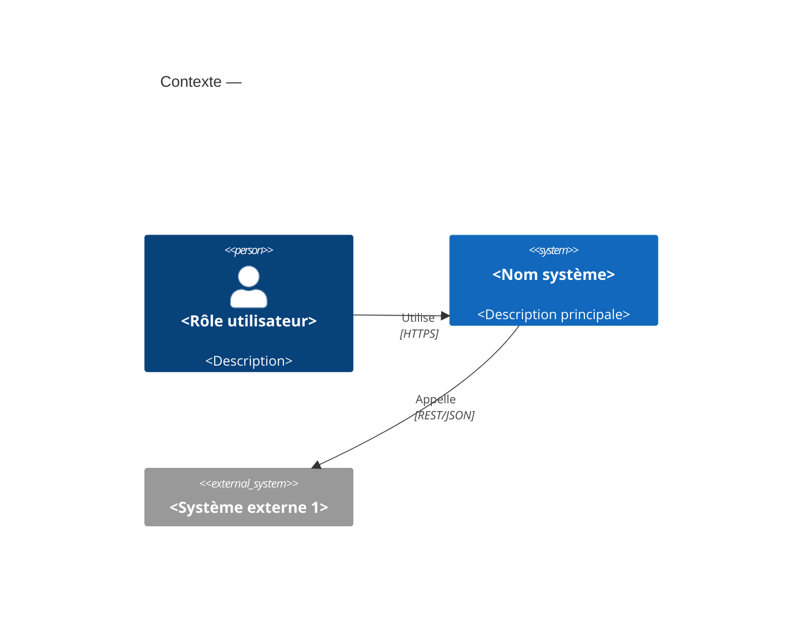
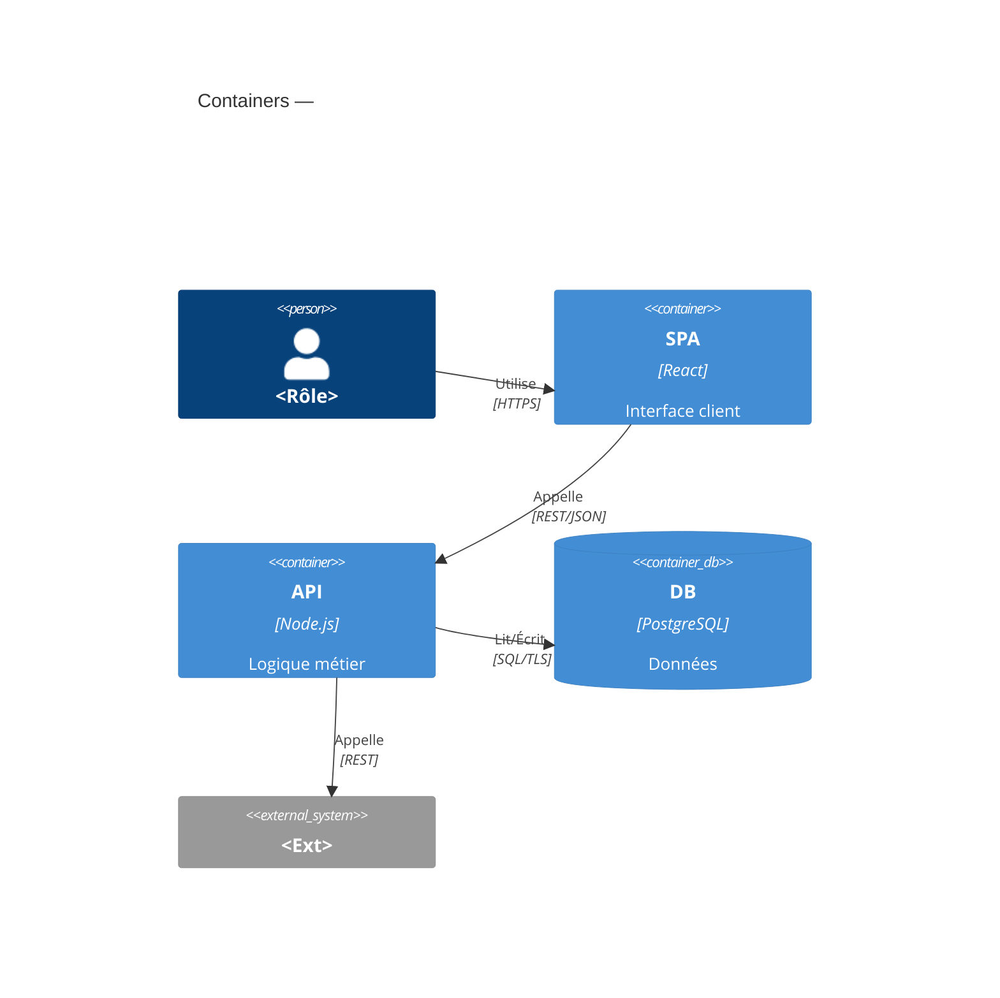
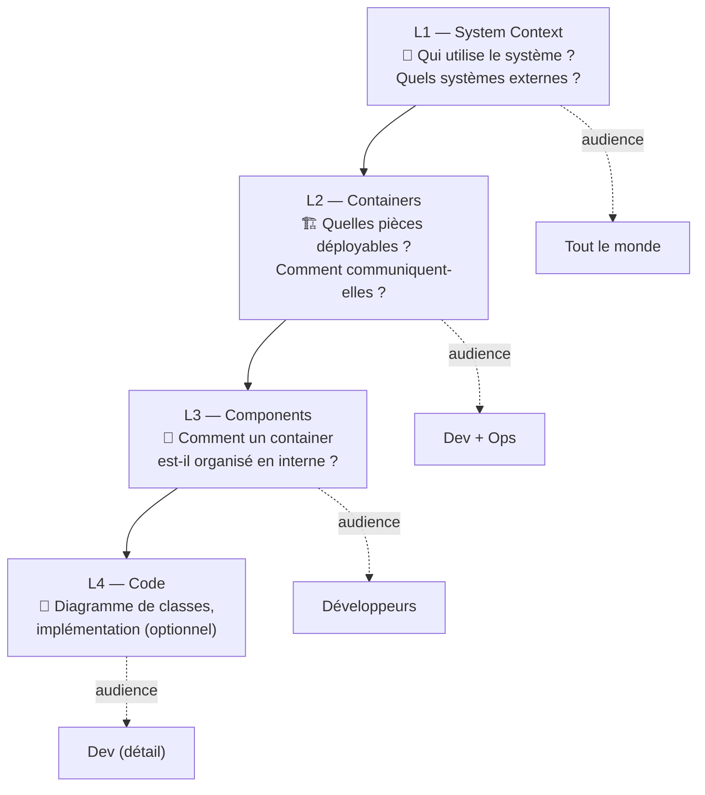

# C4 Model

> 📁 Phase : ② Architecture & Design · 🏷️ Acronyme : **C4** · 🔤 EN : _C4 Model (Context, Containers, Components, Code)_

---

## 1. Définition & objectif

Le **C4 Model** est un **système de diagrammes architecturaux à 4 niveaux de zoom**, créé par Simon Brown, permettant de visualiser l'architecture logicielle de manière **standardisée, lisible et sans ambiguïté**. Le nom vient des 4 niveaux : **Context → Containers → Components → Code**.

Il répond à « **Comment représenter visuellement l'architecture à différents niveaux d'abstraction, pour différents publics ?** »

| Niveau                  | Zoom          | Audience      | Question                                        |
| ----------------------- | ------------- | ------------- | ----------------------------------------------- |
| **L1 — System Context** | 🔭 Très large | Tout le monde | _Le système interagit avec qui et quoi ?_       |
| **L2 — Containers**     | 🏗️ Système    | Dev + ops     | _Quelles sont les grandes pièces déployables ?_ |
| **L3 — Components**     | 🔬 Container  | Développeurs  | _Comment un container est-il organisé ?_        |
| **L4 — Code**           | 🧬 Composant  | Développeurs  | _Comment un composant est-il implémenté ?_      |

---

## 2. Usage & utilité

- **Réduire l'ambiguïté** : chaque type de boîte et de flèche a une signification précise.
- **Adapter le niveau au public** : un manager voit le L1 ; un dev vu le L3.
- **Faciliter l'onboarding** : en 4 slides, un nouveau dev comprend le système.
- **Documenter l'architecture vivante** : avec Structurizr, les diagrammes sont générés depuis du code DSL.
- **Compléter le SAD** : les diagrammes C4 sont les vues visuelles canoniques du SAD.

---

## 3. Périmètre (in / out of scope)

**In scope**

- Les 4 niveaux de diagrammes principaux.
- Les diagrammes **complémentaires** : System Landscape, Dynamic (séquence), Deployment.
- La notation et les éléments (Person, System, Container, Component, Relationship).

**Out of scope**

- Les diagrammes UML détaillés de classes/séquences → Design Doc / LLD.
- Les flux de données fins → Data Flow Diagram.
- Les diagrammes de processus métier → BPMN.

---

## 4. Cycle de vie du document



- **Naissance** : L1 en phase d'initiation (avant même le SRS dans certains cas) ; L2 en phase d'architecture ; L3 en conception fine.
- **Vie** : **diagrammes vivants** — idéalement générés depuis un DSL (Structurizr) pour rester synchronisés avec la réalité.
- **L4** : rarement maintenu manuellement (peut être généré depuis le code via des outils).

---

## 5. Métiers / rôles concernés (RACI)

| Niveau        | Architecte | Tech Lead |  Dev  | PO  |  Ops  |
| ------------- | :--------: | :-------: | :---: | :-: | :---: |
| L1 Context    |   **R**    |     C     |   I   |  C  |   I   |
| L2 Containers |   **R**    |   **R**   |   C   |  I  |   C   |
| L3 Components |     C      |   **R**   | **R** |  I  |   I   |
| L4 Code       |     I      |     C     | **R** |  I  |   I   |
| Deployment    |   **R**    |     C     |   C   |  I  | **R** |

**R**esponsible · **A**ccountable · **C**onsulted · **I**nformed.

---

## 6. Position & interactions avec les autres documents



| Document           | Relation                                                                          |
| ------------------ | --------------------------------------------------------------------------------- |
| **SAD**            | Le C4 **illustre** le SAD ; les deux sont complémentaires.                        |
| **HLD**            | Les L2/L3 alimentent et précisent le HLD.                                         |
| **ICD / API Spec** | Les flèches du L2 correspondent aux interfaces documentées dans les ICD.          |
| **Threat Model**   | La surface d'attaque est visible sur les diagrammes C4 (boundaries, trust zones). |

---

## 7. Nommage & versionnement

- **Fichiers** : `c4-l1-context.md`, `c4-l2-containers.md`, etc. ou un seul fichier `c4-architecture.md`.
- **Versionné avec le SAD** — un changement de topologie = mise à jour des diagrammes impactés.
- **Approche recommandée** : diagrammes **as code** (Structurizr DSL, PlantUML C4) stockés dans Git → diff visuel possible.

---

## 8. Template vierge (Mermaid C4)

````markdown
### L1 — System Context


````

### L2 — Containers



````

---

## 9. Exemple rempli — Portail Client

### L1 — System Context

```mermaid
C4Context
    title L1 — Contexte : Portail Client Self-Service
    Person(client, "Client B2C", "Consulte commandes, factures, ouvre réclamations")
    Person(admin, "Administrateur", "Gère les réclamations escaladées")

    System(portal, "Portail Client", "Application web self-service pour les clients")

    System_Ext(oms, "Order Management System", "Gestion des commandes (existant)")
    System_Ext(billing, "Billing v2", "Facturation et PDF (existant)")
    System_Ext(crm, "CRM", "Historique client (existant)")
    System_Ext(idp, "Identity Provider", "Authentification (Keycloak)")

    Rel(client, portal, "Utilise", "HTTPS/Browser")
    Rel(admin, portal, "Gère", "HTTPS/Browser")
    Rel(portal, oms, "Consulte commandes", "REST/JSON")
    Rel(portal, billing, "Consulte/génère factures", "REST/JSON")
    Rel(portal, crm, "Consulte historique", "SOAP/XML")
    Rel(portal, idp, "Authentifie", "OAuth2/OIDC")
````

### L2 — Containers

```mermaid
C4Container
    title L2 — Containers : Portail Client

    Person(client, "Client B2C")

    Container(spa, "Web App", "React 18 / Vite", "SPA — interface utilisateur")
    Container(gw, "API Gateway", "Kong", "Routing, auth JWT, rate limiting")
    Container(capi, "Customer API", "Node.js / Express", "Orchestration, BFF")
    Container(billing_svc, "Billing Service", "Node.js", "Génération PDF, async queue")
    Container(notif, "Notification Service", "Python / FastAPI", "E-mails, webhooks")
    ContainerDb(db, "Customer DB", "PostgreSQL", "Profils, réclamations, préférences")
    ContainerDb(cache, "Cache", "Redis", "Sessions, résultats OMS mis en cache")
    ContainerQueue(queue, "Message Queue", "RabbitMQ", "Jobs PDF async")

    System_Ext(oms, "OMS", "")
    System_Ext(billing2, "Billing v2", "")
    System_Ext(crm, "CRM", "")
    System_Ext(idp, "IdP (Keycloak)", "")

    Rel(client, spa, "Utilise", "HTTPS")
    Rel(spa, gw, "Appelle", "REST/JSON")
    Rel(gw, idp, "Valide token", "JWT/OIDC")
    Rel(gw, capi, "Route", "REST/JSON")
    Rel(capi, oms, "Lit commandes", "REST/JSON")
    Rel(capi, billing2, "Lit factures", "REST/JSON")
    Rel(capi, crm, "Lit historique", "SOAP/XML")
    Rel(capi, db, "Lit/Écrit", "SQL/TLS")
    Rel(capi, cache, "Lit/Écrit", "Redis")
    Rel(capi, billing_svc, "Demande PDF", "REST interne")
    Rel(billing_svc, queue, "Publie job", "AMQP")
    Rel(billing_svc, notif, "Notifie", "REST interne")
    Rel(notif, client, "Envoie e-mail", "SMTP/TLS")
```

---

## 10. Checklist de revue

- [ ] **L1** : tous les utilisateurs et systèmes externes sont représentés.
- [ ] **L2** : chaque container est **déployable** indépendamment (un container ≠ une classe).
- [ ] Les **relations** ont un libellé de protocole/technologie.
- [ ] Les **trust boundaries** (zones de confiance) sont visibles (internal vs external).
- [ ] Le **diagramme est cohérent** avec le SAD et le deployment réel.
- [ ] Pas de **fuite de L3 dans L2** (pas d'implémentation interne dans le contexte).
- [ ] Accessible **sans légende externe** (les formes sont explicites ou légendées).

---

## 11. Anti-patterns & pièges

| Anti-pattern                                          | Problème                        | Correctif                             |
| ----------------------------------------------------- | ------------------------------- | ------------------------------------- |
| 🎨 **Diagramme spaghetti** (tout dans un seul niveau) | Illisible                       | Respecter les 4 niveaux               |
| 📦 **Container = classe/fonction**                    | Mauvaise granularité (trop fin) | Container = process/déployable        |
| ↔️ **Flèches sans libellé**                           | Ambiguïté du contrat            | Toujours libellées (protocole/techno) |
| 🖼️ **Diagramme statique** jamais mis à jour           | Trompe plus qu'il n'aide        | Diagramme as code (Structurizr)       |
| 🔀 **Mélanger les niveaux** dans un même diagramme    | Confusion                       | Un niveau par diagramme               |
| 🙈 **Omettre les systèmes externes**                  | Dépendances cachées             | Tous les systèmes ext. en L1          |

---

## 12. Variantes par industrie / contexte

| Contexte               | Spécificités                                                                                                                 |
| ---------------------- | ---------------------------------------------------------------------------------------------------------------------------- |
| **Microservices**      | L2 est particulièrement riche (nombreux containers/services) ; ajouter un _System Landscape_ pour la vue macro-organisation. |
| **Monolithe**          | L2 simple (1 container + DB) ; L3 très utile pour la structuration interne.                                                  |
| **Event-driven**       | Utiliser le diagramme **Dynamic C4** pour visualiser les flux d'événements.                                                  |
| **Systèmes critiques** | Diagrammes C4 comme base pour la décomposition fonctionnelle en DO-178C/IEC 62304.                                           |
| **Cloud**              | L4 Deployment correspond aux diagrammes d'infrastructure (VPC, AZ, services managés).                                        |

---

## 13. Standards & normes

- **Simon Brown — C4 Model** ([c4model.com](https://c4model.com)) — référence officielle.
- **arc42** — utilise le C4 comme notation recommandée pour les vues architecturales.
- **ISO/IEC/IEEE 42010** — _architecture viewpoints_ ; le C4 implémente ce concept.
- **Structurizr DSL** — implémentation officielle du C4 as code (par Simon Brown).

---

## 14. Outillage recommandé

| Besoin                 | Outils                                                                    |
| ---------------------- | ------------------------------------------------------------------------- |
| Diagrammes as code     | **Structurizr DSL** (recommandé), PlantUML (C4 stdlib), Mermaid (C4 beta) |
| Diagrammes manuels     | draw.io (C4 shapes), Lucidchart, diagrams.net                             |
| Intégration docs       | Structurizr Lite (auto-hébergé), C4-PlantUML, archimate                   |
| Génération depuis code | Structurizr SDK (Java, .NET, TypeScript)                                  |

---

## 15. Récapitulatif des 4 niveaux



---

> 🔎 **En une phrase** : le C4 Model est un **langage visuel standardisé** pour décrire l'architecture à différentes altitudes — il rend les diagrammes compréhensibles par tous, sans formation UML préalable.

⬅️ [SAD](./03-sad-software-architecture-document.md) · ➡️ Suivant : [ADR](./05-adr-architecture-decision-record.md)
