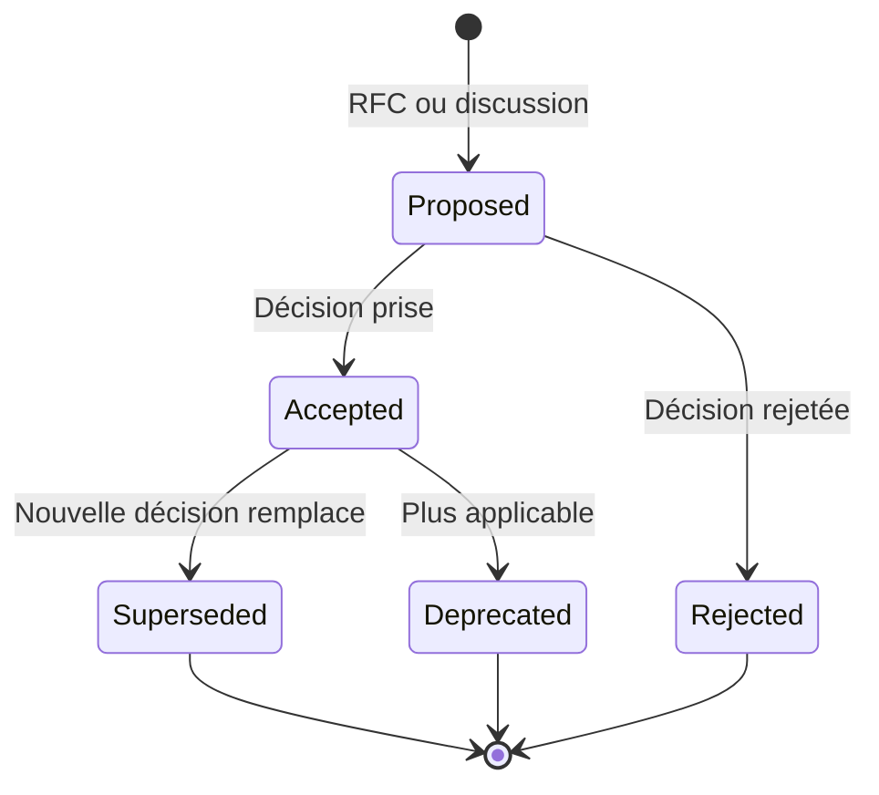
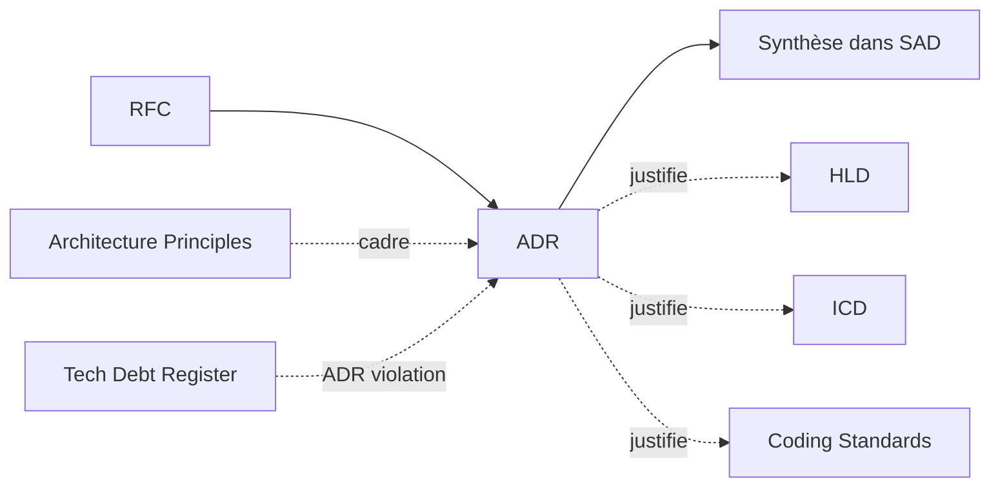
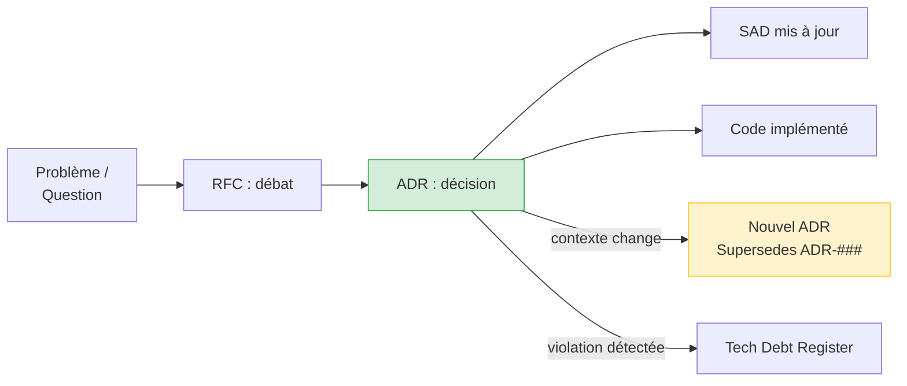

# ADR — Architecture Decision Record

> 📁 Phase : ② Architecture & Design · 🏷️ Acronyme : **ADR** · 🔤 EN : _Architecture Decision Record_

---

## 1. Définition & objectif

Un **ADR** est un **document court qui enregistre une décision architecturale importante** : le contexte qui l'a motivée, la décision prise, les alternatives examinées et les conséquences. Il répond à « **Pourquoi avons-nous fait ce choix technique, et qu'est-ce qu'on a écarté ?** »

Un ADR est **immuable** une fois accepté : on n'efface pas une décision passée — on la **superpose** (statut `Superseded`) si elle change. C'est la mémoire technique de l'équipe.

| Ce qu'il EST                    | Ce qu'il N'EST PAS                 |
| ------------------------------- | ---------------------------------- |
| La trace durable d'une décision | Une spécification d'implémentation |
| Court (1 page max) et atomique  | Un document de design              |
| Immuable dans le temps          | Un ticket Jira                     |

---

## 2. Usage & utilité

- **Mémoire collective** : dans 2 ans, le dev qui rejoindra l'équipe saura _pourquoi_ on utilise PostgreSQL et pas MongoDB.
- **Onboarding** : lire les ADR = comprendre l'histoire architecturale du projet.
- **Éviter de réinventer** : « on a déjà évalué ça, voir ADR-007 ».
- **Éviter les débats infinis** : une décision est prise, documentée, clôturée.
- **Gouvernance** : les ADR montrent la cohérence (ou les incohérences) avec les Architecture Principles.

---

## 3. Périmètre (in / out of scope)

**In scope** (décisions qui méritent un ADR)

- Choix de technologie/framework/langage impactant plusieurs équipes.
- Choix d'architecture (microservices vs monolithe, event-driven vs REST…).
- Décisions de sécurité, de données, de déploiement.
- Décisions avec des **alternatives réelles** et un impact durable.

**Out of scope**

- Décisions triviales / réversibles (choix d'un nom de variable).
- La proposition de la décision → **RFC** (le RFC précède, l'ADR clôture).
- L'implémentation détaillée → **LLD**.

---

## 4. Cycle de vie du document



- **Naissance** : à chaque décision significative (souvent après une RFC).
- **Vie** : **immuable** — on ne modifie pas un ADR accepté, on le superpose.
- **Fin** : `Superseded` (par un nouvel ADR) ou `Deprecated` (décision obsolète sans remplacement).

> **Principe d'immuabilité** : un ADR `Accepted` ne change jamais de contenu. Si la décision change → nouvel ADR avec référence au précédent. Cela préserve l'historique.

---

## 5. Métiers / rôles concernés (RACI)

| Activité                    | Ingénieur / Dev Senior | Tech Lead | Architecte | Équipe |
| --------------------------- | :--------------------: | :-------: | :--------: | :----: |
| Rédaction                   |         **R**          |     C     |     C      |   I    |
| Revue                       |           C            |   **R**   |   **R**    |   C    |
| Décision (accepter/rejeter) |           C            |   **A**   |     A      |   C    |
| Référencement dans le code  |         **R**          |     C     |     I      |   R    |

**R**esponsible · **A**ccountable · **C**onsulted · **I**nformed.

> Tout ingénieur peut proposer un ADR ; la décision est validée par le tech lead / architecte.

---

## 6. Position & interactions avec les autres documents



| Document                    | Relation                                                            |
| --------------------------- | ------------------------------------------------------------------- |
| **RFC**                     | Amont : la RFC débat, l'ADR décide.                                 |
| **SAD**                     | Le SAD référence les ADR ; son architecture _est_ la somme des ADR. |
| **Architecture Principles** | Les ADR citent les principes qui les guident.                       |
| **Tech Debt Register**      | Un ADR qui viole un principe → dette documentée.                    |

---

## 7. Nommage & versionnement

- **Fichier** : `ADR-NNN-titre-kebab.md` ex. `ADR-008-billing-microservice.md`
- **Répertoire** : `docs/adr/` ou `architecture/decisions/`
- **Numérotation** : séquentielle, jamais réutilisée.
- **Immuabilité** : ne jamais modifier le corps d'un ADR `Accepted` — seul le statut change.
- **Index** : `ADR-000-index.md` ou liste dans le README du dossier.

---

## 8. Template vierge (format MADR — Markdown Architectural Decision Records)

```markdown
# ADR-### : <Titre court, verbe d'action>

| Champ       | Valeur                                                   |
| ----------- | -------------------------------------------------------- |
| Statut      | Proposed / Accepted / Deprecated / Superseded by ADR-### |
| Date        | AAAA-MM-JJ                                               |
| Auteur(s)   |                                                          |
| RFC liée    | RFC-###                                                  |
| Principe(s) | P-##                                                     |

## Contexte

<Situation qui nécessite une décision. Forces en présence. Contraintes.>

## Décision

<La décision prise, formulée de manière affirmative. « Nous utiliserons X. »>

## Alternatives considérées

| Option             | Avantages | Inconvénients |
| ------------------ | --------- | ------------- |
| **Option choisie** |           |               |
| Option A           |           |               |
| Option B           |           |               |

## Conséquences

### Positives

### Négatives / compromis

### Neutres / implications

## Statut & évolution

<Conditions qui amèneraient à reconsidérer cette décision.>
```

---

## 9. Exemple rempli

```markdown
# ADR-008 : Extraire le service de facturation en microservice autonome

| Champ       | Valeur                                            |
| ----------- | ------------------------------------------------- |
| Statut      | Accepted                                          |
| Date        | 2026-02-15                                        |
| Auteur      | L. Durand                                         |
| RFC liée    | RFC-012                                           |
| Principe(s) | P-01 (Design for failure), P-03 (Ownership clair) |

## Contexte

Le module de facturation intégré au monolithe cause 3 incidents P1 en Q4 2025
(timeout pages portail lors des pics de génération PDF fin de mois).
NFR-PERF-001 (p95 < 500ms) non satisfaite lors des pics (mesurée à p95 = 1,8s).
La génération PDF est synchrone et bloque le thread principal.

## Décision

Nous extrairons la génération de factures PDF dans un service `billing-service` indépendant,
exposant une API REST interne, avec traitement asynchrone via queue RabbitMQ.

## Alternatives considérées

| Option                           | Avantages                                           | Inconvénients                                |
| -------------------------------- | --------------------------------------------------- | -------------------------------------------- |
| **Microservice async (choisie)** | Isolation, scalabilité indépendante, NFR satisfaite | Complexité op. (nouveau service)             |
| Cache agressif PDF               | Simple                                              | Ne résout pas les 1ères générations          |
| Workers threads Node.js          | Moins de complexité op.                             | Reste dans le monolithe, pas scalable indép. |
| Génération client-side           | Décharge le serveur                                 | Sécurité : accès aux données serveur requis  |

## Conséquences

### Positives

- NFR-PERF-001 satisfaite (génération async, portail non bloqué).
- Scalabilité indépendante de la facturation.
- Respect du principe P-03 (ownership billing-service → équipe billing).

### Négatives

- Complexité opérationnelle accrue (déploiement, monitoring, runbook).
- Latence réseau interne (estimée < 5ms sur le réseau interne).
- Gestion de la cohérence eventual (PDF généré après délai).

## Reconsidération

Si RabbitMQ s'avère sur-dimensionné pour le volume réel, envisager un simple job scheduler.
```

---

## 10. Checklist de revue

- [ ] Le **contexte** décrit le problème, pas la solution.
- [ ] La **décision** est formulée en une phrase affirmative claire.
- [ ] **Au moins 2 alternatives** réelles sont comparées (pas de faux choix).
- [ ] Les **conséquences** sont honnêtes (avantages ET inconvénients).
- [ ] Les **principes architecturaux** concernés sont référencés.
- [ ] Le **statut** est correct (`Accepted` si décision prise).
- [ ] L'ADR est dans le **dépôt Git** (traçabilité).
- [ ] Une **condition de reconsidération** est mentionnée.

---

## 11. Anti-patterns & pièges

| Anti-pattern                                                       | Problème                                      | Correctif                                   |
| ------------------------------------------------------------------ | --------------------------------------------- | ------------------------------------------- |
| 📝 **ADR rétrospectif** (écrit mois après la décision)             | Perd le contexte réel, semble justifier après | Écrire _pendant_ ou juste après la décision |
| 🔒 **Modification d'un ADR Accepted**                              | Brise l'historique                            | Créer un nouvel ADR « Superseded »          |
| 🎭 **Fausse alternative** (1 bonne option + 2 mauvaises évidentes) | Manque de rigueur                             | Alternatives sérieuses et honnêtes          |
| 🗄️ **ADR dans Confluence** (pas dans Git)                          | Séparé du code, oublié                        | Dans le repo, proche du code                |
| 📚 **ADR trop long** (> 2 pages)                                   | Personne ne lit                               | Court, focalisé sur une décision            |
| 🕳️ **Pas d'index**                                                 | Impossible à trouver                          | `ADR-000-index.md` + liens dans le SAD      |

---

## 12. Variantes par industrie / contexte

| Contexte               | Spécificités                                                                                     |
| ---------------------- | ------------------------------------------------------------------------------------------------ |
| **Formats courants**   | MADR (Markdown ADR), Y-Statements, Nygard (Context/Decision/Status/Consequences), adr-tools CLI. |
| **Grande entreprise**  | ADR validé par un Architecture Review Board (ARB) ; processus plus formel.                       |
| **Open source**        | Décisions dans les issues GitHub, ensuite formalisées en ADR dans le repo.                       |
| **Systèmes critiques** | ADR = traçabilité formelle des choix de conception soumis à revue de sûreté.                     |
| **Agile**              | ADR courts, fréquents, dans le repo ; revus en sprint review ou tech meeting.                    |

---

## 13. Standards & normes

- **Michael Nygard (2011)** — article originel « Documenting Architecture Decisions ».
- **MADR** (Markdown Architecture Decision Records) — format structuré recommandé.
- **adr-tools** (Nygard) — CLI pour créer/gérer les ADR.
- **ISO/IEC/IEEE 42010** — justification des décisions architecturales.
- **arc42 §9** — section dédiée aux décisions architecturales.

---

## 14. Outillage recommandé

| Besoin              | Outils                                             |
| ------------------- | -------------------------------------------------- |
| Création & stockage | Git + `adr-tools` CLI, Log4brains, ADR Manager     |
| Templates           | MADR template (GitHub), Nygard template            |
| Navigation / index  | Log4brains (site statique), README d'index         |
| Intégration         | GitHub Actions pour valider le format, linter MADR |

---

## 15. Diagramme — Cycle de vie d'une décision architecturale



---

> 🔎 **En une phrase** : un ADR est une **capsule temporelle d'une décision** — il préserve le _pourquoi_ pour les futurs membres de l'équipe, et rend les choix architecturaux traçables, auditables et apprenables.

⬅️ [C4 Model](./04-c4-model.md) · ➡️ Suivant : [HLD](./06-hld-high-level-design.md)
