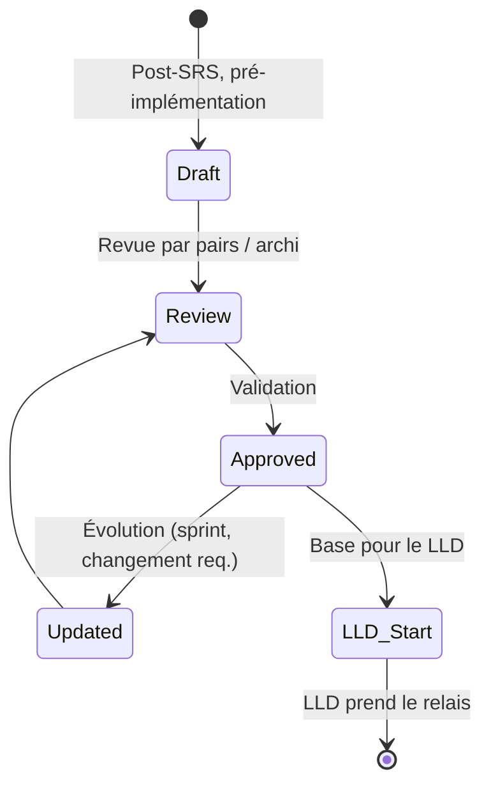
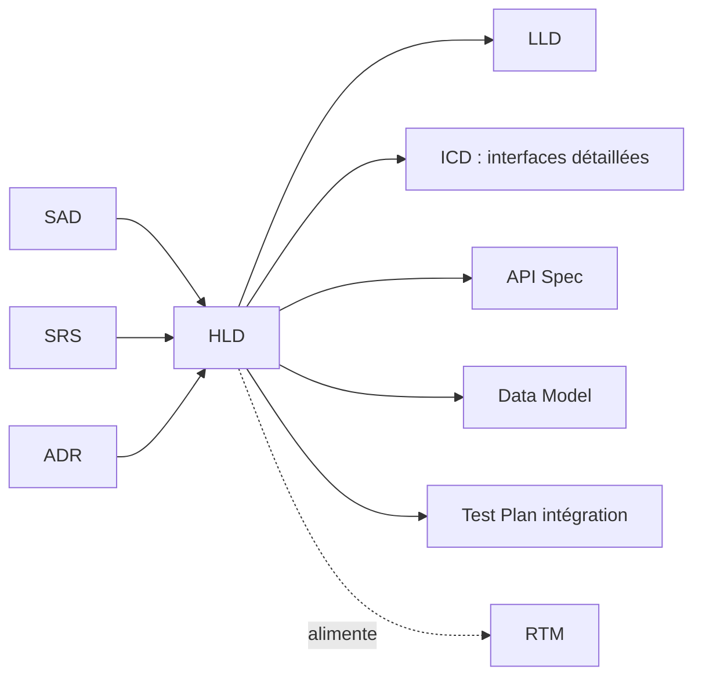
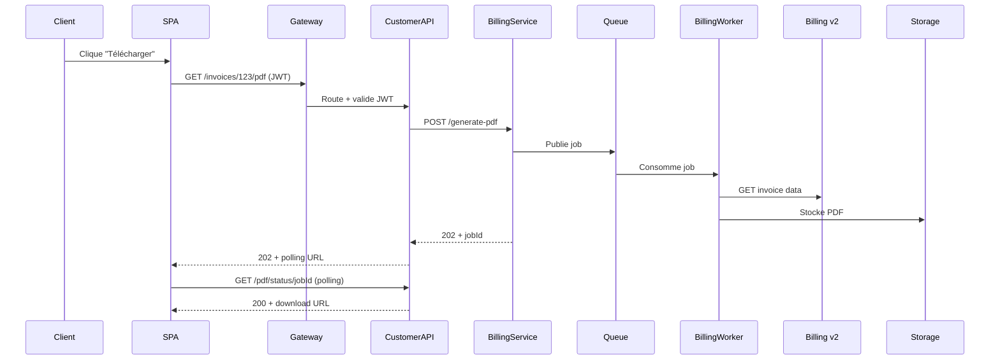

# HLD — High Level Design

> 📁 Phase : ② Architecture & Design · 🏷️ Acronyme : **HLD** · 🔤 EN : _High Level Design_

---

## 1. Définition & objectif

Le **HLD** décrit **la conception de haut niveau d'un système ou d'un sous-système** : ses modules majeurs, leurs interfaces, les flux de données principaux et les choix technologiques, sans entrer dans les détails d'implémentation. Il répond à « **Comment les grandes pièces s'assemblent-elles pour réaliser les exigences ?** »

Le HLD est le lien entre l'architecture abstraite (SAD) et la conception détaillée (LLD) : il concrétise sans sur-spécifier.

| Ce qu'il EST                           | Ce qu'il N'EST PAS                  |
| -------------------------------------- | ----------------------------------- |
| La conception en grandes mailles       | Le détail algorithme/classe (→ LLD) |
| Les choix technologiques par composant | L'architecture globale (→ SAD)      |
| Les flux principaux et interfaces      | Une implémentation                  |

> **Terminologie** : en cycle en V, on parle de _Conception Architecturale_ (CA) ou _Architectural Design_ ; en méthode Agile, le HLD est souvent intégré au SAD ou produit par sprint.

---

## 2. Usage & utilité

- **Transition** SRS → implémentation : les développeurs voient comment partitionner le travail.
- **Estimation** : les composants identifiés permettent d'estimer l'effort.
- **Parallélisation** : les équipes peuvent travailler sur des composants distincts.
- **Revue de conception** : le HLD est soumis à revue avant que le LLD soit rédigé.
- **Base de test d'intégration** : les interfaces du HLD deviennent les contrats à tester.

---

## 3. Périmètre (in / out of scope)

**In scope**

- Décomposition en modules/composants/services et leurs responsabilités.
- Diagramme de blocs, flux de données (data flow), flux de contrôle.
- Interfaces entre composants (contrats de haut niveau).
- Choix technologiques (langage, framework, DB, message broker…).
- Stratégies de gestion des erreurs, de sécurité, de déploiement (grandes lignes).

**Out of scope**

- Détail des algorithmes, structures de données, schéma de DB → **LLD**.
- Contrats d'API précis → **API Spec**.
- Schéma de données détaillé → **Data Model**.
- L'architecture système → **SAD**.

---

## 4. Cycle de vie du document



- **Naissance** : après le SRS baseliné, avant le développement.
- **Vie** : mis à jour à chaque évolution architecturale significative.
- **Fin** : une fois le système en production, devient une **vue documentaire** maintenue avec le SAD.

---

## 5. Métiers / rôles concernés (RACI)

| Activité             | Architecte | Tech Lead | Dev Senior |  QA   |  PO   |
| -------------------- | :--------: | :-------: | :--------: | :---: | :---: |
| Rédaction            |   **R**    |   **R**   |     C      |   I   |   I   |
| Revue conformité SRS |     C      |     C     |     C      | **R** |   A   |
| Revue conception     |   **R**    |   **R**   |     C      |   I   |   I   |
| Approbation          |     C      |     C     |     I      |   I   | **A** |
| Mise à jour          |   **R**    |     C     |     C      |   I   |   I   |

---

## 6. Position & interactions avec les autres documents



| Document           | Relation                                                              |
| ------------------ | --------------------------------------------------------------------- |
| **SAD**            | Le HLD est un **zoom** du SAD sur un sous-système.                    |
| **SRS**            | Le HLD doit couvrir **toutes** les exigences du SRS.                  |
| **LLD**            | Le LLD détaille chaque composant identifié dans le HLD.               |
| **ICD / API Spec** | Les interfaces esquissées dans le HLD sont formalisées dans ces docs. |
| **Test Plan**      | Les interfaces du HLD guident les tests d'intégration.                |

---

## 7. Nommage & versionnement

- **Fichier** : `HLD-<Système/Feature>-v<x.y>.md` — ex. `HLD-PortailClient-v1.2.md`.
- **Versionnement** : sémantique ; `v1.x` évolutions mineures, `v2.0` restructuration.
- **Granularité** : un HLD par **domaine/sous-système** dans un grand système ; un HLD global pour les projets de taille moyenne.

---

## 8. Template vierge

```markdown
# HLD — <Système / Feature> (v1.0)

## 1. Introduction

### 1.1 Objectif & portée

### 1.2 Références (SRS, ADR, SAD)

### 1.3 Hypothèses et contraintes

## 2. Vue d'ensemble du design

<Diagramme de blocs de haut niveau>
<Description narrative des composants majeurs>

## 3. Composants / Modules

### 3.x <Nom composant>

| Champ                 | Valeur |
| --------------------- | ------ |
| Responsabilité        |        |
| Technologies          |        |
| Interfaces exposées   |        |
| Interfaces consommées |        |
| Contraintes / NFR     |        |

## 4. Flux de données & interactions

<Data flow diagram ou sequence diagram de haut niveau>

## 5. Gestion des erreurs & résilience

## 6. Sécurité (grandes lignes)

## 7. Déploiement (grandes lignes)

## 8. Performance & scalabilité (stratégies)

## 9. Points de décision → ADR

## 10. Open points / hypothèses à valider
```

---

## 9. Exemple rempli (extrait)

````markdown
# HLD — Portail Client Self-Service (v1.2)

## 2. Vue d'ensemble du design

Le portail est construit autour d'un BFF (Backend for Frontend) qui orchestre
les appels aux systèmes aval. Le découplage est assuré par un API Gateway.

[Voir diagramme C4 L2 dans le SAD §4]

## 3. Composants

### 3.1 Web App (SPA)

| Champ                 | Valeur                                          |
| --------------------- | ----------------------------------------------- |
| Responsabilité        | Interface utilisateur React ; rendu côté client |
| Technologies          | React 18, Vite, TailwindCSS                     |
| Interfaces exposées   | — (consomme uniquement)                         |
| Interfaces consommées | API Gateway (REST/JSON, OAuth2 PKCE)            |
| Contraintes           | Bundle size < 200 KB gzippé (NFR-USE-002)       |

### 3.2 API Gateway

| Champ                 | Valeur                                                  |
| --------------------- | ------------------------------------------------------- |
| Responsabilité        | Point d'entrée unique, auth JWT, rate limiting, routing |
| Technologies          | Kong Gateway 3.x                                        |
| Interfaces exposées   | HTTP/REST (port 443)                                    |
| Interfaces consommées | Customer API (HTTP interne), IdP (OIDC)                 |
| Contraintes           | Max 1000 req/s (NFR-PERF-002)                           |

### 3.3 Customer API (BFF)

| Champ                 | Valeur                                                   |
| --------------------- | -------------------------------------------------------- |
| Responsabilité        | Agrégation/orchestration des appels OMS, Billing v2, CRM |
| Technologies          | Node.js 20 LTS, Express, Redis (cache)                   |
| Interfaces exposées   | REST/JSON (interne)                                      |
| Interfaces consommées | OMS REST, Billing v2 REST, CRM SOAP, PostgreSQL, Redis   |

## 4. Flux : téléchargement de facture


````

## 5. Gestion des erreurs

- Billing v2 indisponible : circuit breaker (Resilience4j) + message utilisateur + retry.
- Timeout génération PDF : délai max 30s → erreur gracieuse + ticket support proposé.

````

---

## 10. Checklist de revue

- [ ] Toutes les **exigences SRS** sont couvertes par au moins un composant.
- [ ] Chaque composant a une **responsabilité unique** (SRP).
- [ ] Les **interfaces** entre composants sont définies (protcole, format).
- [ ] Les **NFR** (performance, sécurité, disponibilité) ont une stratégie.
- [ ] La **gestion des erreurs** est adressée (pas juste le chemin heureux).
- [ ] Les **décisions technologiques** sont référencées à des ADR.
- [ ] Le HLD est **cohérent avec le SAD**.
- [ ] Un diagramme de flux couvre les **scénarios principaux**.

---

## 11. Anti-patterns & pièges

| Anti-pattern | Problème | Correctif |
|--------------|----------|-----------|
| 🔬 **HLD au niveau LLD** (trop détaillé) | Périme vite, sur-contraint | Grande maille : composants, pas classes |
| 🌫️ **Composants sans responsabilité claire** | Architecture floue | 1 composant = 1 responsabilité + interface |
| ⚡ **Flux heureux seulement** | Erreurs gérées en prod (tard) | Inclure flux d'erreur et edge cases |
| 🧩 **Découplage oublié** | Couplage fort → changements en cascade | Vérifier les dépendances avec une matrice |
| 🔌 **Interfaces vagues** | Tests d'intégration impossibles | Contrats précis dès le HLD → ICD |
| 🕳️ **NFR ignorées** | Pas de stratégie perf/sécu/résilience | Section dédiée aux NFR |

---

## 12. Variantes par industrie / contexte

| Contexte | Spécificités |
|----------|--------------|
| **Agile** | HLD produit itérativement par sprint ou au début de chaque feature ; souvent intégré au ticket de design. |
| **Waterfall / cycle en V** | HLD formel, jalon de revue de conception *avant* le LLD et le développement. |
| **Microservices** | Un HLD par service + un HLD système pour la topologie globale. |
| **Embarqué / temps réel** | HLD inclut la partition hardware/software, les contraintes de timing, le déterminisme. |
| **Systèmes critiques (DO-178C)** | HLD = *High-Level Design* au sens strict, artefact de certification avec traçabilité exigences → composants. |

---

## 13. Standards & normes

- **ISO/IEC/IEEE 12207** — processus de *Architectural Design* et *Detailed Design*.
- **DO-178C / DO-331** — High-Level Design (HLD) comme niveau de décomposition formel.
- **IEC 62304** (médical) — *Software architectural design* correspondant au HLD.
- **ISO 26262** (auto) — *Software architectural design* avec contraintes ASIL.
- **arc42 §5 (Building Block View)** — équivalent du HLD dans arc42.

---

## 14. Outillage recommandé

| Besoin | Outils |
|--------|--------|
| Diagrammes | Mermaid, PlantUML, draw.io, Lucidchart, Excalidraw |
| Rédaction | Confluence, Notion, Markdown |
| Conception architecturale | Enterprise Architect, Sparx EA, Structurizr |
| Revue | PR Git, outil de review collaborative |

---

## 15. Diagramme — Place du HLD dans la chaîne de conception

```mermaid
flowchart TD
    SRS[SRS : Exigences\nFR + NFR] --> HLD
    SAD[SAD : Architecture\nglobale] --> HLD
    HLD --> LLD[LLD : Détail\ncomposant]
    HLD --> ICD[ICD : Contrat\nd'interface]
    HLD --> API[API Spec]
    HLD --> DM[Data Model]
    LLD --> CODE[Code / Implémentation]
    ICD --> TC[Tests d'intégration]
````

---

> 🔎 **En une phrase** : le HLD est **la carte de la solution** — il dit comment les grandes pièces s'assemblent pour satisfaire les exigences, sans encore dire comment chaque pièce est fabriquée.

⬅️ [ADR](./05-adr-architecture-decision-record.md) · ➡️ Suivant : [LLD](./07-lld-low-level-design.md)
