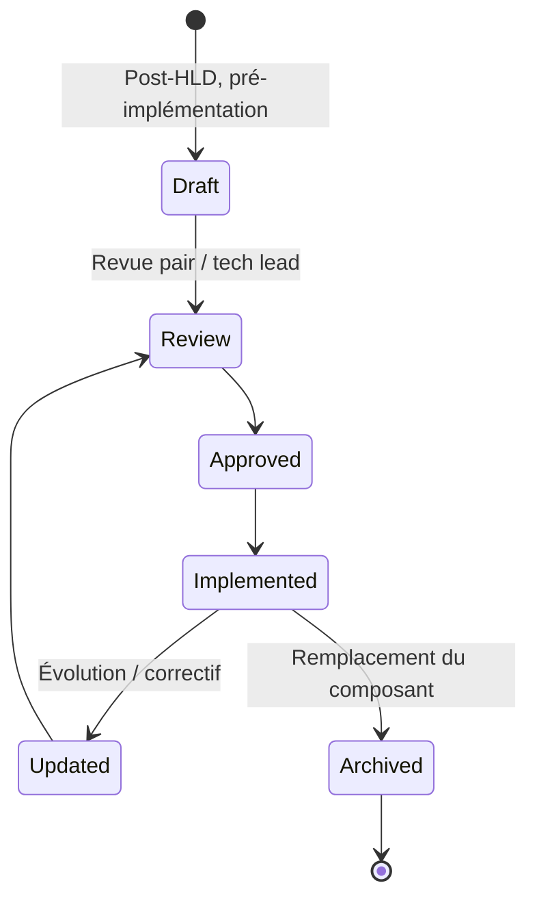
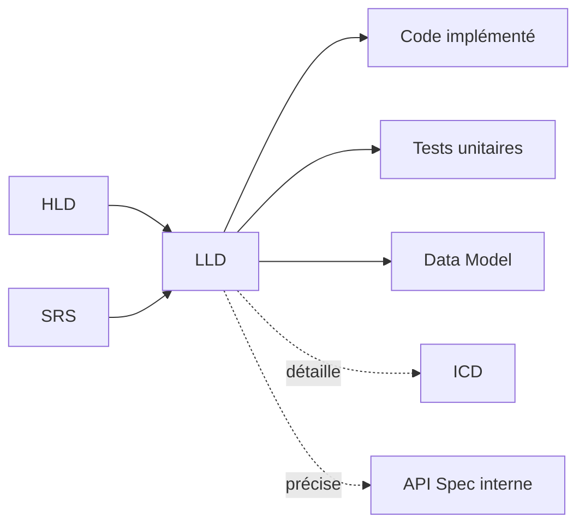
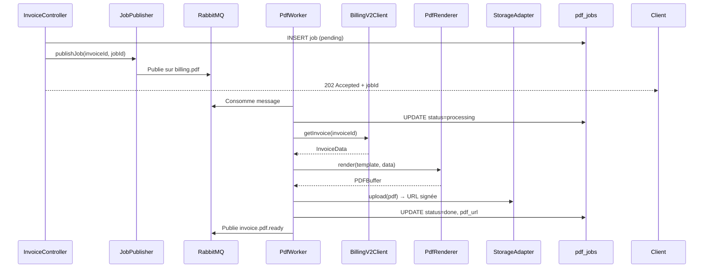

# LLD — Low Level Design

> 📁 Phase : ② Architecture & Design · 🏷️ Acronyme : **LLD** · 🔤 EN : _Low Level Design / Detailed Design_

---

## 1. Définition & objectif

Le **LLD** décrit **la conception interne détaillée d'un composant ou module** : ses classes/fonctions, structures de données, algorithmes, gestion d'erreurs fine et interactions internes. Il répond à « **Comment _exactement_ ce composant est-il implémenté en interne ?** »

Le LLD est le document le plus proche du code : un développeur doit pouvoir l'implémenter directement à partir de lui.

| Ce qu'il EST                               | Ce qu'il N'EST PAS                 |
| ------------------------------------------ | ---------------------------------- |
| Le « plan de construction » d'un composant | L'architecture globale (→ SAD/HLD) |
| Le niveau classe/algo/DB schema            | Une spécification d'exigences      |
| La transition design → code                | Le code lui-même                   |

> **Noms alternatifs** : _Detailed Design Document (DDD)_, _Component Design_, _Module Design Document_.

---

## 2. Usage & utilité

- **Guide l'implémentation** : réduit l'ambiguïté au moment du codage.
- **Revue de conception** : les pairs peuvent valider avant que le code soit écrit (coût ×10 moins cher qu'après).
- **Documentation de référence** pour la maintenance : comprendre un composant sans lire 10 000 lignes de code.
- **Transfert de connaissance** : le LLD survit aux rotations d'équipe.
- **Base de tests unitaires** : les cas de test dérivent directement des scénarios du LLD.

---

## 3. Périmètre (in / out of scope)

**In scope**

- Classes/interfaces/fonctions majeures et leurs responsabilités.
- Structures de données internes, schéma de base de données (tables, colonnes, index).
- Algorithmes et logique métier détaillée.
- Gestion fine des erreurs et cas limites (_edge cases_).
- Flux internes (diagrammes de séquence, state machines).
- Dépendances internes et externes du composant.

**Out of scope**

- Architecture entre composants → **HLD**.
- API externe → **API Spec**.
- Schéma inter-systèmes → **ICD**.
- Code source → **code**.

---

## 4. Cycle de vie du document



- **Naissance** : après le HLD approuvé, pour chaque composant à développer.
- **Vie** : mis à jour lors des évolutions du composant (refactoring, correctifs majeurs).
- **Fin** : archivé quand le composant est remplacé ou décommissionné.

> En **agile**, le LLD peut être produit juste-à-temps par sprint, comme un _technical design_ attaché à la story.

---

## 5. Métiers / rôles concernés (RACI)

| Activité                       | Dev Senior | Tech Lead | Architecte |  QA   |
| ------------------------------ | :--------: | :-------: | :--------: | :---: |
| Rédaction                      |   **R**    |     C     |     C      |   I   |
| Revue technique                |     C      |   **R**   |     C      |   C   |
| Validation conformité HLD      |     C      |   **R**   |   **R**    |   I   |
| Dérivation des tests unitaires |     I      |     I     |     I      | **R** |
| Mise à jour                    |   **R**    |     C     |     I      |   I   |

**R**esponsible · **A**ccountable · **C**onsulted · **I**nformed.

---

## 6. Position & interactions avec les autres documents



| Document            | Relation                                                                    |
| ------------------- | --------------------------------------------------------------------------- |
| **HLD**             | Entrée directe : le LLD **détaille** les composants identifiés dans le HLD. |
| **SRS**             | Les FR détaillées guident les scénarios du LLD (traçabilité FR → LLD).      |
| **Data Model**      | Le LLD peut définir le schéma physique de DB d'un composant.                |
| **Tests unitaires** | Les cas de test dérivent des scénarios du LLD.                              |

---

## 7. Nommage & versionnement

- **Fichier** : `LLD-<Composant>-v<x.y>.md` — ex. `LLD-BillingService-v1.0.md`.
- **Versionnement** : suit la version du composant ; incréments mineurs pour évolutions.
- **Granularité** : un LLD par composant/service significatif (ne pas faire un méga-LLD système).

---

## 8. Template vierge

```markdown
# LLD — <Composant> (v1.0)

## 1. Introduction

### 1.1 Objectif & portée

### 1.2 Références (HLD, SRS, ADR)

## 2. Vue d'ensemble du composant

<Description courte de la responsabilité>
<Diagramme de contexte du composant (entrées / sorties / dépendances)>

## 3. Structure interne

### 3.1 Modules / Classes / Packages

| Classe / Module | Responsabilité |
| --------------- | -------------- |

### 3.2 Diagramme de classes (si pertinent)

### 3.3 Structures de données

| Structure | Champs | Usage |
| --------- | ------ | ----- |

## 4. Schéma de base de données (si applicable)

| Table | Colonnes clés | Index | Partitionnement |
| ----- | ------------- | ----- | --------------- |

## 5. Algorithmes & logique métier

### 5.x <Algorithme ou processus>

<Description + pseudo-code ou diagramme de flux>

## 6. Flux internes

### 6.x <Flux / cas d'utilisation>

<Diagramme de séquence>

## 7. Gestion des erreurs & cas limites

| Cas | Comportement |
| --- | ------------ |

## 8. Sécurité (niveau composant)

## 9. Performance (considérations locales)

## 10. Configuration & paramètres

## 11. Dépendances (bibliothèques, services)
```

---

## 9. Exemple rempli (extrait — Billing Service)

```markdown
# LLD — Billing Service (v1.0)

## 2. Vue d'ensemble

Le Billing Service reçoit des demandes de génération PDF de facture via API REST interne,
les traite de manière asynchrone via une queue RabbitMQ, et stocke le PDF en S3/MinIO.

## 3. Structure interne

| Module              | Responsabilité                                             |
| ------------------- | ---------------------------------------------------------- |
| `InvoiceController` | HTTP endpoint `/generate-pdf` (Express)                    |
| `JobPublisher`      | Publie le job dans RabbitMQ (channel `billing.pdf`)        |
| `PdfWorker`         | Consomme la queue, appelle `PdfRenderer`                   |
| `PdfRenderer`       | Génère le PDF via Puppeteer (template HTML → PDF)          |
| `StorageAdapter`    | Upload vers MinIO + génère URL signée                      |
| `BillingV2Client`   | Appelle Billing v2 REST pour récupérer les données facture |

## 4. Schéma DB (table `pdf_jobs`)

| Colonne      | Type                                  | Index | Description                |
| ------------ | ------------------------------------- | ----- | -------------------------- |
| `id`         | UUID PK                               | PK    | Identifiant unique du job  |
| `invoice_id` | VARCHAR(50)                           | INDEX | ID facture dans Billing v2 |
| `status`     | ENUM (pending/processing/done/failed) | INDEX | État du traitement         |
| `pdf_url`    | TEXT                                  | —     | URL signée (expire 24h)    |
| `created_at` | TIMESTAMPTZ                           | INDEX | Date de création           |
| `error_msg`  | TEXT                                  | —     | Message d'erreur si failed |

## 5. Algorithme : génération PDF

1. Récupérer données via `BillingV2Client.getInvoice(invoiceId)`.
2. Rendre le template HTML avec les données (Handlebars).
3. Convertir HTML → PDF via Puppeteer (headless Chrome, DPI 150, A4).
4. Uploader vers MinIO → URL signée 24h.
5. Mettre à jour `pdf_jobs.status = done`.
6. Publier événement `invoice.pdf.ready` sur RabbitMQ.

## 7. Gestion des erreurs

| Cas                       | Comportement                                            |
| ------------------------- | ------------------------------------------------------- |
| Billing v2 timeout (> 5s) | Retry x3 (backoff exp.) ; si échec → job FAILED + alert |
| Puppeteer crash           | Restart worker ; job requeue                            |
| MinIO indisponible        | Circuit breaker ; retry after 30s ; alert ops           |
| Job > 30s                 | Timeout ; FAILED ; message utilisateur                  |
```

---

## 10. Checklist de revue

- [ ] Toutes les **FR du HLD** assignées à ce composant sont couvertes.
- [ ] Les **classes/modules** ont des responsabilités claires (SRP).
- [ ] Les **flux** (nominaux + erreurs) sont documentés.
- [ ] Les **edge cases** critiques sont traités.
- [ ] Le **schéma DB** est normalisé et indexé correctement.
- [ ] La **gestion des erreurs** est exhaustive (pas de `catch` vide).
- [ ] Les **dépendances** sont listées avec versions.
- [ ] Le LLD est **testable** : les cas de test unitaires peuvent en être dérivés.

---

## 11. Anti-patterns & pièges

| Anti-pattern                                     | Problème                                    | Correctif                                              |
| ------------------------------------------------ | ------------------------------------------- | ------------------------------------------------------ |
| 📜 **LLD = copie du code**                       | Aucune valeur ajoutée, périme immédiatement | Niveau algo et intention, pas ligne par ligne          |
| 🌫️ **LLD jamais écrit** (« le code EST la doc ») | Maintenance difficile, onboarding lent      | LLD pour les composants complexes ou critiques         |
| 🧊 **LLD non mis à jour après refactoring**      | Divergence doc/code                         | Processus : refactoring significatif → mise à jour LLD |
| 🔮 **Over-engineering documentaire**             | LLD pour chaque fichier                     | Réserver aux composants non triviaux                   |
| 🕳️ **Pas de gestion d'erreur documentée**        | Comportement imprédictible en prod          | Scénarios d'erreur obligatoires                        |

---

## 12. Variantes par industrie / contexte

| Contexte                | Spécificités                                                                                                      |
| ----------------------- | ----------------------------------------------------------------------------------------------------------------- |
| **Agile**               | LLD = _Technical Design_ produit en début de sprint, souvent dans le ticket.                                      |
| **DO-178C (avionique)** | LLD = _Low-Level Design_ formel, artefact de certification, traçabilité bidirectionnelle SRS → LLD → code → test. |
| **IEC 62304 (médical)** | _Software detailed design_ avec vérification formelle pour classes B/C.                                           |
| **Embarqué**            | LLD inclut allocation mémoire, timing, interruptions, drivers.                                                    |
| **Systèmes distribués** | LLD inclut comportement en cas de partition réseau (théorème CAP, modèle de cohérence).                           |

---

## 13. Standards & normes

- **ISO/IEC/IEEE 12207** — processus _Detailed Design_.
- **DO-178C** — Low-Level Design (LLD) comme artefact obligatoire.
- **IEC 62304** — _Software detailed design_.
- **SOLID principles** — guide la structure interne du LLD.

---

## 14. Outillage recommandé

| Besoin                          | Outils                                                       |
| ------------------------------- | ------------------------------------------------------------ |
| Diagrammes de classes/séquences | PlantUML, Mermaid, Enterprise Architect, draw.io             |
| Rédaction                       | Confluence, Markdown, Notion                                 |
| Schémas DB                      | dbdiagram.io, DBeaver (visual), Flyway/Liquibase (migration) |
| Génération depuis code          | Javadoc, JSDoc, Doxygen, Docstring → doc auto                |

---

## 15. Diagramme — Flux interne : génération PDF async



---

> 🔎 **En une phrase** : le LLD est le **plan de construction détaillé** d'un composant — il est assez précis pour qu'un développeur l'implémente, assez abstrait pour ne pas être du code.

⬅️ [HLD](./06-hld-high-level-design.md) · ➡️ Suivant : [ICD](./08-icd-interface-control-document.md)
