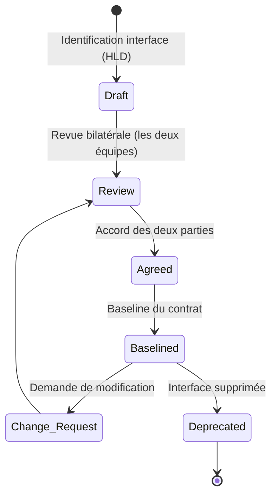
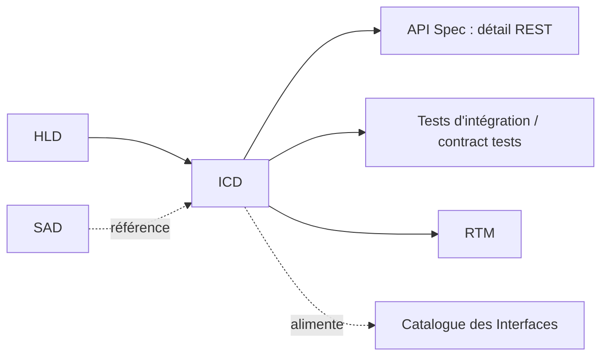
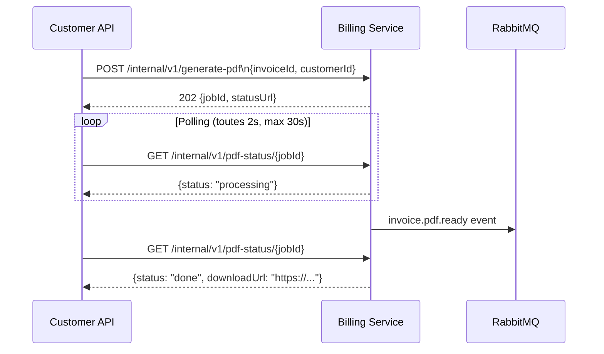

# ICD — Interface Control Document

> 📁 Phase : ② Architecture & Design · 🏷️ Acronyme : **ICD** · 🔤 EN : _Interface Control Document_

---

## 1. Définition & objectif

L'**ICD** est le document qui **spécifie formellement le contrat d'une interface** entre deux systèmes, sous-systèmes ou composants : format, protocole, sémantique, comportements en erreur et contraintes. Il répond à « **Quel est exactement le contrat entre ces deux parties, pour qu'elles puissent être développées et intégrées indépendamment ?** »

L'ICD est le **contrat d'intégration** : si les deux équipes/systèmes respectent l'ICD, l'intégration fonctionne.

| Ce qu'il EST                               | Ce qu'il N'EST PAS                                 |
| ------------------------------------------ | -------------------------------------------------- |
| Le contrat formel entre deux parties       | La spec interne d'un seul côté                     |
| Bidirectionnel (producteur + consommateur) | Une API Spec (plus précise, orientée REST/OpenAPI) |
| Décrit les flux, formats ET comportements  | Un HLD ou une vue d'ensemble                       |

> **ICD vs API Spec** : l'ICD couvre **tous types d'interfaces** (fichiers batch, messages, protocoles propriétaires, flux temps réel, hardware…) ; l'API Spec est l'ICD spécialisé des **API web/REST/GraphQL**. Pour une API REST, les deux coexistent : ICD = vue contrat de haut niveau, API Spec = détail technique complet.

---

## 2. Usage & utilité

- **Développement parallèle** : les équipes de chaque côté développent indépendamment contre le contrat.
- **Tests d'intégration** : le contrat devient le référentiel des tests (contract testing).
- **Réduction des conflits** : les malentendus sur les interfaces sont levés _avant_ l'intégration.
- **Référentiel d'audit** : en systèmes critiques, prouve que les interfaces sont maîtrisées.
- **Évolution contrôlée** : toute modification nécessite un avenant formel.

---

## 3. Périmètre (in / out of scope)

**In scope**

- Identification des deux parties (producteur/consommateur).
- Protocole de transport (HTTP, AMQP, gRPC, FTP, UART…).
- Format des données (JSON, XML, Protobuf, CSV, binaire…).
- Schéma / contrat des messages (champs, types, validations).
- Comportements en erreur, codes de retour, timeouts.
- Versionnement de l'interface, politique de rétrocompatibilité.
- SLA de l'interface (disponibilité, latence, débit).

**Out of scope**

- Implémentation interne des deux côtés → **LLD**.
- Spec OpenAPI complète → **API Spec**.
- Tests d'implémentation → **Test Plan / Test Cases**.

---

## 4. Cycle de vie du document



- **Naissance** : lors de l'identification des interfaces dans le HLD.
- **Vie** : **contractuelle** — toute modification suit un processus de **change request** (les deux parties doivent approuver).
- **Fin** : déprécié quand l'interface est supprimée ; historique conservé.

---

## 5. Métiers / rôles concernés (RACI)

| Activité                    | Équipe producteur | Équipe consommateur | Architecte |  QA   |
| --------------------------- | :---------------: | :-----------------: | :--------: | :---: |
| Rédaction initiale          |       **R**       |          C          |     C      |   I   |
| Validation (les deux côtés) |       **A**       |        **A**        |     C      |   I   |
| Tests de conformité         |         I         |          I          |     I      | **R** |
| Demande de changement       |      C ou R       |       C ou R        |   **A**    |   I   |

**R**esponsible · **A**ccountable · **C**onsulted · **I**nformed.

> L'ICD est le seul document qui nécessite l'**approbation des deux parties** (producteur ET consommateur).

---

## 6. Position & interactions avec les autres documents



| Document                     | Relation                                                           |
| ---------------------------- | ------------------------------------------------------------------ |
| **HLD**                      | Identifie les interfaces ; l'ICD les **formalise**.                |
| **API Spec**                 | Déclinaison technique précise pour les API HTTP/REST.              |
| **Contract Testing**         | Les tests de contrat (Pact, etc.) vérifient la conformité à l'ICD. |
| **Catalogue des Interfaces** | Registre de tous les ICD du système (vue Lot 5).                   |
| **RTM**                      | Chaque interface est tracée vers les exigences qu'elle satisfait.  |

---

## 7. Nommage & versionnement

- **Fichier** : `ICD-<ProducteurSVC>-<ConsommateurSVC>-v<x.y>.md` — ex. `ICD-CustomerAPI-BillingService-v1.0.md`.
- **Version** : `v1.0` = baseline ; incréments **mineurs** pour ajouts rétrocompatibles, **majeurs** pour breaking changes.
- **Politique de versionnement de l'interface** : définie dans l'ICD lui-même (ex. « headers de version supportés : v1, v2 »).

---

## 8. Template vierge

```markdown
# ICD — <Producteur> ↔ <Consommateur> (v1.0)

| Champ        | Valeur                        |
| ------------ | ----------------------------- |
| Producteur   | <Nom système/équipe>          |
| Consommateur | <Nom système/équipe>          |
| Version      | v1.0                          |
| Statut       | Draft / Agreed / Baselined    |
| Approbateurs | <Responsables des deux côtés> |
| Date         | AAAA-MM-JJ                    |

## 1. Description de l'interface

<Objectif de l'interface, ce qu'elle transporte>

## 2. Protocole & transport

| Champ            | Valeur                           |
| ---------------- | -------------------------------- |
| Protocole        | HTTP 1.1 / gRPC / AMQP / FTP ... |
| Format           | JSON / XML / Protobuf / CSV ...  |
| Endpoint / Topic |                                  |
| Authentification |                                  |
| Chiffrement      | TLS 1.2+ / mTLS / aucun          |

## 3. Contrat des messages / données

### 3.1 Requête / Message entrant

| Champ | Type | Obligatoire | Description |
| ----- | ---- | :---------: | ----------- |

### 3.2 Réponse / Message sortant

| Champ | Type | Obligatoire | Description |
| ----- | ---- | :---------: | ----------- |

## 4. Codes de retour & comportements en erreur

| Code | Signification | Comportement attendu côté consommateur |
| ---- | ------------- | -------------------------------------- |

## 5. Contraintes de qualité (SLA)

| Métrique      | Valeur |
| ------------- | ------ |
| Disponibilité |        |
| Latence p95   |        |
| Débit max     |        |

## 6. Politique de versionnement

## 7. Exemples (requête + réponse)

## 8. Historique des modifications
```

---

## 9. Exemple rempli

```markdown
# ICD — Customer API ↔ Billing Service (v1.0)

| Champ        | Valeur                                     |
| ------------ | ------------------------------------------ |
| Producteur   | Billing Service (équipe Billing)           |
| Consommateur | Customer API (équipe Portail)              |
| Version      | v1.0                                       |
| Statut       | Baselined                                  |
| Approbateurs | L. Durand (Billing) / M. Leclerc (Portail) |
| Date         | 2026-03-10                                 |

## 1. Description

Customer API appelle Billing Service pour déclencher la génération asynchrone
d'un PDF de facture et en récupérer l'URL de téléchargement.

## 2. Protocole & transport

| Champ            | Valeur                                                |
| ---------------- | ----------------------------------------------------- |
| Protocole        | HTTP/1.1 (réseau interne, non exposé)                 |
| Format           | JSON                                                  |
| Base URL         | `http://billing-service:3001/internal/v1`             |
| Authentification | Service-to-service token (mTLS sur le réseau interne) |
| Chiffrement      | mTLS interne                                          |

## 3. Contrat des messages

### POST /generate-pdf

| Champ         | Type   | Req. | Description                             |
| ------------- | ------ | :--: | --------------------------------------- |
| `invoiceId`   | string |  ✅  | ID unique de la facture dans Billing v2 |
| `customerId`  | string |  ✅  | ID client (pour l'ownership check)      |
| `requestedBy` | string |  ✅  | ID de la requête utilisateur (trace)    |

**Réponse 202 :**
| Champ | Type | Description |
|-------|------|-------------|
| `jobId` | UUID | Identifiant du job de génération |
| `statusUrl` | string | URL pour polling du statut |

### GET /pdf-status/{jobId}

**Réponse 200 :**
| Champ | Type | Description |
|-------|------|-------------|
| `status` | enum (pending/processing/done/failed) | État du job |
| `downloadUrl` | string (nullable) | URL signée (si done, expire 24h) |
| `errorMessage` | string (nullable) | Message d'erreur (si failed) |

## 4. Codes de retour

| Code | Signification        | Action consommateur                |
| ---- | -------------------- | ---------------------------------- |
| 202  | Job créé             | Polling toutes les 2s              |
| 404  | jobId inconnu        | Log + erreur utilisateur           |
| 503  | Service indisponible | Circuit breaker ; message d'erreur |

## 5. SLA

| Métrique                | Valeur  |
| ----------------------- | ------- |
| Disponibilité           | 99,9 %  |
| Latence (POST)          | < 200ms |
| Temps de génération PDF | < 30s   |
```

---

## 10. Checklist de revue

- [ ] Les **deux parties** ont approuvé le document.
- [ ] Le **protocole et le format** sont explicitement définis.
- [ ] Le **schéma de données** est complet (types, obligatoire/optionnel).
- [ ] Les **codes d'erreur** et comportements attendus sont documentés.
- [ ] La **politique de versionnement** est définie.
- [ ] Les **SLA** de l'interface sont documentés.
- [ ] Des **exemples** concrets (requête/réponse) sont présents.
- [ ] La **politique de rétrocompatibilité** est explicite.

---

## 11. Anti-patterns & pièges

| Anti-pattern                                | Problème                                | Correctif                                           |
| ------------------------------------------- | --------------------------------------- | --------------------------------------------------- |
| 🤝 **Contrat implicite** (doc dans la tête) | Chaque changement = intégration cassée  | Formaliser dans un ICD                              |
| 🔀 **Breaking change sans versionnement**   | Consommateur cassé en prod              | Politique de versionnement + dépréciation graduelle |
| 📝 **ICD modifié unilatéralement**          | Violation de contrat                    | Processus bilatéral de change request               |
| 🌫️ **Comportement erreur non spécifié**     | Consommateur ne sait pas comment réagir | Tous les codes d'erreur documentés                  |
| 🔒 **ICD = spec API détaillée**             | ICD trop couplé à l'implémentation      | ICD = contrat de haut niveau, API Spec = détail     |

---

## 12. Variantes par industrie / contexte

| Contexte                                    | Spécificités                                                                                                            |
| ------------------------------------------- | ----------------------------------------------------------------------------------------------------------------------- |
| **Systèmes embarqués / temps réel**         | ICD décrit les protocoles matériel (UART, CAN bus, SPI), timings, niveaux électriques.                                  |
| **Systèmes critiques (avionique, spatial)** | ICD est un document contractuel formel entre sous-traitants ; exige du versionnement strict et des tests de conformité. |
| **Microservices**                           | Remplacé ou complété par le **contract testing** (Pact) ; l'ICD reste utile pour les interfaces avec des tiers.         |
| **B2B / EDI**                               | ICD = spécification EDI (formats EDIFACT, X12, JSON/XML propriétaire).                                                  |
| **IoT / Protocoles**                        | ICD décrit MQTT topics, CoAP, Zigbee…                                                                                   |

---

## 13. Standards & normes

- **MIL-STD-973 / MIL-STD-498** — origines militaires de l'ICD (toujours référence en aérospatial).
- **DO-178C** — interfaces entre _software components_ documentées et vérifiées.
- **ISO/IEC 42010** — _interface description_ dans la description d'architecture.
- **Pact** (contract testing) — implémentation moderne des ICD pour microservices.
- **AsyncAPI / OpenAPI** — ICD standardisés pour les API event-driven et REST.

---

## 14. Outillage recommandé

| Besoin               | Outils                                     |
| -------------------- | ------------------------------------------ |
| Contrat REST         | OpenAPI 3.x (Swagger), Postman             |
| Contract testing     | Pact (HTTP/messaging), Spring Contract     |
| Contrat event-driven | AsyncAPI, Confluent Schema Registry (Avro) |
| Rédaction            | Markdown, Confluence, Notion               |
| Mock servers         | Wiremock, MockServer, Prism (OpenAPI)      |

---

## 15. Diagramme — Interface Customer API ↔ Billing Service



---

> 🔎 **En une phrase** : l'ICD est le **contrat signé entre deux composants** — il permet à deux équipes de développer en parallèle en garantissant que leur intégration fonctionnera.

⬅️ [LLD](./07-lld-low-level-design.md) · ➡️ Suivant : [API Spec](./09-api-specification.md)
