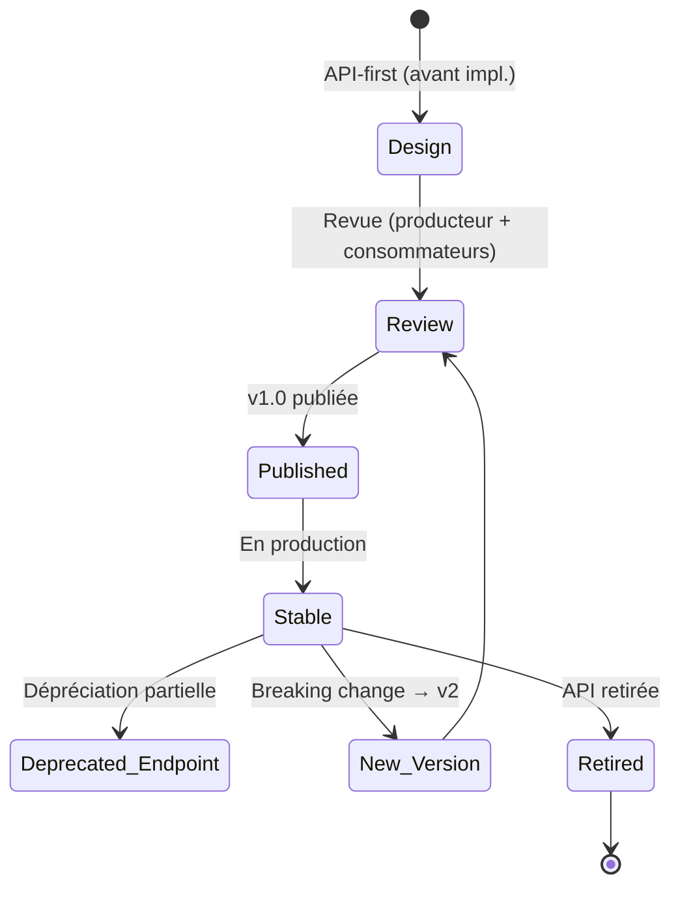
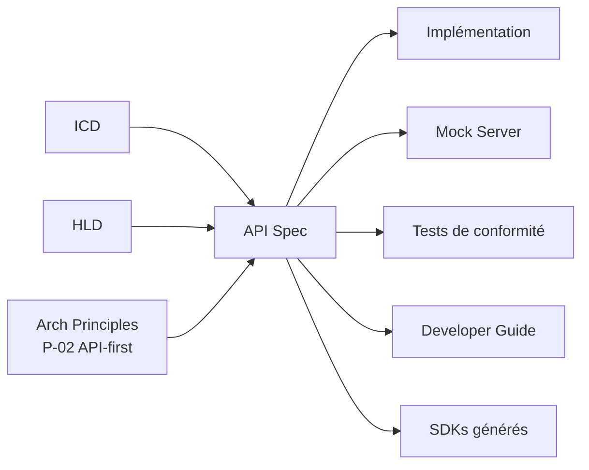
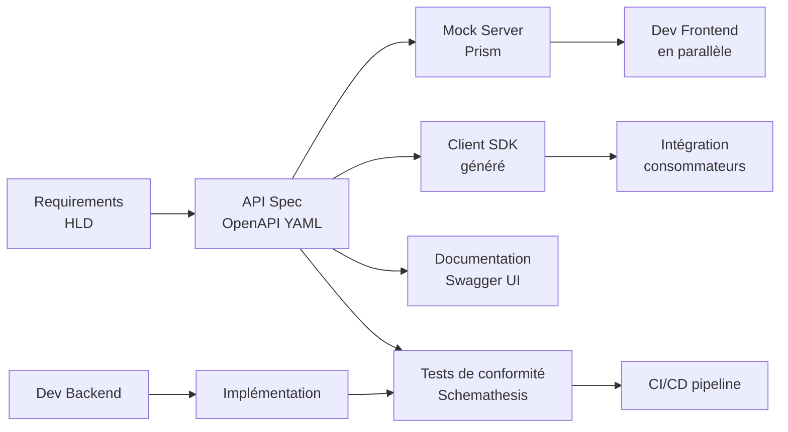

# API Specification

> 📁 Phase : ② Architecture & Design · 🏷️ Acronyme : **API Spec** · 🔤 EN : _API Specification_

---

## 1. Définition & objectif

L'**API Specification** est le document technique précis qui décrit **le contrat complet d'une API** : endpoints, méthodes, paramètres, schémas de données, codes de retour, authentification, versionnement et comportements. Elle répond à « **Comment utiliser cette API exactement, et quel est son comportement garanti ?** »

Le format de référence est **OpenAPI** (anciennement Swagger) pour les API REST ; **AsyncAPI** pour les API event-driven ; **Protobuf / gRPC** pour les API RPC.

| Ce qu'elle EST                              | Ce qu'elle N'EST PAS                                |
| ------------------------------------------- | --------------------------------------------------- |
| Le contrat technique complet de l'API       | L'implémentation de l'API                           |
| La documentation de l'API côté consommateur | Un ICD (plus large, multi-protocoles)               |
| La source de vérité pour les mocks et tests | Un guide d'utilisation narratif (→ doc développeur) |

---

## 2. Usage & utilité

- **Design-first / API-first** : spec rédigée _avant_ l'implémentation → mock server → dev front/back en parallèle.
- **Contrat consommateur** : toute intégration se base sur la spec, pas sur l'implémentation.
- **Génération de code** : client SDKs, stubs serveur, mocks automatisés depuis la spec.
- **Tests de contrat** : la spec est la vérité → tests de conformité automatisés.
- **Portail développeur** : documentation interactive (Swagger UI, Redoc).
- **Versionnement** : les breaking changes sont visibles dans la spec.

---

## 3. Périmètre (in / out of scope)

**In scope**

- Endpoints (chemins, méthodes HTTP).
- Paramètres (path, query, header, body) avec types, contraintes, exemples.
- Schémas de requête/réponse (JSON Schema dans OpenAPI).
- Codes HTTP et corps des erreurs.
- Authentification/autorisation (OAuth2, JWT, API Key…).
- Versionnement, dépréciation, limites de débit (rate limiting).
- Exemples et `x-extensions`.

**Out of scope**

- Implémentation interne → **LLD**.
- Guide narratif / tutoriel → documentation développeur (Lot 3 — Developer Guide).
- Protocoles non-HTTP → **ICD / AsyncAPI**.

---

## 4. Cycle de vie du document



- **Naissance** : idéalement **avant l'implémentation** (API-first) ; en pratique parfois générée depuis le code.
- **Vie** : versionnée ; les endpoints dépréciés sont marqués `deprecated: true` ; les breaking changes → version majeure.
- **Fin** : sunset progressif, annoncé aux consommateurs (header `Sunset`, `Deprecation`).

---

## 5. Métiers / rôles concernés (RACI)

| Activité                | Dev Backend (producteur) | Architecte | Dev Frontend/Client |  QA   | Tech Writer |
| ----------------------- | :----------------------: | :--------: | :-----------------: | :---: | :---------: |
| Rédaction spec          |          **R**           |     C      |          C          |   C   |      I      |
| Revue de design         |            C             |   **R**    |        **R**        |   C   |      I      |
| Implémentation conforme |          **R**           |     I      |          I          |   I   |      I      |
| Tests de conformité     |            I             |     I      |          I          | **R** |      I      |
| Documentation narrative |            I             |     I      |          I          |   I   |    **R**    |

**R**esponsible · **A**ccountable · **C**onsulted · **I**nformed.

---

## 6. Position & interactions avec les autres documents



| Document            | Relation                                                               |
| ------------------- | ---------------------------------------------------------------------- |
| **ICD**             | L'API Spec est un ICD spécialisé et détaillé pour les API HTTP.        |
| **Developer Guide** | Consomme la spec pour produire des tutoriels et exemples.              |
| **Mock Server**     | Généré depuis la spec (Prism, WireMock).                               |
| **Tests**           | La spec est le référentiel des tests de contrat (Schemathesis, Dredd). |

---

## 7. Nommage & versionnement

- **Fichier** : `openapi.yaml` ou `<service-name>-api-v<major>.yaml` — ex. `customer-api-v2.yaml`.
- **Versionnement** : dans l'URL (`/v1/`, `/v2/`) ou via headers (`API-Version: 2`).
- **Politique SEMVER pour les API** :
  - Breaking change (champs supprimés, comportements changés) → **version majeure**.
  - Ajout rétrocompatible → **version mineure**.
  - Corrections → **patch**.
- **Header de dépréciation** : `Deprecation: true`, `Sunset: <date>`.

---

## 8. Template vierge (OpenAPI 3.1)

```yaml
openapi: "3.1.0"
info:
  title: <Nom de l'API>
  description: <Description courte>
  version: "1.0.0"
  contact:
    name: <Équipe>
    email: <email>
  license:
    name: Internal

servers:
  - url: https://api.example.com/v1
    description: Production
  - url: https://api-staging.example.com/v1
    description: Staging

tags:
  - name: <Resource>
    description: <Description du groupe>

paths:
  /<resource>:
    get:
      summary: <Titre court>
      description: <Description complète>
      operationId: list<Resource>
      tags: [<Resource>]
      parameters:
        - name: page
          in: query
          schema:
            type: integer
            default: 1
      responses:
        "200":
          description: Succès
          content:
            application/json:
              schema:
                $ref: "#/components/schemas/<ResourceList>"
        "401":
          $ref: "#/components/responses/Unauthorized"

components:
  schemas:
    <Resource>:
      type: object
      required: [id, name]
      properties:
        id:
          type: string
          format: uuid
          description: Identifiant unique
        name:
          type: string
          maxLength: 255

  responses:
    Unauthorized:
      description: Token manquant ou invalide
      content:
        application/json:
          schema:
            $ref: "#/components/schemas/Error"

  securitySchemes:
    BearerAuth:
      type: http
      scheme: bearer
      bearerFormat: JWT

security:
  - BearerAuth: []
```

---

## 9. Exemple rempli (extrait — Customer API)

```yaml
openapi: "3.1.0"
info:
  title: Customer Portal API
  description: >
    API du Portail Client Self-Service. Permet de consulter les commandes,
    factures, et gérer les réclamations.
  version: "1.2.0"

servers:
  - url: https://api.portal.example.com/v1

paths:
  /invoices:
    get:
      summary: Lister les factures du client authentifié
      operationId: listInvoices
      tags: [Invoices]
      parameters:
        - name: page
          in: query
          schema: { type: integer, default: 1, minimum: 1 }
        - name: from
          in: query
          description: Filtre depuis cette date (ISO 8601)
          schema: { type: string, format: date }
      responses:
        "200":
          description: Liste paginée de factures
          content:
            application/json:
              schema:
                $ref: "#/components/schemas/InvoiceList"
              example:
                items:
                  - id: "INV-2026-0042"
                    amount: 149.90
                    currency: EUR
                    date: "2026-01-31"
                    status: paid
                pagination:
                  page: 1
                  total: 48

  /invoices/{invoiceId}/pdf:
    post:
      summary: Déclencher la génération du PDF d'une facture
      operationId: requestInvoicePdf
      tags: [Invoices]
      parameters:
        - name: invoiceId
          in: path
          required: true
          schema: { type: string }
      responses:
        "202":
          description: Génération démarrée
          content:
            application/json:
              schema:
                $ref: "#/components/schemas/PdfJob"
        "404":
          description: Facture introuvable
          content:
            application/json:
              schema:
                $ref: "#/components/schemas/Error"

components:
  schemas:
    Invoice:
      type: object
      required: [id, amount, currency, date, status]
      properties:
        id: { type: string, example: "INV-2026-0042" }
        amount: { type: number, format: float, example: 149.90 }
        currency: { type: string, enum: [EUR, USD, GBP] }
        date: { type: string, format: date }
        status: { type: string, enum: [draft, sent, paid, overdue] }

    Error:
      type: object
      required: [code, message]
      properties:
        code: { type: string }
        message: { type: string }
        traceId: { type: string, format: uuid }
```

---

## 10. Checklist de revue

- [ ] **Tous les endpoints** du HLD sont couverts.
- [ ] Chaque opération a un `operationId` unique et descriptif.
- [ ] Les **schémas** sont complets (types, contraintes, exemples).
- [ ] Tous les **codes d'erreur** réalistes sont documentés (400, 401, 403, 404, 422, 429, 503…).
- [ ] L'**authentification** est définie et appliquée.
- [ ] Les endpoints dépréciés sont marqués `deprecated: true`.
- [ ] Des **exemples** significatifs sont fournis.
- [ ] La spec est **valide** (validation OpenAPI lint).
- [ ] La **politique de versionnement** est respectée.
- [ ] La spec est accessible dans le **portail dev / dépôt Git**.

---

## 11. Anti-patterns & pièges

| Anti-pattern                                           | Problème                                         | Correctif                                 |
| ------------------------------------------------------ | ------------------------------------------------ | ----------------------------------------- |
| 📄 **Spec générée depuis le code** uniquement          | Code-first = pas de design, pas de contrat amont | API-first : spec d'abord                  |
| 🕳️ **Pas d'erreurs documentées**                       | Consommateurs ignorent les cas d'erreur          | Tous les codes HTTP possibles             |
| 🌫️ **Schémas sans contraintes** (type: string partout) | Pas de validation, pas de génération utile       | Types + format + minLength + enum         |
| 🧟 **Spec obsolète** ≠ code en production              | Fausse confiance                                 | CI qui valide la conformité code/spec     |
| 🔒 **Breaking change sans versionnement**              | Clients cassés                                   | Politique SEMVER + dépréciation graduelle |
| 🎭 **Spec séparée du code**                            | Divergence inévitable                            | Spec dans le même repo que le code        |

---

## 12. Variantes par industrie / contexte

| Contexte                     | Format recommandé                                            |
| ---------------------------- | ------------------------------------------------------------ |
| **REST / JSON**              | **OpenAPI 3.1** (standard de facto)                          |
| **Event-driven / Messaging** | **AsyncAPI 2.x/3.x** (MQTT, AMQP, Kafka, WebSocket)          |
| **RPC**                      | **Protocol Buffers (Protobuf)** + gRPC service definition    |
| **GraphQL**                  | **SDL (Schema Definition Language)** + introspection         |
| **SOAP**                     | **WSDL + XSD** (legacy, toujours présent en SI d'entreprise) |
| **Finance / Banque**         | **FIX Protocol**, **ISO 20022** (messages financiers)        |

---

## 13. Standards & normes

- **OpenAPI Specification 3.1** (Linux Foundation / OpenAPI Initiative) — standard REST.
- **AsyncAPI 3.0** — spec event-driven.
- **JSON Schema Draft 2020-12** — validation de schémas (utilisé dans OpenAPI 3.1).
- **RFC 7807** — _Problem Details for HTTP APIs_ (format d'erreur standardisé).
- **RFC 9110** — HTTP Semantics (méthodes, codes).

---

## 14. Outillage recommandé

| Besoin                    | Outils                                                     |
| ------------------------- | ---------------------------------------------------------- |
| Rédaction spec            | Stoplight Studio, Swagger Editor, VS Code (OpenAPI plugin) |
| Validation/linting        | Spectral (Stoplight), vacuum, 42crunch                     |
| Mock server               | Prism (OpenAPI), WireMock, MockServer                      |
| Documentation interactive | Swagger UI, Redoc, Scalar                                  |
| Tests de conformité       | Schemathesis, Dredd, Postman/Newman                        |
| Génération de code        | OpenAPI Generator, Kiota (Microsoft)                       |
| Portail développeur       | Backstage, Kong DevPortal, Stoplight Docs                  |

---

## 15. Diagramme — Cycle API-first



---

> 🔎 **En une phrase** : l'API Spec est le **contrat technique vivant** de l'API — rédigée avant le code (API-first), elle aligne consommateurs et producteurs, génère les mocks, et fait foi lors des tests de conformité.

⬅️ [ICD](./08-icd-interface-control-document.md) · ➡️ Suivant : [Data Model](./10-data-model.md)
