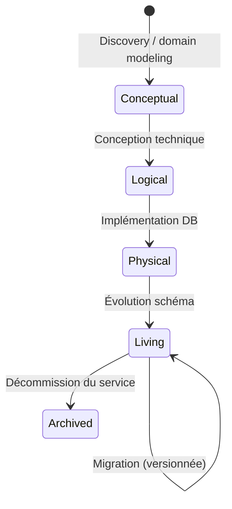
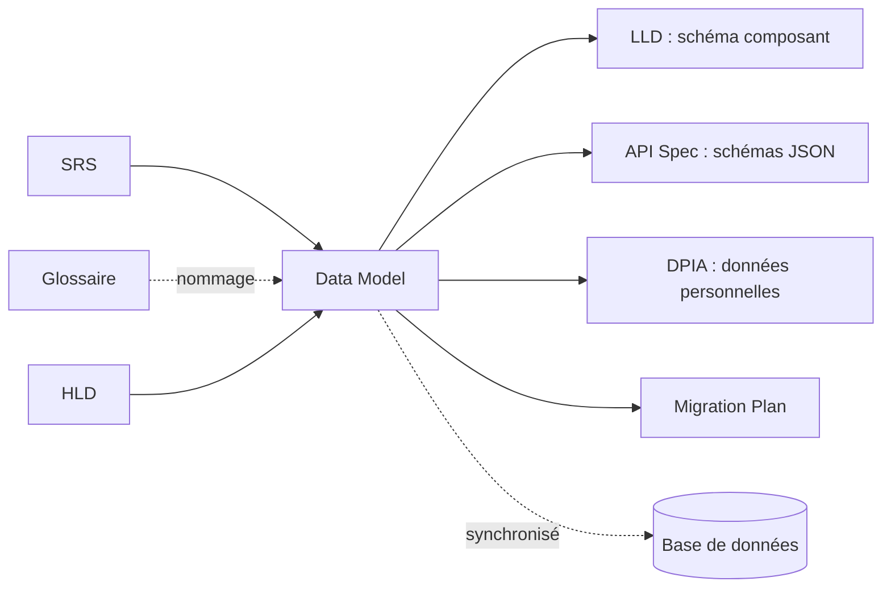
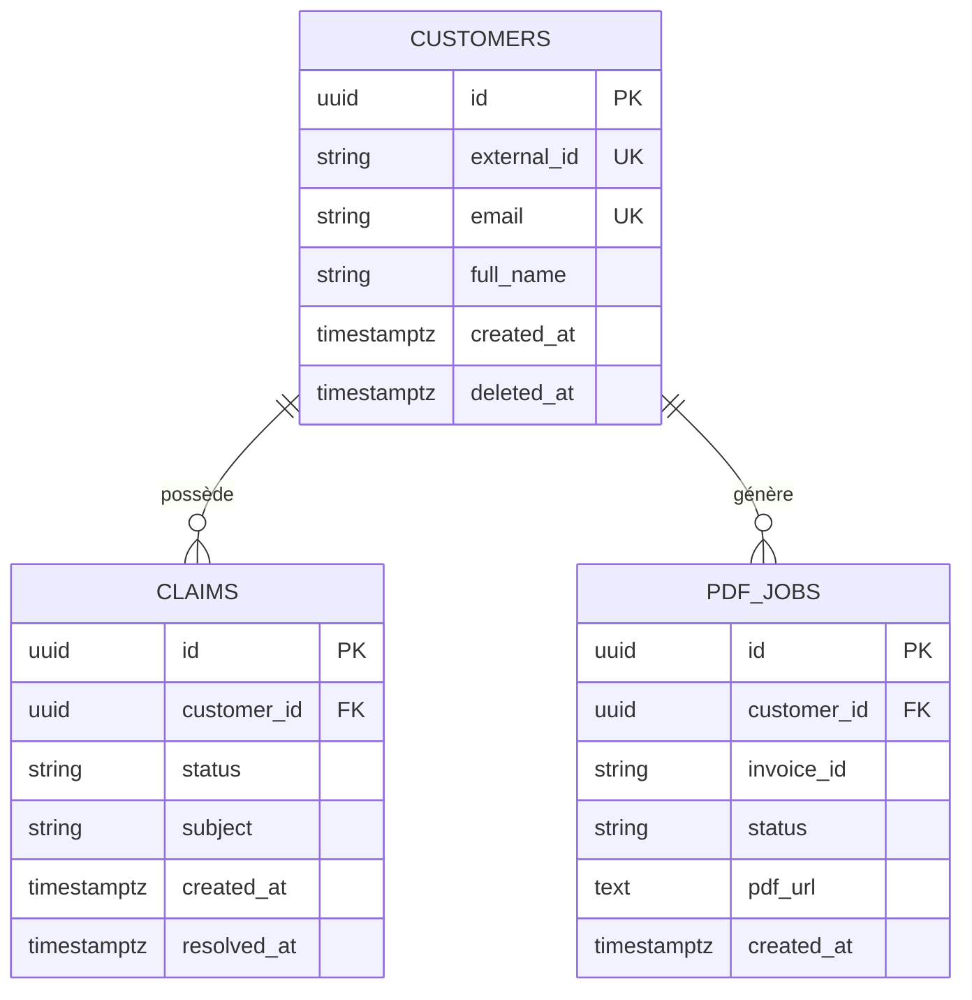

# Data Model

> 📁 Phase : ② Architecture & Design · 🏷️ Acronyme : **DM** · 🔤 EN : _Data Model_

---

## 1. Définition & objectif

Le **Data Model** est la description formelle de **comment les données sont structurées, organisées et reliées** dans un système. Il couvre les entités, leurs attributs, les relations entre elles et les contraintes d'intégrité. Il répond à « **Quelles données le système gère-t-il, comment sont-elles structurées, et quelles règles régissent leur cohérence ?** »

On distingue trois niveaux :

- **Conceptuel (CDM)** : entités métier, relations. _Vu par le métier._
- **Logique (LDM)** : tables, colonnes, types, clés. _Vu par le développeur._
- **Physique (PDM)** : schéma SQL/NoSQL réel, partitionnement, index. _Vu par le DBA._

| Ce qu'il EST                             | Ce qu'il N'EST PAS                       |
| ---------------------------------------- | ---------------------------------------- |
| La structure des données et leurs règles | Les requêtes SQL ou les ORMs             |
| La source de vérité pour le schéma       | Les algorithmes qui traitent les données |
| Un outil de communication métier ↔ dev   | Le plan de migration                     |

---

## 2. Usage & utilité

- **Aligner le métier et le dev** : le modèle conceptuel parle la langue du domaine.
- **Concevoir la base de données** : le modèle physique est le schéma réel.
- **Détecter les incohérences** tôt : conflits de nommage, données manquantes.
- **Évolutivité** : un bon modèle facilite les migrations futures.
- **RGPD / audit** : identifier les données personnelles et leur cycle de vie.
- **Base du Data Lineage** : traçabilité des données à travers les systèmes.

---

## 3. Périmètre (in / out of scope)

**In scope**

- Entités/tables et leurs attributs (noms, types, contraintes).
- Relations (1:1, 1:N, N:M) et cardinalités.
- Clés primaires, clés étrangères, contraintes d'unicité.
- Règles métier portées par les données (invariants).
- Index de performance.
- Classification des données (RGPD : personnelles, sensibles…).

**Out of scope**

- Requêtes SQL → implémentation.
- Procédures stockées → LLD.
- Pipelines ETL / DataWarehouse → architecture data.
- Stratégie de migration → **Migration Plan** (Lot 5).

---

## 4. Cycle de vie du document



- **Naissance** : en phase de conception, en parallèle du HLD.
- **Vie** : **document vivant**, versionné via les migrations de schéma (Flyway, Liquibase).
- **Fin** : archivé quand la DB est décommissionnée.

> 💡 Le vrai modèle physique "vivant" est souvent dans les **migration scripts** (Flyway `V001__init.sql`...) ; le document Data Model est la vue de synthèse humainement lisible.

---

## 5. Métiers / rôles concernés (RACI)

| Activité                | BA / Analyste | Architecte Données | Dev Backend |  DBA  | DPO / RGPD |
| ----------------------- | :-----------: | :----------------: | :---------: | :---: | :--------: |
| Modèle conceptuel       |     **R**     |         C          |      I      |   I   |     C      |
| Modèle logique          |       C       |       **R**        |    **R**    |   C   |     I      |
| Modèle physique / index |       I       |         C          |      C      | **R** |     I      |
| Classification RGPD     |       C       |         C          |      I      |   I   |   **R**    |
| Migration scripts       |       I       |         C          |    **R**    | **R** |     I      |

---

## 6. Position & interactions avec les autres documents



| Document      | Relation                                                                    |
| ------------- | --------------------------------------------------------------------------- |
| **Glossaire** | Le nommage des entités doit respecter l'Ubiquitous Language.                |
| **API Spec**  | Les schémas JSON de l'API Spec dérivent du Data Model logique.              |
| **DPIA**      | Les données personnelles identifiées dans le Data Model alimentent la DPIA. |
| **LLD**       | Le LLD d'un composant peut préciser le schéma physique de sa DB.            |

---

## 7. Nommage & versionnement

- **Fichier** : `data-model.md` ou `data-model-<domaine>.md`.
- **Conventions** : `snake_case` pour les tables/colonnes (SQL) ; noms au singulier pour les entités.
- **Versionnement** : le modèle physique est versionné via les **migrations numérotées** (`V001`, `V002`…) ; le document de synthèse est mis à jour en conséquence.
- **Outils de génération** : diagramme ER généré depuis la DB (DBeaver, DataGrip, dbdiagram.io).

---

## 8. Template vierge

```markdown
# Data Model — <Système>

## 1. Domaine & périmètre

## 2. Modèle conceptuel (entités métier)

<Diagramme ER conceptuel>
[Description narrative des entités clés]

## 3. Entités / Tables

### <NomTable>

| Colonne | Type | Contrainte  | Description |
| ------- | ---- | ----------- | ----------- |
| id      | UUID | PK NOT NULL | Identifiant |
| ...     |      |             |             |

**Index :**
| Nom | Colonnes | Type | Raison |
|-----|---------|------|--------|

**Classification RGPD :** Oui / Non (détail si Oui)

## 4. Relations

| Table A | Cardinalité | Table B | Clé étrangère | On delete |
| ------- | :---------: | ------- | ------------- | --------- |

## 5. Règles métier portées par les données

- <invariant, contrainte CHECK, trigger>

## 6. Données de référence / Énumérations

| Table/Colonne | Valeurs autorisées |
| ------------- | ------------------ |

## 7. Considérations de performance

(Partitionnement, archivage, rétention)

## 8. Données personnelles (RGPD)

| Table.Colonne | Nature | Base légale | Rétention |
| ------------- | ------ | ----------- | --------- |
```

---

## 9. Exemple rempli (extrait — Portail Client)

```markdown
# Data Model — Portail Client Self-Service

## 3. Entités

### customers

| Colonne     | Type         | Contrainte             | Description        |
| ----------- | ------------ | ---------------------- | ------------------ |
| id          | UUID         | PK                     | Identifiant client |
| external_id | VARCHAR(50)  | UNIQUE NOT NULL        | ID dans le CRM     |
| email       | VARCHAR(255) | UNIQUE NOT NULL        | E-mail (RGPD)      |
| full_name   | VARCHAR(255) | NOT NULL               | Nom complet (RGPD) |
| created_at  | TIMESTAMPTZ  | NOT NULL DEFAULT now() |                    |
| deleted_at  | TIMESTAMPTZ  | NULL                   | Soft delete        |

**Index :** `idx_customers_external_id` (external_id, UNIQUE), `idx_customers_email` (email)
**RGPD :** email, full_name → données personnelles, base légale : contrat, rétention 5 ans

---

### claims (réclamations)

| Colonne     | Type         | Contrainte             | Description                       |
| ----------- | ------------ | ---------------------- | --------------------------------- |
| id          | UUID         | PK                     |                                   |
| customer_id | UUID         | FK → customers.id      | Propriétaire                      |
| status      | ENUM         | NOT NULL               | open/in_progress/closed/cancelled |
| subject     | VARCHAR(500) | NOT NULL               | Objet de la réclamation           |
| created_at  | TIMESTAMPTZ  | NOT NULL DEFAULT now() |                                   |
| resolved_at | TIMESTAMPTZ  | NULL                   | Date de résolution                |

**Règle métier :** `resolved_at` ne peut être défini que si `status = 'closed'`

---

### pdf_jobs

| Colonne     | Type        | Contrainte        | Description                    |
| ----------- | ----------- | ----------------- | ------------------------------ |
| id          | UUID        | PK                |                                |
| customer_id | UUID        | FK → customers.id |                                |
| invoice_id  | VARCHAR(50) | NOT NULL          | ID Billing v2                  |
| status      | ENUM        | NOT NULL          | pending/processing/done/failed |
| pdf_url     | TEXT        | NULL              | URL signée (expire 24h)        |
| created_at  | TIMESTAMPTZ | NOT NULL          |                                |
| error_msg   | TEXT        | NULL              |                                |

**Index :** `idx_pdf_jobs_customer_invoice` (customer_id, invoice_id), `idx_pdf_jobs_status` (status)

## 4. Relations

| Table A   | Cardinalité | Table B  |
| --------- | :---------: | -------- |
| customers |    1 → N    | claims   |
| customers |    1 → N    | pdf_jobs |

## 8. Données personnelles

| Colonne             | Nature      | Base légale | Rétention              |
| ------------------- | ----------- | ----------- | ---------------------- |
| customers.email     | Personnelle | Contrat     | 5 ans post-résiliation |
| customers.full_name | Personnelle | Contrat     | 5 ans post-résiliation |
```

---

## 10. Checklist de revue

- [ ] Chaque entité a une **clé primaire** explicite.
- [ ] Les **types** sont précis (UUID vs int, VARCHAR avec longueur, TIMESTAMPTZ vs TIMESTAMP).
- [ ] Les **contraintes** sont définies (NOT NULL, UNIQUE, FK, CHECK).
- [ ] Les **index** sont justifiés (colonnes de recherche, FK, unicité).
- [ ] Les **données personnelles** sont identifiées et documentées (RGPD).
- [ ] Les **règles métier** portées par les données sont explicites.
- [ ] Les **soft deletes** sont documentés si utilisés.
- [ ] Le nommage respecte le **Glossaire / Ubiquitous Language**.
- [ ] Les **migrations** sont scriptées et versionnées.

---

## 11. Anti-patterns & pièges

| Anti-pattern                                     | Problème                                     | Correctif                                         |
| ------------------------------------------------ | -------------------------------------------- | ------------------------------------------------- |
| 🎨 **God Table** (1 table avec 80 colonnes)      | Couplage fort, évolutions difficiles         | Normaliser, décomposer par domaine                |
| 🕳️ **Clés naturelles comme PK** (email, SIRET)   | Changement → cascade de mises à jour         | PK synthétique (UUID/SERIAL) + UNIQUE sur naturel |
| 📅 **Pas de timestamp de création/modification** | Impossibilité d'audit                        | `created_at`, `updated_at` systématiques          |
| 💥 **Suppression physique**                      | Perte de traçabilité, violations FK          | Soft delete (`deleted_at`)                        |
| 🌫️ **VARCHAR sans longueur**                     | Champs infinis, performance                  | Longueurs réalistes                               |
| 🔗 **Dépendances circulaires** entre tables      | Intégration impossible, migrations complexes | Revoir la décomposition                           |
| 🏷️ **Nommage incohérent** (customer/client/user) | Confusion, bugs                              | Ubiquitous Language strict                        |

---

## 12. Variantes par industrie / contexte

| Contexte                        | Spécificités                                                                                  |
| ------------------------------- | --------------------------------------------------------------------------------------------- |
| **Relationnel (RDBMS)**         | ERD classique, SQL, migrations Flyway/Liquibase.                                              |
| **NoSQL (MongoDB, DynamoDB)**   | Document model, dénormalisation assumée, index composites. Risque : duplication vs jointures. |
| **Event Sourcing / CQRS**       | Pas de modèle relationnel CRUD : events en append-only + projections.                         |
| **Data Warehouse**              | Modèle en étoile (Star Schema) / flocon (Snowflake) ; dimensions + faits.                     |
| **Réglementé (santé, finance)** | Traçabilité, immuabilité, audit trail, rétention légale.                                      |
| **IoT / Time-series**           | Modèles optimisés temps (TimescaleDB, InfluxDB) : mesures, séries, compression.               |

---

## 13. Standards & normes

- **ISO/IEC 11179** — nommage des éléments de données.
- **RGPD / GDPR** — minimisation des données, base légale, rétention (art. 5, 13, 35).
- **Chen notation** (ERD conceptuel), **Crow's Foot** (ERD logique).
- **Merise** (méthode française) — MCD/MLD/MPD.
- **DBpedia / Schema.org** — ontologies de référence pour les modèles de domaine.

---

## 14. Outillage recommandé

| Besoin                 | Outils                                              |
| ---------------------- | --------------------------------------------------- |
| Diagrammes ER          | dbdiagram.io (DBML), DBeaver, DataGrip, ERDPlus     |
| Migrations versionnées | Flyway, Liquibase, Alembic (Python), Prisma Migrate |
| Génération depuis DB   | DBeaver, DataGrip, pgAdmin (introspection)          |
| Validation             | Schema validation (Prisma, TypeORM, Hibernate)      |
| Lineage / data catalog | DataHub, Apache Atlas, Collibra                     |

---

## 15. Diagramme — ERD du portail client (extrait)



---

> 🔎 **En une phrase** : le Data Model est **la carte des données du système** — il aligne le métier et le technique sur la structure, les règles et les contraintes des données avant qu'elles existent.

⬅️ [API Spec](./09-api-specification.md) · ➡️ Suivant : [Glossaire / Ubiquitous Language](./11-glossaire-ubiquitous-language.md)
