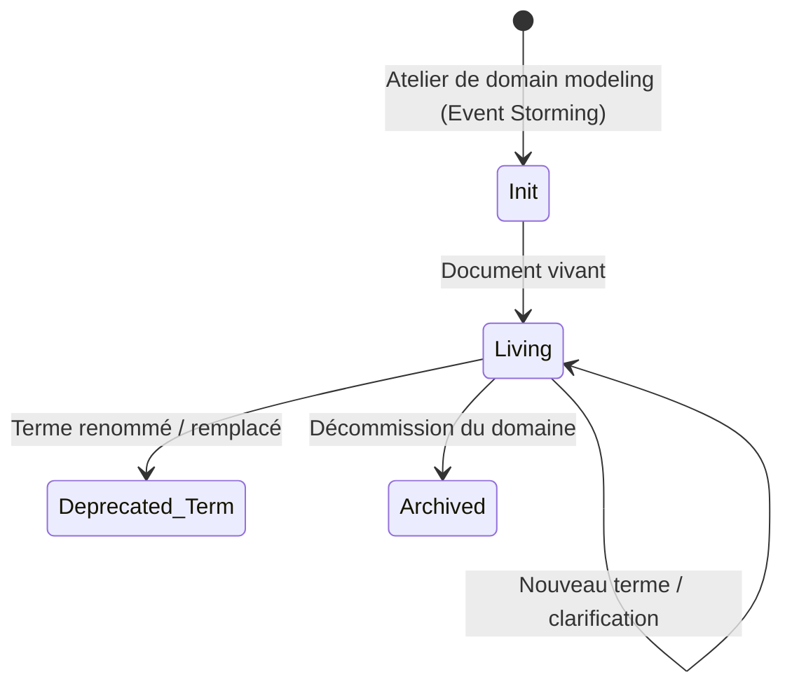
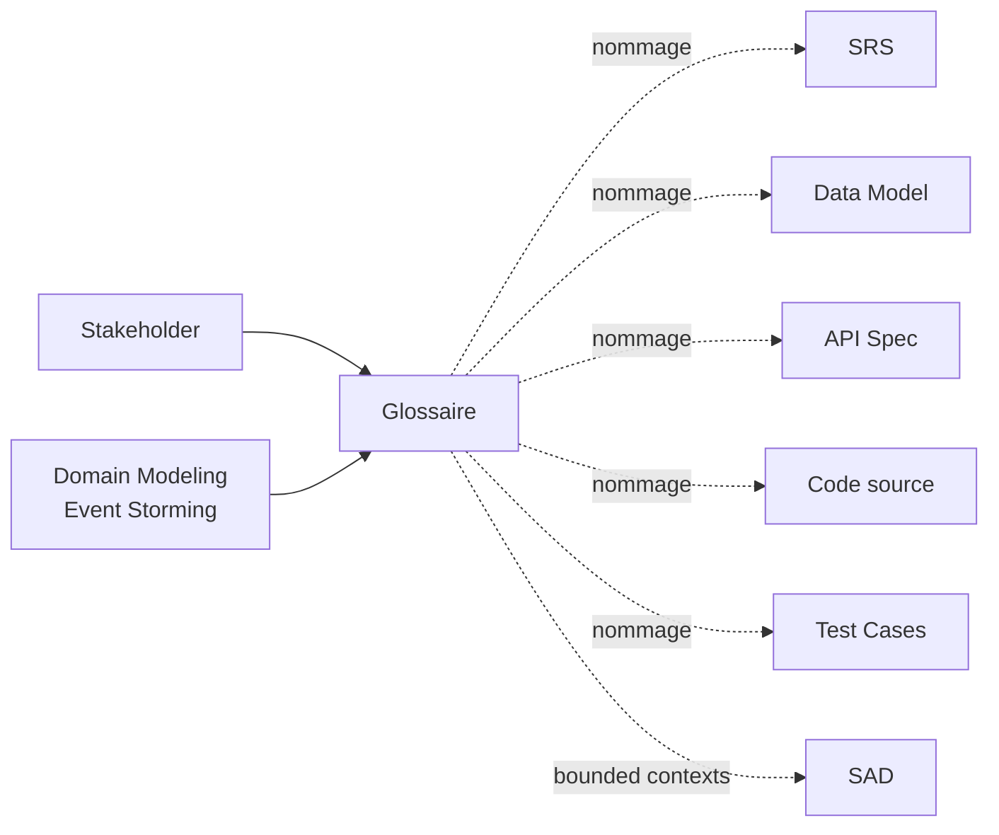

# Glossaire / Ubiquitous Language

> 📁 Phase : ② Architecture & Design · 🏷️ Acronyme : **Glossaire** · 🔤 EN : _Glossary / Ubiquitous Language_

---

## 1. Définition & objectif

Le **Glossaire** est le document qui définit précisément **le vocabulaire partagé entre le métier et l'équipe technique** au sein d'un contexte donné. Dans le jargon DDD (Domain-Driven Design), ce vocabulaire commun est l'**Ubiquitous Language** : le même mot signifie la même chose dans les conversations, le code, les tests et la documentation.

Il répond à « **Que signifie exactement ce mot ici — et est-ce la même chose pour tout le monde ?** »

| Ce qu'il EST                       | Ce qu'il N'EST PAS                                    |
| ---------------------------------- | ----------------------------------------------------- |
| Le dictionnaire de domaine partagé | Un dictionnaire informatique généraliste              |
| La source de vérité sur les termes | Un glossaire de sigles techniques (→ SRS section 1.3) |
| Un outil d'alignement permanent    | Un artefact secondaire qu'on remplit à la fin         |

> **Ubiquitous Language** (Evans, DDD) : le vocabulaire du glossaire doit apparaître _dans le code lui-même_ — noms de classes, fonctions, variables, tables de DB, endpoints d'API. C'est là où le Glossaire a le plus d'impact.

---

## 2. Usage & utilité

- **Éliminer les ambiguïtés** : « client » chez les commerciaux ≠ « customer » dans le code ≠ « user » dans l'auth — les trois doivent être réconciliés ou séparés.
- **Accélérer l'onboarding** : un nouveau dev comprend le domaine en lisant le glossaire.
- **Nommer de façon cohérente** dans le code, les API, la DB, les messages.
- **Délimiter les Bounded Contexts** (DDD) : un même terme peut avoir des définitions différentes dans deux contextes — le glossaire l'explicite.
- **Base pour la RTM / documentation** : références croisées vers les exigences, les entités du Data Model.

---

## 3. Périmètre (in / out of scope)

**In scope**

- Termes métier du domaine (entités, processus, règles).
- Acronymes et abréviations spécifiques au projet.
- Distinctions subtiles (ex. _commande_ vs _panier_ vs _devis_).
- Bounded contexts : un terme défini différemment dans deux sous-domaines.
- Termes techniques propres au projet (ex. noms de services internes).

**Out of scope**

- Termes techniques génériques (HTTP, JSON, SQL) → documentation technique standard.
- Sigles d'organisation généralistes → intranet / Wiki d'entreprise.
- Glossaires des normes (IEEE, ISO) → citées dans le SRS.

---

## 4. Cycle de vie du document



- **Naissance** : idéalement lors d'ateliers de **domain modeling** (Event Storming, Story Mapping) — les termes qui émergent alimentent le glossaire.
- **Vie** : **document le plus vivant** de tous — mis à jour à chaque discussion qui révèle un malentendu.
- **Fin** : archivé avec le domaine ; les termes renommés gardent leur entrée avec une redirection.

---

## 5. Métiers / rôles concernés (RACI)

| Activité                  |  BA   | Product Owner | Dev / Architecte | Métier (SME) | Tech Writer |
| ------------------------- | :---: | :-----------: | :--------------: | :----------: | :---------: |
| Identification des termes | **R** |       C       |        C         |    **R**     |      I      |
| Rédaction des définitions | **R** |       C       |        C         |      C       |      C      |
| Validation métier         |   C   |     **A**     |        I         |    **A**     |      I      |
| Application dans le code  |   I   |       I       |      **R**       |      I       |      I      |
| Maintenance               | **R** |       C       |        C         |      C       |      C      |

---

## 6. Position & interactions avec les autres documents



| Document       | Relation                                                                          |
| -------------- | --------------------------------------------------------------------------------- |
| **SRS**        | Les termes du SRS doivent être définis dans le Glossaire.                         |
| **Data Model** | Les noms d'entités et colonnes doivent respecter l'Ubiquitous Language.           |
| **API Spec**   | Les noms de ressources, champs JSON reflètent le Glossaire.                       |
| **Code**       | La valeur principale : les classes, méthodes, variables parlent le même langage.  |
| **SAD**        | Les Bounded Contexts délimitent les zones où un terme a une définition distincte. |

---

## 7. Nommage & versionnement

- **Fichier** : `glossaire.md` ou `ubiquitous-language.md` à la racine de la documentation du domaine.
- **Structure** : alphabétique ou par Bounded Context.
- **Format d'entrée** : terme → définition + contexte + distinctions + équivalents/acronymes + lien vers artefacts.
- **Versionnement** : Git (historique des modifications de chaque terme visible) ; termes renommés conservés avec `⚠️ Renommé en X`.

---

## 8. Template vierge

```markdown
# Glossaire — <Domaine>

_Dernière mise à jour : AAAA-MM-JJ_

---

## <Terme>

| Champ                | Valeur                              |
| -------------------- | ----------------------------------- |
| Terme français       |                                     |
| Terme anglais (code) |                                     |
| Acronyme / alias     |                                     |
| Bounded Context      | <Sous-domaine si DDD>               |
| Statut               | Actif / Déprécié (remplacé par <X>) |

**Définition :**
<1 à 3 phrases précises, dans le contexte du projet.>

**Ce que ce terme N'est PAS :**
<Distinctions avec des termes proches ou similaires.>

**Exemples :**
<Exemple concret dans le domaine.>

**Utilisé dans :**

- [ ] SRS (§##)
- [ ] Data Model (table `<nom>`)
- [ ] API Spec (ressource `/<endpoint>`)
- [ ] Code (`<ClassName>`, `<module>`)

---
```

---

## 9. Exemple rempli

```markdown
# Glossaire — Portail Client Self-Service

_Dernière mise à jour : 2026-03-15_

---

## Client (Customer)

| Champ                | Valeur        |
| -------------------- | ------------- |
| Terme français       | Client        |
| Terme anglais (code) | `Customer`    |
| Acronyme             | —             |
| Bounded Context      | Portail / CRM |
| Statut               | Actif         |

**Définition :**
Personne physique ou morale titulaire d'un compte actif chez l'entreprise, ayant passé
au moins une commande. Différent d'un _prospect_ (sans commande) ou d'un _utilisateur_
(entité d'authentification).

**Ce que ce terme N'est PAS :**

- Pas un `User` (entité d'auth dans le module Identity).
- Pas un `Contact` (le CRM gère les contacts avant qu'ils deviennent clients).
- Pas un `Buyer` (terme Billing v2 interne, mappé sur `Customer.external_id`).

**Exemples :**
Un client peut consulter ses commandes, télécharger ses factures, ouvrir une réclamation.

**Utilisé dans :**

- [x] SRS §2.3 — Caractéristiques des utilisateurs
- [x] Data Model — table `customers`
- [x] API Spec — ressource `/customers/{customerId}`
- [x] Code — classe `Customer`, `CustomerRepository`

---

## Commande (Order)

| Champ           | Valeur                                       |
| --------------- | -------------------------------------------- |
| Terme anglais   | `Order`                                      |
| Bounded Context | Portail (lecture seule) / OMS (propriétaire) |

**Définition :**
Contrat d'achat validé par le client, géré par l'OMS. Dans le portail, une commande
est toujours **en lecture seule** (le portail ne crée pas de commandes).

**Ce que ce terme N'est PAS :**

- Pas un `Cart` (panier non validé, géré par l'OMS, hors périmètre portail).
- Pas une `Invoice` (la facture est générée _après_ la commande par Billing v2).

---

## Facture (Invoice)

**Définition :**
Document financier associé à une ou plusieurs commandes, géré et propriété de Billing v2.
Le portail affiche et génère le PDF mais **ne stocke pas** les données de facturation
(source de vérité = Billing v2).

---

## Réclamation (Claim)

**Définition :**
Demande formelle d'un client suite à un problème (livraison, facturation, produit).
Créée dans le portail, traitée par l'équipe service client via le CRM. Le portail gère
le cycle de vie côté client (création, suivi, fermeture).

**États :** `open` → `in_progress` → `closed` | `cancelled`
```

---

## 10. Checklist de revue

- [ ] Chaque terme est défini dans **le contexte du projet** (pas générique).
- [ ] Les **distinctions** avec les termes voisins sont explicites.
- [ ] Le terme anglais (utilisé dans le code) est identifié.
- [ ] Les **Bounded Contexts** sont précisés si le terme a des sens différents.
- [ ] Les **références** vers SRS, Data Model, API Spec, code sont à jour.
- [ ] Les termes **dépréciés** sont conservés avec redirection.
- [ ] Le Glossaire est **cité** dans l'onboarding dev et le SRS.

---

## 11. Anti-patterns & pièges

| Anti-pattern                                      | Problème                                | Correctif                                       |
| ------------------------------------------------- | --------------------------------------- | ----------------------------------------------- |
| 🌫️ **Termes implicites** (« tout le monde sait ») | Malentendus, bugs sémantiques           | Tout terme qui crée de la confusion → glossaire |
| 🔀 **Même terme, sens différents** dans le code   | Bugs, ambiguïtés                        | Distinguer par Bounded Context ou renommer      |
| 📚 **Glossaire rédigé à la fin**                  | Les bugs sont déjà en prod              | Rédiger en continu dès le début                 |
| 🧟 **Glossaire non maintenu**                     | Périme, personne ne lit                 | Responsable désigné, lien depuis l'onboarding   |
| 💻 **Code qui ignore le Glossaire**               | Fracture langage métier/code            | Convention : revue de code vérifie le nommage   |
| 🗂️ **Un seul glossaire global** pour tout         | Terme "Commande" diffère entre domaines | Glossaires par Bounded Context                  |

---

## 12. Variantes par industrie / contexte

| Contexte                       | Spécificités                                                                               |
| ------------------------------ | ------------------------------------------------------------------------------------------ |
| **DDD (Domain-Driven Design)** | Ubiquitous Language central ; un glossaire par Bounded Context.                            |
| **Finance / banque**           | Termes très réglementés (MIF2, ACPR) ; glossaire aligné sur les normes.                    |
| **Médical / pharma**           | Terminologie normée (SNOMED CT, ICD-10, HL7 FHIR) ; glossaire doit tracer vers les normes. |
| **Open source**                | `GLOSSARY.md` dans le repo, contribué par la communauté.                                   |
| **Multilingue**                | Tableau multilangue (FR / EN / DE…) ; crucial pour les équipes internationales.            |

---

## 13. Standards & normes

- **Eric Evans — Domain-Driven Design (2003)** — concepts d'Ubiquitous Language et Bounded Context.
- **ISO 704** — terminologie et principes de définition.
- **ISO/IEC/IEEE 24765** — _Vocabulary for Information Technology_.
- **BABOK®** — glossaire des termes de l'analyse métier.

---

## 14. Outillage recommandé

| Besoin                   | Outils                                                             |
| ------------------------ | ------------------------------------------------------------------ |
| Rédaction & partage      | Confluence (macro Term), Notion, Markdown dans le repo             |
| Ateliers domain modeling | Miro + Event Storming facilitator, Mural                           |
| Dictionnaire vivant      | Confluence Glossary macro, Notion Database, Archimate (enterprise) |
| Linting du code          | ArchUnit (Java), custom linters pour vérifier le nommage           |

---

## 15. Diagramme — Le Glossaire comme liant entre les artefacts

```mermaid
flowchart TD
    TALK["💬 Conversations\n(métier ↔ dev)"] --> GL[Glossaire\nUbiquitous Language]
    GL -.nommage commun.-> SRS[SRS\n(termes définis)]
    GL -.nommage commun.-> DB[Data Model\n(tables/colonnes)]
    GL -.nommage commun.-> API[API Spec\n(ressources/champs)]
    GL -.nommage commun.-> CODE[Code Source\n(classes/fonctions)]
    GL -.nommage commun.-> TEST[Test Cases\n(scénarios)]

    subgraph BC1["Bounded Context : Portail"]
        GL_P[Customer\nOrder\nClaim\nInvoice]
    end
    subgraph BC2["Bounded Context : Billing"]
        GL_B[Buyer\nDocument\nPayment]
    end
    GL_P -.mapping.-> GL_B
```

---

> 🔎 **En une phrase** : le Glossaire est le **sol commun** sur lequel se construisent la compréhension partagée, un code lisible et une documentation cohérente — il est le document le moins spectaculaire et l'un des plus précieux.

⬅️ [Data Model](./10-data-model.md) · 🏠 [Index du lot](./README.md) · ➡️ Lot 3 : [Quality & Development](../03-quality-development/) _(à venir)_
