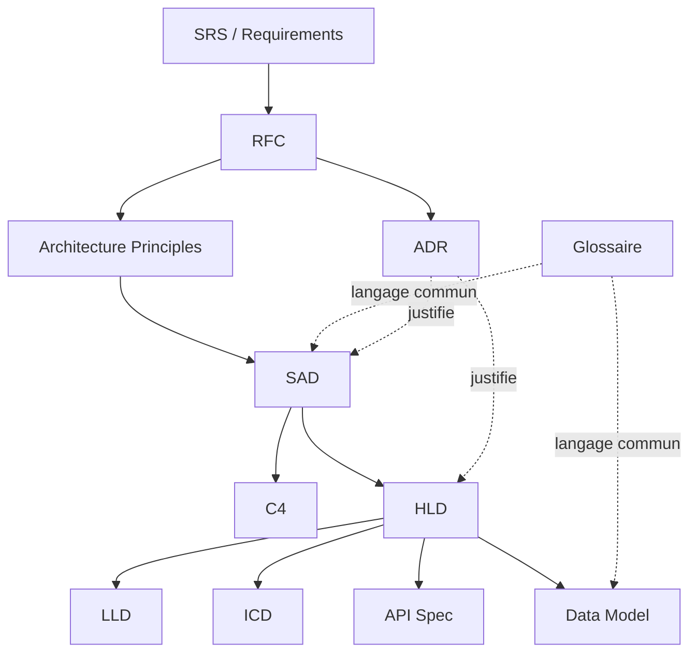

# ② Architecture & Design

> 📁 Lot 2 · 11 fiches · En cours 🔄

Ce dossier couvre les documents qui **décrivent comment le système est structuré**, les décisions prises et leurs justifications, les interfaces entre composants, les données et le vocabulaire partagé. La question centrale : **« Comment allons-nous construire ce système, pourquoi ces choix, et comment les composants communiquent-ils ?** »

---

## Carte du lot

---

## Index des fiches

| #   | Acronyme            | Nom complet                     | Question clé                                                                    | Fiche                                           |
| --- | ------------------- | ------------------------------- | ------------------------------------------------------------------------------- | ----------------------------------------------- |
| 01  | **RFC**             | Request for Comments            | _Comment proposer et discuter une idée avant de décider ?_                      | [→](./01-rfc-request-for-comments.md)           |
| 02  | **Arch Principles** | Architecture Principles         | _Quelles règles gouvernent toutes nos décisions architecturales ?_              | [→](./02-architecture-principles.md)            |
| 03  | **SAD**             | Software Architecture Document  | _Quelle est l'architecture globale du système ?_                                | [→](./03-sad-software-architecture-document.md) |
| 04  | **C4**              | C4 Model                        | _Comment visualiser l'architecture à 4 niveaux de zoom ?_                       | [→](./04-c4-model.md)                           |
| 05  | **ADR**             | Architecture Decision Record    | _Pourquoi avons-nous fait ce choix, et quelles alternatives ont été écartées ?_ | [→](./05-adr-architecture-decision-record.md)   |
| 06  | **HLD**             | High Level Design               | _Quels sont les composants majeurs et leurs interactions ?_                     | [→](./06-hld-high-level-design.md)              |
| 07  | **LLD**             | Low Level Design                | _Comment un composant est-il conçu en détail ?_                                 | [→](./07-lld-low-level-design.md)               |
| 08  | **ICD**             | Interface Control Document      | _Quel est le contrat entre deux systèmes/composants ?_                          | [→](./08-icd-interface-control-document.md)     |
| 09  | **API Spec**        | API Specification               | _Quels endpoints, contrats et comportements expose l'API ?_                     | [→](./09-api-specification.md)                  |
| 10  | **Data Model**      | Data Model                      | _Comment les données sont-elles structurées et reliées ?_                       | [→](./10-data-model.md)                         |
| 11  | **Glossaire**       | Glossaire / Ubiquitous Language | _Que signifie chaque terme dans notre contexte métier ?_                        | [→](./11-glossaire-ubiquitous-language.md)      |

---

## Positionnement dans le cycle de vie

| Depuis (Lot 1)                                   | Vers (Lots 3–5)                                              |
| ------------------------------------------------ | ------------------------------------------------------------ |
| SRS → contraintes pour SAD/HLD                   | SAD/HLD → base du Design Doc (Lot 3)                         |
| NFR → _Architecturally Significant Requirements_ | ADR → historique permanent pour les futurs devs              |
| RTM → trace les décisions vers les exigences     | API Spec / ICD → entrée des Test Cases d'intégration (Lot 4) |
| Glossaire (Lot 2) ↔ nommage dans le code (Lot 3) | Data Model → schéma de migration, Runbooks (Lot 5)           |

---

## Ordre de lecture recommandé

Pour un nouveau projet (ordre chronologique) : `Glossaire` → `Arch Principles` → `RFC` → `ADR` → `SAD + C4` → `HLD` → `LLD + ICD + API Spec + Data Model`.

Pour un audit/reprise : commencer par `SAD → C4 → ADR` (comprendre l'existant et ses justifications).

---

⬅️ [Lot 1 : Business & Requirements](../01-business-requirements/README.md) · 🏠 [Index général](../README.md) · ➡️ Lot 3 : [Quality & Development](../03-quality-development/) _(à venir)_
