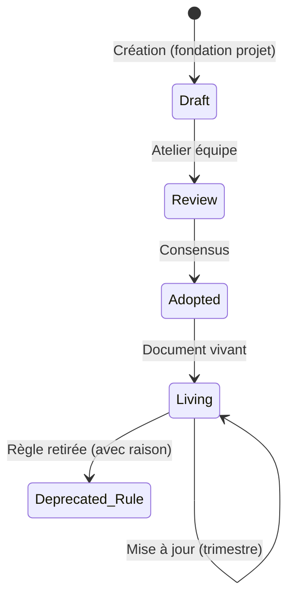
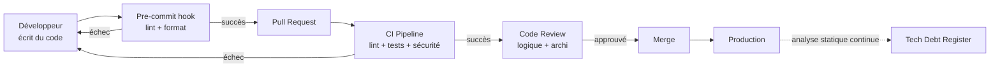

# Coding Standards

> 📁 Phase : ③ Quality & Development · 🏷️ Acronyme : **Coding Standards** · 🔤 EN : _Coding Standards / Code Style Guide_

---

## 1. Définition & objectif

Les **Coding Standards** (normes de codage) définissent l'ensemble des **règles, conventions et bonnes pratiques** que tous les développeurs d'un projet ou d'une organisation doivent respecter lorsqu'ils écrivent du code. Ils répondent à « **Comment le code doit-il être écrit pour être cohérent, lisible, maintenable et sûr ?** »

L'objectif n'est pas l'uniformité esthétique mais la **réduction du coût cognitif** : n'importe quel membre de l'équipe doit pouvoir lire, comprendre et modifier n'importe quelle partie du code sans friction.

| Ce qu'ils SONT                         | Ce qu'ils NE SONT PAS                    |
| -------------------------------------- | ---------------------------------------- |
| Des règles applicables par l'outillage | Un guide de style uniquement esthétique  |
| Un référentiel de qualité commun       | Des préférences personnelles             |
| Applicables en CI via des linters      | Un document qu'on lit une fois et oublie |

---

## 2. Usage & utilité

- **Cohérence** : le code d'une équipe de 20 ressemble à celui d'une seule personne.
- **Code review efficace** : les reviewers s'attardent sur la logique, pas le style.
- **Onboarding accéléré** : les conventions réduisent la courbe d'apprentissage.
- **Réduction des bugs** : certaines règles évitent des erreurs classiques (nulls, exceptions, injection…).
- **Automatisation** : les linters/formatters appliquent 80% des règles sans intervention humaine.
- **Sécurité** : les patterns interdits évitent des vulnérabilités connues (OWASP).

---

## 3. Périmètre (in / out of scope)

**In scope**

- Formatage (indentation, longueur de ligne, espaces).
- Nommage (variables, fonctions, classes, fichiers).
- Structure des fichiers et des modules.
- Patterns autorisés et interdits (anti-patterns, null safety, error handling).
- Documentation du code (commentaires, docstrings).
- Pratiques de sécurité au niveau code.
- Couverture de tests minimale.
- Workflow Git (messages de commit, branches).

**Out of scope**

- Architecture globale → **Architecture Principles / SAD**.
- Design d'une feature → **Design Document**.
- Processus de livraison → **Definition of Done**.

---

## 4. Cycle de vie du document



- **Naissance** : au démarrage du projet (idéalement) ; sinon rétroactivement lors d'un atelier.
- **Vie** : **document vivant**, revu trimestriellement ; les nouvelles règles sont proposées via PR.
- **Fin** : les règles dépréciées sont conservées avec leur raison (éviter la réintroduction).

---

## 5. Métiers / rôles concernés (RACI)

| Activité                | Dev Senior | Tech Lead | Architecte | Équipe Dev | CI/CD |
| ----------------------- | :--------: | :-------: | :--------: | :--------: | :---: |
| Rédaction initiale      |   **R**    |   **R**   |     C      |     C      |   I   |
| Validation              |     C      |   **A**   |     C      |     C      |   I   |
| Application quotidienne |     I      |     C     |     I      |   **R**    |   I   |
| Enforcement automatique |     I      |   **R**   |     I      |     C      | **R** |
| Évolution des règles    |     C      |   **R**   |     C      |   **R**    |   I   |

**R**esponsible · **A**ccountable · **C**onsulted · **I**nformed.

---

## 6. Position & interactions avec les autres documents

```mermaid
flowchart LR
    AP[Architecture Principles] --> CS[Coding Standards]
    CS --> DOD[Definition of Done\n(seuil qualité)]
    CS --> CI[Pipeline CI/CD\nlinters + formatters]
    CS --> CR[Code Review\nguidelines]
    CS --> DG[Developer Guide\nonboarding]
    TDR[Tech Debt Register] -.violations documentées.-> CS
```

| Document                    | Relation                                                                  |
| --------------------------- | ------------------------------------------------------------------------- |
| **Architecture Principles** | Les standards traduisent les principes en règles concrètes de code.       |
| **Definition of Done**      | Le DoD référence les standards comme critères de qualité.                 |
| **Developer Guide**         | Les standards sont l'une des premières choses décrites dans l'onboarding. |
| **Tech Debt Register**      | Les violations intentionnelles de standards → dettes documentées.         |

---

## 7. Nommage & versionnement

- **Fichier** : `CODING_STANDARDS.md` ou `docs/coding-standards/` (un fichier par langage si multi-lang).
- **Stockage** : dans le dépôt Git, à la racine ou dans `docs/` — versionné avec le code.
- **Enforcement** : les règles doivent être configurées dans les outils (`.eslintrc`, `pyproject.toml`, `.editorconfig`, `checkstyle.xml`…).

---

## 8. Template vierge

```markdown
# Coding Standards — <Projet / Organisation>

_Version x.y — AAAA-MM-JJ — Langage(s) : <langages>_

## 1. Principes directeurs

<Pourquoi ces standards ? La valeur derrière les règles.>

## 2. Formatage

- Indentation : <espaces/tabs, nombre>
- Longueur max de ligne : <n> caractères
- Fins de ligne : LF (Unix)
- Encodage : UTF-8

## 3. Nommage

| Élément    | Convention  | Exemple              |
| ---------- | ----------- | -------------------- |
| Variables  | camelCase   | `orderCount`         |
| Constantes | UPPER_SNAKE | `MAX_RETRIES`        |
| Classes    | PascalCase  | `InvoiceService`     |
| Fichiers   | kebab-case  | `invoice-service.ts` |

## 4. Structure & organisation

<Arborescence des fichiers, structure des modules>

## 5. Patterns autorisés / interdits

| Pattern             | Statut        | Raison        |
| ------------------- | ------------- | ------------- |
| `async/await`       | ✅ Privilégié | Lisibilité    |
| Callbacks imbriqués | ❌ Interdit   | Callback hell |

## 6. Gestion des erreurs

## 7. Commentaires & documentation

## 8. Tests

- Couverture minimale : <x>%
- Nommage des tests : `<context>_<scenario>_<expected>`

## 9. Sécurité (au niveau code)

## 10. Git

- Commits : Conventional Commits (feat/fix/chore…)
- Branches : <convention>
- PR/MR : <taille max, labels>

## 11. Linters & formatters configurés

| Outil | Fichier de config | Scope |
| ----- | ----------------- | ----- |
```

---

## 9. Exemple rempli (extrait — Node.js / TypeScript)

```markdown
# Coding Standards — Portail Client (TypeScript / Node.js)

_Version 1.3 — 2026-03-20_

## 1. Principes directeurs

Le code doit être **lisible avant d'être court**. Nous préférons l'explicite à l'implicite.
Un nouveau dev doit comprendre n'importe quelle fonction sans demander d'explications.

## 3. Nommage

| Élément              | Convention           | Exemple                                |
| -------------------- | -------------------- | -------------------------------------- |
| Variables / params   | camelCase            | `customerId`                           |
| Constantes           | UPPER_SNAKE_CASE     | `MAX_PDF_RETRIES`                      |
| Classes / Interfaces | PascalCase           | `InvoiceService`, `IInvoiceRepository` |
| Fichiers             | kebab-case           | `invoice.service.ts`                   |
| Tables DB            | snake_case singulier | `pdf_job`                              |
| Endpoints REST       | kebab-case pluriel   | `/invoice-requests`                    |

## 5. Patterns

| Pattern               | Statut        | Raison                                    |
| --------------------- | ------------- | ----------------------------------------- |
| `async/await`         | ✅ Requis     | Lisibilité vs callbacks                   |
| `any` TypeScript      | ❌ Interdit   | Perd les bénéfices du typage              |
| `console.log` en prod | ❌ Interdit   | Utiliser le logger structuré (pino)       |
| Secrets en dur        | ❌ Interdit   | OWASP A02 — via env vars                  |
| `try/catch` vide      | ❌ Interdit   | Les erreurs silencieuses causent des bugs |
| Early return          | ✅ Privilégié | Réduit l'imbrication                      |

## 8. Tests

- Couverture : ≥ 80% lignes, 100% des chemins critiques (paiement, auth).
- Nommage : `describe('InvoiceService') > it('should throw when invoice not found')`
- Mocking : Jest mocks ; pas de vraie DB en tests unitaires.

## 10. Git — Conventional Commits

| Type               | Usage                                       |
| ------------------ | ------------------------------------------- |
| `feat:`            | Nouvelle fonctionnalité                     |
| `fix:`             | Correction de bug                           |
| `chore:`           | Mise à jour dépendances, CI                 |
| `docs:`            | Documentation uniquement                    |
| `refactor:`        | Refactoring sans changement de comportement |
| `test:`            | Ajout/modification de tests                 |
| `perf:`            | Amélioration de performance                 |
| `BREAKING CHANGE:` | Changement non rétrocompatible              |

## 11. Linters & formatters

| Outil                       | Config                     | Scope              |
| --------------------------- | -------------------------- | ------------------ |
| ESLint + @typescript-eslint | `.eslintrc.json`           | Qualité + erreurs  |
| Prettier                    | `.prettierrc`              | Formatage          |
| Husky + lint-staged         | `.husky/`                  | Pre-commit hook    |
| SonarCloud                  | `sonar-project.properties` | Qualité + sécurité |
```

---

## 10. Checklist de revue

- [ ] Les règles couvrent **formatage, nommage, structure, erreurs, tests et sécurité**.
- [ ] Chaque règle a une **justification** (pas juste une préférence).
- [ ] Les règles sont **enforcées automatiquement** (linter/formatter configuré).
- [ ] Les **patterns de sécurité** (OWASP) sont explicitement adressés.
- [ ] Le document est dans le **dépôt Git** (versionné avec le code).
- [ ] La **couverture de tests minimale** est définie.
- [ ] Les **conventions Git** (commit messages, branching) sont documentées.
- [ ] L'équipe a été **consultée** et a adopté les règles (pas imposées).

---

## 11. Anti-patterns & pièges

| Anti-pattern                             | Problème                                    | Correctif                                          |
| ---------------------------------------- | ------------------------------------------- | -------------------------------------------------- |
| 📋 **Standards non enforcés**            | Chacun fait ce qu'il veut                   | Linters dans le CI obligatoires                    |
| 🔒 **Standards trop restrictifs**        | Freine la productivité, résistance          | 80/20 : enforcer l'essentiel, recommander le reste |
| 📚 **Document de 100 pages**             | Personne ne le lit                          | Court + outillé ; les détails dans les configs     |
| 🎨 **Standards = style uniquement**      | Manque les règles de sécurité/qualité       | Couvrir aussi erreurs, tests, sécurité             |
| 👤 **Imposés par un seul**               | Résistance de l'équipe                      | Atelier collaboratif, PR pour chaque règle         |
| 🧊 **Jamais mis à jour**                 | Décorrélés des pratiques réelles            | Revue trimestrielle                                |
| ♻️ **Ignorer les violations existantes** | Standards décrivent l'idéal, pas la réalité | TDR pour les dettes existantes                     |

---

## 12. Variantes par industrie / contexte

| Contexte                         | Spécificités                                                                                    |
| -------------------------------- | ----------------------------------------------------------------------------------------------- |
| **Multi-langage**                | Un fichier par langage (`.editorconfig` pour le cross-langage)                                  |
| **Systèmes critiques (DO-178C)** | Standards très stricts (MISRA C/C++, JSF Air Vehicle C++, HIC++) ; violations = non-conformités |
| **Open source**                  | `CONTRIBUTING.md` + style guide publics ; GitHub Actions lint automatique                       |
| **Sécurité**                     | OWASP Secure Coding Practices ; règles Semgrep/CodeQL pour les patterns vulnérables             |
| **Agile / petite équipe**        | Standards légers ; opinionated formatter (Black, Prettier, gofmt) + Conventional Commits        |

**Références de style guides publics** : [Google Style Guides](https://google.github.io/styleguide/), [Airbnb JS](https://github.com/airbnb/javascript), [PEP 8](https://peps.python.org/pep-0008/), [Effective Go](https://go.dev/doc/effective_go).

---

## 13. Standards & normes

- **MISRA C/C++** — standards automobiles/embarqués, subset sûr du C/C++.
- **CERT C/C++ Coding Standard** — sécurité et fiabilité.
- **OWASP Secure Coding Practices** — sécurité applicative.
- **ISO/IEC 25010** — maintenabilité (un des critères NFR).
- **Conventional Commits** ([conventionalcommits.org](https://www.conventionalcommits.org)) — messages de commit sémantiques.

---

## 14. Outillage recommandé

| Langage / Besoin        | Outils                                             |
| ----------------------- | -------------------------------------------------- |
| JavaScript / TypeScript | ESLint, Prettier, Biome                            |
| Python                  | Black, Ruff, Pylint, Flake8                        |
| Java                    | Checkstyle, PMD, SpotBugs, Google Java Format      |
| Go                      | `gofmt`, `golangci-lint`                           |
| C/C++                   | Clang-Format, Clang-Tidy, Cppcheck, MISRA checker  |
| Multi-langage           | `.editorconfig`, SonarQube/SonarCloud, CodeClimate |
| Git hooks               | Husky (Node), pre-commit (Python), lefthook        |
| Sécurité statique       | Semgrep, CodeQL (GitHub), Snyk Code                |

---

## 15. Diagramme — Du code au standard (boucle de qualité)



---

> 🔎 **En une phrase** : les Coding Standards transforment les bonnes pratiques implicites en règles explicites et automatiquement vérifiables — leur vraie valeur n'est pas dans le document mais dans le **linter configuré dans le CI**.

⬅️ [Index du lot](./README.md) · ➡️ Suivant : [Definition of Done](./02-definition-of-done.md)
