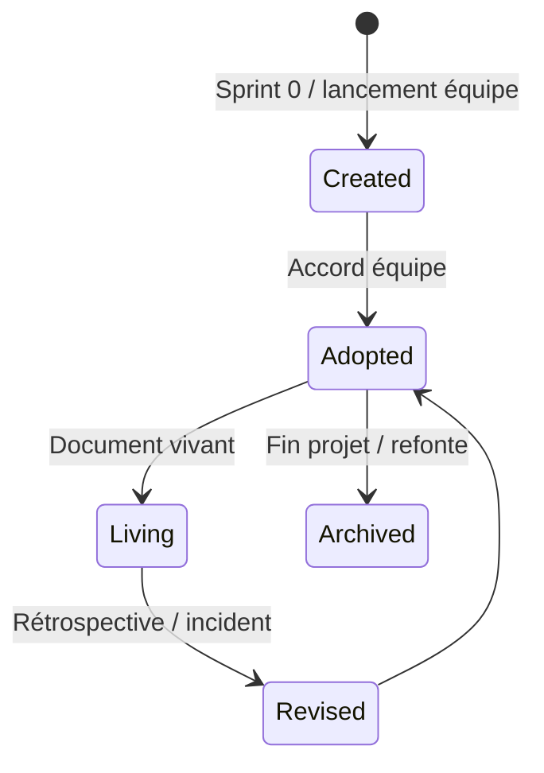
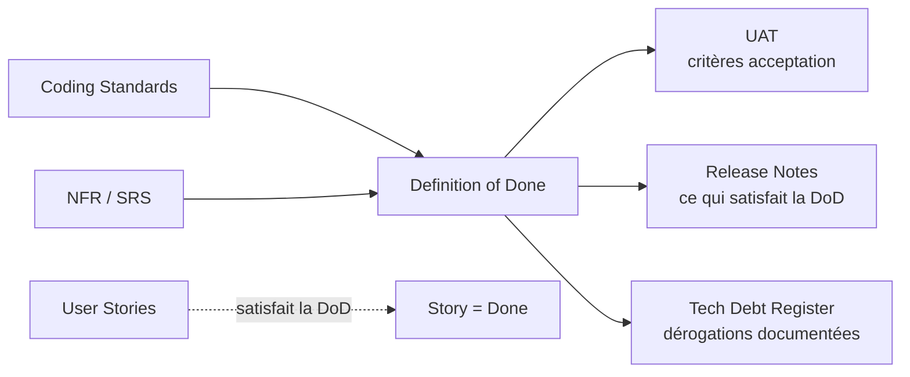
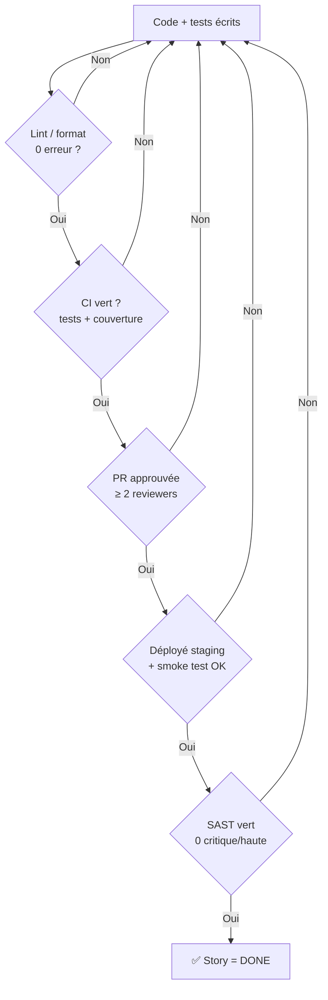

# Definition of Done

> 📁 Phase : ③ Quality & Development · 🏷️ Acronyme : **DoD** · 🔤 EN : _Definition of Done_

---

## 1. Définition & objectif

La **Definition of Done (DoD)** est une **liste de critères vérifiables** qui doivent tous être satisfaits pour qu'un incrément (story, feature, sprint, release) soit considéré comme **terminé**. Elle répond à « **Qu'est-ce que « c'est fini » signifie réellement, pour tout le monde, sans ambiguïté ?** »

C'est l'accord commun de l'équipe sur la qualité minimale non négociable. Sans DoD, « fini » veut dire quelque chose de différent pour chaque personne.

| Ce qu'elle EST                                            | Ce qu'elle N'EST PAS                              |
| --------------------------------------------------------- | ------------------------------------------------- |
| Les critères qualité **transverses** à toutes les stories | Les critères d'acceptation d'une story spécifique |
| Un engagement d'équipe                                    | Un checklist de QA uniquement                     |
| Non négociable                                            | Une liste de souhaits                             |

> **DoD vs Critères d'Acceptation** : les critères d'acceptation sont **spécifiques à une story** (« le client peut télécharger sa facture ») ; le DoD est **transversal** (« le code est testé, documenté, déployé en staging, les logs sont en place »).

---

## 2. Usage & utilité

- **Transparence** : tout le monde sait exactement ce que « terminé » veut dire.
- **Qualité non négociable** : empêche les livraisons au rabais (« fini mais sans tests »).
- **Réduction de la dette** : les critères de qualité sont appliqués à chaque story, pas rattrapés en fin de projet.
- **Confiance** dans les estimations : on planifie avec la même définition de « terminé ».
- **Contrat équipe ↔ PO** : le PO sait ce qu'il accepte.

---

## 3. Périmètre (in / out of scope)

**In scope**

- Critères de code (tests, review, linting).
- Critères de documentation (mise à jour des docs impactées).
- Critères de déploiement (merge, déploiement en staging, smoke test).
- Critères de non-régression.
- Critères de sécurité et de performance.
- Niveaux possibles : **story**, **sprint**, **release**.

**Out of scope**

- Comportement fonctionnel spécifique → critères d'acceptation de la story.
- Règles de codage détaillées → **Coding Standards**.
- Processus de release → **Release Notes / CI-CD pipeline**.

---

## 4. Cycle de vie du document



- **Naissance** : Sprint 0 ou lors de l'atelier de démarrage d'équipe.
- **Vie** : revisitée en **rétrospective** — la DoD évolue avec la maturité de l'équipe.
- **Fin** : archivée à la fin du projet ; un nouveau projet repart d'une DoD adaptée.

---

## 5. Métiers / rôles concernés (RACI)

| Activité         | Équipe Dev |  QA   |  PO   | Scrum Master | Architecte |
| ---------------- | :--------: | :---: | :---: | :----------: | :--------: |
| Création         |   **R**    | **R** |   C   |      F       |     C      |
| Validation       |     C      |   C   | **A** |      F       |     C      |
| Application      |   **R**    | **R** |   I   |      F       |     I      |
| Révision (rétro) |   **R**    | **R** |   C   |      F       |     C      |

_F = Facilitateur._ La DoD **appartient à l'équipe** ; le PO l'approuve. Elle n'est pas imposée par le management.

---

## 6. Position & interactions avec les autres documents



| Document               | Relation                                                                |
| ---------------------- | ----------------------------------------------------------------------- |
| **Coding Standards**   | Les standards alimentent les critères de code de la DoD.                |
| **SRS / NFR**          | Les NFR de qualité (couverture, performance) se retrouvent dans la DoD. |
| **Tech Debt Register** | Une dérogation intentionnelle à la DoD → dette documentée.              |
| **UAT**                | La DoD garantit que le code est prêt à être soumis à l'UAT.             |

---

## 7. Nommage & versionnement

- **Fichier** : `DEFINITION_OF_DONE.md` dans le repo ou `docs/dod.md`.
- **Niveaux** : définir une DoD par niveau (story, sprint, release) si les équipes sont matures.
- **Versionnement** : versionné avec le projet ; historique Git visible.
- **Affichage** : souvent affiché dans l'outil de gestion (Jira, Confluence, tableau physique).

---

## 8. Template vierge

```markdown
# Definition of Done — <Projet>

_Version x.y — AAAA-MM-JJ — Adoptée par l'équipe_

## DoD Niveau Story

### Code

- [ ] Le code respecte les Coding Standards (ESLint, Prettier — 0 warning).
- [ ] La couverture de tests unitaires est ≥ <x>%.
- [ ] Les tests d'intégration pertinents sont écrits et passent.
- [ ] Pas de `TODO` / `FIXME` laissés sans ticket.
- [ ] Pas de secret en dur (scan Gitleaks).

### Revue

- [ ] Pull Request approuvée par ≥ <n> reviewer(s).
- [ ] Aucun commentaire bloquant non résolu.

### Tests

- [ ] Tous les tests automatisés passent (CI vert).
- [ ] Les critères d'acceptation de la story sont tous satisfaits.
- [ ] La non-régression est vérifiée (tests de régression passent).

### Documentation

- [ ] Le code est auto-documenté ou commenté là où nécessaire.
- [ ] L'API Spec est mise à jour si une API a changé.
- [ ] Le Glossaire est mis à jour si un terme nouveau est apparu.

### Déploiement & opérabilité

- [ ] Le code est mergé sur la branche principale (main/develop).
- [ ] Le déploiement en staging est réussi.
- [ ] Les logs et métriques de la feature sont en place.
- [ ] Un smoke test manuel est passé en staging.

### Sécurité

- [ ] Aucune vulnérabilité critique/haute introduite (SAST vert).
- [ ] Les données personnelles sont traitées conformément au RGPD.

---

## DoD Niveau Sprint

- [ ] Toutes les stories du sprint satisfont la DoD story.
- [ ] La vélocité est mise à jour.
- [ ] La démo sprint est préparée.

---

## DoD Niveau Release

- [ ] Toutes les stories de la release satisfont la DoD story.
- [ ] Les tests de performance (NFR-PERF) sont validés.
- [ ] La Release Notes est rédigée.
- [ ] Le runbook est mis à jour si nécessaire.
- [ ] Le déploiement en production est planifié et approuvé.
```

---

## 9. Exemple rempli (Portail Client — DoD Story)

```markdown
# Definition of Done — Portail Client Self-Service

_Version 1.1 — 2026-02-01_

## DoD Story

### Code

- [x] ESLint 0 erreur, Prettier appliqué.
- [x] Couverture tests unitaires ≥ 80% (seuil CI).
- [x] Tests d'intégration pour les endpoints modifiés.
- [x] Pas de `any` TypeScript, pas de secret en dur.

### Revue

- [x] PR approuvée par ≥ 2 reviewers.
- [x] Aucun commentaire bloquant ouvert.

### Tests

- [x] CI GitHub Actions vert (tests + lint + build).
- [x] Critères Gherkin de la story exécutés (Cucumber).
- [x] Suite de régression E2E passée (Playwright).

### Documentation

- [x] OpenAPI spec mise à jour si endpoint modifié.
- [x] Glossaire mis à jour si nouveau terme métier.

### Déploiement

- [x] Mergé sur `main`.
- [x] Déployé automatiquement sur staging via CD.
- [x] Smoke test : page de facturation accessible + PDF téléchargeable.

### Sécurité

- [x] SonarCloud 0 issue critique/haute (security hotspot résolu).
- [x] Aucune dépendance vulnérable introduite (Snyk).
```

---

## 10. Checklist de revue de la DoD elle-même

- [ ] La DoD couvre **code, revue, tests, documentation, déploiement et sécurité**.
- [ ] Tous les critères sont **vérifiables** (pas de « le code est bon »).
- [ ] La DoD est **atteignable** à chaque story (pas trop ambitieuse au départ).
- [ ] L'**équipe entière** l'a adoptée (y compris QA, PO).
- [ ] Elle est **visible** (outil, tableau, repo).
- [ ] Elle a été **mise à jour** après la dernière rétrospective.
- [ ] Les **dérogations** sont tracées (Tech Debt Register).

---

## 11. Anti-patterns & pièges

| Anti-pattern                           | Problème                                     | Correctif                                                |
| -------------------------------------- | -------------------------------------------- | -------------------------------------------------------- |
| 🎯 **DoD = critères d'acceptation**    | Confusion ; le PO dicte la qualité technique | DoD transversal vs critères spécifiques                  |
| 🌫️ **Critères non vérifiables**        | « bien testé » n'est pas mesurable           | Métriques précises : seuil, outil, résultat              |
| 🧊 **DoD figée** jamais révisée        | Décorrélée de la maturité                    | Révision à chaque rétrospective                          |
| 🏃 **Stories « presque done »**        | La DoD est négociée sous pression            | La DoD est non négociable ; si non satisfaite = pas done |
| 🚀 **DoD trop exigeante** au démarrage | Démotive, paralysante                        | Commencer léger, renforcer au fil des sprints            |
| 🧟 **Dérogations non documentées**     | Dette cachée                                 | Toute dérogation → TDR                                   |

---

## 12. Variantes par industrie / contexte

| Contexte                | Spécificités                                                                |
| ----------------------- | --------------------------------------------------------------------------- |
| **Scrum**               | DoD définie et maintenue par l'équipe (Scrum Guide 2020).                   |
| **SAFe**                | DoD à plusieurs niveaux : Story → Feature → Solution → Portfolio.           |
| **Kanban**              | Critères d'entrée et de sortie de chaque colonne (WIP limits).              |
| **Systèmes critiques**  | DoD inclut revue formelle, tests de qualification, traçabilité normative.   |
| **Hardware + Software** | DoD inclut des critères matériels (FPGA programmé, tests sur cible réelle). |

---

## 13. Standards & normes

- **Scrum Guide 2020** (Schwaber & Sutherland) — Definition of Done comme artefact officiel.
- **SAFe® 6.0** — DoD multi-niveaux.
- **ISO/IEC 25010** — les critères de qualité du produit alimentent la DoD.
- **OWASP SAMM** (Software Assurance Maturity Model) — pratiques de sécurité dans le cycle dev (DoD sécurité).

---

## 14. Outillage recommandé

| Besoin                  | Outils                                                                       |
| ----------------------- | ---------------------------------------------------------------------------- |
| Affichage & suivi       | Jira (DoD dans les templates de story), Confluence, Notion, tableau physique |
| Enforcement automatique | GitHub Actions, GitLab CI (seuils de qualité), SonarQube Quality Gates       |
| Tests automatisés       | Jest, Pytest, JUnit, Cypress, Playwright (selon stack)                       |
| Sécurité                | SonarCloud, Snyk, Gitleaks (secrets), Semgrep                                |

---

## 15. Diagramme — Flux de validation (story → done)



---

> 🔎 **En une phrase** : la Definition of Done est **le contrat de qualité de l'équipe** — elle transforme « je pense que c'est fini » en « c'est objectivement fini selon des critères que tout le monde a acceptés ».

⬅️ [Coding Standards](./01-coding-standards.md) · ➡️ Suivant : [Tech Debt Register](./03-technical-debt-register.md)
