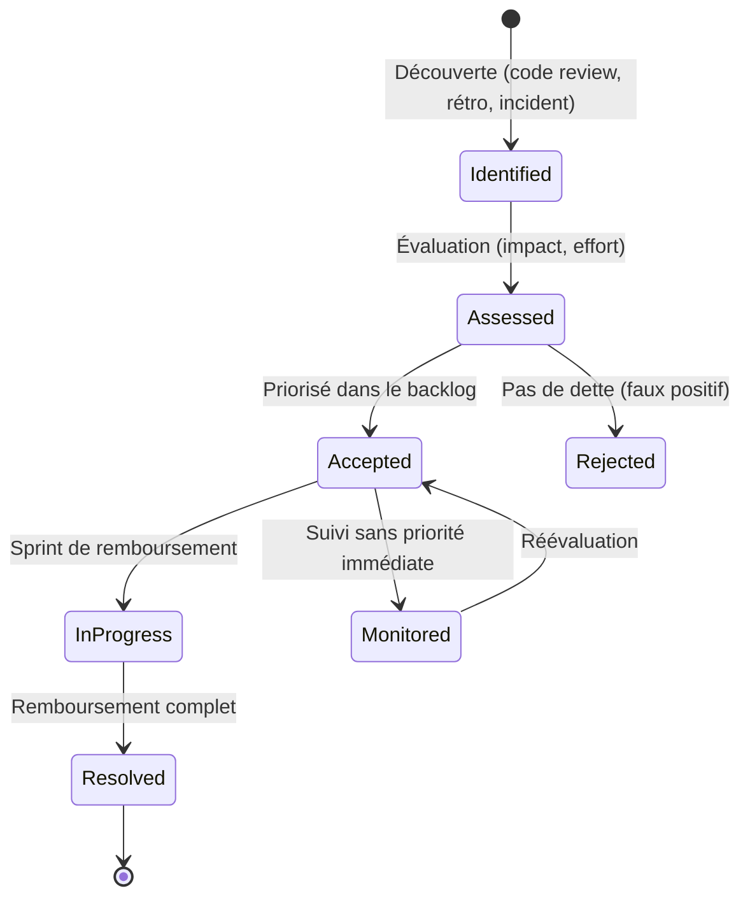

# Technical Debt Register

> 📁 Phase : ③ Quality & Development · 🏷️ Acronyme : **TDR** · 🔤 EN : _Technical Debt Register_

---

## 1. Définition & objectif

Le **Technical Debt Register** est un **registre centralisé des compromis techniques intentionnels** (et découverts) accumulés dans le système : décisions prises délibérément pour aller plus vite, avec la conscience que le coût sera payé plus tard. Il répond à « **Quelle dette technique avons-nous, quelle est son impact, et comment la gérons-nous ?** »

La métaphore de Ward Cunningham (1992) : comme une dette financière, la dette technique **génère des intérêts** — ralentissement du développement, fragilité, risques croissants. La gérer, c'est éviter la faillite technique.

| Ce qu'il EST                                 | Ce qu'il N'EST PAS                                        |
| -------------------------------------------- | --------------------------------------------------------- |
| Un registre transparent de compromis assumés | Une liste de bugs (→ bug tracker)                         |
| Un outil de priorisation du remboursement    | Une excuse pour ne jamais nettoyer                        |
| Une aide à la décision (déroger ou non)      | Un catalogue exhaustif de tout ce qui pourrait être mieux |

> **Types de dette** (Fowler) : _reckless deliberate_ (mauvaise décision consciente), _prudent deliberate_ (compromis assumé), _reckless inadvertent_ (découverte), _prudent inadvertent_ (on sait maintenant ce qu'on aurait dû faire).

---

## 2. Usage & utilité

- **Rendre visible** ce qui est implicite (« on sait que c'est bancal »).
- **Prioriser** le remboursement de la dette (impact × probabilité de toucher ce code).
- **Décider en connaissance de cause** : accepter une dérogation à la DoD avec un ticket TDR.
- **Argumenter** les investissements de qualité auprès du management (dette quantifiée).
- **Éviter les surprises** lors des estimations (« ce module est lourdement endetté »).

---

## 3. Périmètre (in / out of scope)

**In scope**

- Dette délibérée (shortcuts assumés avec impact connu).
- Dette découverte (code legacy, architecture dated).
- Violations documentées des Coding Standards ou de la DoD.
- Dépendances obsolètes.
- Manque de tests (coverage debt).
- Dette architecturale (composant mal conçu connu).

**Out of scope**

- Bugs → **bug tracker** (Jira, GitHub Issues).
- Fonctionnalités manquantes → **backlog**.
- Incidents → **Post-Mortem / RCA** (Lot 5).

---

## 4. Cycle de vie du document



- **Naissance** : à chaque découverte (code review, rétrospective, incident, analyse SonarQube).
- **Vie** : document vivant, revu en **backlog refinement** régulièrement.
- **Fin** : dette remboursée → clôturée et archivée (trace historique).

---

## 5. Métiers / rôles concernés (RACI)

| Activité                   | Dev / Tech Lead | Architecte |  PO   | Scrum Master |
| -------------------------- | :-------------: | :--------: | :---: | :----------: |
| Identification             |      **R**      |   **R**    |   I   |      I       |
| Évaluation (impact/effort) |      **R**      |   **R**    |   C   |      I       |
| Priorisation               |        C        |     C      | **A** |      F       |
| Remboursement              |      **R**      |     C      |   I   |      F       |
| Suivi global               |        C        |   **R**    |   C   |    **R**     |

> Le **PO** arbitre la priorisation : dette technique vs valeur métier. C'est une conversation, pas un diktat technique.

---

## 6. Position & interactions avec les autres documents

```mermaid
flowchart LR
    CS[Coding Standards] -.violation.-> TDR
    DOD[Definition of Done] -.dérogation.-> TDR
    AP[Arch Principles] -.violation.-> TDR
    TDR -.priorité.-> BACKLOG[Product Backlog]
    TDR --> RCA[RCA / Post-Mortem\n(si incident lié)]
    TDR -.informs.-> RISK[Risk Register\nLot 5]
```

| Document                    | Relation                                                               |
| --------------------------- | ---------------------------------------------------------------------- |
| **Coding Standards / DoD**  | Toute dérogation intentionnelle → entrée dans le TDR.                  |
| **Architecture Principles** | Violation d'un principe = dette architecturale à documenter.           |
| **Backlog**                 | Les dettes priorisées deviennent des stories/enablers dans le backlog. |
| **Risk Register**           | Une dette à fort impact peut être un risque projet.                    |

---

## 7. Nommage & versionnement

- **Fichier** : `TECH_DEBT_REGISTER.md` ou dans l'outil de gestion (Jira custom field, tableau dédié).
- **Identifiants** : `TD-001`, `TD-002`… stable dans le temps.
- **Stockage recommandé** : dans l'outil de gestion du backlog (Jira) avec label `tech-debt` + dans un document de synthèse pour le management.
- **Versionné** dans Git si format markdown.

---

## 8. Template vierge

```markdown
# Technical Debt Register — <Projet>

## TD-### : <Titre court>

| Champ              | Valeur                                                          |
| ------------------ | --------------------------------------------------------------- |
| ID                 | TD-###                                                          |
| Date de découverte | AAAA-MM-JJ                                                      |
| Découvert par      |                                                                 |
| Composant / Module |                                                                 |
| Type               | Délibérée / Découverte / Architecturale / Coverage / Dépendance |
| Priorité           | Critique / Haute / Moyenne / Basse                              |
| Statut             | Identifiée / Acceptée / En cours / Résolue                      |
| Lien ticket        | PROJ-###                                                        |

### Description

<Quel est le problème ? Pourquoi c'est de la dette ?>

### Impact

<Ralentissement ? Risque de bug ? Sécurité ? Scalabilité ?>

### Effort de remboursement estimé

<S / M / L / XL (ou points)>

### Décision à date

<Rembourser quand ? Qui ? Ou accepter jusqu'à quand ?>

### Contexte (si délibérée)

<Pourquoi cette décision a été prise à l'époque ?>
```

---

## 9. Exemple rempli

```markdown
# Technical Debt Register — Portail Client Self-Service

## TD-001 : Adaptateur CRM SOAP synchrone

| Champ     | Valeur                          |
| --------- | ------------------------------- |
| ID        | TD-001                          |
| Date      | 2026-01-15                      |
| Composant | customer-api / CRMAdapter       |
| Type      | Architecturale / Délibérée      |
| Priorité  | Haute                           |
| Statut    | Acceptée — à rembourser Q3 2026 |

### Description

L'intégration avec le CRM utilise SOAP/XML synchrone (legacy CRM v2.1).
L'appel est bloquant dans le thread du Customer API, contribuant à la latence
sur les pages Réclamations (p95 = 620ms, cible = 500ms).

### Impact

- NFR-PERF-001 partiellement non satisfaite sur les pages CRM.
- Couplage fort : mise à jour du CRM = risque de régression.
- Difficulté à tester (pas de mock SOAP facile).

### Effort de remboursement

L (migration vers API REST async du CRM v3 + cache Redis)

### Décision

Acceptée jusqu'à la migration CRM planifiée en Q3 2026 (budget alloué).
RFC-015 (migration CRM) adresse ce point.

---

## TD-002 : Couverture tests < 40% sur NotificationService

| Champ    | Valeur                                 |
| -------- | -------------------------------------- |
| Type     | Coverage                               |
| Priorité | Moyenne                                |
| Statut   | Acceptée — à combler dans le Sprint 18 |

### Description

Le NotificationService (e-mails, webhooks) a 38% de couverture.
Historiquement développé en urgence, jamais rattrapé.

### Impact

Risque élevé de régression non détectée sur les notifications.

### Effort

M (2 jours de tests unitaires + 1 jour d'intégration)
```

---

## 10. Checklist de revue

- [ ] Chaque entrée a un **impact concret** documenté (pas juste « c'est moche »).
- [ ] L'**effort de remboursement** est estimé.
- [ ] Une **décision** est prise (rembourser quand / accepter pourquoi).
- [ ] Les dettes critiques / hautes ont un **ticket dans le backlog**.
- [ ] Le registre est **revu régulièrement** (backlog refinement, rétrospective).
- [ ] Les dettes résolues sont **clôturées** (trace conservée).
- [ ] Les dettes liées à des incidents ont un **lien vers le RCA**.

---

## 11. Anti-patterns & pièges

| Anti-pattern                                      | Problème                           | Correctif                                       |
| ------------------------------------------------- | ---------------------------------- | ----------------------------------------------- |
| 🕳️ **TDR vide** (« on n'a pas de dette »)         | Déni ; toute équipe a de la dette  | Chercher activement (SonarQube, rétro)          |
| 📚 **TDR interminable** non priorisé              | Inutilisable ; personne ne regarde | Prioriser ; 20% de la capacité pour la dette    |
| 💭 **« On remboursera un jour »** sans engagement | La dette s'accumule indéfiniment   | Engagement : date ou condition de remboursement |
| 🎭 **TDR pour justifier la lenteur**              | Alibi, pas un outil                | Le TDR informe ; la priorité reste au PO        |
| 🔒 **TDR secret** (honte)                         | Le management décide sans info     | Transparence ; la dette est normale et gérable  |
| 🧟 **Bugs dans le TDR**                           | Confusion ; les bugs sont urgents  | Bugs → bug tracker ; dette → TDR                |

---

## 12. Variantes par industrie / contexte

| Contexte               | Spécificités                                                            |
| ---------------------- | ----------------------------------------------------------------------- |
| **SaaS / Startup**     | TDR léger dans Jira (label + tableau Kanban de dette).                  |
| **Systèmes critiques** | La dette = non-conformité → peut bloquer la certification.              |
| **SI legacy**          | TDR massif ; classement par risque/coût pour guider les modernisations. |
| **Agile**              | 20% de capacité sprint réservée à la dette (règle empirique).           |

**Mesures objectives de dette** : SonarQube _Technical Debt Ratio_, _SQALE index_, CodeClimate _Maintainability_, Coverity _Issue Age_.

---

## 13. Standards & normes

- **Ward Cunningham (1992)** — concept originel de dette technique.
- **Martin Fowler — Technical Debt Quadrant** (délibérée/inadvertente × reckless/prudent).
- **ISO/IEC 25010** — maintenabilité (modifiabilité, testabilité) — métriques de dette.
- **SQALE method** (ISO 25010) — quantification systématique de la dette.
- **SonarQube SQALE** — implémentation outillée.

---

## 14. Outillage recommandé

| Besoin             | Outils                                                                     |
| ------------------ | -------------------------------------------------------------------------- |
| Suivi              | Jira (label `tech-debt`, epic dédié), GitHub Issues, Linear                |
| Mesure automatique | SonarQube/SonarCloud (debt ratio, code smells), CodeClimate                |
| Détection          | SonarQube, Snyk (dépendances), `grep TODO/FIXME`, Renovate (deps outdated) |
| Tableau de bord    | Grafana + SonarQube API, CodeClimate dashboard                             |

---

## 15. Diagramme — Cycle de vie de la dette

```mermaid
flowchart TD
    SRC["Sources de détection\n(code review / rétro / incident / SonarQube)"]
    SRC --> IDENT[TD-### Identifiée]
    IDENT --> ASSESS{Impact + effort\névalués}
    ASSESS -->|Faible impact| MONITOR[Monitored\n(faible priorité)]
    ASSESS -->|Impact significatif| BACKLOG[Ajoutée au backlog\n(story/enabler)]
    BACKLOG --> SPRINT[Sprint de remboursement]
    SPRINT --> RESOLVED[✅ Résolue\narchivée]
    MONITOR -.réévaluation.-> ASSESS
    RESOLVED -.leçon apprise.-> CS[Coding Standards\nmis à jour]
```

---

> 🔎 **En une phrase** : le TDR transforme la dette technique **de honte cachée en risque géré** — visible, priorisé, et progressivement remboursé comme une vraie dette financière.

⬅️ [Definition of Done](./02-definition-of-done.md) · ➡️ Suivant : [Design Document](./04-design-document.md)
