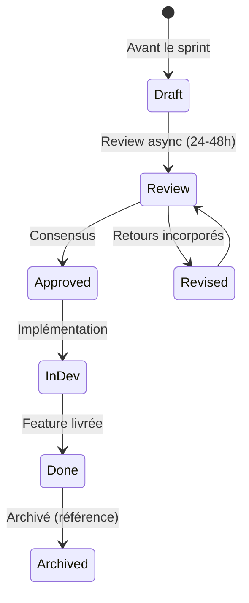
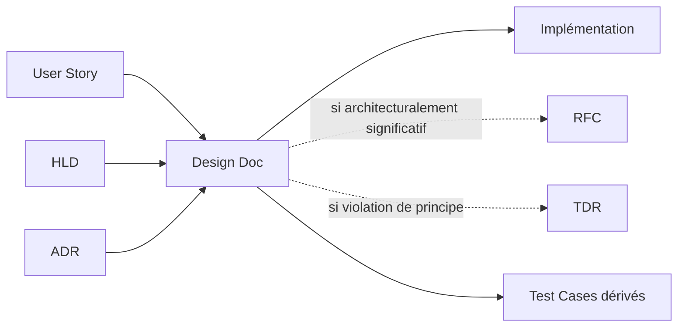
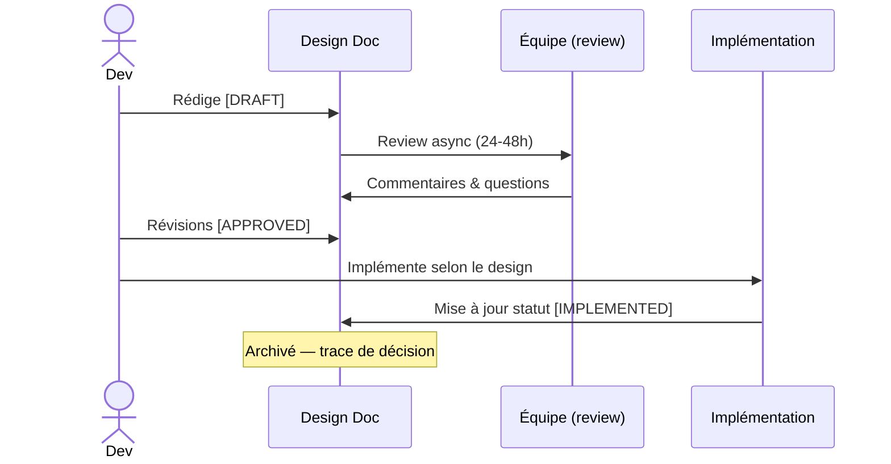

# Design Document

> 📁 Phase : ③ Quality & Development · 🏷️ Acronyme : **Design Doc** · 🔤 EN : _Design Document / Technical Design Document (TDD)_

---

## 1. Définition & objectif

Le **Design Document** (ou _Technical Design Document_) décrit **comment une fonctionnalité ou un changement spécifique sera implémenté**, à un niveau de détail suffisant pour guider le développement et permettre une revue technique rigoureuse. Il répond à « **Exactement comment allons-nous implémenter cette feature ?** »

C'est le pont entre une user story/exigence et le code : plus précis qu'un HLD (qui couvre le système entier), plus haut qu'un LLD (qui est par composant), et restreint à une **fonctionnalité ou un changement défini**.

| Ce qu'il EST                           | Ce qu'il N'EST PAS                       |
| -------------------------------------- | ---------------------------------------- |
| La spec d'implémentation d'une feature | L'architecture globale (→ HLD/SAD)       |
| Le document de revue avant de coder    | Le code lui-même                         |
| Court, ciblé, temporaire               | Un standard durable (→ Coding Standards) |

> **Noms alternatifs** : _Technical Design Document (TDD)_, _Engineering Design Doc_, _Feature Design Doc_, _Spec_ (chez Google/Meta). Attention : TDD signifie aussi _Test-Driven Development_ — préciser le contexte.

---

## 2. Usage & utilité

- **Revue avant de coder** : identifier les problèmes de conception avant qu'ils coûtent cher.
- **Alignement** : l'équipe comprend et valide l'approche avant le développement.
- **Décisions tracées** : les choix d'implémentation sont documentés pour la maintenance future.
- **Alternatives explorées** : on ne se lance pas dans la première idée venue.
- **Onboarding** : un dev qui rejoint comprend pourquoi le code est structuré ainsi.

---

## 3. Périmètre (in / out of scope)

**In scope**

- Contexte et objectif de la feature/changement.
- Approche de conception choisie et alternatives écartées.
- Flux d'implémentation (APIs, DB, services impactés).
- Migrations, rollback, backward compatibility.
- Questions ouvertes et risques.
- Checklist d'implémentation.

**Out of scope**

- Architecture globale → **HLD / SAD**.
- Exigences métier → **SRS / User Stories**.
- Décision d'architecture transverse → **ADR**.
- Discussions préalables → **RFC** (si changement majeur).

---

## 4. Cycle de vie du document



- **Naissance** : **avant** de commencer la feature (idéalement 1–2 jours avant le sprint).
- **Vie** : court — durée d'un sprint ou d'une feature. Révisé pendant la review.
- **Fin** : archivé une fois la feature livrée. La valeur résiduelle est la trace de décision.

> Un Design Doc n'a pas besoin d'être un chef-d'œuvre. Mieux vaut un doc imparfait et revu qu'un doc parfait rédigé après coup.

---

## 5. Métiers / rôles concernés (RACI)

| Activité                 | Dev (auteur) | Tech Lead | Dev pairs |  PO   | QA  |
| ------------------------ | :----------: | :-------: | :-------: | :---: | :-: |
| Rédaction                |    **R**     |     C     |     I     |   I   |  I  |
| Revue technique          |      C       |   **R**   |   **R**   |   I   |  C  |
| Validation fonctionnelle |      I       |     I     |     I     | **A** |  C  |
| Implémentation           |    **R**     |     C     |     C     |   I   |  I  |

**R**esponsible · **A**ccountable · **C**onsulted · **I**nformed.

> Tout développeur peut et devrait rédiger un Design Doc pour les features non triviales.

---

## 6. Position & interactions avec les autres documents



| Document       | Relation                                                              |
| -------------- | --------------------------------------------------------------------- |
| **User Story** | Le Design Doc détaille _comment_ implémenter ce que la story demande. |
| **HLD**        | Le Design Doc reste cohérent avec le HLD ; si conflit → RFC/ADR.      |
| **ADR**        | Si le Design Doc révèle un choix transverse → ADR.                    |
| **TDR**        | Si le Design Doc documente un compromis intentionnel → TDR.           |

---

## 7. Nommage & versionnement

- **Fichier** : `design-<feature-name>-AAAA-MM-JJ.md` ou dans Confluence sous la page de la feature.
- **Court** : cible 1–3 pages. Au-delà → envisager un RFC ou un LLD.
- **Pas de versionnement lourd** : un document par feature ; si ça change beaucoup → nouvelle version ou nouveau doc.
- **Statut** dans l'en-tête : `DRAFT / IN REVIEW / APPROVED / IMPLEMENTED`.

---

## 8. Template vierge

```markdown
# Design Doc : <Titre de la feature>

| Champ          | Valeur     |
| -------------- | ---------- |
| Auteur         |            |
| Statut         | DRAFT      |
| Date           | AAAA-MM-JJ |
| Story / Ticket |            |
| Reviewers      |            |

## TL;DR

<2-3 phrases : ce qu'on va faire et pourquoi.>

## Contexte & problème

<Pourquoi cette feature ? Quel problème métier ou technique résout-elle ?>

## Approche proposée

<Description de l'implémentation. Diagrammes si utile.
Quels services/composants sont modifiés ? Comment ?>

## Flux / Séquence

<Optionnel : diagramme de séquence pour les cas complexes>

## Migrations & compatibilité

<Changements de schéma DB ? Migration des données ? Backward compatibility ? Rollback ?>

## Alternatives considérées

| Option | Avantages | Inconvénients |
| ------ | --------- | ------------- |

## Risques & open points

- [ ] <Question ouverte 1>
- [ ] <Risque 1>

## Checklist d'implémentation

- [ ] Backend (endpoints, logique, tests)
- [ ] Frontend (si applicable)
- [ ] Migration DB (si applicable)
- [ ] Documentation mise à jour (API Spec, Glossaire)
- [ ] Monitoring (métriques, alertes)
```

---

## 9. Exemple rempli

```markdown
# Design Doc : Export CSV des réclamations

| Champ     | Valeur               |
| --------- | -------------------- |
| Auteur    | M. Leclerc           |
| Statut    | APPROVED             |
| Date      | 2026-04-10           |
| Story     | PORTAL-189           |
| Reviewers | L. Durand, A. Martin |

## TL;DR

Ajout d'un endpoint `GET /claims/export?format=csv` permettant au service client
d'exporter toutes les réclamations d'un client en CSV. Traitement synchrone (< 500 lignes).

## Contexte

Les agents du service client exportent manuellement les données depuis le CRM.
BR-003 (ouvrir réclamation) génère maintenant des données dans le portail que le service
client ne peut pas extraire efficacement. PORTAL-189.

## Approche proposée

1. Nouvel endpoint `GET /claims/export` (CustomerAPI) — admin uniquement (scope `admin:claims`).
2. Requête DB : `SELECT * FROM claims WHERE customer_id = ? ORDER BY created_at DESC`.
3. Sérialisation CSV via `fast-csv` (déjà en dépendance).
4. Réponse avec header `Content-Disposition: attachment; filename=claims-{customerId}.csv`.
5. Pas de queue : synchrone car max ~500 lignes par client (volumétrie validée avec le métier).

## Flux

(voir séquence simple : admin → GET /claims/export → DB → CSV stream → réponse)

## Migrations & compatibilité

- Aucun changement de schéma DB.
- Ajout d'un scope OAuth2 `admin:claims` dans Keycloak (IaC PR#42).
- Backward compatible (nouvel endpoint).

## Alternatives

| Option                      | Avantage           | Inconvénient                                      |
| --------------------------- | ------------------ | ------------------------------------------------- |
| **CSV synchrone (choisie)** | Simple, rapide     | Non adapté si > 10 000 lignes                     |
| Export async (queue)        | Scalable           | Complexité disproportionnée pour le volume actuel |
| Rapport via le CRM          | Pas de dev portail | CRM ne voit pas les réclamations portail          |

## Risques

- [x] Volumétrie : validée < 500 lignes — à surveiller (alerte si > 1000 lignes/export)
- [ ] Encodage des caractères spéciaux en CSV (accents, virgules) : valider avec test d'acceptation

## Checklist

- [x] Endpoint + tests unitaires
- [x] Scope Keycloak configuré
- [x] OpenAPI spec mise à jour
- [ ] Test d'acceptation (service client)
```

---

## 10. Checklist de revue

- [ ] Le **problème** est clairement énoncé.
- [ ] L'approche est **suffisamment détaillée** pour être implémentée.
- [ ] Les **alternatives** ont été explorées (pas de solution unique sans discussion).
- [ ] Les **migrations DB** et la rétrocompatibilité sont adressées.
- [ ] Les **risques** sont identifiés.
- [ ] La **checklist d'implémentation** est complète.
- [ ] Le document tient en **1–3 pages** (sinon RFC ou LLD).
- [ ] Il a été **revu** par au moins un pair.

---

## 11. Anti-patterns & pièges

| Anti-pattern                                | Problème                                 | Correctif                               |
| ------------------------------------------- | ---------------------------------------- | --------------------------------------- |
| ⏰ **Écrit après la feature**               | Aucune valeur de revue ; juste de la doc | Écrire _avant_ de coder                 |
| 📚 **Trop long** (> 5 pages)                | Revue laborieuse                         | Découper ; RFC si trop large            |
| 🔒 **Décision déjà prise** présentée        | Simulation de revue                      | Rédiger avant de s'engager mentalement  |
| 🕳️ **Pas d'alternatives**                   | Pensée unique                            | Minimum 2 options                       |
| 🌫️ **Trop vague** (« on va faire du REST ») | Pas exploitable                          | Suffisamment détaillé pour être reviewé |
| 🧟 **Jamais mis à jour** après les retours  | Doc inconsistant avec ce qui a été fait  | Mettre à jour en `IMPLEMENTED`          |

---

## 12. Variantes par industrie / contexte

| Contexte                    | Spécificités                                                                                           |
| --------------------------- | ------------------------------------------------------------------------------------------------------ |
| **Google / Meta / Netflix** | Design Doc très répandu (« design doc culture ») ; template standardisé, revue async sur Google Docs.  |
| **Agile petite équipe**     | Souvent remplacé par une discussion + ticket enrichi. Un Design Doc léger pour les features complexes. |
| **API-first**               | Le Design Doc peut inclure un draft d'API Spec (YAML) pour la revue.                                   |
| **Systèmes critiques**      | Correspond au LLD formel, soumis à revue de sûreté.                                                    |

---

## 13. Standards & normes

- **Google Engineering Practices** — culture du Design Doc interne.
- Pratiques : [Rust RFC Process](https://github.com/rust-lang/rfcs), _A Primer on Documentation Content Strategy_ (Divio).
- **arc42 §8** — _Concepts_ (patterns transverses, proche du Design Doc).

---

## 14. Outillage recommandé

| Besoin           | Outils                                                    |
| ---------------- | --------------------------------------------------------- |
| Rédaction rapide | Google Docs, Notion, Confluence, Markdown                 |
| Revue async      | Google Docs (suggestions), PR Git, Notion comments        |
| Diagrammes       | Mermaid, Excalidraw, draw.io, Whimsical                   |
| Templates        | Dossier `docs/designs/` dans le repo, template Confluence |

---

## 15. Diagramme — Place du Design Doc dans le flux de développement



---

> 🔎 **En une phrase** : un Design Doc force à **penser avant de coder** et ouvre la décision à la revue collective — son coût (30 min de rédaction) est toujours inférieur au coût d'un mauvais design découvert en code review.

⬅️ [Tech Debt Register](./03-technical-debt-register.md) · ➡️ Suivant : [AUTH Document](./05-auth-authentication-authorization.md)
