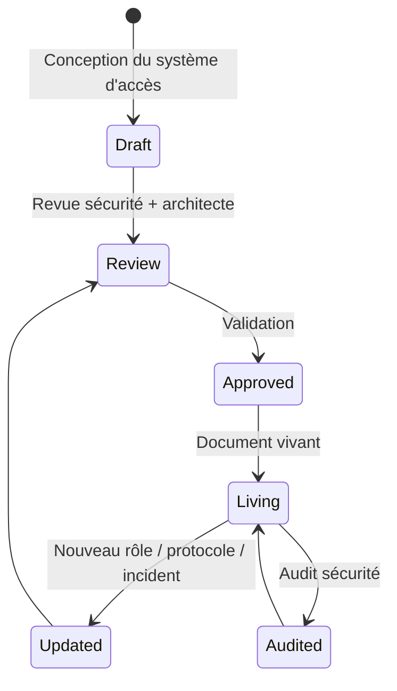
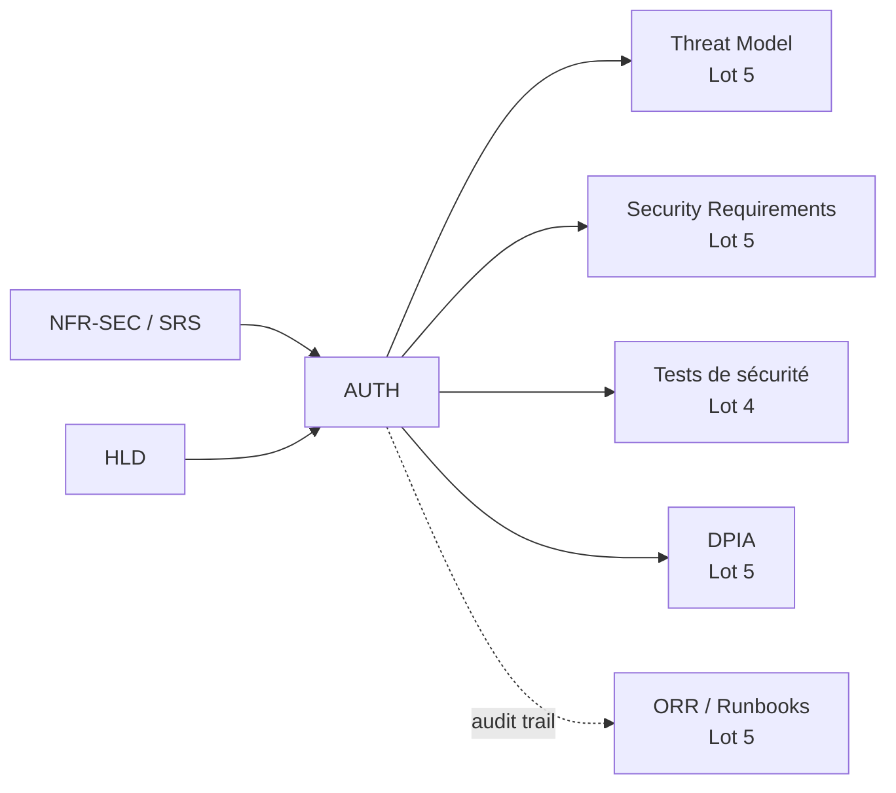
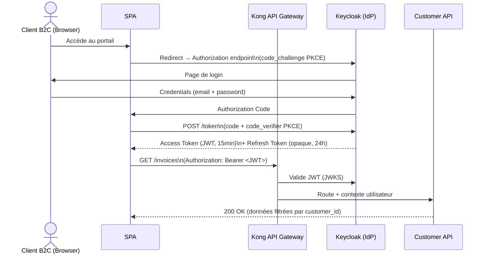

# AUTH — Authentication & Authorization Document

> 📁 Phase : ③ Quality & Development · 🏷️ Acronyme : **AUTH** · 🔤 EN : _Authentication & Authorization Document_

---

## 1. Définition & objectif

Le **AUTH Document** (Authentication & Authorization Document) décrit **le modèle complet d'identité et de contrôle d'accès** d'un système : comment les utilisateurs et services s'authentifient, comment les permissions sont structurées, et quelles règles régissent l'accès aux ressources. Il répond à « **Qui peut faire quoi, comment est-ce prouvé, et comment est-ce contrôlé ?** »

| Concept                    | Définition                  | Question                            |
| -------------------------- | --------------------------- | ----------------------------------- |
| **Authentication** (AuthN) | Prouver qui on est          | _Es-tu bien qui tu prétends être ?_ |
| **Authorization** (AuthZ)  | Décider ce qu'on peut faire | _As-tu le droit de faire ça ?_      |
| **Accounting**             | Tracer ce qui a été fait    | _Qui a fait quoi, quand ?_          |

Ce document couvre les trois (AAA).

---

## 2. Usage & utilité

- **Concevoir** le modèle d'accès avant d'implémenter (évite les failles par design).
- **Revue de sécurité** : base pour le Threat Model et le pentest.
- **Onboarding** : les devs comprennent comment fonctionne l'authentification sur le projet.
- **Conformité** : RGPD, ISO 27001, PCI-DSS, HIPAA exigent un contrôle d'accès documenté.
- **Audit** : prouver que les accès sont maîtrisés.

---

## 3. Périmètre (in / out of scope)

**In scope**

- Mécanismes d'authentification (protocoles, fournisseurs d'identité).
- Modèle d'autorisation (RBAC, ABAC, ACL, Policy-based…).
- Gestion des sessions et des tokens.
- Flux d'authentification (diagrams de séquence).
- Gestion des comptes (création, désactivation, rotation des credentials).
- Journalisation des accès (_access logs_, audit trail).
- Exigences de sécurité spécifiques (MFA, SSO, PKCE…).

**Out of scope**

- Détail de l'implémentation d'un endpoint → **LLD / Design Doc**.
- Tests de sécurité → **Test Plan / Pentest**.
- Politique de sécurité globale → **Security Requirements / Threat Model** (Lot 5).

---

## 4. Cycle de vie du document



- **Naissance** : en phase de conception, avec le HLD.
- **Vie** : **document vivant** — mis à jour à chaque évolution du modèle d'accès, après chaque audit ou incident de sécurité.
- **Fin** : archivé à la décommission du système ; les accès révoqués sont tracés.

---

## 5. Métiers / rôles concernés (RACI)

| Activité              | Dev Backend | Architecte Sécurité | Tech Lead | RSSI / SecOps | DPO |
| --------------------- | :---------: | :-----------------: | :-------: | :-----------: | :-: |
| Rédaction             |    **R**    |          C          |     C     |       C       |  I  |
| Revue sécurité        |      C      |        **R**        |     C     |     **R**     |  C  |
| Validation conformité |      I      |          C          |     C     |     **A**     |  C  |
| Implémentation        |    **R**    |          C          |     C     |       I       |  I  |
| Audit périodique      |      I      |          C          |     I     |     **R**     |  C  |

---

## 6. Position & interactions avec les autres documents



| Document              | Relation                                                                                 |
| --------------------- | ---------------------------------------------------------------------------------------- |
| **NFR-SEC**           | Les exigences de sécurité définissent les contraintes que l'AUTH doc satisfait.          |
| **Threat Model**      | Le AUTH doc est l'entrée principale du threat model (qui peut quoi = surface d'attaque). |
| **DPIA**              | Les données d'accès/journaux impliquent des données personnelles.                        |
| **Tests de sécurité** | Les flux d'auth sont testés (OWASP Top 10, pentest).                                     |

---

## 7. Nommage & versionnement

- **Fichier** : `AUTH.md` ou `docs/security/authentication-authorization.md`.
- **Confidentiel** : accès restreint (équipe + auditeurs) — ne pas publier les détails de configuration.
- **Versionnement** : daté ; chaque évolution majeure du modèle = nouvelle version.

---

## 8. Template vierge

```markdown
# AUTH Document — <Système> (v1.0)

## 1. Vue d'ensemble du modèle d'accès

<Résumé : qui sont les acteurs, quels protocoles, quel IdP ?>

## 2. Acteurs & identités

| Acteur | Type | Identifiant | Mécanisme AuthN |
| ------ | ---- | ----------- | --------------- |

## 3. Mécanismes d'authentification

### 3.1 <Mécanisme 1 — ex. OAuth2/OIDC>

<Protocole, flux (PKCE / client_credentials…), IdP, durée des tokens>

## 4. Modèle d'autorisation

<RBAC / ABAC / Policy-based — description du modèle>

### 4.1 Rôles & permissions

| Rôle | Description | Ressources accessibles | Opérations |
| ---- | ----------- | ---------------------- | ---------- |

### 4.2 Règles d'escalade / exception

## 5. Gestion des sessions & tokens

| Type | Format | Durée | Stockage | Révocation |
| ---- | ------ | ----- | -------- | ---------- |

## 6. Flux d'authentification (diagrammes)

## 7. Gestion des comptes

<Provisioning, déprovisionnement, MFA, rotation de credentials>

## 8. Journalisation & audit trail

<Ce qui est loggé, format, rétention, qui y accède>

## 9. Exigences de sécurité spécifiques

<MFA obligatoire pour ? PKI / certificats ? Rotation des secrets ?>
```

---

## 9. Exemple rempli (Portail Client)

```markdown
# AUTH Document — Portail Client Self-Service (v1.1)

## 2. Acteurs & identités

| Acteur          | Type    | Identifiant           | Mécanisme                       |
| --------------- | ------- | --------------------- | ------------------------------- |
| Client B2C      | Humain  | E-mail + password     | OAuth2/OIDC (PKCE) via Keycloak |
| Administrateur  | Humain  | SSO entreprise (SAML) | Keycloak + LDAP d'entreprise    |
| Customer API    | Service | Client credentials    | OAuth2 client_credentials       |
| Billing Service | Service | mTLS + JWT            | mTLS interne + service token    |

## 3. Mécanismes d'authentification

### 3.1 Clients B2C — OAuth2 Authorization Code + PKCE

- **IdP** : Keycloak 22 (auto-hébergé, HA)
- **Flux** : Authorization Code + PKCE (RFC 7636) — pas de secret côté navigateur
- **Tokens** : Access Token JWT (15 min) + Refresh Token opaque (24h)
- **MFA** : optionnel v1, obligatoire pour les comptes avec > 10 commandes (v2 roadmap)
- **Validation** : Kong Gateway valide le JWT (RS256, JWKS endpoint Keycloak)

### 3.2 Services internes — client_credentials

- Client ID + Client Secret stockés dans Vault (HashiCorp)
- Rotation automatique tous les 90 jours via Vault dynamic secrets
- mTLS activé sur le réseau interne (customer-api ↔ billing-service)

## 4. Modèle d'autorisation — RBAC

| Rôle           | Description            | Ressources                                    |
| -------------- | ---------------------- | --------------------------------------------- |
| `customer`     | Client B2C authentifié | Ses propres commandes, factures, réclamations |
| `admin:claims` | Agent service client   | Toutes les réclamations (export CSV)          |
| `admin:full`   | Administrateur système | Tout (gestion des comptes, logs)              |

**Règle** : les ressources d'un customer sont isolées par `customer_id` (row-level security).
Aucun customer ne peut accéder aux données d'un autre.

## 5. Sessions & tokens

| Type          | Format    | Durée  | Stockage        | Révocation            |
| ------------- | --------- | ------ | --------------- | --------------------- |
| Access Token  | JWT RS256 | 15 min | Mémoire SPA     | Expiration            |
| Refresh Token | Opaque    | 24h    | HttpOnly cookie | `/revoke` endpoint    |
| Service Token | JWT RS256 | 1h     | Env var / Vault | Expiration + rotation |

## 8. Journalisation

- **Loggé** : toute authentification (succès/échec), changement de mot de passe, accès admin.
- **Format** : JSON structuré (pino), corrélation par `traceId`.
- **Rétention** : 90 jours chaud (ELK), 1 an froid (S3).
- **Accès** : RSSI + Tech Lead uniquement.
```

---

## 10. Checklist de revue (OWASP)

- [ ] **A01 — Broken Access Control** : le modèle RBAC/ABAC est défini et vérifié.
- [ ] **A02 — Cryptographic Failures** : tokens JWT signés (RS256), TLS 1.2+ partout, secrets dans Vault.
- [ ] **A07 — Auth Failures** : protection brute force, lockout, MFA documentés.
- [ ] Les **secrets** (client_secret, API keys) ne sont jamais en dur dans le code.
- [ ] La **révocation** de tokens est possible.
- [ ] Les **sessions** expirent et peuvent être invalidées.
- [ ] Les **accès sont journalisés** (qui, quoi, quand) avec rétention définie.
- [ ] Le **principe de moindre privilège** est appliqué (rôles granulaires).
- [ ] Le **provisioning/déprovisionnement** des comptes est défini.

---

## 11. Anti-patterns & pièges

| Anti-pattern                                            | Problème                     | Risque OWASP | Correctif                          |
| ------------------------------------------------------- | ---------------------------- | :----------: | ---------------------------------- |
| 🔑 **Secrets en dur dans le code**                      | Compromission si repo public |     A02      | Vault / env vars / GitHub Secrets  |
| ⏰ **Tokens sans expiration**                           | Si volé, accès permanent     |     A07      | Access token ≤ 15 min              |
| 🔓 **Autorisation côté frontend** uniquement            | Contournable                 |     A01      | Vérifier **toujours** côté serveur |
| 🔗 **CORS trop permissif** (`*`)                        | CSRF, requêtes cross-origin  |     A01      | Whitelist explicite                |
| 🎭 **Rôles trop larges** (admin ou rien)                | Moindre privilège violé      |     A01      | Granularité des rôles              |
| 📢 **Messages d'erreur détaillés** (« user not found ») | Enumération des comptes      |     A07      | Message générique                  |
| 🚪 **Pas de déprovisionnement**                         | Ex-employé accède encore     |     A01      | Processus offboarding automatisé   |

---

## 12. Variantes par industrie / contexte

| Contexte               | Spécificités                                                                                  |
| ---------------------- | --------------------------------------------------------------------------------------------- |
| **SaaS multi-tenant**  | Isolation tenant (row-level security, subdomain routing), ABAC par tenant.                    |
| **B2B / Enterprise**   | SAML/SSO avec les IdP des clients, SCIM pour le provisioning.                                 |
| **Systèmes critiques** | Authentification forte (PKI/certificats), audit trail certifié, revue formelle.               |
| **Finance / PCI-DSS**  | MFA obligatoire, rotation des credentials, logs 12 mois, accès aux données CB très restreint. |
| **Médical / HIPAA**    | Contrôle d'accès aux données de santé, audit trail, chiffrement at rest.                      |
| **Zero Trust**         | Authentification et autorisation à chaque requête (pas de confiance implicite sur le réseau). |

---

## 13. Standards & normes

- **OAuth 2.0** (RFC 6749) + **PKCE** (RFC 7636) — autorisation déléguée.
- **OpenID Connect 1.0** (OIDC) — authentification sur OAuth2.
- **JWT** (RFC 7519), **JWS** (RFC 7515) — tokens signés.
- **OWASP Top 10** — A01 (Broken Access Control), A02 (Cryptographic Failures), A07 (Identification Failures).
- **OWASP ASVS** (Application Security Verification Standard) — référentiel de tests d'authentification.
- **ISO/IEC 27001 A.9** — contrôle d'accès.
- **RGPD art. 32** — sécurité du traitement (chiffrement, intégrité, disponibilité).

---

## 14. Outillage recommandé

| Besoin                 | Outils                                                                      |
| ---------------------- | --------------------------------------------------------------------------- |
| IdP / SSO              | Keycloak (open source), Auth0, Okta, Microsoft Entra ID, AWS Cognito        |
| Gestion des secrets    | HashiCorp Vault, AWS Secrets Manager, Azure Key Vault, Doppler              |
| Tokens                 | JWT.io (debug), nimbus-jose-jwt (Java), jsonwebtoken (Node), PyJWT (Python) |
| Tests de sécurité auth | OWASP ZAP, Burp Suite, nuclei, Postman (flows auth)                         |
| Zero Trust             | SPIFFE/SPIRE, Istio mTLS                                                    |

---

## 15. Diagramme — Flux OAuth2/PKCE (client B2C)



---

> 🔎 **En une phrase** : le AUTH Document est la **carte des accès du système** — il documente qui peut faire quoi, comment c'est prouvé, et comment c'est contrôlé, avant que la première ligne de code de sécurité soit écrite.

⬅️ [Design Document](./04-design-document.md) · ➡️ Suivant : [SBOM](./06-sbom-software-bill-of-materials.md)
