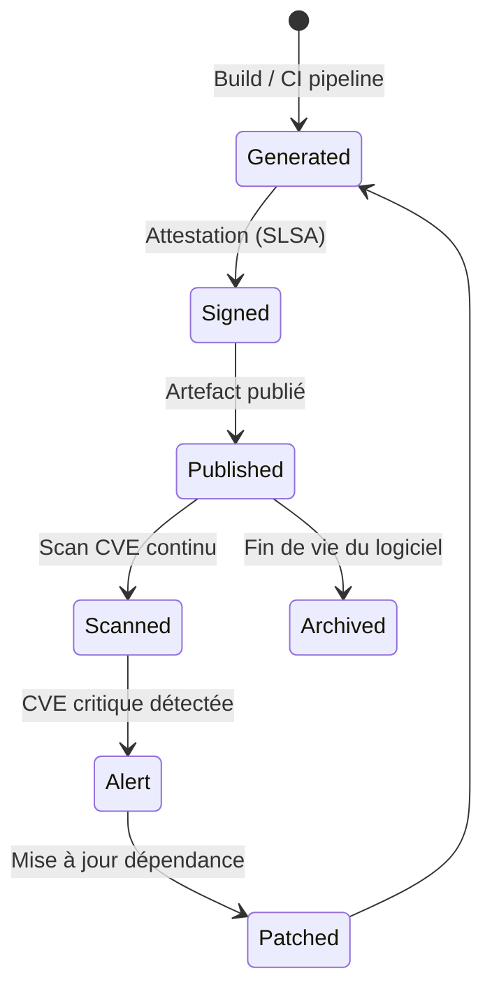

# SBOM — Software Bill of Materials

> 📁 Phase : ③ Quality & Development · 🏷️ Acronyme : **SBOM** · 🔤 EN : _Software Bill of Materials_

---

## 1. Définition & objectif

Le **SBOM** (Software Bill of Materials — _liste des composants logiciels_) est un **inventaire formel et exhaustif de tous les composants tiers** (bibliothèques, frameworks, dépendances transitives) intégrés dans un logiciel, avec leurs versions, licences et métadonnées. Il répond à « **De quoi exactement est composé notre logiciel, qui en est l'auteur, et sommes-nous exposés à une vulnérabilité connue ?** »

Comparaison avec l'industrie manufacturière : la BOM (_Bill of Materials_) liste tous les composants d'une voiture. Le SBOM fait pareil pour le logiciel.

| Ce qu'il EST                        | Ce qu'il N'EST PAS               |
| ----------------------------------- | -------------------------------- |
| L'inventaire des dépendances tiers  | Une liste de licences uniquement |
| Un outil de sécurité (CVE tracking) | Le code source du logiciel       |
| Un artefact de conformité           | Une liste de tâches              |

> **Post-Log4Shell (CVE-2021-44228)** : des milliers d'équipes ont mis des semaines à identifier si elles utilisaient Log4j. Avec un SBOM, c'est une requête de quelques secondes. Le SBOM est devenu incontournable depuis cet incident.

---

## 2. Usage & utilité

- **Sécurité** : identifier en secondes si une CVE publiée affecte le logiciel.
- **Conformité des licences** : détecter les licences incompatibles (GPL dans un produit propriétaire).
- **Chaîne d'approvisionnement** (_supply chain security_) : vérifier l'intégrité des dépendances.
- **Contractuel / réglementaire** : exigé par l'EU Cyber Resilience Act (CRA), les contrats gouvernementaux US (Executive Order 14028), et de nombreux donneurs d'ordre.
- **Audit** : preuve de la maîtrise du logiciel.

---

## 3. Périmètre (in / out of scope)

**In scope**

- Toutes les dépendances directes et transitives.
- Métadonnées : nom, version, hash, auteur/fournisseur, licence, PURL.
- Composants intégrés (binaires, containers, firmware si applicable).
- Vulnérabilités connues (CVE) associées aux composants.

**Out of scope**

- Code propriétaire interne.
- Infrastructure et OS (→ Infrastructure BOM, différent).
- Détail d'implémentation des dépendances.

---

## 4. Cycle de vie du document



- **Naissance** : **généré automatiquement** à chaque build (pas rédigé à la main).
- **Vie** : **artefact vivant** regénéré à chaque release ; scanné en continu pour les CVE.
- **Fin** : archivé avec chaque version livrée (traçabilité historique).

---

## 5. Métiers / rôles concernés (RACI)

| Activité                               | Dev / DevSecOps | Architecte Sécurité | RSSI  | PMO / Legal |
| -------------------------------------- | :-------------: | :-----------------: | :---: | :---------: |
| Génération (automatisée)               |      **R**      |          I          |   I   |      I      |
| Configuration du pipeline              |      **R**      |          C          |   I   |      I      |
| Revue des vulnérabilités               |      **R**      |        **R**        |   C   |      I      |
| Revue des licences                     |        C        |          C          |   I   |    **R**    |
| Transmission aux clients / régulateurs |        I        |          C          | **A** |    **R**    |

**R**esponsible · **A**ccountable · **C**onsulted · **I**nformed.

---

## 6. Position & interactions avec les autres documents

```mermaid
flowchart LR
    CODE[Dépôt + Lockfiles] --> SBOM[SBOM généré]
    SBOM --> SCAN[Scan CVE\nSnyk / OSV / Grype]
    SBOM --> LIC[Analyse licences\nFOSSA / REUSE]
    SBOM --> TM[Threat Model\n(composants à risque)]
    SBOM --> AUTH[AUTH Doc\n(libs d'auth utilisées)]
    SBOM --> DPIA[DPIA\n(libs traitant des PII)]
    SCAN --> TDR[TDR\n(CVE acceptées)]
    SCAN --> ALERT[Alerte + ticket]
```

| Document         | Relation                                                          |
| ---------------- | ----------------------------------------------------------------- |
| **Threat Model** | Le SBOM identifie les composants tiers dans la surface d'attaque. |
| **DPIA**         | Certaines bibliothèques traitent des données personnelles → DPIA. |
| **TDR**          | Une CVE acceptée temporairement → dette documentée.               |
| **AUTH**         | Les bibliothèques d'auth (JWT, OAuth2) sont dans le SBOM.         |

---

## 7. Nommage & versionnement

- **Format** : **SPDX 2.3+** (ISO/IEC 5962:2021, standard ouvert) ou **CycloneDX 1.5+** (XML/JSON, orienté sécurité) — les deux sont reconnus.
- **Fichier** : `sbom.spdx.json` / `sbom.cdx.json` — généré dans le pipeline.
- **Un SBOM par artefact livrable** (par image Docker, par binaire, par package).
- **Signé numériquement** avec Sigstore/Cosign (attestation d'intégrité).
- **Archivé** avec chaque release (reproductibilité).

---

## 8. Template vierge (SPDX JSON simplifié)

```json
{
  "SPDXID": "SPDXRef-DOCUMENT",
  "spdxVersion": "SPDX-2.3",
  "dataLicense": "CC0-1.0",
  "name": "<nom-du-logiciel>",
  "documentNamespace": "https://example.com/sbom/<nom>-<version>",
  "documentDescribes": ["SPDXRef-Package-<nom>"],
  "packages": [
    {
      "SPDXID": "SPDXRef-Package-express",
      "name": "express",
      "version": "4.18.2",
      "supplier": "Organization: OpenJS Foundation",
      "licenseConcluded": "MIT",
      "downloadLocation": "https://registry.npmjs.org/express/-/express-4.18.2.tgz",
      "filesAnalyzed": false,
      "externalRefs": [
        {
          "referenceCategory": "PACKAGE-MANAGER",
          "referenceType": "purl",
          "referenceLocator": "pkg:npm/express@4.18.2"
        }
      ]
    }
  ]
}
```

> En pratique, le SBOM n'est pas rédigé manuellement — il est **généré** par des outils (syft, cdxgen, trivy…).

---

## 9. Exemple rempli (extrait CycloneDX — Customer API)

```json
{
  "bomFormat": "CycloneDX",
  "specVersion": "1.5",
  "version": 1,
  "serialNumber": "urn:uuid:a1b2c3d4-...",
  "metadata": {
    "timestamp": "2026-04-15T10:00:00Z",
    "component": {
      "name": "customer-api",
      "version": "2.1.0",
      "type": "application"
    }
  },
  "components": [
    {
      "name": "express",
      "version": "4.18.2",
      "type": "library",
      "purl": "pkg:npm/express@4.18.2",
      "licenses": [{ "license": { "id": "MIT" } }]
    },
    {
      "name": "jsonwebtoken",
      "version": "9.0.2",
      "type": "library",
      "purl": "pkg:npm/jsonwebtoken@9.0.2",
      "licenses": [{ "license": { "id": "MIT" } }]
    },
    {
      "name": "axios",
      "version": "1.6.5",
      "type": "library",
      "purl": "pkg:npm/axios@1.6.5",
      "licenses": [{ "license": { "id": "MIT" } }]
    }
  ],
  "vulnerabilities": [
    {
      "id": "CVE-2023-45857",
      "affects": [{ "ref": "pkg:npm/axios@1.6.5" }],
      "ratings": [{ "severity": "medium" }],
      "description": "CSRF via cookie theft..."
    }
  ]
}
```

---

## 10. Checklist de revue

- [ ] Le SBOM est **généré automatiquement** dans le CI/CD (pas manuel).
- [ ] Il couvre les **dépendances transitives**, pas seulement directes.
- [ ] Il est en format standardisé : **SPDX** ou **CycloneDX**.
- [ ] Les **licences** de chaque composant sont renseignées.
- [ ] Le SBOM est **signé** (Cosign/Sigstore) pour l'intégrité.
- [ ] Un **scan CVE continu** est en place (Snyk, Grype, OSV).
- [ ] Une **politique de vulnérabilité** (seuil critique → blocage build) est définie.
- [ ] Le SBOM est archivé avec chaque **release**.
- [ ] Les CVE acceptées temporairement sont dans le **TDR**.

---

## 11. Anti-patterns & pièges

| Anti-pattern                          | Problème                             | Correctif                         |
| ------------------------------------- | ------------------------------------ | --------------------------------- |
| ✍️ **SBOM rédigé à la main**          | Incomplet, périme immédiatement      | Générer via l'outillage           |
| 🕳️ **Pas de dépendances transitives** | Les CVE les plus dangereuses y sont  | Outils qui analysent le lock file |
| 🧊 **SBOM généré une seule fois**     | Dépendances changent                 | Régénérer à chaque build/release  |
| 🔕 **Aucune politique** sur les CVE   | On découvre les failles en prod      | Seuil critique = build cassé      |
| 📦 **Un seul SBOM pour tout le repo** | Granularité insuffisante             | Un SBOM par artefact livrable     |
| ⚖️ **Licences ignorées**              | GPL dans du propriétaire = violation | Scan de licences (FOSSA, REUSE)   |

---

## 12. Variantes par industrie / contexte

| Contexte                            | Spécificités                                                             |
| ----------------------------------- | ------------------------------------------------------------------------ |
| **EU Cyber Resilience Act** (2024+) | SBOM obligatoire pour les produits numériques vendus dans l'UE.          |
| **US Executive Order 14028**        | SBOM requis pour les logiciels fournis au gouvernement américain.        |
| **Conteneurs Docker**               | SBOM de l'image (Syft + Grype) : OS packages + dépendances applicatives. |
| **Embarqué / firmware**             | SBOM des bibliothèques C/C++, du kernel, des drivers.                    |
| **Médical (IEC 62304)**             | Liste des COTS (_Commercial Off-The-Shelf_) formellement documentée.     |

---

## 13. Standards & normes

- **ISO/IEC 5962:2021** — SPDX (_Software Package Data Exchange_) : format SBOM standardisé.
- **CycloneDX** (OWASP) — format SBOM orienté sécurité, très adopté.
- **NTIA Minimum Elements for a SBOM** (2021) — éléments minimaux requis.
- **OpenSSF SLSA** (_Supply chain Levels for Software Artifacts_) — framework d'intégrité de la chaîne d'approvisionnement.
- **Sigstore / Cosign** — signature cryptographique des artefacts.

---

## 14. Outillage recommandé

| Besoin                 | Outils                                                                    |
| ---------------------- | ------------------------------------------------------------------------- |
| Génération SBOM        | Syft (Anchore), cdxgen, trivy (`--format cyclonedx`), Microsoft SBOM Tool |
| Scan CVE               | Grype, Trivy, Snyk, OWASP Dependency-Check, OSV Scanner (Google)          |
| Licences               | FOSSA, REUSE (FSFE), licensee, ClearlyDefined                             |
| Signature              | Cosign (Sigstore), in-toto                                                |
| Intégration CI         | GitHub Actions (`anchore/sbom-action`), GitLab CI                         |
| Plateforme centralisée | DependencyTrack (OWASP), Lineaje, Rezilion                                |

---

## 15. Diagramme — SBOM dans le pipeline CI/CD

```mermaid
flowchart LR
    subgraph CI["Pipeline CI/CD"]
        BUILD[Build\n(npm build / docker build)] --> SBOM_GEN[Génération SBOM\nSyft / cdxgen]
        SBOM_GEN --> SIGN[Signature Cosign]
        SIGN --> SCAN_CVE[Scan CVE\nGrype / Snyk]
        SCAN_CVE -->|CVE critique| FAIL[❌ Build échoue\n+ ticket Jira auto]
        SCAN_CVE -->|OK| SCAN_LIC[Scan licences\nFOSSA]
        SCAN_LIC -->|Licence incompatible| FAIL
        SCAN_LIC -->|OK| PUBLISH[📦 Artefact + SBOM\npublié + archivé]
    end
    PUBLISH --> CONT_SCAN[Scan continu\n(nouvelles CVE)]
    CONT_SCAN -->|Nouvelle CVE| ALERT[Alerte → TDR / ticket]
```

---

> 🔎 **En une phrase** : le SBOM est le **manifeste de tous les composants tiers** de votre logiciel — généré automatiquement, il permet de répondre en secondes à « sommes-nous touchés par cette CVE ? » au lieu de semaines.

⬅️ [AUTH Document](./05-auth-authentication-authorization.md) · ➡️ Suivant : [Developer Guide](./07-developer-guide-onboarding.md)
