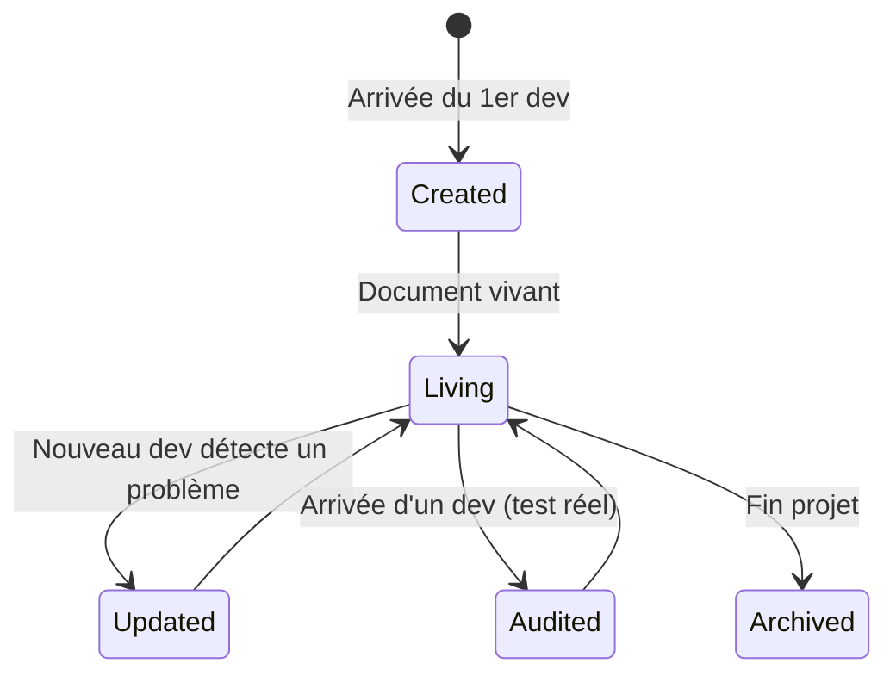

# Developer Guide / Onboarding Guide

> 📁 Phase : ③ Quality & Development · 🏷️ Acronyme : **Dev Guide** · 🔤 EN : _Developer Guide / Onboarding Guide_

---

## 1. Définition & objectif

Le **Developer Guide** (ou _Onboarding Guide_) est le document qui permet à **un développeur de rejoindre le projet, de comprendre son environnement et de contribuer efficacement en un minimum de temps**. Il répond à « **Comment mettre en place l'environnement, comprendre le projet et contribuer dès le premier jour ?** »

C'est souvent le document le plus consulté de toute la base de connaissances — et le plus souvent absent ou obsolète.

| Ce qu'il EST                              | Ce qu'il N'EST PAS                           |
| ----------------------------------------- | -------------------------------------------- |
| La porte d'entrée du développeur          | L'architecture globale (→ SAD)               |
| Un guide pratique step-by-step            | Un document de référence technique exhaustif |
| Orienté "actions" (setup, premier commit) | Un manuel utilisateur final                  |

---

## 2. Usage & utilité

- **Réduire le temps avant le premier commit** : objectif mesurable (cible : < 1 journée).
- **Standardiser l'environnement** : tous les devs travaillent avec le même setup.
- **Autonomie** : le nouveau dev ne doit pas déranger l'équipe pour chaque configuration.
- **Rétention** : un bon onboarding améliore l'expérience développeur (DX) et la fidélisation.
- **Source de vérité** : évite les "tradition orale" sur les commandes magiques.

---

## 3. Périmètre (in / out of scope)

**In scope**

- Prérequis (OS, outils, comptes à créer).
- Setup de l'environnement de développement local.
- Architecture de haut niveau et liens vers les docs de référence.
- Workflow Git (branching, commits, PR).
- Comment lancer les tests en local.
- Accès aux environnements (dev, staging).
- Contacts et canaux de communication.
- Checklist d'onboarding.

**Out of scope**

- Architecture détaillée → **SAD / HLD**.
- Règles de codage détaillées → **Coding Standards**.
- Processus de release → **Release Notes / CI-CD**.
- Runbooks d'exploitation → **Lot 5**.

---

## 4. Cycle de vie du document



- **Naissance** : idéalement au démarrage du projet, au plus tard lors du premier onboarding.
- **Vie** : **document vivant par excellence** — chaque nouveau dev qui suit le guide et trouve un problème le corrige (PR). C'est la meilleure façon de le maintenir.
- **Fin** : archivé avec le projet.

---

## 5. Métiers / rôles concernés (RACI)

| Activité                          | Tech Lead | Dev Senior | Nouveau dev | DevOps |
| --------------------------------- | :-------: | :--------: | :---------: | :----: |
| Rédaction initiale                |   **R**   |     C      |      I      |   C    |
| Maintenance                       |     C     |   **R**    |    **R**    |   C    |
| Test (suivre le guide)            |     I     |     I      |    **R**    |   I    |
| Validation accès / environnements |     C     |     I      |      I      | **R**  |

**R**esponsible · **A**ccountable · **C**onsulted · **I**nformed.

> Le meilleur testeur d'un onboarding guide est **le prochain dev qui arrive** — leur feedback est de l'or.

---

## 6. Position & interactions avec les autres documents

```mermaid
flowchart LR
    DG[Developer Guide] --> CS[Coding Standards]
    DG --> DOD[Definition of Done]
    DG --> SAD[SAD\n(lien vers archi)]
    DG --> GL[Glossaire]
    DG --> AUTH[AUTH\n(accès environnements)]
    DG --> SBOM[SBOM\n(outils de sécurité à installer)]
    DG -.premier pas vers.-> ALL[Tous les docs du projet]
```

Le Developer Guide est le **point d'entrée** qui référence et oriente vers tous les autres documents.

---

## 7. Nommage & versionnement

- **Fichier** : `README.md` (racine du repo, section onboarding) ou `CONTRIBUTING.md` + `docs/onboarding.md`.
- **Règle clé** : le fichier `README.md` à la racine du repo doit **toujours** pointer vers le Developer Guide.
- **Versionné** avec le code — les commandes obsolètes sont visibles dans Git.
- **Test continu** : intégrer un `make setup` ou script d'onboarding testé en CI sur un environnement fresh.

---

## 8. Template vierge

```markdown
# Developer Guide — <Projet>

## 🚀 Démarrage rapide (Quick Start)

<Les 5 commandes pour avoir l'environnement qui tourne>

## 📋 Prérequis

| Outil   | Version minimale | Installation            |
| ------- | ---------------- | ----------------------- |
| Node.js | 20 LTS           | https://nodejs.org      |
| Docker  | 24+              | https://docs.docker.com |
| ...     |                  |                         |

### Comptes & accès nécessaires

- [ ] GitHub : accès au repo (`@<handle>` à envoyer à <contact>)
- [ ] AWS : accès staging (demander à <DevOps>)
- [ ] ...

## ⚙️ Setup local

### 1. Cloner le repo

### 2. Variables d'environnement

### 3. Lancer les services (Docker)

### 4. Lancer l'application

### 5. Vérification (smoke test)

## 🏗️ Architecture (vue rapide)

<3 lignes + lien vers SAD/README de l'archi>

## 🔄 Workflow Git

<Branching strategy, nommage des branches, Conventional Commits>

## 🧪 Lancer les tests

<Commandes : unit / integration / e2e>

## 📦 Structure du projet

<Arborescence commentée des dossiers principaux>

## 🌍 Environnements

| Env | URL | Accès | Usage |
| --- | --- | ----- | ----- |

## 📚 Documentation de référence

<Liens vers SAD, ADR, Coding Standards, Glossaire, etc.>

## 🤝 Contacts & canaux

| Sujet | Contact / Canal |
| ----- | --------------- |

## ✅ Checklist onboarding

- [ ] Repo cloné et environnement qui tourne
- [ ] Premier test passé
- [ ] Accès aux environnements
- [ ] Lu les Coding Standards
- [ ] Lu la Definition of Done
- [ ] Rencontré le Tech Lead
```

---

## 9. Exemple rempli (Portail Client)

````markdown
# Developer Guide — Portail Client Self-Service

## 🚀 Quick Start

```bash
git clone git@github.com:example/customer-portal.git
cd customer-portal
cp .env.example .env          # puis éditer les valeurs
docker compose up -d          # Postgres, Redis, RabbitMQ, Keycloak
npm install
npm run dev                   # SPA + API en parallèle
open http://localhost:3000    # portail
```
````

Temps estimé : **15 minutes** (hors téléchargement Docker).

## 📋 Prérequis

| Outil            | Version     | Notes                                                  |
| ---------------- | ----------- | ------------------------------------------------------ |
| Node.js          | 20 LTS      | `nvm use 20` recommandé                                |
| Docker + Compose | 24+ / 2.20+ |                                                        |
| Git              | 2.40+       |                                                        |
| VS Code          | Dernière    | Extensions recommandées dans `.vscode/extensions.json` |

### Comptes nécessaires

- [ ] GitHub : accès au repo (demander à @tech-lead dans #onboarding Slack)
- [ ] AWS SSO : pour accès staging (formulaire intranet → DevOps)
- [ ] Keycloak local : admin/admin (créé automatiquement par Docker Compose)

## 🏗️ Architecture rapide

5 services : **SPA React** → **API Gateway (Kong)** → **Customer API (Node.js)** → {**Billing Service**, **Notification Service**} + **PostgreSQL** + **Redis** + **RabbitMQ**.
→ Vue complète : [SAD](./docs/architecture/03-sad.md) · [C4](./docs/architecture/04-c4-model.md)

## 🔄 Workflow Git

- Branches : `feat/<ticket>-description`, `fix/<ticket>-description`
- Commits : [Conventional Commits](https://conventionalcommits.org)
  ex: `feat(billing): add PDF async generation PORTAL-189`
- PR : ≥ 2 approbateurs, CI vert obligatoire, squash merge

## 🧪 Tests

```bash
npm test                    # tests unitaires (Jest)
npm run test:integration    # tests d'intégration (Docker requis)
npm run test:e2e            # tests E2E Playwright (staging ou local)
npm run test:coverage       # rapport de couverture (seuil : 80%)
```

## 📦 Structure principale

```
customer-portal/
├── apps/
│   ├── web/          # SPA React (Vite)
│   └── api/          # Customer API (Node.js/Express)
├── services/
│   ├── billing/      # Billing Service
│   └── notification/ # Notification Service
├── docs/             # Documentation (SAD, ADR, etc.)
├── infra/            # IaC (Terraform, Docker Compose)
└── .github/          # CI/CD workflows
```

## ✅ Checklist onboarding

- [ ] Quick start réussi (SPA accessible sur :3000)
- [ ] `npm test` passe à 100%
- [ ] Accès staging configuré
- [ ] [Coding Standards](./docs/quality/01-coding-standards.md) lus
- [ ] [Definition of Done](./docs/quality/02-definition-of-done.md) lue
- [ ] Réunion de présentation avec Tech Lead planifiée
- [ ] Première PR (même triviale) soumise dans la semaine

````

---

## 10. Checklist de revue

- [ ] Le **Quick Start** fonctionne sur un environnement vierge (testé !).
- [ ] Toutes les **dépendances et versions** sont listées.
- [ ] Les **variables d'environnement** sont documentées (`.env.example` à jour).
- [ ] Le **workflow Git** est décrit (branching, commits, PR).
- [ ] Les commandes de **test** sont fournies.
- [ ] Les **accès** aux environnements sont expliqués.
- [ ] Des **contacts et canaux** sont indiqués.
- [ ] La **checklist onboarding** est présente.
- [ ] Le document a été **suivi par un nouveau dev** récemment (date du dernier test).

---

## 11. Anti-patterns & pièges

| Anti-pattern | Problème | Correctif |
|--------------|----------|-----------|
| 🕳️ **README vide** (« voir la doc ») | L'entrée du projet est inexistante | Quick Start dans le README racine |
| 📚 **Guide fleuve** avec tout l'historique | Décourageant ; illisible | Concis + liens vers les détails |
| 🧊 **Guide jamais testé** | Étapes obsolètes, env cassé | Chaque nouveau dev teste ET corrige |
| 🔐 **Secrets dans le guide** | Risque de sécurité | `.env.example` + lien vers Vault |
| 🏃 **Guide que pour les experts** | Barrière à l'entrée trop haute | Du plus simple au plus complexe |
| 🗄️ **Dans Confluence uniquement** | Déconnecté du code | Dans le repo + lien depuis Confluence |

---

## 12. Variantes par industrie / contexte

| Contexte | Spécificités |
|----------|--------------|
| **Open source** | `CONTRIBUTING.md` public + `README.md` orienté contributeurs. |
| **Mono-repo** | Section par service/application ; overview global. |
| **Multi-équipe** | Developer Platform (Backstage) : portail centralisé des guides. |
| **Systèmes embarqués** | Setup toolchain (compilateur, flasheur, émulateur), drivers hardware. |
| **Remote-first** | Accès aux environnements cloud, VPN, outils de collaboration async. |

---

## 13. Standards & normes

- **Diátaxis Framework** (Daniele Procida) — documentation orientée besoins : tutoriels (onboarding), how-to, reference, explanation. Le Developer Guide = *tutorial*.
- **OpenSSF Best Practices** — `CONTRIBUTING.md`, `README.md` comme signaux de qualité.
- **GitHub / GitLab community standards** — fichiers reconnus : `README`, `CONTRIBUTING`, `CODE_OF_CONDUCT`, `SECURITY`.

---

## 14. Outillage recommandé

| Besoin | Outils |
|--------|--------|
| Developer Portal centralisé | Backstage (Spotify), Port, Cortex |
| Documentation dans le repo | Markdown + MkDocs / Docusaurus / VitePress |
| Setup automatisé | `Makefile`, `scripts/setup.sh`, Dev Containers (`.devcontainer/`) |
| Environnement normalisé | Dev Containers (VS Code), Nix flakes, asdf, mise |
| Diagrammes | Mermaid (inline dans le MD) |

---

## 15. Diagramme — Expérience du nouveau dev (journey)

```mermaid
journey
    title Onboarding d'un nouveau développeur
    section Jour 1
      Lire le README: 5: Dev
      Cloner le repo: 5: Dev
      Setup environnement (Quick Start): 3: Dev
      Premier test qui passe: 5: Dev
    section Jour 2
      Lire Coding Standards + DoD: 4: Dev
      Comprendre l'architecture (SAD/C4): 3: Dev
      Réunion Tech Lead: 5: Dev, TL
    section Semaine 1
      Première PR (petite feature ou fix): 4: Dev, TL
      Code Review reçue: 4: Dev, TL
      Merge du premier commit: 5: Dev
````

---

> 🔎 **En une phrase** : le Developer Guide est **la première impression du projet** — il détermine si un nouveau dev est productif en une journée ou en deux semaines, et si la "tradition orale" survivra aux départs.

⬅️ [SBOM](./06-sbom-software-bill-of-materials.md) · ➡️ Suivant : [Release Notes / Changelog](./08-release-notes-changelog.md)
