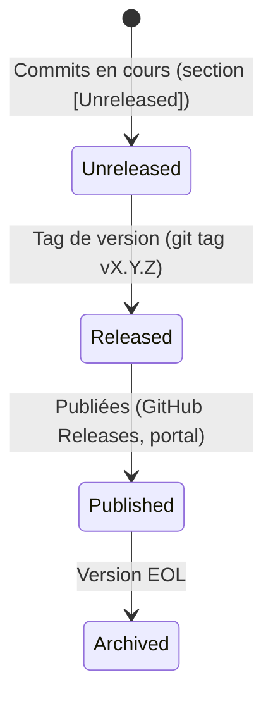

# Release Notes / Changelog

> 📁 Phase : ③ Quality & Development · 🏷️ Acronyme : **Release Notes / CHANGELOG** · 🔤 EN : _Release Notes / Changelog_

---

## 1. Définition & objectif

Les **Release Notes** et le **Changelog** documentent **les modifications apportées à chaque version d'un logiciel**. Bien que proches, ils ont des publics et des intentions légèrement distincts :

|          | **Changelog**               | **Release Notes**                              |
| -------- | --------------------------- | ---------------------------------------------- |
| Audience | Développeurs, équipes       | Utilisateurs, clients, ops                     |
| Ton      | Technique, exhaustif        | Accessible, orienté valeur                     |
| Format   | `CHANGELOG.md` dans le repo | Document release / email / portail             |
| Contenu  | Toutes les modifications    | Nouveautés, corrections importantes, migration |

En pratique, les deux peuvent être **fusionnés** (petit projet) ou **dérivés l'un de l'autre** (le changelog alimente les release notes).

Ils répondent à « **Qu'est-ce qui a changé dans cette version, et que dois-je savoir avant de mettre à jour ?** »

---

## 2. Usage & utilité

- **Transparence** vers les utilisateurs et les clients (confiance).
- **Migration** : informer sur les breaking changes, les étapes de mise à jour.
- **Support** : l'équipe support sait ce qui a changé avant les clients.
- **Audit** : traçabilité des modifications dans le temps.
- **Legal / conformité** : preuve des correctifs de sécurité (CVE patchées).
- **SEO / marketing** : les release notes publiques montrent l'activité du produit.

---

## 3. Périmètre (in / out of scope)

**In scope (Changelog)**

- Toutes les modifications significatives par version (feat, fix, chore impactant, breaking change, security).
- Lien vers les tickets/PRs concernés.
- Date et numéro de version (SEMVER).

**In scope (Release Notes)**

- Nouvelles fonctionnalités (avec valeur métier).
- Corrections de bugs notables.
- Breaking changes et guide de migration.
- Correctifs de sécurité.
- Dépendances mises à jour avec impact.

**Out of scope**

- Détails d'implémentation internes.
- Chaque commit (→ `git log`).
- Bugs non corrigés → bug tracker.

---

## 4. Cycle de vie du document



- **Naissance** : à chaque commit significatif (via Conventional Commits → génération auto).
- **Vie** : le `CHANGELOG.md` est une section `[Unreleased]` en haut, promue à chaque release.
- **Fin** : archivé ; les vieilles versions restent accessibles (référence historique).

> **Approche automatisée** : avec **Conventional Commits** + **semantic-release** ou **release-please**, le changelog est **généré automatiquement** depuis les messages de commit. C'est la meilleure pratique.

---

## 5. Métiers / rôles concernés (RACI)

| Activité                         | Dev (automated) | Tech Lead | Product Owner | Tech Writer | DevOps |
| -------------------------------- | :-------------: | :-------: | :-----------: | :---------: | :----: |
| Génération auto (changelog)      |   **R** (CI)    |     I     |       I       |      I      |   I    |
| Rédaction release notes (valeur) |        I        |     C     |     **R**     |    **R**    |   I    |
| Revue & publication              |        I        |     C     |     **A**     |      C      | **R**  |
| Diffusion (clients, email)       |        I        |     I     |     **R**     |      C      |   I    |

**R**esponsible · **A**ccountable · **C**onsulted · **I**nformed.

---

## 6. Position & interactions avec les autres documents

```mermaid
flowchart LR
    COMMITS[Commits\nConventional Commits] --> CL[CHANGELOG.md\nautogénéré]
    DOD[Definition of Done\n(feature = done)] --> CL
    CL --> RN[Release Notes\nrédigées]
    RN --> DEPLOY[Déploiement\nproduction]
    RN --> SBOM[SBOM archivé\npar version]
    RN --> RUNBOOK[Runbook mis à jour\nsi procédure change]
    RN -.CVE patchée.-> SEC[Security Advisory]
```

| Document               | Relation                                                                  |
| ---------------------- | ------------------------------------------------------------------------- |
| **Definition of Done** | Une story `Done` contribue au changelog de la release.                    |
| **SBOM**               | Archivé avec chaque release (référence aux dépendances de cette version). |
| **Runbook**            | Si la release change un comportement opérationnel → runbook mis à jour.   |

---

## 7. Nommage & versionnement

- **Changelog** : fichier `CHANGELOG.md` à la racine du repo — format [Keep a Changelog](https://keepachangelog.com).
- **Versionnement** : **SEMVER** (Semantic Versioning) obligatoire.
  - `MAJOR.MINOR.PATCH` : ex. `2.1.3`
  - **MAJOR** : breaking change.
  - **MINOR** : nouvelle fonctionnalité rétrocompatible.
  - **PATCH** : correction de bug rétrocompatible.
- **Pre-release** : `2.0.0-beta.1`, `2.0.0-rc.1`.
- **Git tags** : `v2.1.3` — source de vérité pour la version.

---

## 8. Template vierge (Keep a Changelog)

```markdown
# Changelog

Toutes les modifications notables sont documentées ici.
Format : [Keep a Changelog](https://keepachangelog.com/fr/)
Versionnement : [Semantic Versioning](https://semver.org/lang/fr/)

---

## [Unreleased]

### Added

### Changed

### Deprecated

### Removed

### Fixed

### Security

---

## [X.Y.Z] — AAAA-MM-JJ

### Added

- <Nouvelle fonctionnalité>

### Changed

- <Modification de comportement existant>

### Fixed

- <Correction de bug>

### Security

- <Correction de vulnérabilité CVE-XXXX-XXXXX>

[Unreleased]: https://github.com/example/repo/compare/vX.Y.Z...HEAD
[X.Y.Z]: https://github.com/example/repo/compare/vA.B.C...vX.Y.Z
```

---

## 9. Exemple rempli

```markdown
# Changelog — Portail Client Self-Service

## [Unreleased]

### Added

- Export CSV des réclamations pour les admins (PORTAL-189)

---

## [2.1.0] — 2026-04-20

### Added

- **Téléchargement PDF de factures en asynchrone** : la génération ne bloque plus le portail.
  Les clients reçoivent une notification e-mail quand le PDF est prêt. (PORTAL-145, RFC-012)
- Filtre par date sur la liste des factures. (PORTAL-158)

### Changed

- Amélioration des performances de la page "Mes commandes" : p95 passé de 820ms à 310ms
  grâce au cache Redis. (PORTAL-161, NFR-PERF-001 ✅)

### Fixed

- Correction d'un affichage incorrect des montants en devise USD. (PORTAL-177)
- Correction d'un bug d'encodage des noms avec accents dans les exports. (PORTAL-180)

### Security

- Mise à jour `axios` 1.6.5 → 1.7.2 (CVE-2024-39338, sévérité haute). (PORTAL-182)

---

## [2.0.0] — 2026-03-01

### ⚠️ Breaking Changes

- L'endpoint `/api/invoices` retourne maintenant un objet paginé `{items, pagination}`
  au lieu d'un tableau direct. **Migration requise pour les intégrations.**
  → Voir [Guide de migration v1→v2](./docs/migrations/v1-to-v2.md)

### Added

- Architecture microservices : Billing Service extrait du monolithe. (RFC-012, ADR-008)
- Authentification OAuth2/PKCE via Keycloak. (ADR-009)
```

---

## 10. Checklist de revue

- [ ] Chaque **breaking change** est identifié `⚠️` et accompagné d'un guide de migration.
- [ ] Les **correctifs de sécurité** incluent la référence CVE.
- [ ] Le **versionnement SEMVER** est respecté.
- [ ] La **date de release** est présente.
- [ ] Les entrées sont **orientées utilisateur** (pas jargon interne).
- [ ] Le format **Keep a Changelog** est respecté (Added/Changed/Fixed/Security…).
- [ ] Le fichier `CHANGELOG.md` est dans le **dépôt Git**.
- [ ] Un **lien de comparaison Git** est présent pour chaque version.

---

## 11. Anti-patterns & pièges

| Anti-pattern                               | Problème                              | Correctif                                     |
| ------------------------------------------ | ------------------------------------- | --------------------------------------------- |
| 📋 **Changelog = `git log`**               | Bruit illisible ; pas de valeur       | Résumés humains + Conventional Commits        |
| 🧊 **Jamais mis à jour**                   | Clients surpris par les changements   | Processus : release = changelog obligatoire   |
| 🌫️ **Langage technique** pour les users    | Incompréhensible                      | Release Notes en langage client               |
| 🔒 **Breaking changes sans avertissement** | Intégrations cassées chez les clients | `⚠️ BREAKING` systématique + délai de dépréc. |
| 🚮 **CVE patchées non documentées**        | Clients ne savent pas se protéger     | Section Security obligatoire                  |
| 🏃 **Release sans notes**                  | Surprise pour les ops                 | DoD : release notes dans la DoD release       |

---

## 12. Variantes par industrie / contexte

| Contexte                            | Spécificités                                                                          |
| ----------------------------------- | ------------------------------------------------------------------------------------- |
| **Open source**                     | `CHANGELOG.md` public, GitHub Releases avec notes formatées.                          |
| **SaaS**                            | Status page + email aux clients + in-app banner pour les breaking changes.            |
| **API publique**                    | `API Changelog` dédié avec politique de dépréciation (sunset headers).                |
| **Produit B2B**                     | Release notes envoyées aux CSM (Customer Success) avant les clients.                  |
| **Systèmes critiques**              | Release notes = document de qualification/certification : chaque modification tracée. |
| **Mobile (App Store / Play Store)** | Release notes limitées en longueur, orientées valeur utilisateur.                     |

---

## 13. Standards & normes

- **Keep a Changelog** ([keepachangelog.com](https://keepachangelog.com)) — format de référence.
- **Semantic Versioning 2.0.0** ([semver.org](https://semver.org)) — versionnement de référence.
- **Conventional Commits** ([conventionalcommits.org](https://conventionalcommits.org)) — messages de commit qui génèrent le changelog.
- **RFC 7469** / **RFC 9110** — headers `Sunset`, `Deprecation` pour les API.

---

## 14. Outillage recommandé

| Besoin           | Outils                                                                  |
| ---------------- | ----------------------------------------------------------------------- |
| Génération auto  | `semantic-release`, `release-please` (Google), `conventional-changelog` |
| Format & linting | `commitlint`, `commitizen`                                              |
| GitHub Releases  | GitHub Actions (`softprops/action-gh-release`)                          |
| Portail public   | Beamer, LaunchNotes, Headway, Noticeable                                |
| CHANGELOG.md     | git-cliff, `standard-version` (déprécié), auto-changelog                |

---

## 15. Diagramme — Pipeline de release automatisé

```mermaid
flowchart LR
    COMMIT[Commit\nConventional Commit] --> CI[CI Pipeline]
    CI -->|merge sur main| REL_PLEASE[release-please\nou semantic-release]
    REL_PLEASE --> SEMVER{Calcul SEMVER\n(feat→minor, fix→patch\nBREAKING→major)}
    SEMVER --> TAG[Tag git vX.Y.Z]
    SEMVER --> CL_UPDATE[CHANGELOG.md mis à jour]
    SEMVER --> GH_RELEASE[GitHub Release créée]
    TAG --> DEPLOY[Déploiement\nproduction]
    GH_RELEASE --> NOTIFY[Notification\n(Slack, email clients)]
    DEPLOY -.archivé avec.-> SBOM[SBOM vX.Y.Z]
```

---

> 🔎 **En une phrase** : le Changelog est la **mémoire publique du produit** — il traduit des centaines de commits en une narration compréhensible de ce qui a changé, pourquoi, et ce que les utilisateurs doivent savoir avant de mettre à jour.

⬅️ [Developer Guide](./07-developer-guide-onboarding.md) · 🏠 [Index du lot](./README.md)
