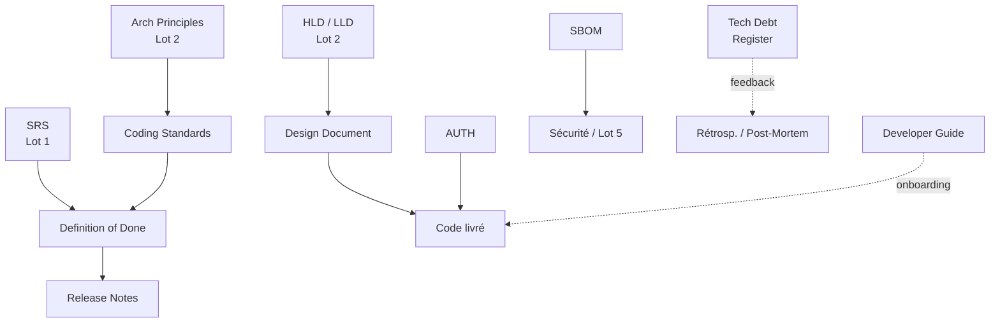

# ③ Quality & Development

> 📁 Lot 3 · 8 fiches · En cours 🔄

Ce dossier couvre les documents qui **structurent la qualité du code et du processus de développement** : les règles de codage, les critères de finition, la gestion de la dette, les designs de fonctionnalités, la sécurité applicative, la traçabilité des dépendances et l'expérience développeur. La question centrale : **« Comment garantit-on que ce qu'on livre est de bonne qualité, sûr et maintenable ?** »

---

## Carte du lot

---

## Index des fiches

| #   | Acronyme             | Nom complet                             | Question clé                                                 | Fiche                                          |
| --- | -------------------- | --------------------------------------- | ------------------------------------------------------------ | ---------------------------------------------- |
| 01  | **Coding Standards** | Normes de codage                        | _Quelles règles tous les devs doivent-ils respecter ?_       | [→](./01-coding-standards.md)                  |
| 02  | **DoD**              | Definition of Done                      | _Qu'est-ce que « c'est fini » veut dire ?_                   | [→](./02-definition-of-done.md)                |
| 03  | **TDR**              | Technical Debt Register                 | _Quelle dette technique avons-nous et comment la gérer ?_    | [→](./03-technical-debt-register.md)           |
| 04  | **Design Doc**       | Design Document                         | _Comment cette fonctionnalité est-elle conçue en détail ?_   | [→](./04-design-document.md)                   |
| 05  | **AUTH**             | Authentication & Authorization Document | _Comment le système gère-t-il l'identité et les accès ?_     | [→](./05-auth-authentication-authorization.md) |
| 06  | **SBOM**             | Software Bill of Materials              | _Quels composants tiers sont dans notre logiciel ?_          | [→](./06-sbom-software-bill-of-materials.md)   |
| 07  | **Dev Guide**        | Developer Guide / Onboarding Guide      | _Comment un nouveau dev monte en compétence sur le projet ?_ | [→](./07-developer-guide-onboarding.md)        |
| 08  | **Release Notes**    | Release Notes / Changelog               | _Qu'est-ce qui change dans cette version ?_                  | [→](./08-release-notes-changelog.md)           |

---

## Positionnement dans le cycle de vie

| Depuis (Lots 1–2)                          | Ce lot produit                          | Vers (Lots 4–5)                                  |
| ------------------------------------------ | --------------------------------------- | ------------------------------------------------ |
| Architecture Principles → Coding Standards | Standards applicables dès le 1er commit | Test Cases vérifient la conformité aux standards |
| HLD/LLD → Design Doc                       | Décision de feature avant codage        | Release Notes = résumé de ce qui est livré       |
| SRS NFR → DoD                              | Critères de qualité opérationnels       | UAT = validation DoD par les utilisateurs        |
| SBOM                                       | Inventaire des dépendances tiers        | Threat Model, DPIA (données)                     |
| AUTH doc                                   | Modèle d'accès documenté                | Tests de sécurité, Lot 5                         |

---

⬅️ [Lot 2 : Architecture & Design](../02-architecture-design/README.md) · 🏠 [Index général](../README.md) · ➡️ Lot 4 : [Test / V&V](../04-test-verification-validation/) _(à venir)_
