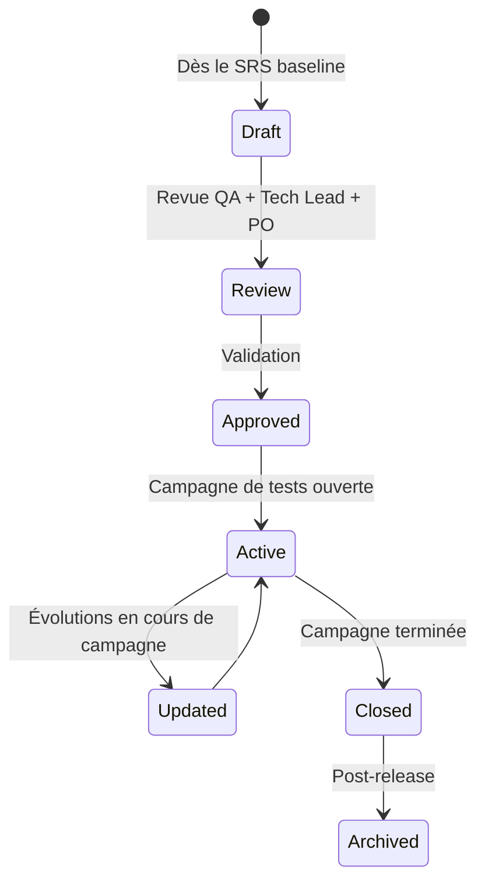
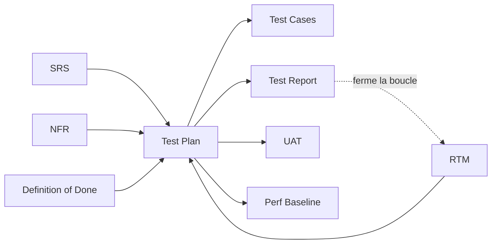
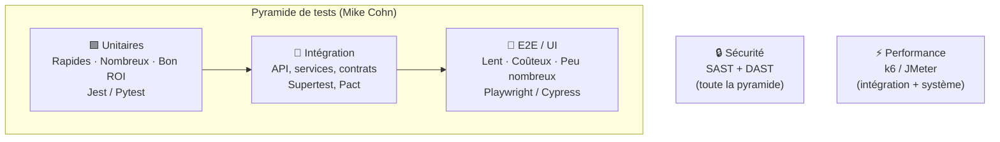

# Test Plan

> 📁 Phase : ④ Test / V&V · 🏷️ Acronyme : **Test Plan** · 🔤 EN : _Test Plan / Master Test Plan_

---

## 1. Définition & objectif

Le **Test Plan** est le document qui décrit **la stratégie, le périmètre, les ressources, le planning et les critères de succès** d'une campagne de tests pour un système ou une release. Il répond à « **Comment allons-nous tester ce système, que va-t-on tester, avec quels moyens, et à quel niveau de qualité ?** »

C'est le document de **pilotage de la qualité** : il ne contient pas les cas de test eux-mêmes, mais organise qui fait quoi, avec quoi, dans quel ordre, et ce qui détermine le succès.

| Ce qu'il EST                                     | Ce qu'il N'EST PAS                       |
| ------------------------------------------------ | ---------------------------------------- |
| La stratégie et le plan d'organisation des tests | Les cas de test détaillés (→ Test Cases) |
| Le référentiel de décision go/no-go              | Un rapport de résultats (→ Test Report)  |
| Un document vivant pendant la phase de test      | Un document purement formel inutilisé    |

---

## 2. Usage & utilité

- **Organiser** : qui teste quoi, quand, avec quels outils et dans quels environnements.
- **Communiquer** le niveau de risque et l'effort de test aux parties prenantes.
- **Définir les critères d'entrée/sortie** (quand commence-t-on, quand s'arrête-t-on).
- **Prioriser** : quels composants testés en profondeur, lesquels en surface (risk-based testing).
- **Tracer** : base du Test Report qui en mesurera l'exécution.

---

## 3. Périmètre (in / out of scope)

**In scope**

- Objectifs et périmètre des tests (in/out of scope).
- Stratégie de test (niveaux, types, approches : boîte noire/blanche, TDD, BDD…).
- Critères d'entrée et de sortie de la campagne.
- Environnements de test, données de test, outils.
- Rôles, responsabilités, planning.
- Métriques de qualité cibles (couverture, taux de défauts…).
- Risques et hypothèses.

**Out of scope**

- Scénarios détaillés → **Test Cases**.
- Résultats → **Test Report**.
- Recette utilisateur → **UAT**.

---

## 4. Cycle de vie du document



- **Naissance** : dès que le SRS est baseliné, souvent en parallèle de la conception.
- **Vie** : actif pendant la campagne de tests ; mis à jour si le périmètre change.
- **Fin** : archivé avec le Test Report à chaque release.

---

## 5. Métiers / rôles concernés (RACI)

| Activité                              | QA / Test Manager | Tech Lead | Dev |  PO   | DevOps |
| ------------------------------------- | :---------------: | :-------: | :-: | :---: | :----: |
| Rédaction                             |       **R**       |     C     |  C  |   C   |   I    |
| Revue & approbation                   |         C         |     C     |  I  | **A** |   I    |
| Mise à disposition des environnements |         I         |     C     |  I  |   I   | **R**  |
| Exécution des tests                   |       **R**       |     I     |  C  |   I   |   I    |
| Go/No-Go                              |         C         |     C     |  I  | **A** |   I    |

**R**esponsible · **A**ccountable · **C**onsulted · **I**nformed.

---

## 6. Position & interactions avec les autres documents



| Document        | Relation                                                                            |
| --------------- | ----------------------------------------------------------------------------------- |
| **SRS / RTM**   | Chaque exigence doit avoir un cas de test ; le Test Plan organise cette couverture. |
| **DoD**         | Les critères de sortie du Test Plan alignés avec le DoD release.                    |
| **Test Cases**  | Produits conformément à la stratégie du Test Plan.                                  |
| **Test Report** | Rend compte de l'exécution du Test Plan.                                            |

---

## 7. Nommage & versionnement

- **Fichier** : `Test-Plan-<Système>-<Sprint|Release>-v<x.y>.md`.
- **Niveau** : _Master Test Plan_ (système entier) ou _Level Test Plan_ (composant, sprint).
- **Versionnement** : mis à jour pour chaque release majeure ; archivé à la clôture.

---

## 8. Template vierge (IEEE 829 / ISO 29119)

```markdown
# Test Plan — <Système> — <Release / Sprint> (v1.0)

| Champ        | Valeur                             |
| ------------ | ---------------------------------- |
| Version      | v1.0                               |
| Auteur       |                                    |
| Approbateurs |                                    |
| Date         | AAAA-MM-JJ                         |
| Statut       | Draft / Approved / Active / Closed |

## 1. Introduction

### 1.1 Objectif

### 1.2 Périmètre (in / out of scope)

### 1.3 Références (SRS, RTM, exigences)

## 2. Stratégie de test

### 2.1 Niveaux de test

| Niveau      | Responsable | Outils               | Scope              |
| ----------- | ----------- | -------------------- | ------------------ |
| Unitaire    | Dev         | Jest / Pytest        | Fonctions, classes |
| Intégration | Dev / QA    | Supertest, Pact      | Services, API      |
| Système     | QA          | Playwright / Cypress | E2E scénarios      |
| Acceptance  | PO + Users  | Manuel / Gherkin     | Critères métier    |

### 2.2 Types de test

| Type                 |  Obligatoire   | Outils                |
| -------------------- | :------------: | --------------------- |
| Fonctionnel          |       ✅       |                       |
| Performance / Charge |       ✅       | k6 / JMeter           |
| Sécurité (SAST/DAST) |       ✅       | OWASP ZAP / Semgrep   |
| Régression           |       ✅       | Suite E2E automatisée |
| Accessibilité (a11y) | Selon contexte | axe, Lighthouse       |

### 2.3 Approche (Risk-based)

<Quels composants sont testés en profondeur ? Sur quelle base de risque ?>

## 3. Critères d'entrée & de sortie

### 3.1 Critères d'entrée (pour commencer les tests)

- [ ] SRS / stories approuvées
- [ ] Environnement de test disponible
- [ ] Données de test préparées

### 3.2 Critères de sortie (pour terminer la campagne)

- [ ] Couverture des exigences : 100%
- [ ] Taux de défauts critiques : 0
- [ ] Taux de défauts hauts : ≤ <n> acceptés avec plan de remédiation
- [ ] NFR-PERF vérifiée (p95 < seuil)

## 4. Environnements & données de test

| Env | URL | Configuration | Données |
| --- | --- | ------------- | ------- |

## 5. Rôles & responsabilités

## 6. Planning (jalons)

## 7. Métriques & reporting

## 8. Risques & hypothèses
```

---

## 9. Exemple rempli (extrait — Portail Client v2.1)

```markdown
# Test Plan — Portail Client Self-Service — Release 2.1.0 (v1.0)

## 2. Stratégie de test

### 2.3 Approche risk-based

| Composant                   | Risque                              | Couverture cible                        |
| --------------------------- | ----------------------------------- | --------------------------------------- |
| Billing Service (PDF async) | Élevé (nouveau composant, NFR-PERF) | Tests unitaires ≥ 90% + charge          |
| Customer API                | Élevé (orchestrateur central)       | Tests intégration + contract tests Pact |
| Auth (Keycloak / Kong)      | Critique (sécurité)                 | Tests sécurité OWASP ZAP                |
| SPA React                   | Moyen                               | Tests E2E Playwright (flux principaux)  |
| Notification Service        | Faible (non bloquant)               | Tests unitaires ≥ 75%                   |

## 3. Critères de sortie — Release 2.1.0

- [ ] 0 défaut Critique ou Bloquant non résolu
- [ ] ≤ 2 défauts Hauts avec plan de remédiation < 30j
- [ ] Couverture RTM : 100% des FR/NFR testés
- [ ] NFR-PERF-001 : p95 ≤ 500ms à 500 users concurrents (test de charge)
- [ ] NFR-SEC-001 : 0 finding OWASP Critical/High dans ZAP

## 4. Environnements

| Env         | URL                             | Config          | Données           |
| ----------- | ------------------------------- | --------------- | ----------------- |
| Test        | https://test.portal.example.com | Staging infra   | Dataset anonymisé |
| Performance | Infra dédiée (4 nodes)          | Production-like | Générateur k6     |

## 7. Métriques

| Métrique                             | Cible                    |
| ------------------------------------ | ------------------------ |
| Couverture RTM                       | 100%                     |
| Taux de réussite des tests           | ≥ 95%                    |
| Défauts critiques en fin de campagne | 0                        |
| Densité de défauts                   | < 0,5 défaut/story point |
```

---

## 10. Checklist de revue

- [ ] Le **périmètre** (in/out of scope) est explicite.
- [ ] Tous les **niveaux de test** (unitaire, intégration, système, acceptance) sont couverts.
- [ ] Les **types de test non-fonctionnels** (perf, sécu, a11y) sont planifiés.
- [ ] Les **critères d'entrée et de sortie** sont mesurables.
- [ ] Les **environnements** et **données de test** sont identifiés.
- [ ] L'**approche risk-based** justifie le niveau de couverture par composant.
- [ ] Les **métriques de qualité** cibles sont définies (couverture, défauts).
- [ ] Le plan a été **revu et approuvé** par le PO et le Tech Lead.

---

## 11. Anti-patterns & pièges

| Anti-pattern                                 | Problème                          | Correctif                                     |
| -------------------------------------------- | --------------------------------- | --------------------------------------------- |
| 📋 **Test Plan rédigé après les tests**      | Aucune valeur planificatrice      | Rédiger dès le SRS baseliné                   |
| 🎯 **100% de couverture comme seul critère** | Qualité ≠ nombre de tests         | Risk-based + critères défaut                  |
| 🔒 **Tests uniquement fonctionnels**         | NFR ignorées jusqu'en prod        | Types de test explicites (perf, sécu)         |
| ⏰ **Pas de critères d'entrée**              | Tests commencent sur env instable | Critères d'entrée vérifiés avant démarrage    |
| 🌫️ **Plan trop abstrait**                    | Inutilisable en pratique          | Niveaux, types, outils, responsables concrets |
| 🕳️ **Régression non planifiée**              | Régressions découvertes en prod   | Suite de régression explicite                 |

---

## 12. Variantes par industrie / contexte

| Contexte                | Spécificités                                                                                                        |
| ----------------------- | ------------------------------------------------------------------------------------------------------------------- |
| **Agile**               | _Test Plan_ par sprint ou release ; souvent allégé et intégré à la story (BDD criteria).                            |
| **DO-178C (avionique)** | _Software Test Plan (STP)_ obligatoire ; niveaux Hardware Integration Test, Software Integration Test, System Test. |
| **IEC 62304 (médical)** | _Software System Test Plan_ avec validation/vérification formelle.                                                  |
| **ISO 29119**           | Standard de test logiciel complet, définit tous les artefacts (Test Plan, Cases, Report).                           |
| **Pénétration testing** | Plan spécifique : périmètre, règles d'engagement, fenêtre de test.                                                  |

---

## 13. Standards & normes

- **IEEE 829-1998 / 2008** — _Standard for Software Test Documentation_ (historique, structure de référence).
- **ISO/IEC/IEEE 29119** — standard moderne de test logiciel en 5 parties.
- **ISTQB CTFL** — certification fondamentale ; vocabulaire et pratiques de test.
- **DO-178C** — _Software Considerations in Airborne Systems_ (avionique).
- **IEC 62304** — _Software Life Cycle Processes for Medical Device Software_.

---

## 14. Outillage recommandé

| Besoin            | Outils                                                               |
| ----------------- | -------------------------------------------------------------------- |
| Gestion des tests | Xray (Jira), Zephyr Scale, Azure DevOps Test Plans, TestRail, Allure |
| Tests automatisés | Jest, Pytest, JUnit, Cypress, Playwright, Selenium                   |
| Tests de charge   | k6, Apache JMeter, Gatling, Locust                                   |
| Tests de sécurité | OWASP ZAP, Burp Suite, Semgrep, Trivy                                |
| Contract testing  | Pact, Spring Contract                                                |
| Couverture        | Istanbul/nyc (JS), Coverage.py, JaCoCo (Java)                        |

---

## 15. Diagramme — Pyramide de tests



> **Règle** : investir en priorité dans les tests unitaires (rapides, stables, bon ROI), compléter avec l'intégration, garder l'E2E pour les flux critiques uniquement.

---

> 🔎 **En une phrase** : le Test Plan est **la stratégie de confiance** — il décide à l'avance ce qui sera prouvé, comment, et à quelle condition le système sera considéré comme prêt à être livré.

⬅️ [Index du lot](./README.md) · ➡️ Suivant : [Test Cases](./02-test-cases.md)
