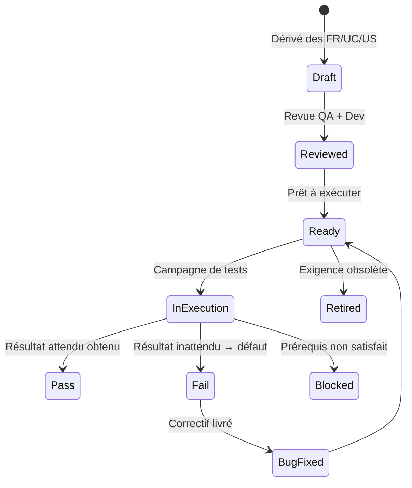
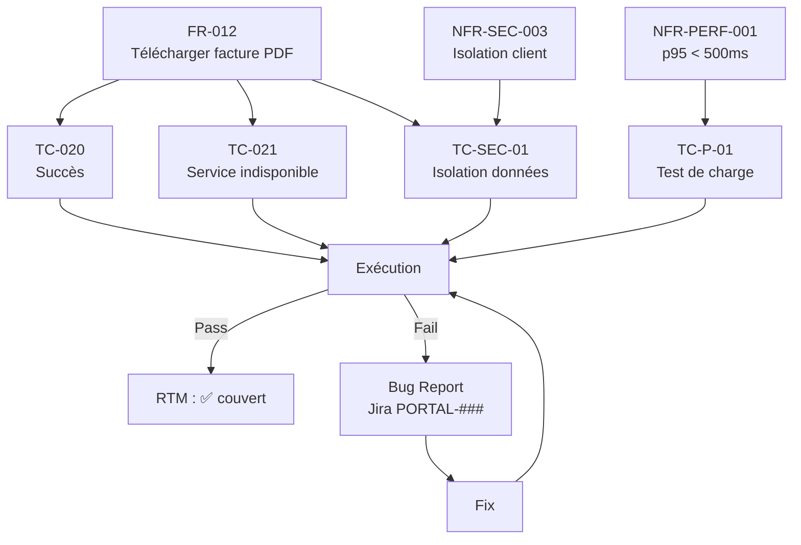

# Test Cases

> 📁 Phase : ④ Test / V&V · 🏷️ Acronyme : **TC** · 🔤 EN : _Test Cases / Test Specifications_

---

## 1. Définition & objectif

Un **Test Case** (cas de test) est la **spécification précise d'un scénario de test** : les préconditions, les actions à effectuer, les données d'entrée et le résultat attendu vérifiable. L'ensemble des test cases constitue la **test suite** qui couvre le système. Ils répondent à « **Exactement comment vérifier que cette exigence ou ce comportement est correct ?** »

| Ce qu'il EST                           | Ce qu'il N'EST PAS                     |
| -------------------------------------- | -------------------------------------- |
| Une procédure précise et reproductible | Un test exploratoire (ad hoc)          |
| Spécifié avant l'exécution             | Un rapport de résultat (→ Test Report) |
| Traçable vers une exigence             | Un bug report                          |

> **Test Case vs Test Scenario** : un _scenario_ décrit _quoi_ tester (« l'utilisateur peut télécharger une facture ») ; un _test case_ décrit _comment_ (préconditions, étapes, données, résultat attendu). Plusieurs test cases couvrent un scenario.

---

## 2. Usage & utilité

- **Vérifiabilité** : chaque exigence est testée de façon déterministe et reproductible.
- **Traçabilité** : liens FR → Test Case → résultat dans la RTM.
- **Automatisation** : un test case bien spécifié se traduit directement en test automatisé.
- **Régression** : les test cases historiques protègent contre les régressions.
- **Audit / certification** : preuve formelle que les exigences sont vérifiées.

---

## 3. Périmètre (in / out of scope)

**In scope**

- Préconditions (état du système avant le test).
- Étapes d'exécution (actions précises).
- Données d'entrée (valides, invalides, limites).
- Résultat attendu vérifiable.
- Résultat réel (rempli lors de l'exécution).
- Statut (Pass / Fail / Blocked / Skip).

**Out of scope**

- La stratégie globale → **Test Plan**.
- Le résumé agrégé → **Test Report**.
- La configuration des environnements → **Test Plan**.

---

## 4. Cycle de vie du document



- **Naissance** : dérivé des exigences (FR, UC, US) ; idéalement **en parallèle du développement** (shift-left).
- **Vie** : exécuté à chaque cycle de test ; les cas `Fail` génèrent des bug reports.
- **Fin** : retiré quand l'exigence associée est supprimée.

---

## 5. Métiers / rôles concernés (RACI)

| Activité                     |  QA   |  Dev  | Tech Lead |  PO   |
| ---------------------------- | :---: | :---: | :-------: | :---: |
| Rédaction des cas            | **R** |   C   |     I     |   I   |
| Revue (compréhension métier) |   C   |   I   |     I     | **R** |
| Revue (technique)            |   C   | **R** |   **R**   |   I   |
| Exécution manuelle           | **R** |   C   |     I     |   I   |
| Implémentation automatisée   |   C   | **R** |     C     |   I   |
| Gestion des échecs / bugs    | **R** | **R** |     C     |   C   |

---

## 6. Position & interactions avec les autres documents

```mermaid
flowchart LR
    FR[FR/NFR] --> TC[Test Cases]
    UC[Use Cases] --> TC
    US[User Stories\n(critères Gherkin)] --> TC
    RTM --> TC
    TC --> TR[Test Report]
    TC -.implémentés en.-> AUTO[Tests automatisés]
    TC -.bogue détecté.-> BUG[Bug Report / Jira]
    RTM -.trace.-> TC
```

| Document              | Relation                                                       |
| --------------------- | -------------------------------------------------------------- |
| **RTM**               | Chaque FR doit avoir ≥ 1 test case ; la RTM trace ce lien.     |
| **Use Cases**         | Chaque flux (nominal, alternatif, erreur) d'un UC → test case. |
| **User Stories**      | Les critères d'acceptation Gherkin _sont_ des test cases.      |
| **Tests automatisés** | Un test case bien spécifié = implémentation directe en code.   |

---

## 7. Nommage & versionnement

- **Identifiants** : `TC-###` (global) ou `TC-<module>-###` (ex. `TC-BILLING-012`).
- **Nommage** : `TC-###_<quoi>_<scénario>` — ex. `TC-042_invoice_download_success`.
- **Versionnement** : dans l'outil de test management (Xray, TestRail…) ; pas de versionnement manuel.
- **Stabilité des IDs** : jamais réutilisés (même si le cas est retiré).

---

## 8. Template vierge

```markdown
## TC-### : <Titre>

| Champ                   | Valeur                                                |
| ----------------------- | ----------------------------------------------------- |
| ID                      | TC-###                                                |
| Exigence(s) couverte(s) | FR-###, UC-###                                        |
| Priorité                | Critique / Haute / Moyenne / Basse                    |
| Type                    | Fonctionnel / Non-fonctionnel / Régression / Sécurité |
| Niveau                  | Unitaire / Intégration / Système / Acceptance         |
| Auteur                  |                                                       |
| Statut                  | Draft / Ready / Pass / Fail / Blocked                 |

### Préconditions

- <État du système, données requises, utilisateur connecté…>

### Données de test

| Variable | Valeur |
| -------- | ------ |

### Étapes d'exécution

| #   | Action | Résultat attendu |
| --- | ------ | ---------------- |
| 1   |        |                  |
| 2   |        |                  |

### Résultat attendu global

<Description du succès>

### Résultat réel (rempli à l'exécution)

<Résultat observé>

### Notes / Preuves

<Screenshots, logs, liens>
```

---

## 9. Exemples remplis

### TC-020 : Téléchargement PDF facture — succès

```markdown
| Champ     | Valeur         |
| --------- | -------------- |
| ID        | TC-020         |
| Exigences | FR-012, UC-012 |
| Priorité  | Critique       |
| Type      | Fonctionnel    |
| Niveau    | Système        |

### Préconditions

- Client `test-customer@example.com` authentifié (token valide).
- Facture `INV-2026-0042` existante pour ce client dans Billing v2 (fixture).
- Billing Service opérationnel.

### Données de test

| Variable       | Valeur                    |
| -------------- | ------------------------- |
| Customer email | test-customer@example.com |
| Invoice ID     | INV-2026-0042             |

### Étapes

| #   | Action                                  | Résultat attendu                                              |
| --- | --------------------------------------- | ------------------------------------------------------------- |
| 1   | Naviguer vers "Mes factures"            | Liste des factures affichée (dont INV-2026-0042)              |
| 2   | Cliquer "Télécharger" sur INV-2026-0042 | Indicateur de chargement affiché                              |
| 3   | Attendre max 30s                        | Téléchargement du fichier PDF démarré automatiquement         |
| 4   | Ouvrir le PDF                           | Facture lisible, montant 149,90 € et n° INV-2026-0042 correct |

### Résultat attendu global

PDF valide téléchargé en < 30s, contenant les données correctes de la facture.
```

---

### TC-021 : Téléchargement PDF — service Billing indisponible

```markdown
| ID       | TC-021 | Exigences | FR-012 (flux erreur E1), NFR-AVL |
| -------- | ------ | --------- | -------------------------------- |
| Priorité | Haute  | Type      | Gestion d'erreur                 |

### Préconditions

- Client authentifié.
- **Billing Service simulé hors service** (mock / chaos engineering).

### Étapes

| #   | Action                       | Résultat attendu                                                          |
| --- | ---------------------------- | ------------------------------------------------------------------------- |
| 1   | Cliquer "Télécharger"        | Message d'erreur affiché (non-bloquant)                                   |
| 2   | Message affiché              | « Service temporairement indisponible. Réessayez dans quelques minutes. » |
| 3   | Aucune exception 500 visible | Page reste stable, sans crash                                             |
| 4   | Log serveur                  | Erreur loggée avec traceId, alerte déclenchée                             |
```

---

### TC-SEC-01 : Accès aux factures d'un autre client (isolation)

```markdown
| ID       | TC-SEC-01 | Exigences | NFR-SEC-003, AUTH §4 |
| -------- | --------- | --------- | -------------------- |
| Priorité | Critique  | Type      | Sécurité             |

### Préconditions

- Client A (`customer-a@example.com`) authentifié.
- Facture `INV-B-0001` appartient au client B (autre compte).

### Étapes

| #   | Action                                            | Résultat attendu                                |
| --- | ------------------------------------------------- | ----------------------------------------------- |
| 1   | `GET /invoices/INV-B-0001` avec token du client A | HTTP 404 (pas 403 — ne pas révéler l'existence) |
| 2   | Tentative via manipulation d'URL                  | Idem : 404                                      |

### Justification

Vérifie l'isolation des données (OWASP A01 — Broken Access Control, row-level security).
```

---

## 10. Checklist de revue

- [ ] Chaque test case est **traçable vers ≥ 1 exigence** (FR ou NFR).
- [ ] Le **résultat attendu** est précis et vérifiable (pas « ça marche »).
- [ ] Les **données de test** sont définies (pas « mettre n'importe quoi »).
- [ ] Les **cas d'erreur** (flux alternatifs, exceptions) ont leurs propres test cases.
- [ ] Les **tests de sécurité** couvrent l'isolation des données, l'auth, l'injection.
- [ ] Les **tests de performance** sont liés à des NFR quantifiées.
- [ ] Les cas sont **indépendants** (pas d'ordre implicite entre eux).
- [ ] Les cas sont **reproductibles** (même résultat à chaque exécution).

---

## 11. Anti-patterns & pièges

| Anti-pattern                                     | Problème                           | Correctif                                 |
| ------------------------------------------------ | ---------------------------------- | ----------------------------------------- |
| ✏️ **Résultat attendu vague** (« ça s'affiche ») | Test non déterministe              | Résultat précis et mesurable              |
| 🔗 **Tests couplés** (TC-003 dépend de TC-002)   | Défaut en cascade, debug difficile | Chaque test indépendant avec ses fixtures |
| 📋 **Seul le flux heureux** testé                | Erreurs découvertes en prod        | Flux d'erreur obligatoires                |
| 🕳️ **Tests sans traçabilité exigence**           | Couverture impossible à prouver    | ID exigence obligatoire                   |
| 🧊 **Suite jamais nettoyée**                     | Tests obsolètes, faux positifs     | Retirer les TC des exigences supprimées   |
| 🤖 **Automatiser sans spec**                     | Tests fragiles, sans intention     | Spec d'abord, automation ensuite          |

---

## 12. Variantes par industrie / contexte

| Contexte                              | Spécificités                                                                                     |
| ------------------------------------- | ------------------------------------------------------------------------------------------------ |
| **BDD (Behavior-Driven Development)** | Test cases en Gherkin (Given/When/Then) exécutables (Cucumber, Behave, SpecFlow).                |
| **TDD**                               | Test case rédigé _avant_ le code ; échec attendu d'abord.                                        |
| **DO-178C (avionique)**               | Test cases formels avec traçabilité bidirectionnelle, indépendance vérificateur/développeur.     |
| **IEC 62304**                         | Test cases de niveau système traçables vers les exigences de sécurité et de sûreté.              |
| **Pentest**                           | Test cases de sécurité structurés (OWASP Testing Guide, règles d'engagement).                    |
| **Exploratoire**                      | Test _charter_ (objectif + périmètre) au lieu de cas détaillés ; adapté aux domaines peu connus. |

---

## 13. Standards & normes

- **IEEE 829** / **ISO/IEC/IEEE 29119-3** — _Software Test Design Specification_.
- **ISTQB CTFL** — techniques de test (équivalence classes, boundary value, décision tables…).
- **OWASP Testing Guide v4.2** — test cases de sécurité applicative.
- **Gherkin** (Cucumber/BDD) — format de spécification exécutable.

---

## 14. Outillage recommandé

| Besoin             | Outils                                                           |
| ------------------ | ---------------------------------------------------------------- |
| Gestion (manuel)   | Xray (Jira), Zephyr Scale, TestRail, Azure DevOps Test Plans     |
| Automatisation E2E | Playwright, Cypress, Selenium                                    |
| BDD/Gherkin        | Cucumber (Java/JS/Ruby), Behave (Python), SpecFlow (.NET), Gauge |
| API                | Postman/Newman, REST Assured, Supertest                          |
| Sécurité           | OWASP ZAP, Burp Suite, Semgrep, nuclei                           |
| Contract           | Pact (consommateur-producteur)                                   |
| Reporting          | Allure Report, ReportPortal                                      |

---

## 15. Diagramme — Dérivation et exécution des test cases



---

> 🔎 **En une phrase** : un test case est une **procédure déterministe** qui prouve (ou infirme) qu'une exigence est satisfaite — sa qualité détermine la valeur de toute la suite de tests.

⬅️ [Test Plan](./01-test-plan.md) · ➡️ Suivant : [Test Report](./03-test-report.md)
