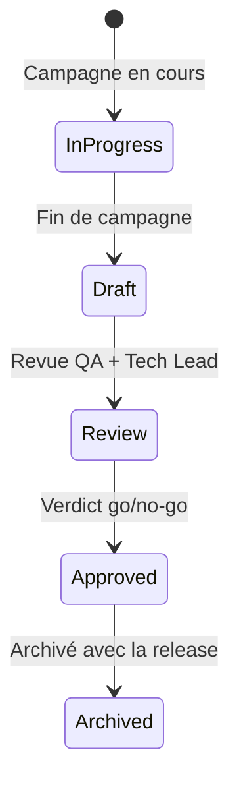

# Test Report

> 📁 Phase : ④ Test / V&V · 🏷️ Acronyme : **Test Report** · 🔤 EN : _Test Report / Test Summary Report_

---

## 1. Définition & objectif

Le **Test Report** (ou _Test Summary Report_) est le document qui **résume les résultats d'une campagne de tests** : ce qui a été testé, les résultats obtenus (Pass/Fail/Blocked), les défauts découverts, la couverture des exigences et la **recommandation de go ou no-go**. Il répond à « **Quel est le bilan objectif de la campagne de tests, et le système est-il prêt à passer en production ?** »

C'est le document de **décision** : le management, le PO et le Tech Lead s'appuient sur lui pour autoriser (ou non) la mise en production.

| Ce qu'il EST                     | Ce qu'il N'EST PAS                        |
| -------------------------------- | ----------------------------------------- |
| Le bilan factuel de la campagne  | Un catalogue de test cases (→ Test Cases) |
| La recommandation go/no-go       | La stratégie de test (→ Test Plan)        |
| Le document de traçabilité final | Un bug tracker                            |

---

## 2. Usage & utilité

- **Décision go/no-go** : base objective pour la décision de release.
- **Traçabilité** : ferme la boucle RTM (exigences → tests → résultats).
- **Audit / conformité** : preuve que les exigences ont été vérifiées.
- **Mémoire** : comparaison entre releases (évolution de la qualité).
- **Amélioration continue** : les tendances de défauts alimentent les rétrospectives.

---

## 3. Périmètre (in / out of scope)

**In scope**

- Résumé de la campagne (périmètre, environnement, dates).
- Métriques d'exécution (total, Pass, Fail, Blocked, Skip).
- Couverture des exigences (RTM mise à jour).
- Liste des défauts (ouverts, fermés, report acceptés).
- Résultats NFR (performance, sécurité).
- Verdict et recommandation.
- Risques résiduels acceptés.

**Out of scope**

- Détail des étapes de test → **Test Cases**.
- Plans futurs → **Test Plan** de la prochaine release.
- Recette utilisateur → **UAT**.

---

## 4. Cycle de vie du document



- **Naissance** : produit à la fin de la campagne de tests (souvent en continu via l'outil de reporting).
- **Vie** : court — rédigé, revu et approuvé avant la décision de release.
- **Fin** : archivé avec la release correspondante ; accessible pour audit.

---

## 5. Métiers / rôles concernés (RACI)

| Activité            | QA / Test Manager | Tech Lead |  PO   | Dev | Ops |
| ------------------- | :---------------: | :-------: | :---: | :-: | :-: |
| Rédaction           |       **R**       |     C     |   I   |  I  |  I  |
| Revue technique     |         C         |   **R**   |   I   |  C  |  I  |
| Revue fonctionnelle |         C         |     I     | **R** |  I  |  I  |
| Décision go/no-go   |         C         |     C     | **A** |  I  |  C  |
| Archivage           |       **R**       |     I     |   I   |  I  |  I  |

---

## 6. Position & interactions avec les autres documents

```mermaid
flowchart LR
    TC[Test Cases exécutés] --> TR[Test Report]
    PB[Perf Baseline] --> TR
    TR -.ferme la boucle.-> RTM
    TR --> GO{Décision\ngo/no-go}
    GO -->|go| DEPLOY[Déploiement\nproduction]
    GO -->|no-go| FIX[Correctifs\n+ nouvelle campagne]
    TR --> RN[Release Notes\n(anomalies connues)]
    TR -.alimente.-> RETRO[Rétrospective]
```

| Document                 | Relation                                                                            |
| ------------------------ | ----------------------------------------------------------------------------------- |
| **Test Cases**           | Le Test Report agrège les résultats d'exécution des test cases.                     |
| **RTM**                  | Mis à jour avec le statut final de couverture (chaque FR tracée jusqu'au résultat). |
| **Release Notes**        | Les défauts reportés apparaissent dans les « known issues » des Release Notes.      |
| **Performance Baseline** | Les résultats de perf du Test Report vs la baseline = verdict NFR-PERF.             |

---

## 7. Nommage & versionnement

- **Fichier** : `Test-Report-<Système>-<Release>-<Date>.md` — ex. `Test-Report-PortailClient-v2.1.0-2026-04-22.md`.
- **Généré automatiquement** : la plupart des outils (Allure, Xray, TestRail) génèrent le rapport depuis l'exécution.
- **Archivé** avec la release (immutable après signature go/no-go).

---

## 8. Template vierge

```markdown
# Test Report — <Système> — <Release>

| Champ               | Valeur                                      |
| ------------------- | ------------------------------------------- |
| Release             |                                             |
| Période de campagne | AAAA-MM-JJ → AAAA-MM-JJ                     |
| Environnement       |                                             |
| Auteur              |                                             |
| Approbateur         |                                             |
| Verdict             | **GO** / **NO-GO** / **GO avec conditions** |

## 1. Résumé exécutif

<3 lignes : résultat global, points majeurs, recommandation.>

## 2. Métriques d'exécution

| Métrique         | Valeur | Cible (Test Plan) | Statut |
| ---------------- | ------ | ----------------- | ------ |
| Total test cases |        |                   |        |
| Pass             |        |                   |        |
| Fail             |        |                   |        |
| Blocked          |        |                   |        |
| Taux de réussite |        | ≥ 95%             | ✅/❌  |
| Couverture RTM   |        | 100%              | ✅/❌  |

## 3. Résultats par composant / niveau

| Composant | Unitaire | Intégration | E2E | Statut |
| --------- | :------: | :---------: | :-: | ------ |

## 4. Résultats NFR

| NFR          | Mesure | Cible              | Statut |
| ------------ | ------ | ------------------ | ------ |
| NFR-PERF-001 |        | p95 < 500ms        | ✅/❌  |
| NFR-SEC-001  |        | 0 finding Critical | ✅/❌  |

## 5. Défauts

### 5.1 Défauts critiques/bloquants ouverts

| ID  | Description | Composant | Sévérité | Décision |
| --- | ----------- | --------- | :------: | -------- |

### 5.2 Défauts reportés (known issues)

| ID  | Description | Sévérité | Plan de résolution |
| --- | ----------- | :------: | ------------------ |

## 6. Couverture RTM (synthèse)

<Tableau ou % : exigences testées / non testées / échouées>

## 7. Risques résiduels acceptés

## 8. Recommandation & décision
```

---

## 9. Exemple rempli

```markdown
# Test Report — Portail Client Self-Service — v2.1.0

| Champ         | Valeur                     |
| ------------- | -------------------------- |
| Période       | 2026-04-14 → 2026-04-21    |
| Environnement | staging.portal.example.com |
| Auteur        | S. Petit (QA Lead)         |
| Approbateur   | M. Durand (PO)             |
| Verdict       | **GO avec conditions**     |

## 1. Résumé exécutif

La campagne v2.1.0 couvre 100% des exigences FR/NFR.
2 défauts hauts ont été identifiés (PORTAL-190, PORTAL-191) : plan de résolution validé
sous 15 jours. NFR-PERF-001 satisfaite. 1 finding de sécurité moyen résolu.
**Recommandation : GO avec monitoring renforcé sur le Billing Service les 48h suivant le déploiement.**

## 2. Métriques d'exécution

| Métrique         | Valeur               | Cible      | Statut       |
| ---------------- | -------------------- | ---------- | ------------ |
| Total TC         | 147                  |            |              |
| Pass             | 143                  |            | ✅           |
| Fail             | 2                    | 0 Critique | ⚠️ (2 Hauts) |
| Blocked          | 2                    |            | ℹ️           |
| Taux de réussite | 97,3%                | ≥ 95%      | ✅           |
| Couverture RTM   | 100% (26 FR + 5 NFR) | 100%       | ✅           |

## 4. Résultats NFR

| NFR                  | Mesure                                | Cible    | Statut |
| -------------------- | ------------------------------------- | -------- | ------ |
| NFR-PERF-001 p95     | 380ms à 500 users                     | < 500ms  | ✅     |
| NFR-PERF-001 p99     | 820ms à 500 users                     | < 1000ms | ✅     |
| NFR-AVL-001 (uptime) | 99,98% sur 7j staging                 | ≥ 99,9%  | ✅     |
| NFR-SEC-001 ZAP scan | 0 Critical, 0 High, 1 Medium (résolu) | 0 C/H    | ✅     |

## 5.1 Défauts hauts ouverts

| ID         | Description                                              | Composant       | Sévérité | Décision              |
| ---------- | -------------------------------------------------------- | --------------- | :------: | --------------------- |
| PORTAL-190 | Encodage UTF-8 des noms de fichier CSV sous macOS Safari | Billing Service |  Haute   | Report v2.1.1 (< 15j) |
| PORTAL-191 | Tooltip d'aide manquant sur le filtre de date            | SPA             |  Haute   | Report v2.1.1         |

## 8. Recommandation

**GO** pour déploiement le 2026-04-24. Conditions :

1. PORTAL-190 et PORTAL-191 résolus en v2.1.1 (< 15j).
2. Monitoring Billing Service (latence PDF) les 48h post-déploiement.
```

---

## 10. Checklist de revue

- [ ] La **couverture RTM** est complète (100% des exigences tracées).
- [ ] Le **taux de réussite** est conforme aux critères de sortie du Test Plan.
- [ ] Les **défauts critiques/bloquants** sont à 0 (ou le no-go est justifié).
- [ ] Les **défauts reportés** ont un plan de résolution daté.
- [ ] Les **résultats NFR** (perf, sécu, a11y) sont documentés vs cibles.
- [ ] Les **risques résiduels** sont explicites et acceptés par le PO.
- [ ] La **recommandation** (go/no-go) est claire et signée.
- [ ] Le rapport est **archivé** avec la release.

---

## 11. Anti-patterns & pièges

| Anti-pattern                     | Problème                                  | Correctif                           |
| -------------------------------- | ----------------------------------------- | ----------------------------------- |
| ✅ **Green-washing**             | On masque les échecs pour avoir le go     | Rapport factuel et indépendant      |
| 🚀 **Go par pression**           | Sortie en prod avec bugs critiques        | Critères de sortie non négociables  |
| 🕳️ **NFR non rapportées**        | Perf / sécu ignorées                      | Section NFR obligatoire             |
| 🧟 **Rapport jamais relu**       | Décision prise sans lire                  | Revue formelle avec approbateur     |
| 📋 **Rapport = dump de l'outil** | Illisible, pas de synthèse                | Résumé exécutif + verdict explicite |
| 🏃 **Pas d'archivage**           | Impossible de retrouver l'état à une date | Archivage systématique par release  |

---

## 12. Variantes par industrie / contexte

| Contexte                 | Spécificités                                                                                           |
| ------------------------ | ------------------------------------------------------------------------------------------------------ |
| **Agile**                | Rapport de sprint (velocity + test results) + rapport release.                                         |
| **DO-178C**              | _Software Accomplishment Summary (SAS)_ : trace tous les artefacts de test pour la certification.      |
| **IEC 62304 / médical**  | _Software System Test Report_ : document de qualification/validation.                                  |
| **Réglementé (finance)** | Rapport d'audit de tests (conformité MIF2, PCI-DSS).                                                   |
| **Continu (CI/CD)**      | Rapport automatique généré à chaque pipeline (Allure, Xray) ; rapport de release = synthèse mensuelle. |

---

## 13. Standards & normes

- **IEEE 829 / ISO/IEC/IEEE 29119-3** — _Software Test Summary Report_.
- **ISTQB** — structure et métriques recommandées.
- **DO-178C** — _Software Accomplishment Summary_ (certification avionique).
- **IEC 62304** — _Software system test report_.

---

## 14. Outillage recommandé

| Besoin             | Outils                                                           |
| ------------------ | ---------------------------------------------------------------- |
| Génération rapport | Allure Report, ReportPortal, Xray (Jira), TestRail, Azure DevOps |
| Dashboard qualité  | SonarQube, Grafana (métriques de test), DORA metrics             |
| Archivage          | Confluence, artefact CI (GitHub Releases), S3                    |

---

## 15. Diagramme — Flux du verdict go/no-go

```mermaid
flowchart TD
    EXEC[Exécution des tests\n(automatisée + manuelle)] --> RESULTS[Résultats agrégés]
    RESULTS --> REPORT[Test Report\n(Allure / Xray)]

    REPORT --> CHK1{0 défaut\ncritique/bloquant ?}
    CHK1 -->|Non| NOGO[❌ NO-GO\n→ correctifs urgents]
    CHK1 -->|Oui| CHK2{Couverture RTM\n= 100% ?}
    CHK2 -->|Non| NOGO
    CHK2 -->|Oui| CHK3{NFR-PERF\net NFR-SEC ✅ ?}
    CHK3 -->|Non| NOGO
    CHK3 -->|Oui| CHK4{Défauts hauts\navec plan remédiation ?}
    CHK4 -->|Oui, plan validé| GOCOND[⚠️ GO avec conditions]
    CHK4 -->|Aucun ou reportés| GO[✅ GO]

    GO & GOCOND --> DEPLOY[Déploiement production]
    NOGO --> FIX[Correctifs] --> EXEC
```

---

> 🔎 **En une phrase** : le Test Report est le **bilan de confiance** — il transforme des centaines de tests en une seule réponse : « ce système est prêt (ou non) à être livré aux utilisateurs ».

⬅️ [Test Cases](./02-test-cases.md) · ➡️ Suivant : [UAT](./04-uat-user-acceptance-testing.md)
