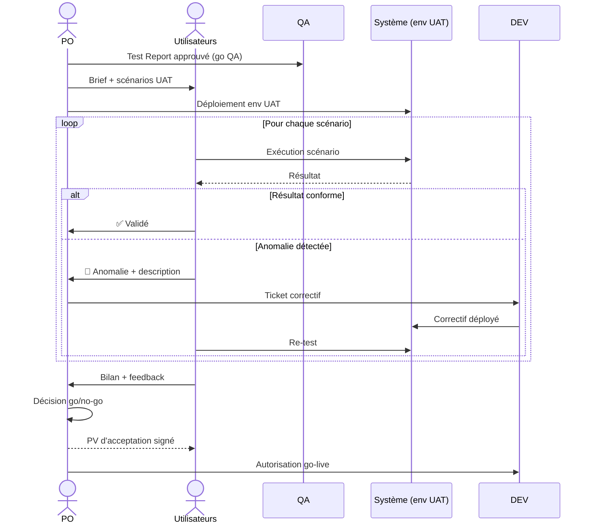

# UAT — User Acceptance Testing

> 📁 Phase : ④ Test / V&V · 🏷️ Acronyme : **UAT** · 🔤 EN : _User Acceptance Testing_

---

## 1. Définition & objectif

L'**UAT** (_User Acceptance Testing_ — Recette Utilisateur) est la **phase de validation finale par les utilisateurs ou représentants métier**, qui confirme que le logiciel répond aux besoins réels dans des conditions proches de la production. Elle répond à « **Les utilisateurs confirment-ils que le système fait ce qu'ils en attendent, et sont-ils prêts à l'accepter ?** »

L'UAT est la dernière étape avant la mise en production : c'est le **moment de vérité** où le métier prend la décision d'accepter ou de rejeter le système.

| Ce qu'il EST                             | Ce qu'il N'EST PAS                 |
| ---------------------------------------- | ---------------------------------- |
| La validation par les vrais utilisateurs | Un re-test fonctionnel technique   |
| Un acte d'acceptation formel             | Un test exploratoire sans objectif |
| Orienté valeur métier                    | Un audit technique                 |

> **Vérification vs Validation (IEEE)** : _Vérification_ = « avons-nous construit le système correctement ? » (tests QA) ; _Validation_ = « avons-nous construit le bon système ? » (UAT). L'UAT est de la **validation**.

---

## 2. Usage & utilité

- **Confirmer** que le système répond aux besoins métier dans un contexte réel.
- **Formaliser l'acceptation** (signature) et transférer la responsabilité au métier.
- **Détecter** les lacunes fonctionnelles non visibles par les tests QA (contexte d'usage réel).
- **Identifier les formations** nécessaires avant le go-live.
- **Contractuel** : l'UAT est souvent la condition du paiement final chez les prestataires.

---

## 3. Périmètre (in / out of scope)

**In scope**

- Scénarios métier de bout en bout (les flux les plus importants).
- Vérification des critères d'acceptation des user stories clés.
- Données réalistes (anonymisées ou fictives proches du réel).
- Feedback utilisateur sur l'ergonomie et l'expérience.
- Critères d'acceptation du BRD.
- Procédure d'acceptation formelle (signée).

**Out of scope**

- Tests techniques (unitaires, intégration) → **QA / Test Cases**.
- Tests de performance en charge → **Performance Baseline**.
- Tests de sécurité → **Test Cases / Pentest**.
- Tests de tous les cas limites → **Test Cases QA**.

---

## 4. Cycle de vie du document

```mermaid
stateDiagram-v2
    [*] --> Plan: Planification UAT (post Test Report go)
    Plan --> Prepare: Préparation (scénarios, env, données, formation)
    Prepare --> Execute: Exécution (utilisateurs testent)
    Execute --> Debrief: Debriefing + collecte feedback
    Debrief --> Decision{Décision}
    Decision -->|Accepté| Signed: PV d'acceptation signé
    Decision -->|Rejeté| Fix: Correctifs → nouvelle UAT
    Decision -->|Accepté avec réserves| Conditional: Conditions documentées
    Fix --> Execute
    Signed --> Archived
    Conditional --> Archived
```

- **Naissance** : déclenchée après le go du Test Report.
- **Vie** : 1 à 2 semaines typiquement ; itérée si la première passe est rejetée.
- **Fin** : PV d'acceptation signé → déploiement autorisé.

---

## 5. Métiers / rôles concernés (RACI)

| Activité                | Utilisateurs/Métier | PO / Product Manager |  QA   | Tech Lead | Support |
| ----------------------- | :-----------------: | :------------------: | :---: | :-------: | :-----: |
| Planification           |          C          |        **R**         | **R** |     C     |    I    |
| Rédaction scénarios UAT |        **R**        |        **R**         |   C   |     I     |    I    |
| Exécution des tests     |        **R**        |          C           |   F   |     I     |    C    |
| Collecte du feedback    |          C          |        **R**         | **R** |     I     |    I    |
| Décision d'acceptation  |          C          |        **A**         |   C   |     C     |    I    |
| Signature PV            |        **R**        |        **R**         |   I   |     I     |    I    |

**R**esponsible · **A**ccountable · **C**onsulted · **I**nformed.

_F = Facilitateur._ Les **utilisateurs** testent ; le **PO** pilote et décide.

---

## 6. Position & interactions avec les autres documents

```mermaid
flowchart LR
    BRD[BRD\n(critères métier)] --> UAT
    US[User Stories\n(critères d'acceptation)] --> UAT
    TR[Test Report\n(go QA)] --> UAT
    UAT --> PV[PV d'acceptation\n(signature)]
    PV --> DEPLOY[Go-live]
    UAT -.feedback.-> BACKLOG[Backlog\n(nouvelles stories)]
    UAT -.formation.-> TRAIN[Plan de formation]
```

| Document          | Relation                                                                 |
| ----------------- | ------------------------------------------------------------------------ |
| **BRD**           | Les objectifs du BRD servent de critères d'acceptation macro pour l'UAT. |
| **User Stories**  | Les critères d'acceptation Gherkin sont la base des scénarios UAT.       |
| **Test Report**   | L'UAT ne commence qu'après le go QA (Test Report approuvé).              |
| **Release Notes** | Les fonctionnalités livrées sont présentées aux utilisateurs en UAT.     |

---

## 7. Nommage & versionnement

- **Fichier** : `UAT-Plan-<Projet>-<Release>.md` + `UAT-PV-<Projet>-<Release>-<Date>.md` (PV signé).
- **Scénarios** : identifiants `UAT-###` distincts des TC techniques.
- **PV** : daté, signé par le sponsor/PO et les représentants utilisateurs ; valeur contractuelle.

---

## 8. Template vierge

```markdown
# UAT Plan — <Projet> — <Release>

| Champ        | Valeur                  |
| ------------ | ----------------------- |
| Version      |                         |
| PO           |                         |
| Participants |                         |
| Env UAT      |                         |
| Dates        | AAAA-MM-JJ → AAAA-MM-JJ |

## 1. Objectifs de l'UAT

<Quels objectifs métier cette UAT valide-t-elle ? Lien vers BRD §4.>

## 2. Périmètre des scénarios

### In scope

### Out of scope

## 3. Scénarios UAT

### UAT-### : <Titre du scénario>

| Champ                 | Valeur        |
| --------------------- | ------------- |
| US / BR couvert(e)(s) |               |
| Priorité              | Must / Should |

**Description (langage métier) :**
<Ce que l'utilisateur fait, du début à la fin, sans jargon technique.>

**Critère d'acceptation :**
<Comment sait-on que c'est bon ?>

| Résultat attendu | Résultat observé | Statut |
| ---------------- | ---------------- | ------ |

## 4. Critères de go / no-go UAT

- [ ] 100% des scénarios Must validés
- [ ] Réserves documentées avec plan

## 5. Environnement & données

## 6. Planning & participants

## 7. Processus de remontée des anomalies

---

# PV d'acceptation — <Projet> — <Release>

_Date : AAAA-MM-JJ_

## Verdict

☐ Accepté sans réserve
☐ Accepté avec réserves (listées ci-dessous)
☐ Non accepté

## Réserves (si applicable)

| ID  | Description | Plan de résolution |
| --- | ----------- | ------------------ |

## Signatures

| Rôle                      | Nom | Signature | Date |
| ------------------------- | --- | --------- | ---- |
| Product Owner             |     |           |      |
| Sponsor                   |     |           |      |
| Représentant utilisateurs |     |           |      |
```

---

## 9. Exemple rempli (extrait)

```markdown
# UAT Plan — Portail Client Self-Service — v2.1.0

## 3. Scénarios UAT

### UAT-001 : Consulter mes commandes du mois

| US couverte | US-010, US-011 | Priorité | Must |

**Description :**
En tant que client, je me connecte au portail, j'accède à "Mes commandes",
je filtre sur le mois d'avril 2026 et je consulte le détail de la commande CMD-20260412-001.
Je vérifie que le statut, la date de livraison estimée et le montant sont corrects.

**Critère d'acceptation :**
Le détail de la commande affiche les informations correctes identiques à celles reçues
par e-mail de confirmation.

| Résultat attendu                                   | Résultat observé | Statut |
| -------------------------------------------------- | ---------------- | ------ |
| Statut : "Livré le 2026-04-14" · Montant : 89,90 € | ✅ Conforme      | Pass   |

---

### UAT-003 : Télécharger une facture et la soumettre à ma comptabilité

**Description :**
Je télécharge ma facture INV-2026-0042, je vérifie que le PDF contient
mon nom, l'adresse de facturation et le montant TTC de 149,90 €.
Je joins le PDF à un e-mail simulé.

| Résultat attendu                     | Résultat observé         | Statut |
| ------------------------------------ | ------------------------ | ------ |
| PDF valide, données correctes, < 30s | Généré en 8s, données OK | Pass   |

---

### UAT-005 : Ouvrir une réclamation pour une commande non reçue

**Description :**
Je sélectionne ma commande CMD-20260410-003, je clique "Ouvrir une réclamation",
je décris le problème et je valide. Je reçois un e-mail de confirmation.

| Résultat attendu                        | Résultat observé     | Statut |
| --------------------------------------- | -------------------- | ------ |
| Réclamation créée + e-mail reçu < 5 min | E-mail reçu en 2 min | Pass   |

---

# PV d'acceptation — Portail Client v2.1.0

_Date : 2026-04-23_

## Verdict

☑ **Accepté avec réserves**

## Réserves

| ID  | Description                                         | Plan                         |
| --- | --------------------------------------------------- | ---------------------------- |
| R-1 | Libellé confus sur le bouton "Archiver réclamation" | Correction UX v2.1.1 (< 15j) |

## Signatures

| Rôle                           | Nom        | Date       |
| ------------------------------ | ---------- | ---------- |
| Product Owner                  | M. Durand  | 2026-04-23 |
| Dir. Relation Client (Sponsor) | C. Bernard | 2026-04-23 |
| Représentant utilisateurs      | L. Martin  | 2026-04-23 |
```

---

## 10. Checklist de revue

- [ ] Les scénarios sont en **langage métier** (pas technique).
- [ ] Les scénarios couvrent les **flux les plus importants** (critères BRD).
- [ ] L'**environnement UAT** est prêt et stable.
- [ ] Les **données de test** sont réalistes (anonymisées).
- [ ] Les utilisateurs ont été **formés** avant l'UAT (ou la formation fait partie de l'UAT).
- [ ] Un **processus de remontée d'anomalies** est défini.
- [ ] Les **critères de go/no-go** sont convenus à l'avance.
- [ ] Le **PV d'acceptation** est signé.

---

## 11. Anti-patterns & pièges

| Anti-pattern                           | Problème                                   | Correctif                                    |
| -------------------------------------- | ------------------------------------------ | -------------------------------------------- |
| 🏃 **UAT = re-test QA**                | Les utilisateurs font des tests techniques | Scénarios métier, pas techniques             |
| ⏰ **UAT en fin de projet** sans marge | Pas le temps de corriger                   | Prévoir du buffer après l'UAT                |
| 👨‍💻 **Dev présents pendant l'UAT**      | Utilisateurs se censurent                  | Dev disponibles mais à distance              |
| 📋 **Scénarios trop nombreux**         | UAT de 3 semaines, personne ne finit       | 10–20 scénarios Must prioritaires            |
| 🤐 **Pas de PV**                       | Acceptation informelle, litiges            | PV signé systématiquement                    |
| 🎭 **Utilisateurs non représentatifs** | L'UAT ne reflète pas l'usage réel          | Vrais utilisateurs finaux (pas des managers) |

---

## 12. Variantes par industrie / contexte

| Contexte                | Spécificités                                                                                              |
| ----------------------- | --------------------------------------------------------------------------------------------------------- |
| **Agile**               | UAT continue : sprint review (PO + stakeholders valident chaque sprint) + UAT de release.                 |
| **Waterfall**           | UAT formelle en fin de projet ; document contractuel signé avant paiement.                                |
| **SaaS / B2C**          | Bêta testing (utilisateurs early adopters) + instrumentation (Hotjar, analytics).                         |
| **Médical (IEC 62304)** | _User Validation Study_ : validation clinique avec utilisateurs réels dans l'environnement d'utilisation. |
| **Systèmes critiques**  | UAT / validation opérationnelle avec opérateurs formés sur simulateur.                                    |
| **Public / marchés**    | Recette officielle du maître d'ouvrage ; valeur contractuelle et légale.                                  |

---

## 13. Standards & normes

- **ISO/IEC/IEEE 29119** — _Software Testing — Part 3_ : processus UAT.
- **IEEE 829** — documentation de la recette.
- **IEC 62366** (médical) — _Usability Engineering_ : tests d'utilisabilité (inclut la validation utilisateurs).
- **PMBOK** — _User Acceptance Testing_ comme processus de clôture du projet.

---

## 14. Outillage recommandé

| Besoin                    | Outils                                            |
| ------------------------- | ------------------------------------------------- |
| Gestion des scénarios UAT | Jira (story + UAT criteria), TestRail, Confluence |
| Feedback utilisateurs     | Maze, UserTesting, Hotjar (beta), Google Forms    |
| Sessions à distance       | Miro (facilitation), Zoom/Teams (enregistrement)  |
| PV électronique           | DocuSign, Adobe Sign, e-signature                 |

---

## 15. Diagramme — Processus UAT de bout en bout



---

> 🔎 **En une phrase** : l'UAT est le **moment de vérité** — les vrais utilisateurs confirment que le système qu'on a construit est bien celui dont ils avaient besoin, et leur signature transforme une livraison technique en acceptation métier.

⬅️ [Test Report](./03-test-report.md) · ➡️ Suivant : [Performance Baseline](./05-performance-baseline.md)
