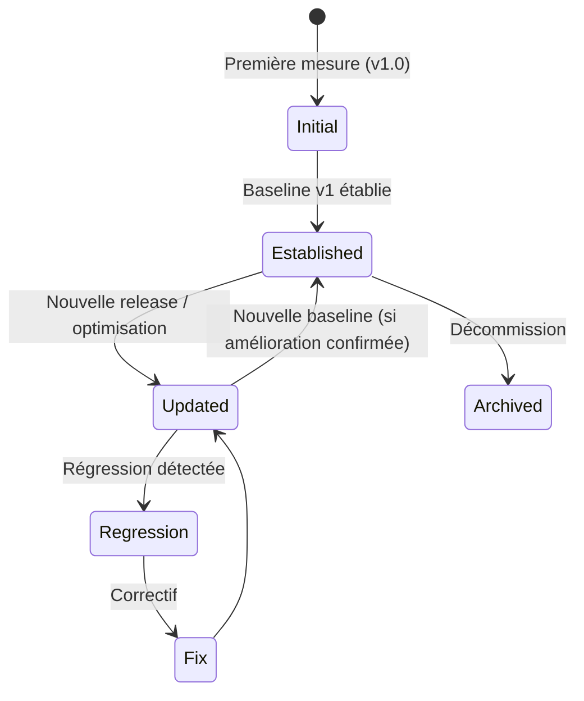

# Performance Baseline

> 📁 Phase : ④ Test / V&V · 🏷️ Acronyme : **Perf Baseline** · 🔤 EN : _Performance Baseline_

---

## 1. Définition & objectif

La **Performance Baseline** est le **document qui établit les métriques de performance de référence** d'un système : les mesures objectivement observées à un instant donné, dans des conditions définies. Elle répond à « **Quelles sont les performances actuelles du système, mesurées de façon reproductible, que nous utiliserons comme référence pour détecter les régressions et valider les améliorations ?** »

C'est la **ligne de base** : toute évolution future est jugée _par rapport_ à cette référence.

| Ce qu'elle EST                        | Ce qu'elle N'EST PAS                      |
| ------------------------------------- | ----------------------------------------- |
| La mesure de référence à un instant T | Les objectifs NFR à atteindre (→ SRS NFR) |
| Un artefact vivant et daté            | Un rapport de test ponctuel               |
| La base de détection des régressions  | Une liste de bugs de performance          |

> **NFR vs Baseline** : les NFR définissent les _objectifs_ (« p95 < 500ms ») ; la baseline mesure la _réalité_ (« p95 = 380ms en v2.1, dans ces conditions »). La baseline peut être en dessous ou au-dessus des objectifs NFR.

---

## 2. Usage & utilité

- **Détecter les régressions** : une release suivante plus lente que la baseline = régression identifiée.
- **Valider les améliorations** : une optimisation doit améliorer la baseline de façon mesurable.
- **Calibrer les alertes** de monitoring en production (seuils basés sur la baseline).
- **Dimensionner l'infrastructure** : la baseline informe les décisions de scaling.
- **Communication** : prouver objectivement une amélioration (ou une dégradation) de performance.

---

## 3. Périmètre (in / out of scope)

**In scope**

- Métriques de latence (p50, p95, p99).
- Débit (requêtes/seconde, messages/seconde).
- Taux d'erreur sous charge.
- Utilisation des ressources (CPU, mémoire, connexions DB).
- Conditions de mesure (charge, profil utilisateur, environnement).
- Outils et configuration utilisés (reproductibilité).

**Out of scope**

- Objectifs NFR (définis dans le SRS).
- Analyse des causes de lenteur → TDR / LLD.
- Tests de sécurité sous charge → Test Plan (approche distincte).

---

## 4. Cycle de vie du document



- **Naissance** : lors de la première release en conditions représentatives (staging ou prod).
- **Vie** : **mise à jour à chaque release majeure** ou après une optimisation significative ; les versions précédentes sont conservées (comparaison historique).
- **Fin** : archivée à la décommission du service.

---

## 5. Métiers / rôles concernés (RACI)

| Activité                      | Dev / SRE | QA / Perf Engineer | Architecte | PO  |  Ops  |
| ----------------------------- | :-------: | :----------------: | :--------: | :-: | :---: |
| Définition scénarios          |     C     |       **R**        |     C      |  C  |   I   |
| Exécution des tests de charge |   **R**   |       **R**        |     I      |  I  |   C   |
| Analyse des résultats         |   **R**   |       **R**        |   **R**    |  I  |   C   |
| Validation (vs NFR)           |     C     |         C          |   **A**    |  C  |   I   |
| Mise à jour baseline          |   **R**   |       **R**        |     C      |  I  |   I   |
| Configuration alertes prod    |     C     |         I          |     C      |  I  | **R** |

**R**esponsible · **A**ccountable · **C**onsulted · **I**nformed.

---

## 6. Position & interactions avec les autres documents

```mermaid
flowchart LR
    NFR[NFR-PERF\nSRS] --> PB[Performance Baseline]
    HLD --> PB
    PB --> TR[Test Report\n(verdict NFR-PERF)]
    PB --> ALERT[Alertes prod\n(seuils calibrés)]
    PB --> ORR[ORR\n(critères perf go-live)]
    PB -.régression détectée.-> TDR[Tech Debt Register]
    PB -.capacité.-> INFRA[Capacity Plan]
```

| Document         | Relation                                                                                |
| ---------------- | --------------------------------------------------------------------------------------- |
| **SRS NFR-PERF** | Les NFR définissent les _objectifs_ ; la baseline mesure la _réalité_.                  |
| **Test Report**  | La baseline est l'une des métriques reportées dans le Test Report.                      |
| **ORR**          | Les critères de performance go-live (Lot 5) s'appuient sur la baseline.                 |
| **Alertes prod** | Les seuils d'alerte sont dérivés de la baseline (ex. `alerte si p95 > baseline × 1,5`). |

---

## 7. Nommage & versionnement

- **Fichier** : `perf-baseline-<service>-v<release>-<AAAA-MM-JJ>.md`.
- **Versionnement** : une baseline par release ou par optimisation significative.
- **Immutabilité** : une baseline établie n'est pas modifiée — une nouvelle baseline la remplace.
- **Archivage** : toutes les baselines historiques conservées (comparaison tendancielle).

---

## 8. Template vierge

```markdown
# Performance Baseline — <Service / Système>

_Version : <release> — Date : AAAA-MM-JJ — Environnement : <staging / prod>_

## 1. Contexte & conditions de mesure

| Champ              | Valeur                   |
| ------------------ | ------------------------ |
| Version du système |                          |
| Environnement      | Staging / Production     |
| Infrastructure     | <nb nodes, CPU, RAM, DB> |
| Outil de test      | k6 / JMeter / Gatling    |
| Date d'exécution   |                          |
| Durée du test      |                          |

## 2. Profil de charge (_workload model_)

| Phase                          | Durée | Utilisateurs concurrent | Débit cible |
| ------------------------------ | ----- | ----------------------- | ----------- |
| Montée en charge (ramp-up)     |       |                         |             |
| Charge soutenue (steady state) |       |                         |             |
| Descente (ramp-down)           |       |                         |             |

## 3. Scénarios testés

| Scénario | Poids | Description |
| -------- | :---: | ----------- |

## 4. Résultats — Métriques de latence

| Endpoint / Flux | p50 | p90 | p95 | p99 | Max | NFR cible | Statut |
| --------------- | :-: | :-: | :-: | :-: | :-: | :-------: | ------ |

## 5. Résultats — Débit & erreurs

| Métrique                    | Valeur | Unité |
| --------------------------- | ------ | ----- |
| Requêtes/sec (steady state) |        | req/s |
| Taux d'erreur HTTP          |        | %     |
| Timeouts                    |        | %     |

## 6. Utilisation des ressources

| Ressource              | Valeur moyenne | Valeur max | Seuil d'alerte |
| ---------------------- | :------------: | :--------: | :------------: |
| CPU (Customer API)     |                |            |                |
| RAM (Customer API)     |                |            |                |
| Connexions DB (pool)   |                |            |                |
| Cache Redis (hit rate) |                |            |                |

## 7. Comparaison avec la baseline précédente

| Métrique | Baseline N-1 | Baseline actuelle |  Δ  | Tendance |
| -------- | :----------: | :---------------: | :-: | -------- |

## 8. Observations & points d'attention

## 9. Seuils d'alerte recommandés pour le monitoring prod
```

---

## 9. Exemple rempli

```markdown
# Performance Baseline — Portail Client Self-Service

_v2.1.0 — 2026-04-18 — Environnement : Staging (production-like)_

## 1. Conditions de mesure

| Champ          | Valeur                                                                          |
| -------------- | ------------------------------------------------------------------------------- |
| Outil          | k6 v0.49                                                                        |
| Infrastructure | 3 pods Customer API (2 vCPU / 4 GB), 1 pod Billing, RDS PostgreSQL db.t3.medium |
| Durée          | 30 min (5 min ramp-up, 20 min steady state, 5 min ramp-down)                    |

## 2. Profil de charge

| Phase        | Durée  | VU (Virtual Users) |
| ------------ | ------ | ------------------ |
| Ramp-up      | 5 min  | 0 → 500            |
| Steady state | 20 min | 500                |
| Ramp-down    | 5 min  | 500 → 0            |

## 3. Scénarios (distribution)

| Scénario                     | Poids |
| ---------------------------- | :---: |
| Consulter commandes (browse) |  40%  |
| Télécharger facture PDF      |  30%  |
| Ouvrir réclamation           |  20%  |
| Connexion / auth             |  10%  |

## 4. Métriques de latence

| Endpoint                |  p50  |  p90  |    p95    |  p99  |  NFR cible  | Statut |
| ----------------------- | :---: | :---: | :-------: | :---: | :---------: | ------ |
| GET /orders             | 95ms  | 210ms |   280ms   | 420ms |   < 500ms   | ✅     |
| POST /invoices/{id}/pdf | 1,2s  | 4,8s  |   6,1s    |  11s  |    < 30s    | ✅     |
| GET /pdf-status/{jobId} | 45ms  | 90ms  |   120ms   | 200ms |   < 500ms   | ✅     |
| POST /claims            | 180ms | 310ms |   380ms   | 620ms |   < 500ms   | ✅     |
| **Global p95**          |       |       | **340ms** |       | **< 500ms** | **✅** |

## 5. Débit & erreurs

| Métrique                    | Valeur                           |
| --------------------------- | -------------------------------- |
| Requêtes/sec (steady state) | 312 req/s                        |
| Taux d'erreur HTTP          | 0,02% (8 timeout sur 38 400 req) |
| Timeouts (> 30s)            | 0%                               |

## 6. Ressources

| Ressource          | Moyenne |  Max   | Seuil alerte |
| ------------------ | :-----: | :----: | :----------: |
| CPU Customer API   |   42%   |  71%   |    > 80%     |
| RAM Customer API   | 1,2 GB  | 1,8 GB |    > 3 GB    |
| Connexions DB pool |  18/20  | 20/20  |     ≥ 18     |
| Redis hit rate     |   87%   |   —    |    < 70%     |

## 7. Δ vs baseline v2.0.0

| Métrique   | v2.0  | v2.1  |                 Δ                 |
| ---------- | :---: | :---: | :-------------------------------: |
| Global p95 | 820ms | 340ms | **−59%** ✅ (ADR-003 cache Redis) |
| Req/s max  |  180  |  312  |            **+73%** ✅            |

## 9. Seuils d'alerte prod recommandés

| Métrique      |  Seuil alerte   | Seuil critique |
| ------------- | :-------------: | :------------: |
| p95 global    |     > 500ms     |   > 1 000ms    |
| Taux d'erreur |      > 1%       |      > 5%      |
| CPU pod       |      > 80%      |     > 95%      |
| DB pool       | ≥ 18 connexions | = 20 (saturé)  |
```

---

## 10. Checklist de revue

- [ ] Les **conditions de mesure** sont précisément documentées (reproductibilité).
- [ ] Le **profil de charge** est réaliste (basé sur des métriques prod ou estimées).
- [ ] Les résultats couvrent **p50, p90, p95, p99** (pas seulement la moyenne).
- [ ] L'**utilisation des ressources** est mesurée (CPU, RAM, DB, cache).
- [ ] La **comparaison avec la baseline précédente** est présente.
- [ ] Les **seuils d'alerte prod** sont recommandés.
- [ ] Le test a été exécuté sur un **environnement production-like** (pas le dev local).
- [ ] Les **scénarios sont réalistes** (distribution proche du profil réel).

---

## 11. Anti-patterns & pièges

| Anti-pattern                                       | Problème                                                    | Correctif                                |
| -------------------------------------------------- | ----------------------------------------------------------- | ---------------------------------------- |
| 📊 **Utiliser la moyenne** comme seule métrique    | Masque les outliers (queues longues)                        | p95 / p99 systématiques                  |
| 🏃 **Tests sur env local**                         | Non représentatif                                           | Env production-like obligatoire          |
| 🎭 **Test court** (1 min)                          | Ne détecte pas les fuites mémoire et dégradation temporelle | ≥ 20 min en steady state                 |
| 💤 **Baseline jamais mise à jour**                 | Comparaison incorrecte avec les nouvelles releases          | Mise à jour à chaque release majeure     |
| 🔒 **Scénarios irréalistes** (100% sur 1 endpoint) | Baseline non représentative                                 | Modèle de charge basé sur les logs prod  |
| 📉 **Régression ignorée**                          | Dégradation de la perf en prod non détectée                 | CI : seuil de régression = blocage build |

---

## 12. Variantes par industrie / contexte

| Contexte                  | Spécificités                                                                |
| ------------------------- | --------------------------------------------------------------------------- |
| **Temps réel / embarqué** | _Worst Case Execution Time (WCET)_ ; deadline temps réel ; jitter.          |
| **Batch / ETL**           | Débit (records/seconde), temps de traitement total, consommation mémoire.   |
| **Mobile**                | Temps de démarrage (_cold start_), consommation batterie, taille du bundle. |
| **Base de données**       | TPS (transactions/sec), temps de réponse des requêtes critiques, IOPS.      |
| **Réseau / CDN**          | Latence géographique, cache hit rate, bande passante.                       |
| **SaaS multi-tenant**     | Isolation des performances entre tenants, _noisy neighbor_ problem.         |

---

## 13. Standards & normes

- **ISO/IEC 25010** — _Performance efficiency_ (comportement temporel, utilisation des ressources, capacité).
- **ISTQB Performance Testing** — techniques et métriques de référence.
- **Google SRE Book** — SLI/SLO/Error Budget ; golden signals (latency, traffic, errors, saturation).
- **DORA Metrics** — performance des équipes de livraison (pas directement des systèmes, mais corrélé).

---

## 14. Outillage recommandé

| Besoin                     | Outils                                                                         |
| -------------------------- | ------------------------------------------------------------------------------ |
| Test de charge             | **k6** (JS, scripting facile), Apache JMeter, Gatling (Scala), Locust (Python) |
| Test de stress / chaos     | k6, Chaos Monkey, Gremlin                                                      |
| Profiling                  | async_profiler (Java), py-spy (Python), clinic.js (Node.js)                    |
| Monitoring & visualisation | Grafana + Prometheus, k6 Cloud, Datadog APM, New Relic                         |
| Comparaison baselines      | k6 Cloud (trends), Grafana (requêtes comparatives)                             |
| CI/CD                      | k6 + GitHub Actions (`--threshold` pour bloquer sur régression)                |

---

## 15. Diagramme — Métriques mesurées et leur interprétation

```mermaid
flowchart TD
    LOAD[Test de charge\n500 VU × 20 min] --> LATENCY[Métriques de latence\np50 / p90 / p95 / p99]
    LOAD --> THROUGHPUT[Débit\nreq/s]
    LOAD --> ERRORS[Taux d'erreur\n%]
    LOAD --> RESOURCES[Ressources\nCPU / RAM / DB / Cache]

    LATENCY --> NFR_CHECK{vs NFR-PERF ?}
    NFR_CHECK -->|sous le seuil| BASELINE_OK[✅ Baseline établie]
    NFR_CHECK -->|au-dessus| OPTIM[🔧 Optimisation\n→ ADR + TDR]

    BASELINE_OK --> ALERTS[Seuils d'alerte\nprod calibrés]
    BASELINE_OK --> PREV[Baseline N-1\n(archivée)]
    BASELINE_OK --> COMPARE[Comparaison\nΔ vs N-1]
```

---

> 🔎 **En une phrase** : la Performance Baseline est le **podomètre du système** — elle donne la mesure objective de l'état actuel, rend les régressions visibles et les améliorations démontrables.

⬅️ [UAT](./04-uat-user-acceptance-testing.md) · 🏠 [Index du lot](./README.md) · ➡️ Lot 5 : [Operations / Risk / Safety](../05-operations-risk-safety/) _(à venir)_
