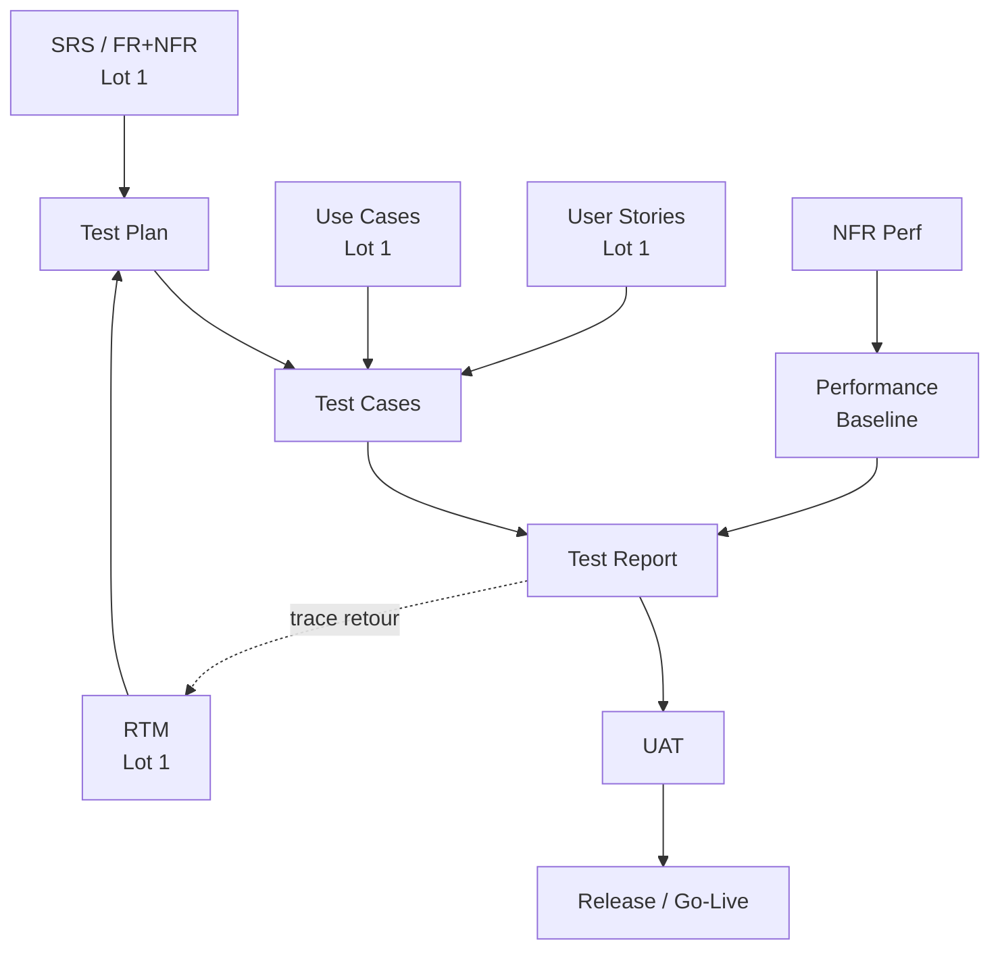

# ④ Test / Verification & Validation

> 📁 Lot 4 · 5 fiches · En cours 🔄

Ce dossier couvre les documents qui **organisent, exécutent et prouvent la conformité** du logiciel aux exigences : la planification des tests, leur spécification, leurs résultats, la recette utilisateur et la mesure des performances. La question centrale : **« Le système fait-il ce qu'il est censé faire, et à quel niveau de qualité ?** »

---

## Carte du lot

---

## Index des fiches

| #   | Acronyme          | Nom complet                       | Question clé                                                            | Fiche                                    |
| --- | ----------------- | --------------------------------- | ----------------------------------------------------------------------- | ---------------------------------------- |
| 01  | **Test Plan**     | Test Plan                         | _Comment allons-nous tester le système ?_                               | [→](./01-test-plan.md)                   |
| 02  | **Test Cases**    | Test Cases / Test Specifications  | _Exactement quoi tester et comment ?_                                   | [→](./02-test-cases.md)                  |
| 03  | **Test Report**   | Test Report / Test Summary Report | _Qu'est-ce qui a passé, échoué, et quel est le verdict ?_               | [→](./03-test-report.md)                 |
| 04  | **UAT**           | User Acceptance Testing           | _Les utilisateurs valident-ils que le système répond à leurs besoins ?_ | [→](./04-uat-user-acceptance-testing.md) |
| 05  | **Perf Baseline** | Performance Baseline              | _Quelles sont les performances de référence mesurées ?_                 | [→](./05-performance-baseline.md)        |

---

## Distinctions clés

| Doc               | Qui le produit        | Qui le valide   | À quelle phase      |
| ----------------- | --------------------- | --------------- | ------------------- |
| **Test Plan**     | QA / Test Manager     | PO + Tech Lead  | Avant les tests     |
| **Test Cases**    | QA / Dev              | Tech Lead + PO  | Avant les tests     |
| **Test Report**   | QA                    | Tech Lead + PO  | Après les tests     |
| **UAT**           | Métier / Utilisateurs | PO + Sponsor    | Avant la release    |
| **Perf Baseline** | Dev / SRE             | Architecte + PO | Release ou régulier |

---

## Positionnement dans le cycle de vie

| Depuis (Lots 1–3)                  | Ce lot produit                     | Vers (Lot 5)                            |
| ---------------------------------- | ---------------------------------- | --------------------------------------- |
| SRS + RTM → Test Plan + Cases      | Couverture complète des exigences  | Test Report → go/no-go prod             |
| DoD → critères dans les Test Cases | UAT = validation finale métier     | Runbooks mis à jour selon les résultats |
| NFR-PERF → Performance Baseline    | Mesure objective de la performance | Alertes prod calées sur la Baseline     |

---

⬅️ [Lot 3 : Quality & Development](../03-quality-development/README.md) · 🏠 [Index général](../README.md) · ➡️ Lot 5 : [Operations / Risk / Safety](../05-operations-risk-safety/) _(à venir)_
