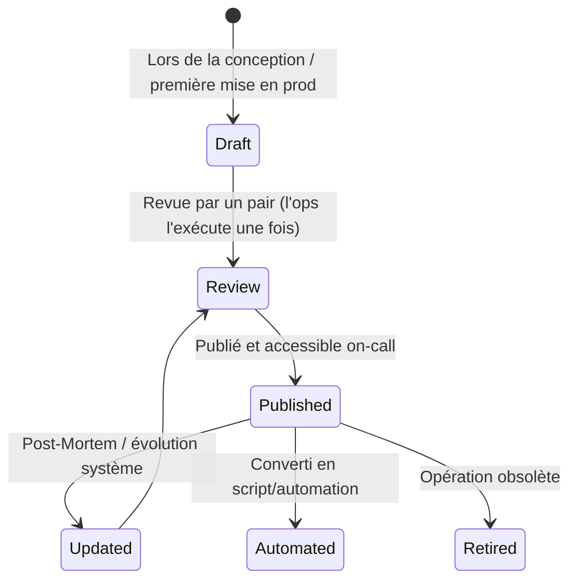

# Runbook

> 📁 Phase : ⑤ Operations / Risk / Safety · 🏷️ Acronyme : **Runbook** · 🔤 EN : _Runbook / Operations Runbook_

---

## 1. Définition & objectif

Un **Runbook** est un document qui décrit **les procédures pas à pas pour exécuter une opération spécifique sur un système** : démarrage, arrêt, redémarrage, mise à jour, diagnostic ou toute tâche d'exploitation récurrente. Il répond à « **Comment effectue-t-on cette opération précise sur ce système, sans avoir à appeler quelqu'un à 3h du matin ?** »

C'est le manuel d'exploitation opérationnel, destiné aux ingénieurs on-call (SRE / Ops) pour leur permettre d'agir en autonomie et de façon reproductible.

| Ce qu'il EST                                     | Ce qu'il N'EST PAS                          |
| ------------------------------------------------ | ------------------------------------------- |
| Une procédure technique précise et reproductible | Un guide de réponse à incident (→ Playbook) |
| Orienté opération unique et bien définie         | Une documentation d'architecture (→ SAD)    |
| Utilisé par l'on-call sans aide extérieure       | Un outil de formation                       |

> **Runbook vs Playbook** : le **Runbook** décrit _comment faire quelque chose_ (restart du service X) ; le **Playbook** orchestre _quoi faire_ face à un scénario (incident « portail inaccessible »), en appelant potentiellement plusieurs runbooks.

---

## 2. Usage & utilité

- **Autonomie on-call** : l'ingénieur de garde résout le problème sans escalader.
- **Cohérence** : la même procédure est exécutée de la même façon par n'importe qui.
- **Réduction du MTTR** (_Mean Time To Restore_) : pas de recherche ni d'improvisation.
- **Onboarding ops** : les nouveaux ingénieurs apprennent le système en suivant les runbooks.
- **Automatisation** : les runbooks manuels sont la base des runbooks automatisés (scripts, Ansible, Terraform).

---

## 3. Périmètre (in / out of scope)

**In scope**

- Prérequis (accès, outils, contexte nécessaire).
- Étapes numérotées avec commandes exactes.
- Sorties attendues à chaque étape (comment savoir que ça a marché).
- Points de vérification et rollback si l'opération échoue.
- Références aux contacts en cas de blocage.

**Out of scope**

- Stratégie de réponse à incident (→ **Playbook**).
- Architecture du système (→ **SAD**).
- Explication du _pourquoi_ de l'architecture (→ **ADR**).

---

## 4. Cycle de vie du document



- **Naissance** : lors de la préparation au go-live (ORR) ou après un premier incident.
- **Vie** : mis à jour après chaque Post-Mortem qui révèle une lacune, et à chaque évolution du système.
- **Fin** : retiré quand l'opération est entièrement automatisée ou obsolète.

> **Règle** : tout runbook exécuté pour la première fois doit être **testé par une personne qui ne l'a pas écrit**.

---

## 5. Métiers / rôles concernés (RACI)

| Activité                    | Dev / SRE | Tech Lead | Ops / On-Call | Architecte |
| --------------------------- | :-------: | :-------: | :-----------: | :--------: |
| Rédaction                   |   **R**   |     C     |       C       |     I      |
| Test (exécution à blanc)    |     C     |     I     |     **R**     |     I      |
| Validation                  |     C     |   **R**   |       C       |     I      |
| Exécution en prod           |     I     |     I     |     **R**     |     I      |
| Mise à jour (post-incident) |   **R**   |     C     |     **R**     |     I      |

**R**esponsible · **A**ccountable · **C**onsulted · **I**nformed.

---

## 6. Position & interactions avec les autres documents

```mermaid
flowchart LR
    ORR --> RUN[Runbooks\n(prérequis go-live)]
    SAD --> RUN
    PLB[Playbooks] -.appelle.-> RUN
    PM[Post-Mortem] -.améliore.-> RUN
    RUN -.automatisé en.-> AUTO[Scripts / IaC\nAnsible / Terraform]
    SLA[SLA/SLO/SLI] -.MTTR cible.-> RUN
```

| Document        | Relation                                                                |
| --------------- | ----------------------------------------------------------------------- |
| **ORR**         | Les runbooks sont un prérequis de l'ORR (go-live).                      |
| **Playbook**    | Appelle les runbooks comme briques élémentaires.                        |
| **Post-Mortem** | Révèle les runbooks manquants ou incorrects → mise à jour.              |
| **SLA/SLO**     | Le MTTR cible (SLO) motive la qualité et l'automatisation des runbooks. |

---

## 7. Nommage & versionnement

- **Fichier** : `RB-<service>-<opération>.md` — ex. `RB-billing-service-restart.md`.
- **Stockage** : dans le dépôt Git du service, sous `docs/runbooks/` ou dans le wiki (Confluence).
- **Accessible depuis** : le tableau de bord de monitoring (lien dans les alertes Grafana/PagerDuty).
- **Versionnement** : Git ; date de dernière validation en en-tête.

---

## 8. Template vierge

````markdown
# Runbook : <Titre de l'opération>

| Champ               | Valeur                 |
| ------------------- | ---------------------- |
| Service             |                        |
| Opération           |                        |
| Durée estimée       | ~<n> min               |
| Risque              | Faible / Moyen / Élevé |
| Dernière validation | AAAA-MM-JJ             |
| Auteur              |                        |
| On-call channel     | #ops-portal            |

## Contexte & déclencheurs

<Quand exécute-t-on ce runbook ? Quelle alerte, quel besoin ?>

## Prérequis

- [ ] Accès SSH / kubectl / console cloud
- [ ] Membership groupe `sre-team`
- [ ] VPN connecté
- Outil X installé (version ≥ y)

## Impact attendu de l'opération

<Downtime ? Dégradation ? Invisible pour les utilisateurs ?>

## Procédure

### Étape 1 : <Titre>

```bash
# Commande exacte
```
````

**Sortie attendue :**

```
<exemple de sortie attendue>
```

✅ **Vérification** : <comment savoir que l'étape a réussi>

### Étape 2 : <Titre>

...

## Vérification finale

<Comment confirmer que l'opération a réussi globalement>

## Rollback

<Comment annuler l'opération si elle échoue>

## Contacts

| Situation         | Contact            |
| ----------------- | ------------------ |
| Blocage technique | @<tech-lead> Slack |
| Escalade          | @<sre-manager>     |

````

---

## 9. Exemple rempli

```markdown
# Runbook : Redémarrage d'urgence du Billing Service

| Champ | Valeur |
|-------|--------|
| Service | billing-service |
| Durée estimée | ~5 min |
| Risque | Moyen (indisponibilité génération PDF < 5 min) |
| Dernière validation | 2026-04-01 |

## Déclencheurs
- Alerte `BillingServiceDown` (PagerDuty)
- p95 génération PDF > 60s depuis > 5 min
- Erreurs 503 sur `POST /internal/v1/generate-pdf` > 5%

## Prérequis
- [ ] `kubectl` configuré pour le cluster `portal-prod`
- [ ] Membership `sre-team` (Kubernetes RBAC)
- [ ] VPN corp actif

## Impact
Indisponibilité de la génération de PDF pendant ~2-3 min.
Les requêtes en attente seront rejouées automatiquement (queue RabbitMQ persistante).

## Procédure

### Étape 1 : Vérifier l'état des pods
```bash
kubectl get pods -n portal -l app=billing-service
````

**Sortie attendue :**

```
NAME                              READY   STATUS    RESTARTS
billing-service-7d9f8b-xk2p1     0/1     CrashLoopBackOff   5
```

✅ Confirme que le pod est bien en erreur.

### Étape 2 : Consulter les logs récents

```bash
kubectl logs -n portal -l app=billing-service --tail=100 --previous
```

Chercher l'erreur : `OutOfMemoryError`, `ECONNREFUSED`, `timeout`.
→ Si OOM : continuer. Si DB conn refused : voir RB-postgres-connections.md

### Étape 3 : Redémarrer le déploiement

```bash
kubectl rollout restart deployment/billing-service -n portal
```

**Sortie attendue :** `deployment.apps/billing-service restarted`

### Étape 4 : Attendre le redémarrage

```bash
kubectl rollout status deployment/billing-service -n portal
```

**Sortie attendue :** `deployment "billing-service" successfully rolled out`

## Vérification finale

```bash
curl -X POST https://api.portal.example.com/internal/v1/generate-pdf \
  -H "Authorization: Bearer $SERVICE_TOKEN" \
  -d '{"invoiceId":"TEST-001","customerId":"TEST"}'
# Attendu : HTTP 202
```

Vérifier Grafana dashboard "Billing Service" : p95 PDF < 10s.

## Rollback

Le redémarrage est réversible : si le nouveau pod crashe aussi,
vérifier les ressources (OOM limit) → RB-billing-increase-memory.md

## Contacts

| Situation              | Contact                   |
| ---------------------- | ------------------------- |
| Problème DB persistant | DBA on-call (@dba-oncall) |
| Problème RabbitMQ      | @infra-team Slack         |

````

---

## 10. Checklist de revue

- [ ] Le **déclencheur** est clair (quelle alerte, quelle condition).
- [ ] Les **prérequis d'accès** sont listés.
- [ ] Les **commandes sont copiables** telles quelles (pas de pseudo-code).
- [ ] Chaque étape a une **sortie attendue** et une vérification.
- [ ] Un **rollback** est défini.
- [ ] L'**impact** sur les utilisateurs est précisé.
- [ ] Le runbook a été **exécuté en test** par quelqu'un qui ne l'a pas écrit.
- [ ] La **date de dernière validation** est présente.

---

## 11. Anti-patterns & pièges

| Anti-pattern | Problème | Correctif |
|--------------|----------|-----------|
| 📝 **Commandes pseudo-code** (`<your-pod-name>`) | Inutilisable sous stress | Commandes exactes avec selectors |
| 🕳️ **Pas de vérification** à chaque étape | On ne sait pas si ça a marché | Sortie attendue + check obligatoire |
| 🧊 **Runbook obsolète** (testé il y a 2 ans) | Procédure qui ne fonctionne plus | Date de validation + test régulier |
| 📚 **Runbook trop long** | Inutilisable sous pression | < 2 pages ; scinder si nécessaire |
| 🔒 **Secrets en dur** dans les commandes | Risque sécurité | Variables d'environnement / Vault |
| 🤷 **Pas de rollback** | On est bloqué si ça rate | Rollback obligatoire pour toute opération risquée |

---

## 12. Variantes par industrie / contexte

| Contexte | Spécificités |
|----------|--------------|
| **Kubernetes / Cloud** | Runbooks avec `kubectl`, `aws-cli`, `gcloud` ; automatisables en GitHub Actions. |
| **SRE (Google model)** | Runbooks intégrés aux alertes (lien direct depuis PagerDuty/Grafana). |
| **Ops traditionnel** | Runbooks pour déploiements manuels, scripts SQL, procédures de sauvegarde. |
| **Systèmes critiques** | Procédures de maintenance formelles, approuvées et auditées. |
| **Automatisation** | Runbook-as-code : Ansible playbooks, scripts Python, AWS Systems Manager Run Command. |

---

## 13. Standards & normes

- **Google SRE Book** — Runbooks comme outil de réduction du toil ; automatisation progressive.
- **ITIL 4** — *Operational procedures* dans la gestion des services.
- **ISO 20000** — documentation des procédures d'exploitation.

---

## 14. Outillage recommandé

| Besoin | Outils |
|--------|--------|
| Stockage & recherche | Confluence, Notion, PagerDuty Runbooks, GitBook, repo Git |
| Lien depuis les alertes | PagerDuty (runbook URL dans les services), Grafana alerting |
| Automatisation | Ansible, Rundeck, AWS Systems Manager, Temporal |
| Tests de runbooks | Chaos engineering (Gremlin, Chaos Monkey) |

---

## 15. Diagramme — Cycle de vie d'une alerte et son runbook

```mermaid
sequenceDiagram
    participant MON as Monitoring (Grafana)
    participant PD as PagerDuty
    participant ONCALL as Ingénieur on-call
    participant RUN as Runbook
    participant SYS as Système

    MON->>PD: Alerte BillingServiceDown
    PD->>ONCALL: Notification (SMS + app)
    ONCALL->>PD: Acknowledge
    PD->>ONCALL: Lien → Runbook RB-billing-restart.md
    ONCALL->>RUN: Lit et suit le runbook
    RUN->>SYS: kubectl rollout restart billing-service
    SYS-->>ONCALL: Pod redémarré ✅
    ONCALL->>PD: Resolve incident
    Note over ONCALL: Si runbook insuffisant → Post-Mortem → mise à jour
````

---

> 🔎 **En une phrase** : un Runbook transforme une opération complexe en **recette de cuisine reproductible** — n'importe quel ingénieur on-call peut l'exécuter seul à 3h du matin sans risquer d'aggraver la situation.

⬅️ [Index du lot](./README.md) · ➡️ Suivant : [Playbooks](./02-playbooks.md)
