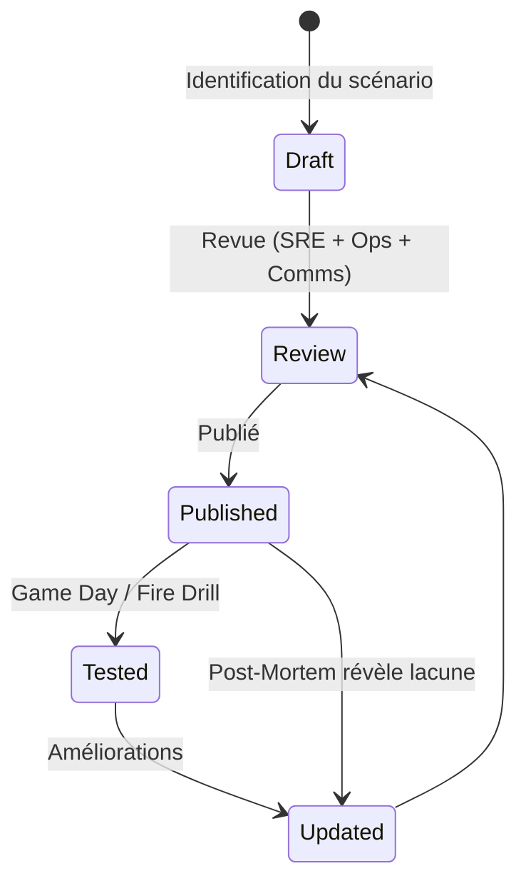
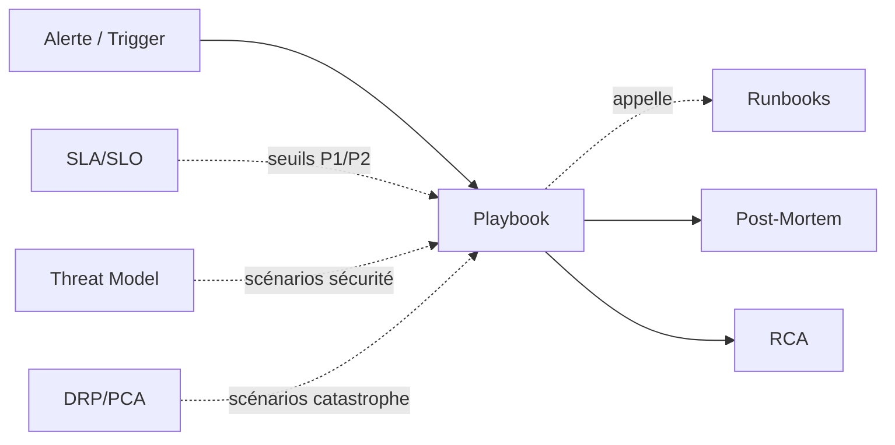
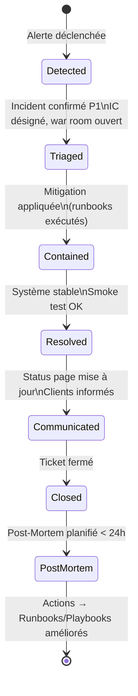

# Playbook

> 📁 Phase : ⑤ Operations / Risk / Safety · 🏷️ Acronyme : **Playbook** · 🔤 EN : _Incident Playbook / Response Playbook_

---

## 1. Définition & objectif

Un **Playbook** est un document qui décrit **la stratégie et l'orchestration de la réponse à un scénario défini** (incident, crise de sécurité, problème de performance…), en coordonnant les actions de plusieurs acteurs. Il répond à « **Face à ce scénario, qui fait quoi, dans quel ordre, et comment coordonne-t-on la réponse ?** »

Là où le Runbook est une procédure technique atomique, le Playbook est la **partition d'orchestre** qui coordonne plusieurs acteurs et peut appeler plusieurs Runbooks.

| Ce qu'il EST                                           | Ce qu'il N'EST PAS                           |
| ------------------------------------------------------ | -------------------------------------------- |
| L'orchestration de la réponse à un scénario            | Une procédure technique atomique (→ Runbook) |
| Multi-acteurs (technique + communication + management) | Un Runbook nommé autrement                   |
| Orienté scénario / trigger                             | Un guide de formation                        |

> **Exemples de scénarios** : « Portail inaccessible », « Fuite de données détectée », « Pic de charge × 10 », « Compromission d'un service account », « Rollback d'urgence ».

---

## 2. Usage & utilité

- **Coordonner** : tout le monde sait qui est l'_Incident Commander_, qui communique, qui corrige.
- **Réduire le MTTD/MTTR** : pas d'improvisation, pas de questions « qui prend quoi ? ».
- **Communication de crise** : les templates de communication (clients, direction) sont prêts.
- **Entraînement** : les Game Days / Fire Drills s'appuient sur les playbooks.
- **Post-Mortem** : le playbook exécuté est la timeline de l'incident.

---

## 3. Périmètre (in / out of scope)

**In scope**

- Déclencheurs du scénario.
- Rôles pendant l'incident (Incident Commander, Tech Lead, Comms Lead…).
- Phases de réponse : détection → contention → résolution → communication.
- Escalade et seuils (P1/P2/P3).
- Templates de communication (clients, direction, support).
- Liens vers les Runbooks techniques concernés.
- Critères de clôture de l'incident.

**Out of scope**

- Commandes techniques détaillées → **Runbooks**.
- Analyse post-incident → **RCA / Post-Mortem**.
- Prévention → **Risk Register / Threat Model**.

---

## 4. Cycle de vie du document



- **Naissance** : à la préparation du go-live (ORR) pour les scénarios critiques ; après chaque incident majeur.
- **Vie** : testé via des **Game Days** (simulations) ; mis à jour après chaque Post-Mortem.
- **Fin** : retiré quand le scénario n'est plus applicable.

---

## 5. Métiers / rôles concernés (RACI)

| Activité                       | SRE / Tech Lead |  Ops  | Comms / Support | Management | Sécurité |
| ------------------------------ | :-------------: | :---: | :-------------: | :--------: | :------: |
| Rédaction                      |      **R**      |   C   |        C        |     I      |    C     |
| Revue                          |      **R**      | **R** |      **R**      |     C      |    C     |
| Exécution (Incident Commander) |      **A**      |   R   |        R        |     I      |    C     |
| Communication                  |        I        |   I   |      **R**      |     C      |    I     |
| Post-Mortem / amélioration     |      **R**      |   C   |        I        |     I      |    C     |

**R**esponsible · **A**ccountable · **C**onsulted · **I**nformed.

---

## 6. Position & interactions avec les autres documents



| Document              | Relation                                                                            |
| --------------------- | ----------------------------------------------------------------------------------- |
| **Runbooks**          | Le Playbook orchestre l'incident ; les Runbooks fournissent les actions techniques. |
| **SLA/SLO**           | Les niveaux de sévérité (P1/P2) et les délais sont calés sur les SLO.               |
| **Post-Mortem / RCA** | Chaque incident majeur déclenche une revue qui améliore le Playbook.                |
| **DRP/PCA**           | Les scénarios de désastre ont leur propre Playbook (ou sont intégrés).              |

---

## 7. Nommage & versionnement

- **Fichier** : `PB-<scénario>.md` — ex. `PB-portail-inaccessible.md`, `PB-data-breach.md`.
- **Accessibilité** : lien depuis PagerDuty/Opsgenie, dashboard ops, canal Slack #incidents.
- **Versionnement** : Git ; date de dernier test (Game Day) en en-tête.

---

## 8. Template vierge

```markdown
# Playbook : <Scénario>

| Champ                   | Valeur              |
| ----------------------- | ------------------- |
| Scénario                |                     |
| Sévérité                | P1 / P2 / P3        |
| Déclencheur             | Alerte X / Signal Y |
| Incident Commander      | Rôle (pas un nom)   |
| Dernier test (Game Day) | AAAA-MM-JJ          |

## 1. Déclencheurs

<Quelles alertes, quels signaux font déclencher ce playbook ?>

## 2. Sévérité & escalade

| Niveau        | Critère | Temps de réponse | Escalade  |
| ------------- | ------- | :--------------: | --------- |
| P1 — Critique |         |     < 15 min     | CTO       |
| P2 — Majeur   |         |       < 1h       | VP Eng    |
| P3 — Mineur   |         |       < 4h       | Tech Lead |

## 3. Rôles pendant l'incident

| Rôle                        | Responsabilité             | Qui           |
| --------------------------- | -------------------------- | ------------- |
| **Incident Commander (IC)** | Coordonne, décide, clôture | On-call SRE   |
| **Tech Lead**               | Diagnostic et fix          | Dev senior    |
| **Comms Lead**              | Communication externe      | Support / PO  |
| **Scribe**                  | Note la timeline           | IC ou désigné |

## 4. Phases de réponse

### Phase 1 : Détection & triage (0–15 min)

- [ ] Confirmer l'incident (pas un faux positif)
- [ ] Évaluer la sévérité → ouvrir le war room (#incidents-<ticket>)
- [ ] Assigner les rôles
- [ ] Premier statut page (si P1/P2)

### Phase 2 : Contention (15–60 min)

- [ ] Identifier la cause probable
- [ ] Appliquer la mitigation immédiate (runbook : <lien>)
- [ ] Mise à jour statut page (toutes les 30 min)

### Phase 3 : Résolution

- [ ] Fix appliqué, système stable
- [ ] Vérification end-to-end (smoke test)
- [ ] Communication de résolution

### Phase 4 : Clôture

- [ ] Post-Mortem planifié (P1 : < 24h, P2 : < 72h)
- [ ] Statut page mis à jour : résolu
- [ ] Ticket incident fermé avec timeline

## 5. Templates de communication

### Communication initiale (clients / status page)
```

[Titre] : Dégradation du service <fonctionnalité>
Nous sommes informés d'un problème affectant <fonctionnalité>.
Les équipes sont mobilisées. Prochain point dans 30 minutes.
Heure de début : HH:MM UTC.

```

### Mise à jour en cours
```

Mise à jour HH:MM : Nous avons identifié la cause (<description vague>).
Un correctif est en cours de déploiement.

```

## 6. Runbooks associés
| Symptôme | Runbook |
|----------|---------|

## 7. Critères de clôture
```

---

## 9. Exemple rempli

```markdown
# Playbook : Portail Client Inaccessible (P1)

| Champ        | Valeur                                          |
| ------------ | ----------------------------------------------- |
| Sévérité     | P1                                              |
| Déclencheur  | Alerte `PortalDown` > 2 min OU error rate > 20% |
| Dernier test | 2026-03-15 (Game Day #3)                        |

## 2. Escalade

| Niveau | Critère                               | Réponse  | Escalade      |
| ------ | ------------------------------------- | :------: | ------------- |
| P1     | Portail totalement inaccessible       | < 15 min | CTO + Dir. RC |
| P2     | Fonctionnalité dégradée (factures KO) |   < 1h   | VP Eng        |

## 4. Phases

### Phase 1 — Triage (0–10 min)

- [ ] Confirmer depuis un autre device/réseau (pas VPN seul)
- [ ] Vérifier [Grafana Dashboard](https://grafana.portal/d/portal-overview)
- [ ] Ouvrir le canal #inc-YYYYMMDD-portal sur Slack
- [ ] Créer ticket Jira INC-###
- [ ] Publier sur la status page (Statuspage.io)

### Phase 2 — Contention (10–30 min)

- [ ] Vérifier l'API Gateway (Kong) → [RB-kong-health.md](./runbooks/RB-kong-health.md)
- [ ] Vérifier le Customer API → [RB-customer-api-restart.md](./runbooks/RB-customer-api-restart.md)
- [ ] Vérifier la DB → [RB-postgres-connections.md](./runbooks/RB-postgres-connections.md)
- [ ] Si tout OK mais SPA blanche : vérifier le CDN → [RB-cdn-cache-purge.md](./runbooks/RB-cdn-cache-purge.md)

### Phase 3 — Résolution

- [ ] Smoke test : se connecter + consulter une commande + télécharger une facture
- [ ] p95 < 500ms vérifié dans Grafana
- [ ] Communication : « Problème résolu à HH:MM UTC »

## 5. Template communication P1
```

🔴 INCIDENT EN COURS — Portail Client Self-Service
Depuis HH:MM UTC, le portail client est inaccessible.
Nos équipes travaillent à la résolution.
Prochain point dans 30 min — suivi sur https://status.example.com

```

## 6. Runbooks associés
| Symptôme | Runbook |
|----------|---------|
| Pod KO | RB-customer-api-restart.md |
| DB saturée | RB-postgres-connections.md |
| CDN/SPA blanche | RB-cdn-cache-purge.md |
| Keycloak KO | RB-keycloak-restart.md |
```

---

## 10. Checklist de revue

- [ ] Les **déclencheurs** sont précis (quelle alerte, quel seuil).
- [ ] Les **rôles** sont des fonctions, pas des noms de personnes.
- [ ] Les **délais de réponse** sont calés sur les SLO.
- [ ] Les **templates de communication** sont prêts à copier-coller.
- [ ] Les **runbooks** associés sont listés avec liens.
- [ ] Le Playbook a été **testé** (Game Day) récemment.
- [ ] Les **critères de clôture** sont définis.
- [ ] Un **Post-Mortem** est prévu après chaque déclenchement P1/P2.

---

## 11. Anti-patterns & pièges

| Anti-pattern                     | Problème                                | Correctif                             |
| -------------------------------- | --------------------------------------- | ------------------------------------- |
| 👤 **Rôles = noms de personnes** | Inutilisable si la personne est absente | Rôles fonctionnels (on-call rotation) |
| 🏃 **Playbook jamais testé**     | Dysfonctionnel en vrai incident         | Game Days réguliers (trimestriel min) |
| 📢 **Communication oubliée**     | Clients sans info, escalade direction   | Communication = phase obligatoire     |
| 🔐 **Accès non préparés**        | Ingénieur bloqué par les droits         | Liste d'accès prérequis vérifiée      |
| 📚 **Trop long**                 | Inutilisable sous pression              | Max 2 pages ; runbooks pour le détail |
| 🧟 **Jamais mis à jour**         | Réponse inadaptée au système actuel     | Révision systématique post-incident   |

---

## 12. Variantes par industrie / contexte

| Contexte               | Spécificités                                                                      |
| ---------------------- | --------------------------------------------------------------------------------- |
| **SRE (Google model)** | Playbooks intégrés aux alertes ; automatisation progressive (auto-remediation).   |
| **Sécurité (CSIRT)**   | _Security Incident Response Playbook_ (SIRP) : data breach, ransomware, phishing. |
| **Finance**            | Playbooks de continuité réglementaires (DORA EU, règlements BCM).                 |
| **On-call**            | Outil : PagerDuty / Opsgenie avec lien direct vers le Playbook.                   |
| **Chaos Engineering**  | Les scénarios de Game Days sont des Playbooks de test.                            |

---

## 13. Standards & normes

- **Google SRE Book** — Incident Management ; rôles et processus.
- **NIST SP 800-61** — _Computer Security Incident Handling Guide_.
- **ISO/IEC 27035** — _Information Security Incident Management_.
- **ITIL 4** — _Incident Management Practice_.

---

## 14. Outillage recommandé

| Besoin                   | Outils                                             |
| ------------------------ | -------------------------------------------------- |
| Stockage & accessibilité | PagerDuty Runbook URL, Confluence, Notion, GitBook |
| Gestion d'incident       | PagerDuty, Opsgenie, Incident.io, FireHydrant      |
| Status page              | Statuspage.io (Atlassian), BetterUptime            |
| Communication            | Slack (#incidents), Teams (war room)               |
| Game Days                | Gremlin, LitmusChaos (chaos engineering)           |

---

## 15. Diagramme — Cycle de vie d'un incident P1



---

> 🔎 **En une phrase** : un Playbook est la **partition d'un orchestre en crise** — il coordonne les rôles, les actions et la communication pour transformer un chaos d'incident en réponse organisée et reproductible.

⬅️ [Runbooks](./01-runbooks.md) · ➡️ Suivant : [ORR](./03-orr-operational-readiness-review.md)
