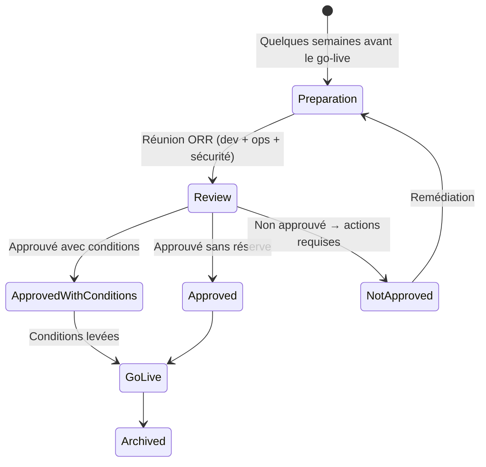
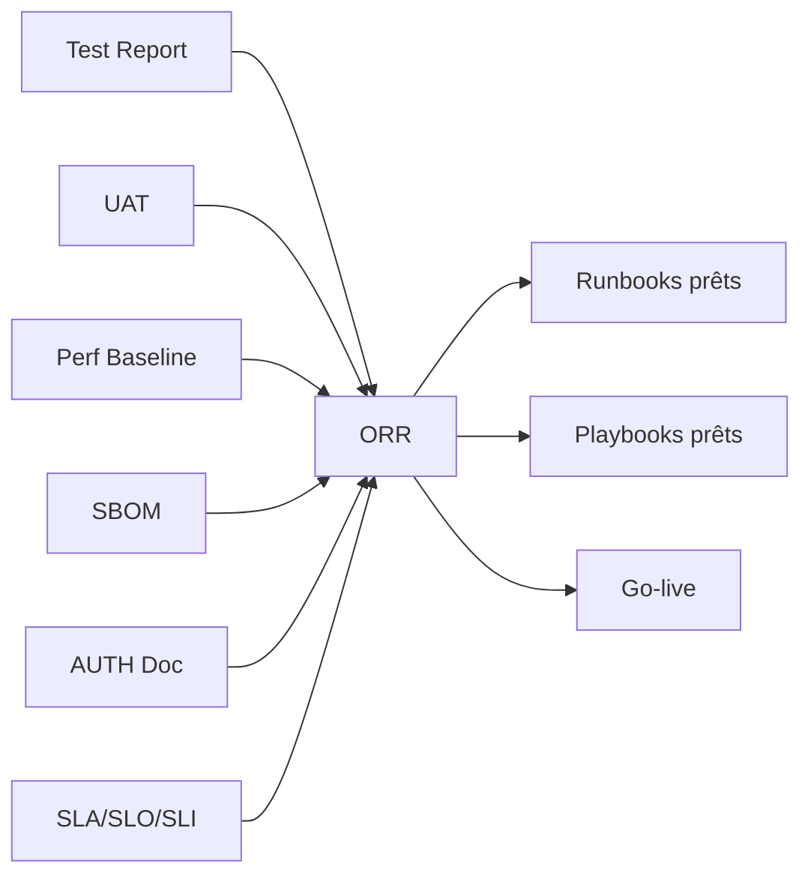

# ORR — Operational Readiness Review

> 📁 Phase : ⑤ Operations / Risk / Safety · 🏷️ Acronyme : **ORR** · 🔤 EN : _Operational Readiness Review / Production Readiness Review (PRR)_

---

## 1. Définition & objectif

L'**ORR** (_Operational Readiness Review_ — aussi appelé _Production Readiness Review_ ou _Launch Readiness Review_) est une **revue formelle qui vérifie que le système est prêt à passer en production** de façon fiable, sécurisée et opérationnellement maîtrisée. Elle répond à « **L'équipe est-elle prête à mettre ce système en production et à le maintenir en conditions opérationnelles ?** »

L'ORR dépasse la simple question « est-ce que ça fonctionne ? » pour couvrir : monitoring, alertes, runbooks, sécurité, scalabilité, rollback, formation des ops, SLO, conformité.

| Ce qu'il EST                           | Ce qu'il N'EST PAS                        |
| -------------------------------------- | ----------------------------------------- |
| La gate de validation avant le go-live | Un test fonctionnel (→ Test Report / UAT) |
| Un audit ops multi-dimensionnel        | Une revue de code                         |
| Un contrat entre dev et ops            | Un document purement formel               |

> **Noms alternatifs** : _Production Readiness Review (PRR)_ (Google SRE), _Launch Readiness Checklist_, _Go-Live Gate_.

---

## 2. Usage & utilité

- **Réduire les incidents en prod** : les problèmes opérationnels sont détectés avant le go-live.
- **Aligner dev et ops** : les deux équipes valident ensemble les prérequis.
- **Standardiser le go-live** : pas de « on pousse en prod et on voit ».
- **Transfert de responsabilité** : l'équipe de dev transfère la responsabilité opérationnelle à l'équipe ops.
- **Conformité** : en systèmes réglementés, l'ORR est un artefact d'audit.

---

## 3. Périmètre (in / out of scope)

**In scope**

- Monitoring & alerting (toutes les métriques golden signals couvertes).
- Runbooks pour les incidents prévisibles.
- Capacité et scalabilité (dimensionnement, auto-scaling).
- Sécurité (vulnérabilités, secrets, accès).
- Rollback plan.
- SLO définis et mesurables.
- Formation des équipes on-call.
- Conformité réglementaire (RGPD, PCI-DSS…).
- Documentation (Architecture, API Spec, Developer Guide à jour).

**Out of scope**

- Résultats des tests fonctionnels → **Test Report / UAT**.
- Exigences métier → **BRD / SRS**.

---

## 4. Cycle de vie du document



- **Naissance** : initié 2–4 semaines avant le go-live.
- **Vie** : unique par release majeure ; une ORR peut être refaite après une refonte majeure.
- **Fin** : archivé avec la release.

---

## 5. Métiers / rôles concernés (RACI)

| Activité                    | Tech Lead | SRE / Ops | Dev | Sécurité |  PO   |
| --------------------------- | :-------: | :-------: | :-: | :------: | :---: |
| Préparation de la checklist |   **R**   |   **R**   |  C  |    C     |   I   |
| Revue de sécurité           |     C     |     C     |  I  |  **R**   |   I   |
| Revue ops                   |     C     |   **R**   |  C  |    C     |   I   |
| Décision go/no-go           |     C     |     C     |  I  |    C     | **A** |
| Suivi des conditions        |   **R**   |   **R**   |  C  |    C     |   C   |

**R**esponsible · **A**ccountable · **C**onsulted · **I**nformed.

---

## 6. Position & interactions avec les autres documents



| Document                 | Relation                                              |
| ------------------------ | ----------------------------------------------------- |
| **Test Report + UAT**    | Prérequis : tests passés avant l'ORR.                 |
| **SLA/SLO**              | L'ORR valide que les SLO sont mesurables.             |
| **Runbooks / Playbooks** | Doivent exister avant le go-live (critère ORR).       |
| **SBOM**                 | Vérifié dans l'ORR (pas de CVE critique non traitée). |

---

## 7. Nommage & versionnement

- **Fichier** : `ORR-<Système>-<Release>-<Date>.md`.
- **Archivé** avec la release ; signé par les parties prenantes.
- **Checklist automatisée** possible (GitHub Actions qui vérifient certains critères).

---

## 8. Template vierge (checklist ORR)

```markdown
# ORR — <Système> — <Release>

_Date : AAAA-MM-JJ — Statut : ✅ Approuvé / ⚠️ Conditions / ❌ Non approuvé_

## 1. Fiabilité & résilience

- [ ] Tests de charge validés (NFR-PERF satisfaite)
- [ ] Stratégie de retry / circuit breaker implémentée
- [ ] Graceful degradation testée (dépendances indisponibles)
- [ ] Auto-scaling configuré et testé
- [ ] Rollback plan documenté et testé

## 2. Monitoring & alerting

- [ ] Golden signals couverts (latency, traffic, errors, saturation)
- [ ] Dashboards Grafana en place et compréhensibles
- [ ] Alertes configurées avec runbook URL (PagerDuty/Opsgenie)
- [ ] Logs structurés en place (format + rétention définie)
- [ ] Distributed tracing activé

## 3. Sécurité

- [ ] SBOM : 0 CVE critique non traitée
- [ ] Secrets dans Vault (0 secret en dur)
- [ ] TLS activé sur tous les points d'entrée
- [ ] Accès production limités (principe de moindre privilège)
- [ ] Audit trail activé

## 4. Opérabilité

- [ ] Runbooks pour les incidents prévisibles (≥ top 5 alertes)
- [ ] Playbook P1 disponible et testé
- [ ] On-call rotation configurée (rotation, escalade)
- [ ] Formation on-call effectuée

## 5. Documentation

- [ ] Architecture (SAD / C4) à jour
- [ ] API Spec à jour
- [ ] Release Notes rédigées
- [ ] Developer Guide à jour

## 6. Conformité

- [ ] RGPD : DPIA à jour si données personnelles concernées
- [ ] Licences SBOM validées (pas de licence incompatible)
- [ ] Conditions contractuelles respectées (SLA client)

## 7. SLO & SLA

- [ ] SLO définis et mesurables
- [ ] Error budget calculé
- [ ] SLA clients documenté

## Décision

| Critère     | Statut | Commentaire |
| ----------- | ------ | ----------- |
| Fiabilité   | ✅     |             |
| Monitoring  | ✅     |             |
| Sécurité    | ✅     |             |
| Opérabilité | ✅     |             |

**Verdict : GO / NO-GO / GO avec conditions**

| Condition | Responsable | Deadline |
| --------- | ----------- | -------- |

## Signatures

| Rôle                 | Nom | Date |
| -------------------- | --- | ---- |
| Tech Lead            |     |      |
| SRE Lead             |     |      |
| Responsable Sécurité |     |      |
```

---

## 9. Exemple rempli (extrait)

```markdown
# ORR — Portail Client Self-Service — v2.1.0

_Date : 2026-04-23 — Statut : ⚠️ GO avec conditions_

## 1. Fiabilité

- [x] Tests de charge : p95 = 340ms @ 500 VU ✅
- [x] Circuit breaker Billing Service configuré (Resilience4j) ✅
- [x] Dégradation : Billing KO → message utilisateur + log ✅
- [x] Auto-scaling : HPA configuré (min 3, max 10 pods) ✅
- [x] Rollback testé en staging (< 5 min) ✅

## 2. Monitoring

- [x] Dashboard Grafana "Portal Overview" opérationnel ✅
- [x] Alertes PagerDuty : 8 alertes configurées avec runbook URL ✅
- [x] Logs JSON structurés (pino) + 90 jours rétention ✅
- [ ] Distributed tracing : ⚠️ configuré mais span coverage < 80% → condition

## 3. Sécurité

- [x] SBOM : 0 CVE critique/haute (scan du 2026-04-22) ✅
- [x] Secrets dans Vault (rotation 90j) ✅
- [x] TLS 1.3 sur tous les ingress ✅
- [x] Accès prod : SRE team uniquement (12 personnes) ✅

## Verdict : GO avec 1 condition

| Condition                   | Responsable | Deadline   |
| --------------------------- | ----------- | ---------- |
| Tracing span coverage ≥ 80% | L. Durand   | 2026-04-30 |

## Signatures

| Rôle      | Nom       | Date       |
| --------- | --------- | ---------- |
| Tech Lead | L. Durand | 2026-04-23 |
| SRE Lead  | S. Petit  | 2026-04-23 |
| RSSI      | P. Martin | 2026-04-23 |
```

---

## 10. Checklist de revue de l'ORR lui-même

- [ ] **Golden signals** tous couverts (latency, traffic, errors, saturation).
- [ ] **Rollback** possible et testé en < X min.
- [ ] **0 CVE critique/haute** dans le SBOM.
- [ ] **Runbooks** pour les top 5 alertes.
- [ ] **On-call rotation** configurée avec escalade.
- [ ] **SLO définis** et mesurables avant le go-live.
- [ ] **Conditions** documentées avec responsable et deadline.
- [ ] **Signatures** obtenues.

---

## 11. Anti-patterns & pièges

| Anti-pattern                                          | Problème                  | Correctif                                |
| ----------------------------------------------------- | ------------------------- | ---------------------------------------- |
| ✅ **ORR purement formel** (coches sans vérification) | Fausse sécurité           | Preuve pour chaque critère               |
| 🏃 **ORR la veille du go-live**                       | Pas le temps de corriger  | 2–4 semaines avant                       |
| 🎭 **Dev ORR seuls**                                  | Perspective ops absente   | SRE + Sécurité obligatoires              |
| 🕳️ **Pas de runbooks**                                | On improvise à l'incident | Runbooks prérequis                       |
| 🔒 **Conditions sans deadline**                       | Jamais levées             | Date + responsable pour chaque condition |

---

## 12. Variantes par industrie / contexte

| Contexte       | Spécificités                                                                                    |
| -------------- | ----------------------------------------------------------------------------------------------- |
| **Google SRE** | _Production Readiness Review_ formalisée ; l'équipe SRE co-propriétaire du service après l'ORR. |
| **Réglementé** | ORR = artefact de mise en service réglementaire (médical, finance, avionique).                  |
| **Agile**      | Checklist allégée à chaque release ; ORR complète pour les releases majeures.                   |
| **Cloud**      | Critères spécifiques : cost dashboard, FinOps review, backup/restore test.                      |

---

## 13. Standards & normes

- **Google SRE Book** — _Production Readiness Reviews_ (chapitre 32).
- **ITIL 4** — _Change Enablement Practice_ (évaluation avant déploiement).
- **ISO 20000** — gestion des mises en production.

---

## 14. Outillage recommandé

| Besoin     | Outils                                               |
| ---------- | ---------------------------------------------------- |
| Checklist  | Confluence, Notion, GitHub Issues (template), Linear |
| Monitoring | Grafana, Datadog, New Relic, Prometheus              |
| Alerting   | PagerDuty, Opsgenie, Grafana Alerting                |
| Sécurité   | Trivy (SBOM scan), OWASP ZAP, Vault                  |

---

## 15. Diagramme — Gate ORR dans le cycle de livraison

```mermaid
flowchart LR
    TR[Test Report\n✅ go QA] --> UAT_OK[UAT\n✅ accepté]
    UAT_OK --> ORR[ORR\nRevue ops]
    ORR --> CHECK{Tous les critères\nsatisfaits ?}
    CHECK -->|Oui| GOLIVE[🚀 Go-Live]
    CHECK -->|Conditions| COND[Go avec conditions\n(deadline)]] --> GOLIVE
    CHECK -->|Non| FIX[Actions correctives\n(runbooks, monitoring...)]
    FIX --> ORR
    GOLIVE --> RUN[Runbooks & Playbooks\nactivés]
```

---

> 🔎 **En une phrase** : l'ORR est la **dernière gate avant la production** — elle garantit que l'équipe est prête non seulement à livrer le système mais à le maintenir, le surveiller et répondre à ses incidents.

⬅️ [Playbooks](./02-playbooks.md) · ➡️ Suivant : [RCA](./04-rca-root-cause-analysis.md)
