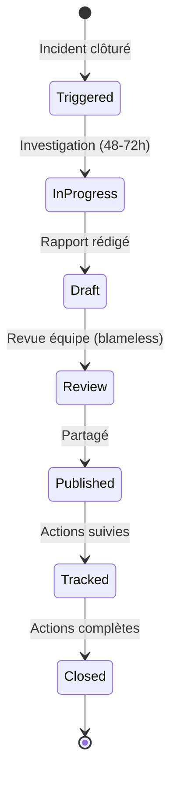
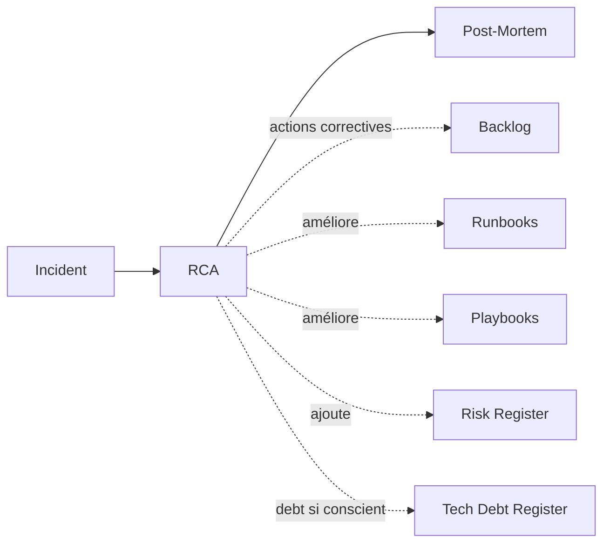
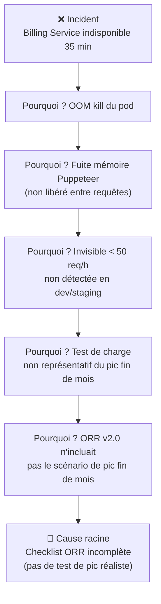

# RCA — Root Cause Analysis

> 📁 Phase : ⑤ Operations / Risk / Safety · 🏷️ Acronyme : **RCA** · 🔤 EN : _Root Cause Analysis_

---

## 1. Définition & objectif

La **RCA** (_Root Cause Analysis_ — Analyse des Causes Racines) est une **méthode et un document qui identifient la ou les cause(s) fondamentale(s) d'un incident ou d'un problème**, au-delà des symptômes superficiels. Elle répond à « **Pourquoi cet incident s'est-il vraiment produit, et quelle est la cause profonde à éliminer pour éviter la récidive ?** »

La RCA va plus loin que « le pod a crashé » : elle cherche _pourquoi_ le pod a crashé, _pourquoi_ ça n'a pas été détecté à temps, _pourquoi_ le système n'a pas récupéré automatiquement.

| Ce qu'elle EST                           | Ce qu'elle N'EST PAS                  |
| ---------------------------------------- | ------------------------------------- |
| L'analyse technique des causes profondes | Un rapport d'incident (→ Post-Mortem) |
| Une investigation rigoureuse             | Un blame game (chercher un coupable)  |
| La base des actions correctives          | Une liste de symptômes                |

> **RCA vs Post-Mortem** : la **RCA** se concentre sur les _causes_ (technique, processus, facteur humain) ; le **Post-Mortem** est le bilan complet (impact, timeline, causes, actions, apprentissages). En pratique, la RCA est une section clé du Post-Mortem.

---

## 2. Usage & utilité

- **Prévenir la récidive** : corriger la cause racine, pas juste le symptôme.
- **Apprentissage organisationnel** : comprendre les failles systémiques.
- **Améliorer la résilience** : chaque RCA renforce le système.
- **Communication** : expliquer clairement à la direction ce qui s'est passé.
- **Contractuel / réglementaire** : preuve de gestion des incidents (ISO 27001, ITIL).

---

## 3. Périmètre (in / out of scope)

**In scope**

- Chronologie précise de l'incident (timeline).
- Identification des causes racines (technique, processus, humain, organisationnel).
- Facteurs contributifs (conditions qui ont aggravé ou permis l'incident).
- Actions correctives (court terme et long terme).

**Out of scope**

- Bilan complet (impact business, communication) → **Post-Mortem**.
- Prévention systémique → **Risk Register**.

---

## 4. Cycle de vie du document



- **Naissance** : déclenchée à la clôture d'un incident significatif (P1 systématique, P2 si récurrent).
- **Délai** : < 48–72h après clôture (pendant que la mémoire est fraîche).
- **Fin** : archivée quand les actions correctives sont complètes.

---

## 5. Métiers / rôles concernés (RACI)

| Activité                 | SRE / Dev (investigateur) | Tech Lead | Incident Commander | Management |
| ------------------------ | :-----------------------: | :-------: | :----------------: | :--------: |
| Investigation technique  |           **R**           |     C     |         C          |     I      |
| Rédaction                |           **R**           |     C     |         C          |     I      |
| Facilitation (blameless) |             I             |     C     |       **R**        |     I      |
| Validation des actions   |             C             |   **R**   |         C          |   **A**    |
| Communication externe    |             I             |     I     |         C          |   **R**    |

---

## 6. Position & interactions avec les autres documents



| Document          | Relation                                                  |
| ----------------- | --------------------------------------------------------- |
| **Post-Mortem**   | La RCA est la section technique du Post-Mortem.           |
| **Runbooks**      | La RCA peut révéler un runbook manquant ou incorrect.     |
| **Risk Register** | La cause racine identifiée peut être un risque à ajouter. |

---

## 7. Nommage & versionnement

- **Fichier** : `RCA-<INC-###>-<AAAA-MM-JJ>-<titre>.md` — ex. `RCA-INC-2026-042-billing-oom.md`.
- **Base de données des RCA** : indexée pour identifier les récurrences et tendances.
- **Accessibilité** : partagée avec les équipes concernées (pas uniquement la hiérarchie).

---

## 8. Template vierge

```markdown
# RCA — INC-### : <Titre>

| Champ              | Valeur               |
| ------------------ | -------------------- |
| Incident           | INC-###              |
| Sévérité           | P1 / P2              |
| Date de l'incident | AAAA-MM-JJ HH:MM UTC |
| Date de clôture    |                      |
| Investigateur      |                      |
| Facilitateur       |                      |

## 1. Résumé

<3 phrases : que s'est-il passé, impact, cause principale.>

## 2. Impact

| Dimension               | Valeur |
| ----------------------- | ------ |
| Durée (indisponibilité) |        |
| Utilisateurs affectés   |        |
| Impact métier           |        |
| SLO consommé            |        |

## 3. Timeline (chronologie)

| Heure UTC | Événement | Acteur |
| --------- | --------- | ------ |

## 4. Causes racines

### 4.1 Méthode des 5 Pourquoi

- **Pourquoi 1** : Le service Billing a crashé.
  → Parce que : le pod a atteint sa limite mémoire (OOM kill).
- **Pourquoi 2** : La limite mémoire était atteinte.
  → Parce que : une fuite mémoire dans la génération PDF consommait ~50 MB/requête.
- **Pourquoi 3** : La fuite n'a pas été détectée.
  → Parce que : pas d'alerte sur la consommation mémoire du pod.
- **Pourquoi 4** : L'alerte n'existait pas.
  → Parce que : l'ORR n'avait pas vérifié la saturation mémoire.
- **Pourquoi 5** : L'ORR était insuffisante.
  → **Cause racine** : la checklist ORR ne couvrait pas les métriques de saturation mémoire.

### 4.2 Facteurs contributifs

- <Facteur 1 : condition ayant aggravé>

## 5. Ce qui a bien fonctionné

- <Circuit breaker a limité l'impact...>

## 6. Actions correctives

| ID  | Action                              |    Type    | Responsable | Deadline |
| --- | ----------------------------------- | :--------: | ----------- | -------- |
| A1  | Ajouter alerte mémoire pod < 80%    | Prévention |             |          |
| A2  | Corriger la fuite mémoire Puppeteer | Correction |             |          |
| A3  | Mettre à jour la checklist ORR      | Processus  |             |          |
```

---

## 9. Exemple rempli

```markdown
# RCA — INC-2026-042 : Billing Service OOM — Timeout factures 35 min

## 2. Impact

| Dimension             | Valeur                                                             |
| --------------------- | ------------------------------------------------------------------ |
| Durée                 | 35 min (14:12 → 14:47 UTC)                                         |
| Utilisateurs affectés | ~1 200 clients tentant de télécharger une facture                  |
| Impact métier         | 0 achat perdu (fonctionnalité non bloquante) ; ~40 tickets support |
| SLO consommé          | NFR-AVL-001 : 0,08% d'uptime mensuel consommé sur 0,1% disponible  |

## 3. Timeline

| Heure | Événement                                                           |
| ----- | ------------------------------------------------------------------- |
| 14:05 | Pic de génération PDF (fin de mois, 320 demandes simultanées)       |
| 14:09 | Consommation mémoire billing-service : 3,8 GB (limit : 4 GB)        |
| 14:12 | OOM kill — pod CrashLoopBackOff                                     |
| 14:14 | Alerte `BillingServiceDown` → PagerDuty (délai 2 min)               |
| 14:17 | Ingénieur on-call acknowledge                                       |
| 14:22 | Runbook RB-billing-restart exécuté → pod redémarre mais re-crashe   |
| 14:31 | Décision : réduction temporaire de la concurrence PDF (max 50 jobs) |
| 14:47 | Service stable, file RabbitMQ se vide                               |

## 4. Cause racine (5 Pourquoi)

1. Pourquoi Billing crashait ? → OOM kill (3,8 GB → limit 4 GB)
2. Pourquoi la mémoire dépassait ? → Puppeteer chargeait les images Base64 en mémoire sans les libérer entre les requêtes
3. Pourquoi pas détecté avant ? → Fuite mémoire progressive, invisible avec < 50 requêtes/h
4. Pourquoi l'alerte mémoire n'a pas prévenu ? → Alerte configurée à 90% (3,6 GB), seuil trop tardif
5. **Cause racine** : absence de test de charge représentatif du pic de fin de mois (320 req/h) lors de l'ORR v2.0

## 5. Ce qui a bien fonctionné

- Circuit breaker : Customer API a retourné une erreur gracieuse (pas de 500)
- Runbook RB-billing-restart existait et a été trouvé en < 5 min
- RabbitMQ persistant : 0 job PDF perdu

## 6. Actions correctives

| ID  | Action                                                      |      Type      | Responsable | Deadline   |
| --- | ----------------------------------------------------------- | :------------: | ----------- | ---------- |
| A1  | Corriger fuite mémoire Puppeteer (stream instead of buffer) |      Fix       | Dev Billing | 2026-05-05 |
| A2  | Alerte mémoire à 70% (pas 90%)                              |   Monitoring   | SRE         | 2026-04-28 |
| A3  | Limit mémoire 6 GB + HPA trigger à 60%                      | Infrastructure | DevOps      | 2026-04-30 |
| A4  | Ajouter scénario pic fin de mois dans le test de charge     |   Processus    | QA          | 2026-05-10 |
| A5  | Checklist ORR : saturation mémoire + test de pic            |   Processus    | SRE Lead    | 2026-05-10 |
```

---

## 10. Checklist de revue

- [ ] La **timeline** est précise et basée sur les logs (pas la mémoire).
- [ ] Les **5 Pourquoi** (ou Fishbone) identifient une cause **systémique**, pas un bouc émissaire.
- [ ] Les **facteurs contributifs** sont distingués de la cause racine.
- [ ] Les **actions correctives** ont un responsable, une deadline et un type (fix/prévention/processus).
- [ ] Ce qui a **bien fonctionné** est documenté (ancrer les bonnes pratiques).
- [ ] Le document est rédigé dans un esprit **blameless** (pas de noms, pas de culpabilisation).
- [ ] Les actions sont **suivies dans le backlog** (Jira).

---

## 11. Anti-patterns & pièges

| Anti-pattern                                         | Problème                          | Correctif                                           |
| ---------------------------------------------------- | --------------------------------- | --------------------------------------------------- |
| 👤 **Blâmer une personne**                           | Culture de peur, problèmes cachés | Culture blameless (systèmes, pas individus)         |
| 🌫️ **Cause racine = symptôme** (« le pod a crashé ») | La récidive est garantie          | S'arrêter quand on atteint une cause systémique     |
| ⏳ **RCA rédigée 2 semaines après**                  | Détails oubliés, logs supprimés   | < 48-72h après clôture                              |
| 📋 **Actions sans responsable**                      | Jamais faites                     | Propriétaire + deadline pour chaque action          |
| 🎭 **RCA secrète**                                   | Pas d'apprentissage collectif     | Partagée avec l'équipe entière                      |
| 🔒 **1 seul type d'action** (uniquement technique)   | Problème processus non résolu     | Actions techniques + processus + organisationnelles |

---

## 12. Variantes par industrie / contexte

| Contexte                 | Méthodes                                                                               |
| ------------------------ | -------------------------------------------------------------------------------------- |
| **SRE / Ops**            | 5 Pourquoi + Blameless Postmortem (Google SRE culture).                                |
| **Industrie / Qualité**  | Diagramme d'Ishikawa (Fishbone / cause-effet), PDCA (Plan-Do-Check-Act).               |
| **Sécurité**             | Kill Chain analysis, MITRE ATT&CK timeline.                                            |
| **Aviation / nucléaire** | HFACS (Human Factors Analysis and Classification System), Reason's Swiss Cheese model. |
| **Finance**              | Analyse formelle obligatoire (DORA EU, PCI-DSS) avec reporting réglementaire.          |

---

## 13. Standards & normes

- **Google SRE Book** — _Postmortem Culture_ (blameless, systemic analysis).
- **ITIL 4** — _Problem Management Practice_.
- **ISO/IEC 20000** — gestion des problèmes.
- **ISO 9001** — _Corrective Action_ (action corrective systémique).
- **IEC 62508** — _Guidance on human aspects of dependability_.

---

## 14. Outillage recommandé

| Besoin              | Outils                                            |
| ------------------- | ------------------------------------------------- |
| Rédaction           | Confluence, Notion, Google Docs, Markdown         |
| Logs pour timeline  | Grafana, Kibana/ELK, Datadog, Loki                |
| Suivi actions       | Jira (épic « Post-Mortem Actions »), Linear       |
| Base de données RCA | Confluence (espace Incidents), Blameless.io, Jeli |

---

## 15. Diagramme — Méthode des 5 Pourquoi (INC-2026-042)



---

> 🔎 **En une phrase** : la RCA creuse au-delà du symptôme pour trouver **la faille systémique** — si on ne corrige que le pod qui a crashé, le même incident revient dans 3 mois avec un autre pod.

⬅️ [ORR](./03-orr-operational-readiness-review.md) · ➡️ Suivant : [Post-Mortem](./05-post-mortem.md)
