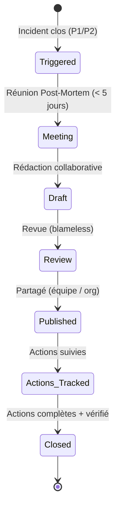
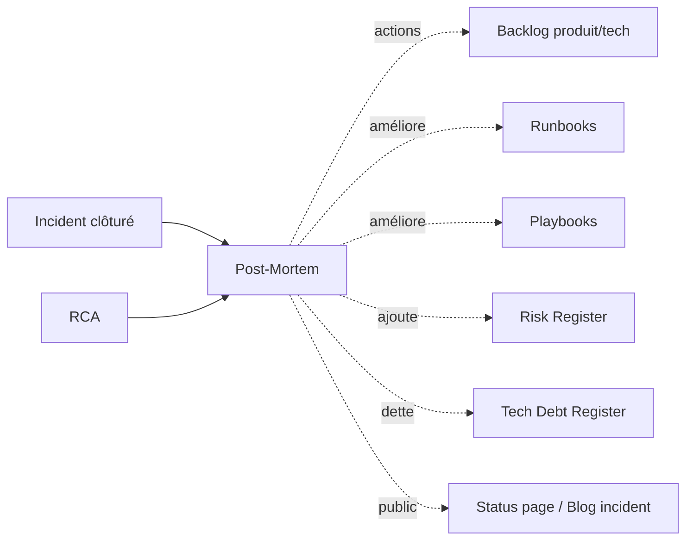

# Post-Mortem

> 📁 Phase : ⑤ Operations / Risk / Safety · 🏷️ Acronyme : **Post-Mortem** · 🔤 EN : _Post-Mortem / Incident Review_

---

## 1. Définition & objectif

Le **Post-Mortem** est le **document de bilan complet d'un incident significatif** : impact, chronologie, causes racines, ce qui a bien/mal fonctionné, et plan d'actions pour éviter la récidive. Il répond à « **Que s'est-il passé exactement, quelles en sont les conséquences, pourquoi, et que faisons-nous pour que ça n'arrive plus ?** »

Le Post-Mortem va plus loin que la RCA : il inclut l'impact métier, la communication, les enseignements organisationnels et le plan d'amélioration complet. C'est un **outil d'apprentissage collectif**, pas un procès.

| Ce qu'il EST                       | Ce qu'il N'EST PAS            |
| ---------------------------------- | ----------------------------- |
| Le bilan complet d'un incident     | Un compte-rendu disciplinaire |
| Un outil d'amélioration collective | Une liste de coupables        |
| Public (partagé avec l'équipe)     | Un secret pour la direction   |

> **Culture blameless** (Google SRE) : le Post-Mortem assume que les personnes ont fait de leur mieux avec les informations disponibles. On cherche à améliorer les **systèmes**, pas à punir les individus.

---

## 2. Usage & utilité

- **Capitaliser** sur les erreurs pour ne pas les répéter.
- **Communication** transparente vers les parties prenantes internes et externes.
- **Amélioration continue** : chaque Post-Mortem renforce la résilience.
- **Confiance** : les clients et partenaires voient qu'on gère les incidents sérieusement.
- **Formation** : les Post-Mortems passés sont la meilleure formation aux incidents.

---

## 3. Périmètre (in / out of scope)

**In scope**

- Impact complet (utilisateurs, SLO, métier, financier si applicable).
- Timeline détaillée (détection, diagnostic, actions, résolution).
- Causes racines (issues de la RCA).
- Ce qui a bien fonctionné.
- Ce qui n'a pas fonctionné (detection, response, communication).
- Plan d'actions avec responsables et deadlines.
- Enseignements.

**Out of scope**

- Analyse technique pure → **RCA**.
- Décisions de compensation client → processus commercial/juridique.

---

## 4. Cycle de vie du document



- **Déclenchement** : P1 systématiquement ; P2 si impactant ou récurrent.
- **Réunion** : dans les 5 jours suivant la résolution.
- **Publication** : partagé avec l'équipe entière, la direction et parfois les clients.
- **Suivi** : les actions sont trackées jusqu'à completion.

---

## 5. Métiers / rôles concernés (RACI)

| Activité              | Incident Commander | SRE / Dev | PO / Dir. | Comms | QA  |
| --------------------- | :----------------: | :-------: | :-------: | :---: | :-: |
| Facilitation réunion  |       **R**        |     C     |     I     |   I   |  I  |
| Rédaction             |       **R**        |   **R**   |     I     |   C   |  I  |
| Validation            |         C          |     C     |   **A**   |   C   |  I  |
| Communication clients |         I          |     I     |   **A**   | **R** |  I  |
| Suivi des actions     |         C          |   **R**   |     C     |   I   |  C  |

---

## 6. Position & interactions avec les autres documents



---

## 7. Nommage & versionnement

- **Fichier** : `PM-<INC-###>-<AAAA-MM-JJ>-<titre-court>.md`.
- **Base de données** : indexée, consultable, avec tags (composant, type, sévérité).
- **Politique de partage** : interne par défaut ; version publique si incident visible.

---

## 8. Template vierge

```markdown
# Post-Mortem — INC-### : <Titre>

| Champ               | Valeur            |
| ------------------- | ----------------- |
| Sévérité            | P1 / P2           |
| Durée               | HH:MM — HH:MM UTC |
| Date du post-mortem |                   |
| Facilitateur        |                   |
| Participants        |                   |

## TL;DR

<3 phrases : quoi, impact, cause principale, action principale.>

## Impact

| Dimension                    | Valeur |
| ---------------------------- | ------ |
| Durée totale indisponibilité |        |
| Utilisateurs affectés        |        |
| Fonctionnalités impactées    |        |
| SLO consommé                 |        |
| Impact financier / métier    |        |

## Timeline

| Heure UTC | Événement | Acteur |
| --------- | --------- | ------ |

## Causes racines

_Voir [RCA-INC-###](../rca/RCA-INC-###.md)_

- **Cause principale** :
- **Facteurs contributifs** :

## Ce qui a bien fonctionné

- <Mécanisme qui a limité l'impact>

## Ce qui n'a pas bien fonctionné

| Domaine       | Problème | Action |
| ------------- | -------- | ------ |
| Détection     |          |        |
| Réponse       |          |        |
| Communication |          |        |

## Plan d'actions

| ID  | Action | Priorité | Responsable | Deadline | Statut |
| --- | ------ | :------: | ----------- | -------- | ------ |

## Enseignements

<Quels patterns systémiques révèle cet incident ?>
```

---

## 9. Exemple rempli

```markdown
# Post-Mortem — INC-2026-042 : Billing Service OOM

| Sévérité | P1 |
| Durée | 14:12 → 14:47 UTC (35 min) |
| Participants | L. Durand, S. Petit, M. Leclerc, A. Martin (PO) |

## TL;DR

Le Billing Service a crashé 35 min suite à une fuite mémoire Puppeteer lors du pic de fin de mois.
~1 200 clients affectés. 0 donnée perdue (RabbitMQ persistant).
Action principale : corriger la fuite + améliorer l'ORR pour les pics.

## Impact

| Dimension                 | Valeur                         |
| ------------------------- | ------------------------------ |
| Durée indisponibilité PDF | 35 min                         |
| Clients affectés          | ~1 200                         |
| Tickets support générés   | 42                             |
| SLO mensuel consommé      | 0,08% (budget restant : 0,02%) |

## Ce qui a bien fonctionné ✅

- Circuit breaker : Customer API a renvoyé une erreur gracieuse, pas de cascade
- RabbitMQ persistant : 0 job PDF perdu, rejoués automatiquement
- Runbook RB-billing-restart trouvé et exécuté < 5 min
- Communication status page dans les 10 min

## Ce qui n'a pas bien fonctionné ❌

| Domaine    | Problème                                                     | Action                                       |
| ---------- | ------------------------------------------------------------ | -------------------------------------------- |
| Prévention | Fuite mémoire non détectée en staging                        | Scénario pic fin de mois dans test de charge |
| Monitoring | Alerte mémoire à 90% (trop tardive, 2 min avant OOM)         | Alerte à 70%                                 |
| Réponse    | Runbook restart insuffisant (pod re-crashait) → 9 min perdus | Enrichir runbook avec diagnostic mémoire     |

## Plan d'actions

| ID  | Action                                   | Prio | Responsable    | Deadline   |
| --- | ---------------------------------------- | :--: | -------------- | ---------- |
| A1  | Fix fuite mémoire Puppeteer (stream PDF) |  🔴  | L. Durand      | 2026-05-05 |
| A2  | Alerte mémoire à 70%                     |  🟠  | S. Petit (SRE) | 2026-04-28 |
| A3  | Limit mémoire 6 GB + HPA 60%             |  🟠  | DevOps         | 2026-04-30 |
| A4  | Test de charge scénario fin de mois      |  🟡  | QA             | 2026-05-10 |
| A5  | ORR checklist : pic réaliste obligatoire |  🟡  | SRE Lead       | 2026-05-10 |

## Enseignements

Les pics prévisibles (fin de mois, facturation) doivent être explicitement modélisés dans les
tests de charge et l'ORR. La performance sous charge normale ne garantit pas la tenue sous pic.
Les alertes doivent être calibrées pour donner du temps de réaction (alerte à 70%, pas à 90%).
```

---

## 10. Checklist de revue

- [ ] La **timeline** est basée sur les logs (pas la mémoire).
- [ ] L'**impact** est quantifié (utilisateurs, SLO, métier).
- [ ] Les **causes racines** viennent de la RCA (pas juste des symptômes).
- [ ] **Ce qui a bien fonctionné** est documenté.
- [ ] Les **actions** ont toutes un responsable et une deadline.
- [ ] Le Post-Mortem est **blameless** (pas de noms impliqués dans la faute).
- [ ] Les **enseignements systémiques** sont extraits.
- [ ] Le document est **partagé** avec l'équipe entière.
- [ ] Les actions sont **trackées** dans le backlog.

---

## 11. Anti-patterns & pièges

| Anti-pattern                    | Problème                           | Correctif                                 |
| ------------------------------- | ---------------------------------- | ----------------------------------------- |
| 🔵 **Post-Mortem = punition**   | Culture de peur ; incidents cachés | Culture blameless explicite               |
| 🗑️ **Post-Mortem sans actions** | Même incident dans 6 mois          | Actions concrètes + suivi obligatoire     |
| 📅 **Rédigé 3 semaines après**  | Détails perdus, moins d'impact     | < 5 jours après résolution                |
| 🔐 **Gardé secret**             | Pas d'apprentissage                | Partagé avec l'équipe, voire publiquement |
| 📋 **Actions non suivies**      | Backlog de bonnes intentions       | Revue mensuelle des actions post-mortem   |
| 🎭 **Réunion de 3h**            | Épuisement, digression             | 60-90 min max ; préparation préalable     |

---

## 12. Variantes par industrie / contexte

| Contexte               | Spécificités                                                                             |
| ---------------------- | ---------------------------------------------------------------------------------------- |
| **SaaS / Web**         | Post-Mortem public si incident visible (Atlassian, GitHub, Stripe publient les leurs).   |
| **Finance (DORA EU)**  | Rapport incident réglementaire (RTS) avec délais stricts (4h à 72h selon sévérité).      |
| **Aviation / médical** | Rapport d'événement de sécurité formel, soumis aux autorités.                            |
| **Agile**              | Rétrospective de sprint intègre les petits incidents ; Post-Mortem dédié pour les P1/P2. |

**Exemples publics de Post-Mortems** : [GitHub Incident Reports](https://www.githubstatus.com/history), [Cloudflare Incident Reports](https://blog.cloudflare.com/tag/outage/), [Stripe](https://stripe.com/blog/tag/incident-review).

---

## 13. Standards & normes

- **Google SRE Book** — _Postmortem Culture_ (chapitres 14–15).
- **ITIL 4** — _Problem Management_.
- **ISO/IEC 27035** — _Information Security Incident Management_.
- **DORA EU** — reporting d'incidents majeurs (finance).

---

## 14. Outillage recommandé

| Besoin            | Outils                                                      |
| ----------------- | ----------------------------------------------------------- |
| Rédaction         | Confluence, Notion, Google Docs, Blameless.io, Jeli, Cortex |
| Timeline          | Grafana (logs), Datadog, PagerDuty (incident timeline)      |
| Suivi actions     | Jira (épic PM-actions), Linear                              |
| Base Post-Mortems | Confluence (espace), Jeli (analyse de patterns)             |

---

## 15. Diagramme — Processus Post-Mortem

```mermaid
flowchart TD
    INC[Incident résolu] --> TRIGGER{P1 / P2\nsignificatif ?}
    TRIGGER -->|Oui| PLAN[Planifier réunion\n< 5 jours]
    TRIGGER -->|Non| SKIP[Pas de PM formel\n(note dans le ticket)]

    PLAN --> PREP[Préparer : timeline\nlogs, participants]
    PREP --> MEET[Réunion blameless\n60-90 min]
    MEET --> DRAFT[Rédiger le document]
    DRAFT --> REVIEW[Revue équipe]
    REVIEW --> PUBLISH[Publier & partager]
    PUBLISH --> TRACK[Tracker les actions\ndans le backlog]
    TRACK --> COMPLETE{Toutes les actions\ncomplètes ?}
    COMPLETE -->|Oui| CLOSE[PM clôturé ✅]
    COMPLETE -->|Non| TRACK
```

---

> 🔎 **En une phrase** : le Post-Mortem transforme un incident douloureux en **leçon collective précieuse** — son seul but est d'améliorer le système pour que la prochaine équipe on-call ait une nuit plus tranquille.

⬅️ [RCA](./04-rca-root-cause-analysis.md) · ➡️ Suivant : [Risk Register](./06-risk-register.md)
