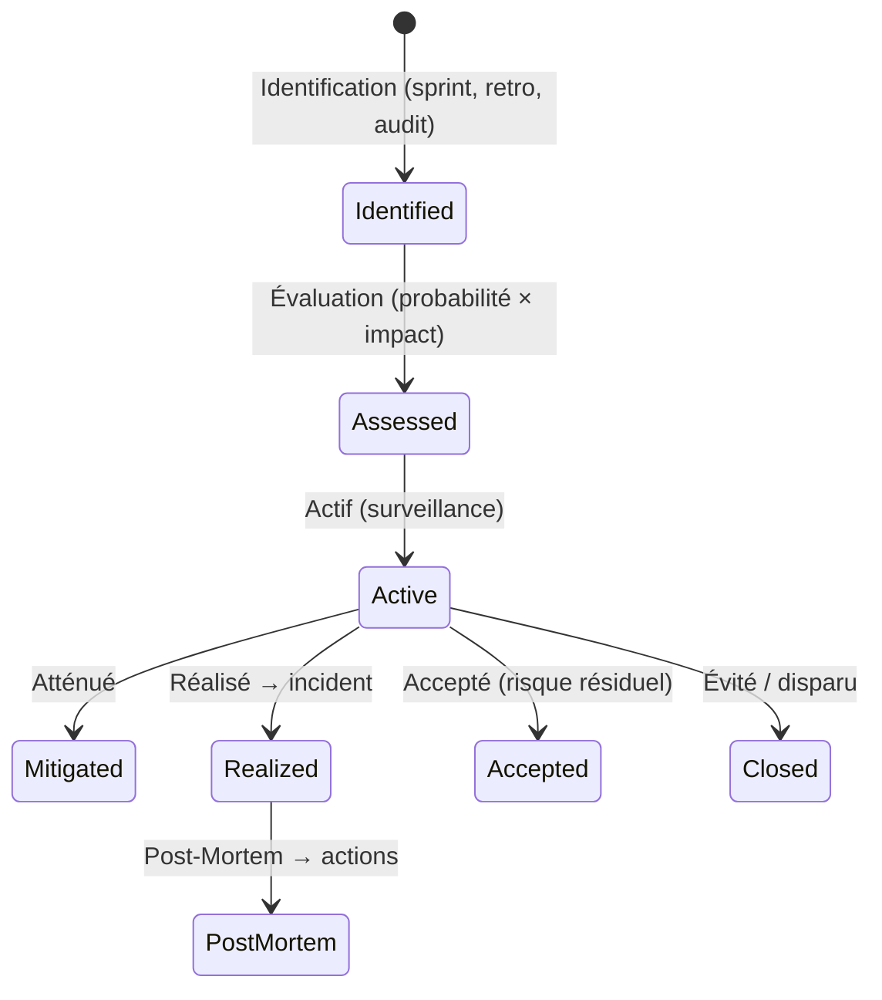
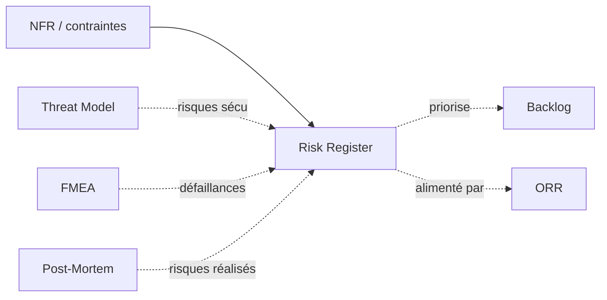
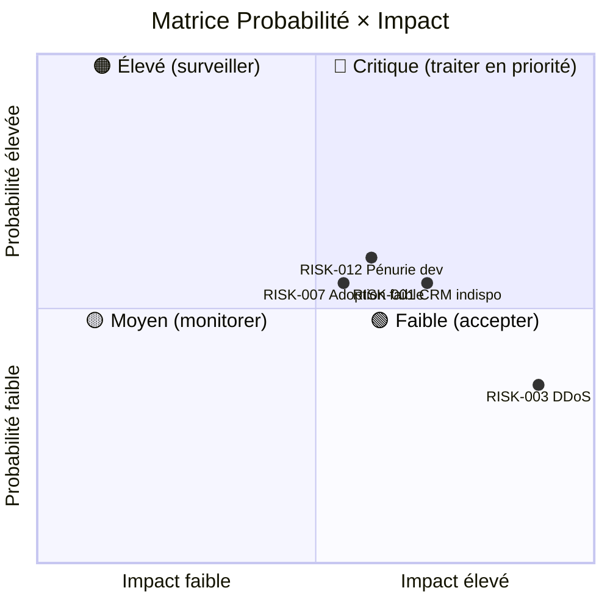

# Risk Register

> 📁 Phase : ⑤ Operations / Risk / Safety · 🏷️ Acronyme : **Risk Register** · 🔤 EN : _Risk Register / Risk Log_

---

## 1. Définition & objectif

Le **Risk Register** est un **catalogue vivant de tous les risques identifiés** qui menacent un projet, un produit ou un système, avec leur probabilité, leur impact, leur niveau et les stratégies de mitigation. Il répond à « **Quels événements négatifs pourraient survenir, quelle est leur gravité, et que faisons-nous pour les prévenir ou en atténuer les conséquences ?** »

Un risque est un événement **incertain mais possible** qui aurait un impact négatif s'il se réalisait — à distinguer du **problème** (déjà survenu) et de la **dette** (compromis connu).

| Ce qu'il EST                                   | Ce qu'il N'EST PAS                    |
| ---------------------------------------------- | ------------------------------------- |
| Les risques **potentiels** non encore réalisés | Un bug tracker (problèmes réels)      |
| Un outil de décision proactif                  | La liste des incidents passés (→ RCA) |
| Priorisé et vivant                             | Un document purement formel           |

---

## 2. Usage & utilité

- **Prévenir** les surprises en anticipant les risques.
- **Décider** : accepter, atténuer, transférer ou éviter chaque risque.
- **Planifier** les réponses avant que le risque se réalise.
- **Communication** avec le management : transparence sur les risques résiduels.
- **Prioriser** l'investissement en sécurité / résilience.

---

## 3. Périmètre (in / out of scope)

**In scope**

- Risques techniques (performance, sécurité, disponibilité).
- Risques projet (planning, ressources, dépendances).
- Risques métier (adoption, réglementaire).
- Risques fournisseurs / tiers.

**Out of scope**

- Risques de sécurité spécifiques aux attaquants → **Threat Model**.
- Défaillances techniques précises → **FMEA**.
- Incidents déjà survenus → **Post-Mortem / RCA**.

---

## 4. Cycle de vie du document



- **Naissance** : au démarrage du projet et en continu.
- **Vie** : revu à chaque sprint ou réunion de comité de risques.
- **Fin** : un risque est fermé quand il est évité, réalisé (incident) ou délai passé.

---

## 5. Métiers / rôles concernés (RACI)

| Activité                   | PM / Tech Lead | Architecte | Dev | RSSI  |  PO   |
| -------------------------- | :------------: | :--------: | :-: | :---: | :---: |
| Identification             |     **R**      |   **R**    |  C  | **R** |   C   |
| Évaluation                 |     **R**      |     C      |  I  |   C   |   C   |
| Stratégie de mitigation    |     **R**      |   **R**    |  C  | **R** |   C   |
| Décision (accepter/éviter) |       C        |     C      |  I  |   C   | **A** |
| Surveillance               |     **R**      |     C      |  C  |   C   |   I   |

---

## 6. Position & interactions avec les autres documents



---

## 7. Nommage & versionnement

- **Fichier** : `RISK_REGISTER-<Projet>.md` ou dans l'outil de gestion de projet.
- **Identifiants** : `RISK-001`, `RISK-002`… stables et jamais réutilisés.
- **Versionnement** : versionné dans Git ou outil ; revue datée en en-tête.

---

## 8. Template vierge

```markdown
# Risk Register — <Projet>

| Révision | Date | Auteur |
| -------- | ---- | ------ |

## RISK-### : <Titre>

| Champ               | Valeur                                                                |
| ------------------- | --------------------------------------------------------------------- |
| ID                  | RISK-###                                                              |
| Catégorie           | Technique / Projet / Sécurité / Réglementaire                         |
| Description         | <Événement redouté et son contexte>                                   |
| Probabilité         | 1–5 (1=rare, 5=presque certain)                                       |
| Impact              | 1–5 (1=négligeable, 5=catastrophique)                                 |
| Score               | Probabilité × Impact                                                  |
| Niveau              | 🔴 Critique (>15) / 🟠 Élevé (8-15) / 🟡 Moyen (4-7) / 🟢 Faible (<4) |
| Stratégie           | Éviter / Atténuer / Transférer / Accepter                             |
| Mitigation          | <Actions préventives>                                                 |
| Plan de contingence | <Que faire si le risque se réalise>                                   |
| Propriétaire        |                                                                       |
| Statut              | Actif / Atténué / Accepté / Réalisé / Fermé                           |
| Dernier examen      | AAAA-MM-JJ                                                            |
```

---

## 9. Exemple rempli (extrait)

```markdown
## RISK-001 : Indisponibilité du CRM (dépendance externe)

| Probabilité | 3 | Impact | 4 | Score | 12 | Niveau | 🟠 Élevé |
| Stratégie | Atténuer |
| Mitigation | Cache Redis des données CRM (TTL 5 min) ; dégradation gracieuse si CRM KO |
| Contingence | Afficher données mises en cache ; message d'avertissement ; alerte ops |
| Propriétaire | L. Durand |

## RISK-003 : Attaque DDOS sur l'API Gateway (Kong)

| Probabilité | 2 | Impact | 5 | Score | 10 | Niveau | 🟠 Élevé |
| Stratégie | Atténuer |
| Mitigation | Rate limiting (Kong), WAF Cloudflare, auto-scaling |
| Contingence | Playbook PB-ddos.md ; escalade RSSI |
| Propriétaire | SecOps |

## RISK-007 : Adoption faible du portail (< 30% clients actifs à 6 mois)

| Probabilité | 3 | Impact | 3 | Score | 9 | Niveau | 🟠 Élevé |
| Stratégie | Atténuer |
| Mitigation | Campagne onboarding + emails ciblés + incentives |
| Contingence | Révision UX, interview utilisateurs, ajustement OBJ-2 |
| Propriétaire | PO |
```

---

## 10. Checklist de revue

- [ ] Chaque risque a une **probabilité et un impact quantifiés**.
- [ ] Une **stratégie** (Éviter/Atténuer/Transférer/Accepter) est définie.
- [ ] Une **mitigation** et un **plan de contingence** sont documentés.
- [ ] Chaque risque a un **propriétaire**.
- [ ] Les risques de niveau 🔴 et 🟠 ont un **plan d'action actif**.
- [ ] Le registre est **revu régulièrement** (sprint ou mensuel).
- [ ] Les risques **réalisés** sont liés à leur Post-Mortem.

---

## 11. Anti-patterns & pièges

| Anti-pattern                                | Problème                            | Correctif                                    |
| ------------------------------------------- | ----------------------------------- | -------------------------------------------- |
| 📋 **Registre rédigé pour cocher une case** | Jamais relu                         | Outil intégré au processus (sprint planning) |
| 🎯 **Uniquement des risques techniques**    | Risques projet et métier ignorés    | Catégories multiples                         |
| 📊 **Scores non calibrés**                  | Tout est "critique"                 | Définir l'échelle avec des exemples          |
| 🕳️ **Pas de plan de contingence**           | Réaction improvisée quand ça arrive | Contingence obligatoire pour risques ≥ Moyen |
| 🧊 **Jamais mis à jour**                    | Risques fermés toujours actifs      | Revue à chaque sprint/réunion                |

---

## 12. Variantes par industrie / contexte

| Contexte                     | Spécificités                                                                     |
| ---------------------------- | -------------------------------------------------------------------------------- |
| **PMBOK / Prince2**          | Risk Register comme artefact formel du projet ; comité de risques.               |
| **ISO 27005**                | Risk Assessment : identification, analyse et évaluation des risques de sécurité. |
| **IEC 61508 / DO-178C**      | Hazard Register : risques de sûreté de fonctionnement (safety risks).            |
| **Finance (DORA, Bâle III)** | Risk taxonomy formalisée ; risque opérationnel quantifié.                        |

---

## 13. Standards & normes

- **ISO 31000:2018** — _Gestion du risque — Lignes directrices_.
- **ISO/IEC 27005** — gestion des risques de sécurité de l'information.
- **PMBOK 7** — _Project Risk Management_.
- **FAIR** (Factor Analysis of Information Risk) — quantification des risques cyber.

---

## 14. Outillage recommandé

| Besoin               | Outils                                          |
| -------------------- | ----------------------------------------------- |
| Registre             | Jira (custom type), Confluence, Notion, tableur |
| Analyse quantitative | FAIR model, Monte Carlo simulation              |
| Cyber risks          | Microsoft Threat Modeling Tool, STRIDE          |

---

## 15. Diagramme — Matrice de risques



---

> 🔎 **En une phrase** : le Risk Register est **le radar du projet** — il rend visibles les menaces potentielles pour qu'on les adresse avant qu'elles deviennent des incidents.

⬅️ [Post-Mortem](./05-post-mortem.md) · ➡️ Suivant : [Threat Model](./07-threat-model.md)
