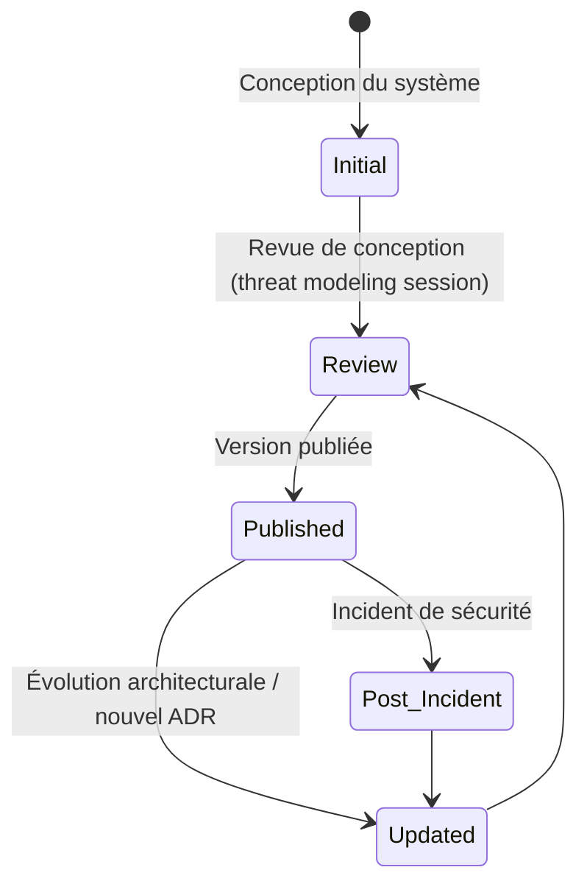
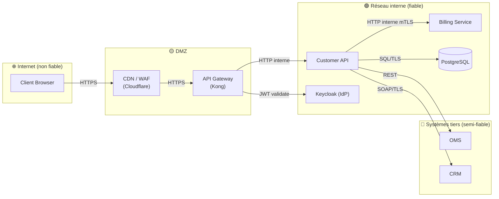

# Threat Model

> 📁 Phase : ⑤ Operations / Risk / Safety · 🏷️ Acronyme : **Threat Model** · 🔤 EN : _Threat Model / Threat Modeling_

---

## 1. Définition & objectif

Le **Threat Model** (modèle de menaces) est un **exercice structuré qui identifie les menaces de sécurité pesant sur un système**, les acteurs malveillants potentiels, les vecteurs d'attaque, les contrôles existants et les lacunes à combler. Il répond à « **Qui pourrait attaquer notre système, comment, avec quel objectif, et que faisons-nous pour s'en protéger ?** »

C'est le document de conception de la sécurité _avant_ les incidents — « penser comme un attaquant » pour construire des défenses adaptées.

| Ce qu'il EST                                   | Ce qu'il N'EST PAS                    |
| ---------------------------------------------- | ------------------------------------- |
| L'analyse proactive des menaces par conception | Un audit de pénétration (→ pentest)   |
| Un exercice collaboratif (dev + sécu)          | Un scan de vulnérabilités automatique |
| Un outil de priorisation des contrôles sécu    | Un rapport d'incident (→ Post-Mortem) |

---

## 2. Usage & utilité

- **Security by design** : les décisions de sécurité sont faites tôt, pas en correctif.
- **Prioriser** les contrôles de sécurité (pas tout sécuriser à égalité).
- **Guide les tests de sécurité** (pentest, DAST, code review sécurité).
- **Communication** : expliquer les risques à la direction et aux auditeurs.
- **Conformité** : RGPD, ISO 27001, PCI-DSS exigent une analyse des risques.

---

## 3. Périmètre (in / out of scope)

**In scope**

- Acteurs et leurs objectifs (attaquants, insiders malveillants).
- _Entry points_ (surfaces d'attaque).
- Menaces par composant (méthode STRIDE ou PASTA).
- Contrôles existants et leur efficacité.
- Lacunes et risques résiduels.
- Actions de remédiation priorisées.

**Out of scope**

- Exigences de sécurité détaillées → **Security Requirements**.
- Tests d'exploitation → **pentest / DAST**.
- Incidents de sécurité passés → **RCA / Post-Mortem**.

---

## 4. Cycle de vie du document



- **Naissance** : en phase de conception (avec le HLD/SAD), idéalement en atelier collaboratif.
- **Vie** : mis à jour à chaque évolution architecturale significative.
- **Fin** : archivé avec le système ; conservé pour les audits.

---

## 5. Métiers / rôles concernés (RACI)

| Activité                | Dev / Architecte | RSSI / Sécu | SRE |  PO   |
| ----------------------- | :--------------: | :---------: | :-: | :---: |
| Atelier threat modeling |      **R**       |    **R**    |  C  |   C   |
| Rédaction               |      **R**       |    **R**    |  I  |   I   |
| Revue                   |        C         |    **R**    |  C  |   I   |
| Actions de remédiation  |      **R**       |      C      |  C  | **A** |

---

## 6. Position & interactions avec les autres documents

```mermaid
flowchart LR
    C4[C4 Model\nSAD] --> TM[Threat Model]
    AUTH[AUTH Doc] --> TM
    TM --> SR[Security Requirements]
    TM -.risques.-> RR[Risk Register]
    TM -.tests sécu.-> TC_SEC[Test Cases\n(sécurité)]
    TM -.vulnérabilités.-> TDR[Tech Debt Register]
```

| Document                  | Relation                                                              |
| ------------------------- | --------------------------------------------------------------------- |
| **C4 / SAD**              | La topologie du système (diagrammes) est l'entrée du threat modeling. |
| **AUTH Doc**              | Le modèle d'accès est analysé dans le threat model (STRIDE).          |
| **Security Requirements** | Les mitigations identifiées deviennent des exigences de sécurité.     |
| **Test Cases**            | Les menaces identifiées génèrent des cas de test de sécurité.         |

---

## 7. Nommage & versionnement

- **Fichier** : `threat-model-<système>-v<x.y>.md` ; **accès restreint** (info sensible).
- **Niveau de sensibilité** : ne pas publier les détails des vulnérabilités non corrigées.
- **Versionnement** : versionné avec le SAD ; mis à jour après chaque RFC impactant la sécurité.

---

## 8. Template vierge (STRIDE)

```markdown
# Threat Model — <Système> (v1.0)

⚠️ Confidentiel — Accès restreint (équipe sécurité + architectes)

## 1. Périmètre

<Quels composants sont dans le scope ? (Cf. C4 L2)>

## 2. Acteurs (adversaires)

| Acteur | Motivation | Capacités | Priorité |
| ------ | ---------- | --------- | :------: |

## 3. Entrées (entry points) & assets à protéger

| Entry point | Description | Niveau de confiance requis |
| ----------- | ----------- | -------------------------- |

## 4. Analyse des menaces (STRIDE)

Pour chaque composant significatif :

### <Composant>

| ID   | Menace (STRIDE)        | Description | Contrôle existant | Lacune | Risque | Action |
| ---- | ---------------------- | ----------- | ----------------- | ------ | :----: | ------ |
| T-01 | Spoofing               |             |                   |        | H/M/L  |        |
| T-02 | Tampering              |             |                   |        |        |        |
| T-03 | Repudiation            |             |                   |        |        |        |
| T-04 | Information Disclosure |             |                   |        |        |        |
| T-05 | Denial of Service      |             |                   |        |        |        |
| T-06 | Elevation of Privilege |             |                   |        |        |        |

## 5. Résumé des risques résiduels

## 6. Actions de remédiation priorisées

| ID  | Action | Menace adressée | Priorité | Responsable |
| --- | ------ | --------------- | :------: | ----------- |
```

> **STRIDE** (Microsoft) : _Spoofing_ · _Tampering_ · _Repudiation_ · _Information Disclosure_ · _Denial of Service_ · _Elevation of Privilege_.

---

## 9. Exemple rempli (extrait — API Gateway / Auth)

```markdown
# Threat Model — Portail Client Self-Service (v1.1)

⚠️ Confidentiel

## 2. Acteurs

| Acteur              | Motivation                              | Capacités                            | Priorité |
| ------------------- | --------------------------------------- | ------------------------------------ | :------: |
| Client malveillant  | Accès aux données d'autres clients      | Script kiddie → avancé               |    🔴    |
| Attaquant externe   | Voler données personnelles pour revente | Avancé (OSINT + tooling)             |    🔴    |
| Employé malveillant | Fraude, exfiltration                    | Accès interne + connaissance système |    🟠    |
| Bot / DDOS          | Déni de service, scraping               | Automatisé                           |    🟡    |

## 4. Analyse — API Gateway (Kong)

| ID   | Menace          | Description                                | Contrôle existant         | Lacune                    | Risque | Action                             |
| ---- | --------------- | ------------------------------------------ | ------------------------- | ------------------------- | :----: | ---------------------------------- |
| T-01 | Spoofing        | Token JWT forgé                            | Validation JWKS (RS256)   | Aucune                    |   L    | Rotation clés annuelle             |
| T-04 | Info Disclosure | Réponses d'erreur verbose révèlent l'archi | Erreurs génériques        | Messages debug en staging |   M    | Filtrer les erreurs d'archi        |
| T-05 | DoS             | Flood de requêtes auth                     | Rate limiting 100 req/min | Pas de ban IP adaptatif   |   H    | Ajouter IP reputation (Cloudflare) |
| T-06 | EoP             | Exploitation d'une CVE Kong                | MAJ régulières            | CVE < 30j patching time   |   M    | SBOM scan + alertes CVE Kong       |

## 4. Analyse — Customer API (accès aux données)

| ID   | Menace          | Description                                                      | Risque | Action                                |
| ---- | --------------- | ---------------------------------------------------------------- | :----: | ------------------------------------- |
| T-01 | Spoofing        | IDOR : accéder aux données d'un autre client via ID manipulation |   🔴   | Row-level security + TC-SEC-01 (test) |
| T-04 | Info Disclosure | Logs contenant des données personnelles                          |   🟠   | PII masking dans les logs             |

## 6. Actions priorisées

| ID  | Action                                              | Priorité |
| --- | --------------------------------------------------- | :------: |
| A1  | Row-level security sur toutes les requêtes customer |    🔴    |
| A2  | PII masking dans les logs (e-mail → hash)           |    🟠    |
| A3  | IP reputation / WAF pour les bots                   |    🟠    |
| A4  | Réduire le patching time CVE à < 15j                |    🟡    |
```

---

## 10. Checklist de revue

- [ ] Tous les **composants exposés** sont analysés.
- [ ] Les **acteurs** (attaquants) sont identifiés avec leurs motivations.
- [ ] Les **6 catégories STRIDE** sont couvertes pour chaque composant critique.
- [ ] Chaque menace a un **contrôle existant** et une **lacune documentée**.
- [ ] Les actions sont **priorisées** (pas tout au même niveau).
- [ ] Le **modèle de données** et les **données sensibles** (PII) sont analysés.
- [ ] Le document est **à accès restreint** (ne pas exposer les vulnérabilités non corrigées).

---

## 11. Anti-patterns & pièges

| Anti-pattern                                        | Problème                                | Correctif                                                 |
| --------------------------------------------------- | --------------------------------------- | --------------------------------------------------------- |
| 🔓 **Threat model publié** avec vulns non corrigées | Roadmap pour les attaquants             | Accès restreint ; corriger avant de documenter            |
| 🎭 **Seule l'équipe sécu** le fait                  | Dev ne comprend pas les risques         | Atelier collaboratif (dev + sécu)                         |
| 📋 **Menaces sans contrôle**                        | Analyse incomplète                      | Documenter contrôle + lacune pour chaque menace           |
| 🧊 **Modèle figé** post-conception                  | Nouvelles fonctionnalités non analysées | Mise à jour à chaque RFC impactant la sécu                |
| 🔮 **Sur-exhaustivité**                             | Inutilisable                            | Focus sur les composants exposés et les données sensibles |

---

## 12. Variantes par industrie / contexte

| Contexte           | Méthode                                                              |
| ------------------ | -------------------------------------------------------------------- |
| **Web / Cloud**    | **STRIDE** (Microsoft) — méthode la plus répandue.                   |
| **Avancé**         | **PASTA** (Process for Attack Simulation and Threat Analysis).       |
| **Attaque ciblée** | **MITRE ATT&CK** — tactiques et techniques réelles d'attaquants.     |
| **Embarqué / IoT** | **TARA** (Threat Analysis and Risk Assessment — ISO/SAE 21434 auto). |
| **Agile**          | _Threat modeling as code_ (Pytm, Threatspec, Threat Dragon).         |

---

## 13. Standards & normes

- **STRIDE** (Microsoft, 2000) — méthode de référence.
- **OWASP Threat Modeling** — guide et outils.
- **ISO/IEC 27005** — évaluation des risques sécurité.
- **NIST SP 800-154** — Data-Centric Threat Modeling.
- **SAFECode** — Practical Security Stories and Security Tasks.
- **ISO/SAE 21434** (automobile) — TARA.

---

## 14. Outillage recommandé

| Besoin                             | Outils                                    |
| ---------------------------------- | ----------------------------------------- |
| Diagrammes C4 + zones de confiance | OWASP Threat Dragon, Pytm, IriusRisk      |
| STRIDE automatisé                  | Microsoft Threat Modeling Tool, Threagile |
| MITRE ATT&CK                       | attack-navigator, Mitre ATT&CK Workbench  |
| Tests issus du TM                  | OWASP ZAP, Burp Suite, nuclei             |

---

## 15. Diagramme — Zones de confiance et flux (Data Flow Diagram)



---

> 🔎 **En une phrase** : le Threat Model est l'**exercice de pensée comme un attaquant** qui transforme « on espère que c'est sécurisé » en « on a analysé les menaces et nos défenses sont documentées ».

⬅️ [Risk Register](./06-risk-register.md) · ➡️ Suivant : [Security Requirements](./08-security-requirements.md)
