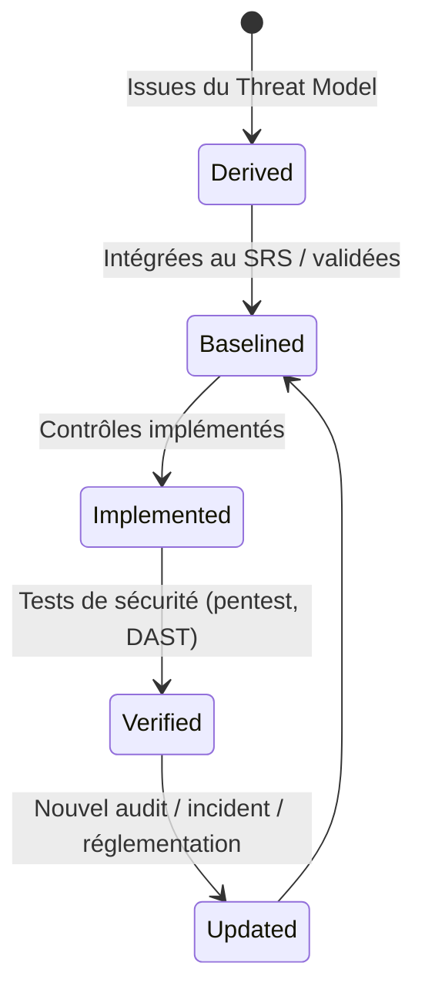
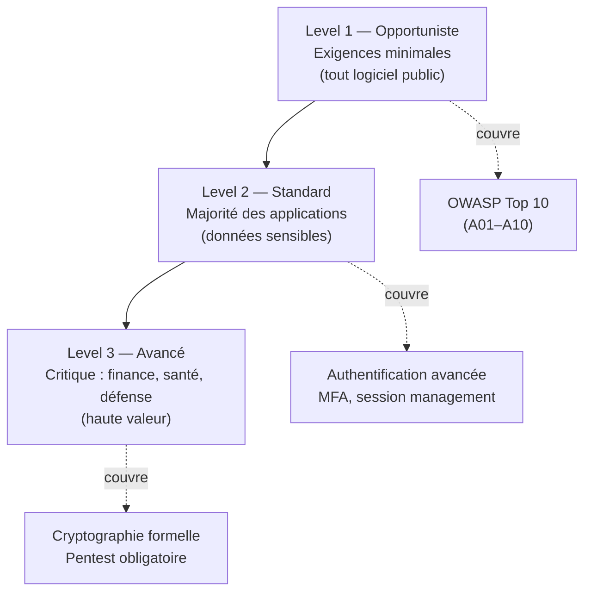

# Security Requirements

> 📁 Phase : ⑤ Operations / Risk / Safety · 🏷️ Acronyme : **Security Req.** · 🔤 EN : _Security Requirements_

---

## 1. Définition & objectif

Les **Security Requirements** sont les **exigences spécifiques à la sécurité** d'un système : confidentialité, intégrité, disponibilité, authentification, autorisation, traçabilité, cryptographie et conformité. Elles répondent à « **Quelles propriétés de sécurité le système doit-il garantir, de manière vérifiable ?** »

Ce sont des **NFR de sécurité** suffisamment détaillées et structurées pour guider la conception et les tests — une section du SRS enrichie et spécialisée.

| Ce qu'elles SONT                           | Ce qu'elles NE SONT PAS         |
| ------------------------------------------ | ------------------------------- |
| Les exigences de sécurité testables        | Un audit de sécurité            |
| Issues du Threat Model                     | Des bonnes pratiques génériques |
| Liées à des tests de sécurité (Test Cases) | Un threat model                 |

> **Relation SRS ↔ Security Requirements** : les exigences de sécurité font partie du SRS (section NFR-SEC). Un _Security Requirements Document_ dédié est justifié pour les systèmes avec des enjeux forts (finance, santé, défense).

---

## 2. Usage & utilité

- **Traduire** les menaces du Threat Model en exigences concrètes et testables.
- **Guider** les développeurs dans les choix sécurisés.
- **Base des tests de sécurité** (pentest, DAST, SAST, code review).
- **Conformité** : RGPD, PCI-DSS, ISO 27001, HIPAA exigent des contrôles documentés.
- **Contrat** : les exigences de sécurité sont vérifiables par audit.

---

## 3. Périmètre (in / out of scope)

**In scope**

- Authentification & autorisation (force, MFA, gestion des sessions).
- Chiffrement (données en transit, au repos).
- Protection des données sensibles (PII, secrets).
- Audit et journalisation.
- Disponibilité et résilience aux attaques.
- Gestion des vulnérabilités et mises à jour.
- Conformité réglementaire spécifique.

**Out of scope**

- Analyse des menaces → **Threat Model**.
- Protection des données (RGPD) → **DPIA**.
- Tests d'exploitation → **pentest**.

---

## 4. Cycle de vie du document



---

## 5. Métiers / rôles concernés (RACI)

| Activité             | RSSI / Architecte Sécu |  Dev  |  QA   |  PO   |  DPO  |
| -------------------- | :--------------------: | :---: | :---: | :---: | :---: |
| Rédaction            |         **R**          |   C   |   C   |   I   |   C   |
| Validation métier    |           C            |   I   |   I   | **A** |   C   |
| Implémentation       |           C            | **R** |   I   |   I   |   I   |
| Vérification (tests) |           C            |   I   | **R** |   I   |   I   |
| Revue conformité     |         **R**          |   I   |   I   |   I   | **R** |

---

## 6. Position & interactions avec les autres documents

```mermaid
flowchart LR
    TM[Threat Model] --> SR[Security Requirements]
    SR --> SRS[SRS\n(NFR-SEC intégrées)]
    SR --> AUTH[AUTH Doc]
    SR --> TC_SEC[Test Cases sécu]
    SR --> DPIA[DPIA]
    SR -.conformité.-> REGS[RGPD / PCI-DSS / ISO 27001]
```

---

## 7. Nommage & versionnement

- **Fichier** : `security-requirements-<système>-v<x.y>.md` ou intégré au SRS (§3.3 NFR-SEC).
- **Identifiants** : `NFR-SEC-###` (cohérent avec les NFR du SRS).
- **Confidentialité** : les exigences non satisfaites à accès restreint.

---

## 8. Template vierge

```markdown
# Security Requirements — <Système>

## NFR-SEC-### : <Titre>

| Champ                   | Valeur                                                        |
| ----------------------- | ------------------------------------------------------------- |
| ID                      | NFR-SEC-###                                                   |
| Domaine                 | AuthN / AuthZ / Crypto / Audit / Dispo / PII / Vulnérabilités |
| Description             | <Le système DOIT...>                                          |
| Justification           | <Menace adressée (T-##) / réglementation>                     |
| Critère de vérification | <Test / audit / outil>                                        |
| Priorité                | Must / Should                                                 |
| Statut                  | Défini / Implémenté / Vérifié                                 |
```

---

## 9. Exemple rempli (extrait)

```markdown
## NFR-SEC-001 : Chiffrement en transit

| Domaine | Crypto |
| Description | Toutes les communications du portail (navigateur ↔ API, inter-services) DOIVENT utiliser TLS 1.2 minimum (TLS 1.3 recommandé). |
| Justification | T-04 (Information Disclosure) ; RGPD art. 32 |
| Vérification | Scan SSL Labs (A ou A+) ; test OWASP ZAP |
| Priorité | Must |

## NFR-SEC-002 : Isolation des données client

| Domaine | AuthZ |
| Description | Un client authentifié NE DOIT PAS pouvoir accéder aux ressources d'un autre client (commandes, factures, réclamations). |
| Justification | T-01 IDOR (spoofing/accès non autorisé) ; RGPD art. 5 (confidentialité) |
| Vérification | TC-SEC-01 (test manuel + DAST) |
| Priorité | Must |

## NFR-SEC-003 : Gestion des secrets

| Domaine | Secrets |
| Description | Aucun secret (API key, password, token) NE DOIT être présent dans le code source ou les variables d'environnement non chiffrées. Tous les secrets DOIVENT être stockés dans HashiCorp Vault. |
| Justification | OWASP A02 (Cryptographic Failures) |
| Vérification | Scan Gitleaks en CI ; revue Vault (rotation 90j) |
| Priorité | Must |

## NFR-SEC-004 : Journalisation de sécurité

| Domaine | Audit |
| Description | Toutes les authentifications (succès/échec), les accès admin et les modifications de données sensibles DOIVENT être journalisés avec l'identité, le timestamp et l'adresse IP. Rétention : 90 jours accessibles, 1 an archivés. |
| Justification | ISO 27001 A.12.4 ; RGPD art. 5 (accountability) |
| Vérification | Revue ELK/logs ; test de modification sans log |
| Priorité | Must |

## NFR-SEC-005 : Gestion des vulnérabilités

| Domaine | Vulnérabilités |
| Description | Les CVE critiques (CVSS ≥ 9) DOIVENT être corrigées sous 7 jours. Les CVE hautes (CVSS 7–8.9) sous 30 jours. |
| Justification | OWASP A06 (Vulnerable and Outdated Components) ; DORA EU |
| Vérification | SBOM scan automatique (Snyk/Trivy) en CI |
| Priorité | Must |
```

---

## 10. Checklist de revue

- [ ] Les exigences **couvrent les 6 domaines** (AuthN, AuthZ, Crypto, Audit, Dispo, PII/Secrets).
- [ ] Chaque exigence est **reliée à une menace** du Threat Model.
- [ ] Les exigences sont **testables** (critère de vérification spécifié).
- [ ] Les **réglementations applicables** sont citées (RGPD, PCI-DSS…).
- [ ] Elles sont **intégrées au SRS** (traçabilité RTM).
- [ ] Un **test de sécurité** existe pour chaque exigence Must.

---

## 11. Anti-patterns & pièges

| Anti-pattern                                                | Problème                | Correctif                               |
| ----------------------------------------------------------- | ----------------------- | --------------------------------------- |
| 📋 **Copier-coller de listes génériques OWASP**             | Pas adaptées au système | Dériver du Threat Model spécifique      |
| 🌫️ **Exigences vagues** (« le système doit être sécurisé ») | Non testables           | Critères précis et vérifiables          |
| 🎭 **Séparées du SRS**                                      | Traçabilité rompue      | Intégrées au SRS §NFR-SEC               |
| 🔒 **Non relues après changement**                          | Exigences obsolètes     | Revue à chaque évolution architecturale |

---

## 12. Variantes par industrie / contexte

| Contexte              | Framework                                                            |
| --------------------- | -------------------------------------------------------------------- |
| **Général**           | OWASP ASVS (Application Security Verification Standard) — 3 niveaux. |
| **PCI-DSS**           | 12 requirements + 300+ contrôles.                                    |
| **HIPAA**             | Administrative, Physical, Technical Safeguards.                      |
| **ISO 27001**         | Annexe A — 93 contrôles.                                             |
| **Finance (DORA EU)** | ICT risk, incident management, operational resilience.               |
| **Embarqué / auto**   | ISO/SAE 21434, IEC 61508, MISRA.                                     |

---

## 13. Standards & normes

- **OWASP ASVS 4.0** — _Application Security Verification Standard_ (niveaux 1/2/3).
- **OWASP Top 10** — les 10 risques les plus critiques (NFR-SEC doivent les couvrir).
- **ISO/IEC 27001 Annexe A** — contrôles de sécurité.
- **NIST SP 800-53** — contrôles de sécurité et confidentialité.
- **RGPD art. 25, 32** — _privacy by design_, sécurité du traitement.

---

## 14. Outillage recommandé

| Besoin            | Outils                                       |
| ----------------- | -------------------------------------------- |
| Tests automatisés | OWASP ZAP (DAST), Semgrep (SAST), Burp Suite |
| Secrets scanning  | Gitleaks, truffleHog, GitHub Secret Scanning |
| SBOM / CVE        | Trivy, Snyk, Grype                           |
| Conformité        | Wazuh, Scout Suite, Prowler (cloud)          |

---

## 15. Diagramme — OWASP ASVS niveaux



---

> 🔎 **En une phrase** : les Security Requirements transforment les menaces abstraites du Threat Model en **exigences concrètes et testables** — elles sont le contrat de sécurité vérifiable du système.

⬅️ [Threat Model](./07-threat-model.md) · ➡️ Suivant : [Hazard Analysis](./09-hazard-analysis.md)
