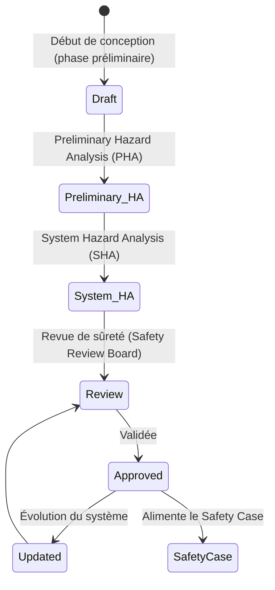
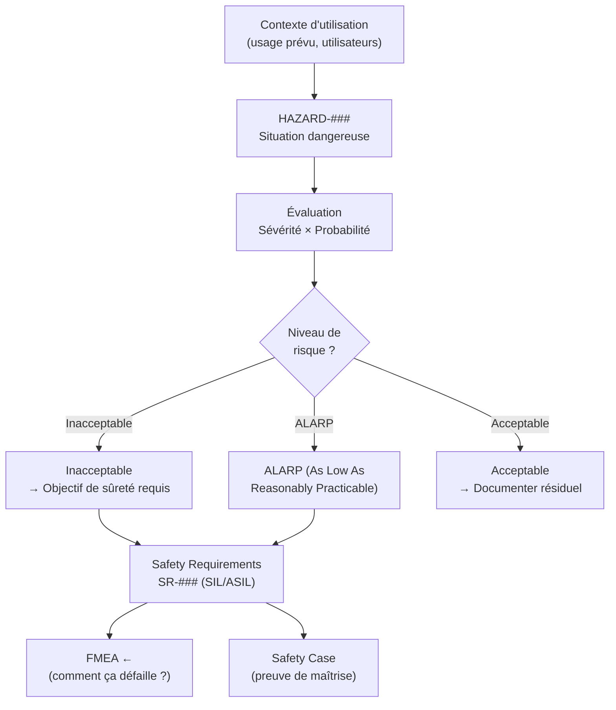

# Hazard Analysis

> 📁 Phase : ⑤ Operations / Risk / Safety · 🏷️ Acronyme : **HA** · 🔤 EN : _Hazard Analysis_

---

## 1. Définition & objectif

L'**Hazard Analysis** (analyse des dangers) identifie **les situations dans lesquelles le système peut causer des dommages** — aux personnes, à l'environnement, aux biens ou au fonctionnement d'autres systèmes. Elle répond à « **Quels dangers notre système peut-il engendrer, dans quelles conditions, et avec quelle sévérité ?** »

Un **hazard** est une **condition potentielle** qui, combinée à certains événements déclencheurs, peut conduire à un accident ou dommage. L'objectif est d'éliminer ou de réduire ces dangers à un niveau acceptable.

| Ce qu'elle EST                                        | Ce qu'elle N'EST PAS                        |
| ----------------------------------------------------- | ------------------------------------------- |
| Identification des dangers liés à l'usage du système  | Un risk register général (→ Risk Register)  |
| Orientée sécurité des personnes et de l'environnement | Un audit de cybersécurité (→ Threat Model)  |
| Base du Safety Case                                   | Une FMEA (analyse des modes de défaillance) |

> **Domaine de prédilection** : systèmes critiques — médical, avionique, ferroviaire, automobile, industriel, nucléaire. Les systèmes purement web/SaaS font rarement une Hazard Analysis formelle, mais les systèmes qui contrôlent des actionneurs physiques, des équipements médicaux ou des infrastructures critiques l'exigent.

> **Hazard Analysis vs FMEA** : la FMEA part des **défaillances techniques** pour remonter aux effets ; la Hazard Analysis part des **dangers** (conséquences) pour identifier les conditions initiatrices.

---

## 2. Usage & utilité

- **Identifier tous les dangers** avant la conception (pas après).
- **Base du Safety Case** : prouver que chaque danger identifié est maîtrisé.
- **Certification réglementaire** : exigée par IEC 61508, DO-178C, ISO 26262, EN 50128, IEC 60601 (médical).
- **Allocation des exigences de sûreté** : chaque danger → objectif de sécurité → exigences.

---

## 3. Périmètre (in / out of scope)

**In scope**

- Dangers liés à l'usage normal, l'usage raisonnablement prévisible et le mauvais usage.
- Conditions opérationnelles (défaillance d'alimentation, EMC, environnement).
- Scénarios accidentels (chaîne d'événements).

**Out of scope**

- Défaillances techniques de composants (→ FMEA).
- Risques de sécurité informatique (→ Threat Model).
- Risques projet/business (→ Risk Register).

---

## 4. Cycle de vie du document



- **Naissance** : dès la phase préliminaire de conception.
- **Niveaux** : _Preliminary Hazard Analysis (PHA)_ → _System Hazard Analysis (SHA)_ → _Subsystem HA_.
- **Fin** : maintenue tout au long du cycle de vie (artefact de certification).

---

## 5. Métiers / rôles concernés (RACI)

| Activité                            | Ingénieur Sûreté | Architecte | Dev | Autorité Certification |
| ----------------------------------- | :--------------: | :--------: | :-: | :--------------------: |
| Identification des dangers          |      **R**       |     C      |  I  |           C            |
| Évaluation (sévérité / probabilité) |      **R**       |     C      |  I  |           A            |
| Allocation exigences de sûreté      |      **R**       |   **R**    |  C  |           A            |
| Vérification (tests)                |        C         |     I      |  C  |         **R**          |

---

## 6. Position & interactions avec les autres documents

```mermaid
flowchart LR
    SRS[SRS\nContexte d'usage] --> HA[Hazard Analysis]
    FMEA[FMEA] --> HA
    HA --> SC[Safety Case]
    HA --> SRS_SAFETY[Safety Requirements\ndans SRS]
    HA -.classif. SIL.-> IEC[IEC 61508 / ISO 26262]
```

---

## 7. Nommage & versionnement

- **Fichier** : `hazard-analysis-<système>-v<x.y>.md` — document formel contrôlé.
- **Versionnement** : contrôle de configuration strict (chaque modification tracée).
- **Accès** : équipe de sûreté + auditeurs + autorité de certification.

---

## 8. Template vierge (HARA simplifié)

```markdown
# Hazard Analysis — <Système>

## 1. Périmètre et contexte d'utilisation

## 2. Situations dangereuses opérationnelles

### HAZARD-### : <Titre>

| Champ                         | Valeur                                                     |
| ----------------------------- | ---------------------------------------------------------- |
| ID                            | HAZARD-###                                                 |
| Description du danger         | <Condition dangereuse>                                     |
| Événements initiateurs        | <Ce qui déclenche la situation>                            |
| Séquence accidentelle         | <Comment ça dégénère en accident>                          |
| Dommage potentiel             | <Effets sur les personnes, l'environnement, les biens>     |
| Sévérité                      | Catastrophique / Critique / Marginal / Négligeable         |
| Probabilité d'occurrence      | Fréquent / Probable / Occasionnel / Rare / Improbable      |
| Niveau de risque              | Inacceptable / ALARP / Acceptable                          |
| Objectif de sûreté            | <Ce que le système doit garantir pour maîtriser ce danger> |
| Exigences de sûreté           | SR-###                                                     |
| Niveau d'intégrité (SIL/ASIL) | SIL 1-4 / ASIL A-D                                         |
| Mitigation                    | <Mesures de maîtrise>                                      |
| Statut                        | Ouvert / Maîtrisé / Résiduel acceptable                    |
```

---

## 9. Exemple (contexte médical — pompe à perfusion logicielle)

> _Note : le Portail Client Self-Service n'est pas un système de sûreté critique. L'exemple ci-dessous illustre un contexte médical typique._

```markdown
# Hazard Analysis — Logiciel de pompe à perfusion v2.0

## HAZARD-001 : Surdosage médicament

| Description | Le système délivre une dose supérieure à la dose prescrite |
| Initiateurs | Erreur saisie UI non détectée ; calcul de débit incorrect |
| Séquence | Saisie erronée → dose calculée incorrecte → perfusion excessive → complications |
| Dommage | Lésions graves / décès patient |
| Sévérité | Catastrophique |
| Probabilité | Rare (si contrôles en place) |
| Niveau risque | Inacceptable (sans mitigation) |
| Objectif sûreté | Le système DOIT détecter et rejeter les doses hors limites thérapeutiques |
| SIL | SIL 3 (IEC 62304 Classe C) |
| Mitigation | Double validation dose, limites configurables, alarme sonore + visuelle |

## HAZARD-002 : Sous-dosage médicament

| Description | Le système délivre une dose inférieure à la dose prescrite |
| Dommage | Inefficacité thérapeutique → dégradation état patient |
| Sévérité | Critique |
| Mitigation | Alarme occlusion, détection débit réel vs prescrit |
```

---

## 10. Checklist de revue

- [ ] Tous les **modes d'utilisation** (normal, dégradé, maintenance) sont couverts.
- [ ] Les **dommages humains** (blessure, décès) sont identifiés en priorité.
- [ ] La **sévérité** est évaluée sans mitigation (hazard intrinsèque).
- [ ] Les **objectifs de sûreté** sont clairs et alloués en exigences (SR-###).
- [ ] Le **niveau SIL/ASIL** est justifié.
- [ ] Les **mitigations** sont vérifiables (testables).
- [ ] La revue a été faite par un **ingénieur sûreté indépendant**.

---

## 11. Anti-patterns & pièges

| Anti-pattern                                      | Problème                                           | Correctif                                           |
| ------------------------------------------------- | -------------------------------------------------- | --------------------------------------------------- |
| 🎯 **Confondre hazard et défaillance**            | FMEA vs HA mélangées                               | Hazard = danger (conséquence) ; défaillance = cause |
| 🌫️ **Sévérité surévaluée** pour tout              | Trop de SIL élevés → coûts prohibitifs             | Évaluation rigoureuse et justifiée                  |
| 🕳️ **Usages non conformes oubliés**               | Un médecin fait une erreur de saisie → danger réel | Couvrir usage raisonnablement prévisible            |
| 🔒 **Document figé** après certification initiale | Danger lié à une nouvelle fonction non analysé     | Mise à jour à chaque évolution fonctionnelle        |

---

## 12. Variantes par industrie / contexte

| Industrie              | Méthode / Norme                                                 |
| ---------------------- | --------------------------------------------------------------- |
| **Médical (logiciel)** | IEC 62304 + ISO 14971 (risk management) + IEC 62366 (usability) |
| **Avionique**          | ARP 4761 (system safety) + DO-178C (software)                   |
| **Ferroviaire**        | EN 50126/50128/50129 (RAMS)                                     |
| **Automobile**         | ISO 26262 (ASIL A–D) + ISO/SAE 21434 (cybersécurité)            |
| **Industrie**          | IEC 61508 (SIL 1–4)                                             |
| **Nucléaire**          | IEEE 603, IEC 61513                                             |

---

## 13. Standards & normes

- **ISO 14971:2019** — _Application of risk management to medical devices_ (méthode de référence).
- **IEC 61508** — _Functional Safety of E/E/PE Safety-related Systems_.
- **ISO 26262** — _Road Vehicles — Functional Safety_ (ASIL).
- **ARP 4761** — _Guidelines for Conducting the Safety Assessment Process_ (avionique).
- **EN 50126/50128/50129** — RAMS ferroviaire.

---

## 14. Outillage recommandé

| Besoin          | Outils                                                      |
| --------------- | ----------------------------------------------------------- |
| HA structurée   | Enterprise Architect, Cameo (SysML), ITEM ToolKit, Isograph |
| HARA automobile | AutoSAR HARA outils, Daedalean                              |
| Traçabilité     | Jama Connect, IBM DOORS, PTC Integrity                      |

---

## 15. Diagramme — De l'Hazard aux exigences de sûreté



---

> 🔎 **En une phrase** : l'Hazard Analysis identifie **ce que le système ne doit jamais permettre** pour protéger les personnes et l'environnement — c'est le premier pas vers un système certifié sûr.

⬅️ [Security Requirements](./08-security-requirements.md) · ➡️ Suivant : [Safety Case](./10-safety-case.md)
