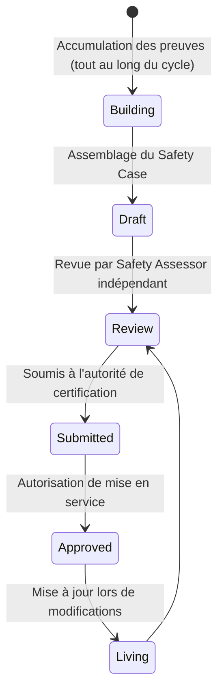
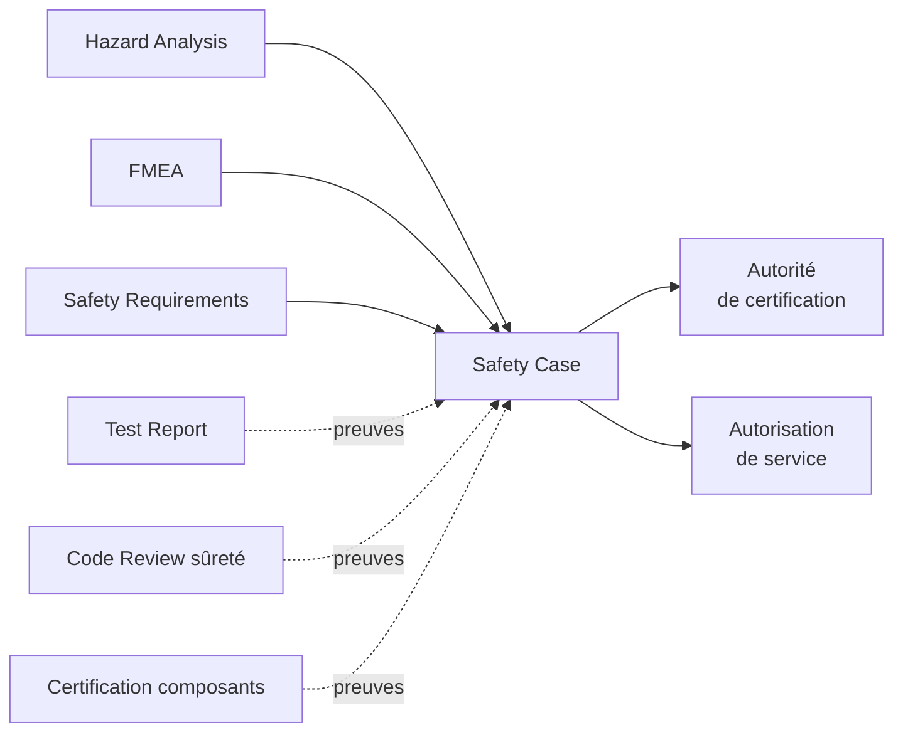
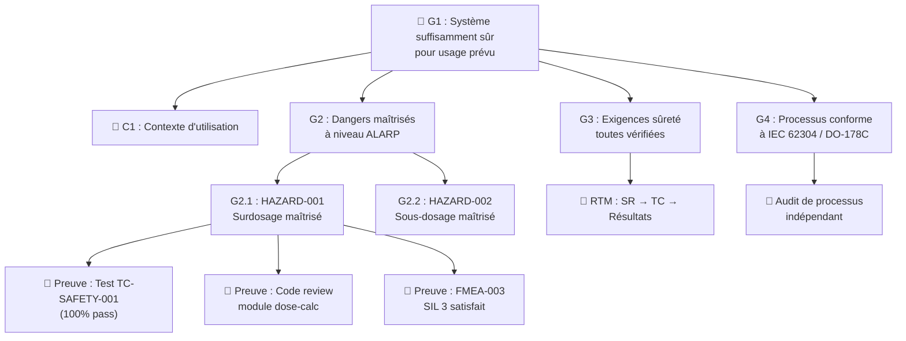

# Safety Case

> 📁 Phase : ⑤ Operations / Risk / Safety · 🏷️ Acronyme : **Safety Case** · 🔤 EN : _Safety Case / Safety Assurance Case_

---

## 1. Définition & objectif

Le **Safety Case** est un **argument structuré et documenté qui démontre que le système est suffisamment sûr pour son usage prévu**. Il ne dit pas « le système est parfait » mais « le risque résiduel est acceptable compte tenu de l'usage, des mitigations et des preuves disponibles ». Il répond à « **Pourquoi ce système est-il suffisamment sûr pour être mis en service ?** »

C'est le **dossier de sûreté** : une argumentation logique liant des affirmations (_claims_) à des preuves (_evidence_), structurée en hiérarchie (_Goal Structuring Notation_, GSN ou CAE).

| Ce qu'il EST                                 | Ce qu'il N'EST PAS                  |
| -------------------------------------------- | ----------------------------------- |
| Un argument de confiance structuré           | Un rapport de test seul             |
| L'agrégation de toutes les preuves de sûreté | Une garantie absolue de zéro défaut |
| Un artefact de certification                 | Un hazard analysis                  |

> **Domaine de prédilection** : systèmes critiques (médical, avionique, ferroviaire, nucléaire, défense). Rare dans les systèmes purement web/SaaS, sauf infrastructures critiques.

---

## 2. Usage & utilité

- **Certification** : exigé par les autorités de régulation (EASA, FDA, ANSM, autorité ferroviaire nationale).
- **Décision de mise en service** : le Safety Case est soumis à l'autorité qui autorise le service.
- **Transfert de responsabilité** : entre le développeur et l'opérateur.
- **Traçabilité totale** : toutes les preuves (tests, analyses, revues) sont reliées aux affirmations.
- **Communication** : expliquer _pourquoi_ le système est sûr à des parties prenantes non techniques.

---

## 3. Périmètre (in / out of scope)

**In scope**

- Arguments de sûreté (claims/objectifs de sûreté).
- Preuves : résultats de tests, analyses formelles, audits, revues, certifications de composants.
- Lien vers la Hazard Analysis, la FMEA, les Safety Requirements.
- Hypothèses et contexte d'utilisation.
- Risques résiduels explicitement acceptés.

**Out of scope**

- Identification des dangers → **Hazard Analysis**.
- Détail des tests → **Test Report**.
- Argumentation de sécurité informatique → **Threat Model / Security Requirements**.

---

## 4. Cycle de vie du document



- **Naissance** : construit progressivement tout au long du projet ; pas rédigé en une fois.
- **Vie** : maintenu à chaque modification du système (toute évolution nécessite une mise à jour du Safety Case).
- **Fin** : archivé à la décommission du système.

---

## 5. Métiers / rôles concernés (RACI)

| Activité           | Ingénieur Sûreté | Architecte | Dev | Safety Assessor indép. | Autorité certification |
| ------------------ | :--------------: | :--------: | :-: | :--------------------: | :--------------------: |
| Construction       |      **R**       |     C      |  C  |           I            |           I            |
| Rédaction          |      **R**       |     C      |  I  |           I            |           I            |
| Revue indépendante |        I         |     I      |  I  |         **R**          |           I            |
| Approbation        |        I         |     I      |  I  |           C            |         **A**          |

**R**esponsible · **A**ccountable · **C**onsulted · **I**nformed.

---

## 6. Position & interactions avec les autres documents



---

## 7. Nommage & versionnement

- **Fichier** : `safety-case-<système>-v<x.y>.md` — document de configuration contrôlée.
- **Structure** : souvent un document racine avec des sous-documents par sujet (argument, preuves).
- **Contrôle** : chaque version est approuvée ; les modifications sont auditées.

---

## 8. Template vierge (structure GSN simplifiée)

```markdown
# Safety Case — <Système>

## Affirmation principale (Top-Level Claim)

**G1 : Le système <Nom> est suffisamment sûr pour son usage prévu dans le contexte <C>.**

## Contexte

C1 : Contexte d'utilisation (portée, environnement, utilisateurs)
C2 : Standards applicables (IEC 62304, ISO 14971…)
C3 : Définition de « suffisamment sûr » (seuil de risque accepté)

## Hypothèses

A1 : <Hypothèse sur le contexte d'utilisation>

## Sous-arguments (structure)

### G2 : Tous les dangers identifiés sont maîtrisés à un niveau acceptable

- **Preuve** : Hazard Analysis v<x.y> — liste des dangers + mitigations
- **Preuve** : FMEA v<x.y> — défaillances analysées

#### G2.1 : HAZARD-001 est maîtrisé à un niveau ALARP

- **Preuve** : SR-001 implémentée (vérifiée par test TC-SAFETY-01)
- **Preuve** : Résultats test TC-SAFETY-01 (Test Report §4.2)
- **Preuve** : Revue de code indépendante module <X>

### G3 : Les exigences de sûreté sont toutes vérifiées

- **Preuve** : Matrice de traçabilité (RTM : SR → TC → Résultats)

### G4 : Le logiciel est développé selon les processus IEC 62304 / DO-178C

- **Preuve** : Plan de développement logiciel
- **Preuve** : Revues de conception (Design Reviews signées)
- **Preuve** : Audit de processus indépendant

## Risques résiduels acceptés

| Risque | Niveau | Justification |
| ------ | ------ | ------------- |

## Conclusion

**Le Safety Case démontre que <Système> respecte les critères de sûreté définis en C3,
pour l'usage décrit en C1. Risques résiduels documentés ci-dessus.**
```

---

## 9. Exemple (médical — pompe à perfusion)

```markdown
# Safety Case — Logiciel Pompe à Perfusion MediPump v2.0

## G1 : MediPump v2.0 est suffisamment sûr pour une utilisation en unité de soins intensifs

## Contexte

C1 : Utilisation par des infirmières formées en USI, patients adultes
C2 : IEC 62304 Classe C, ISO 14971:2019
C3 : Tous les dangers HAZARD-### de catégorie Catastrophique/Critique maîtrisés à ALARP

## G2.1 : HAZARD-001 (Surdosage) maîtrisé

- Preuve P1 : SR-001 implémentée — vérification des limites de dose (code review signée)
- Preuve P2 : Résultats TC-SAFETY-001 : 100% pass (Test Report v2.0 §4.3)
- Preuve P3 : FMEA-PUMP-003 : mode de défaillance « saisie incorrecte » → SIL 3 satisfait
- Preuve P4 : Test utilisabilité IEC 62366 : 0 erreur critique sur 18 scénarios

## Risques résiduels acceptés

| Risque                                              | Niveau   | Justification                                            |
| --------------------------------------------------- | -------- | -------------------------------------------------------- |
| Panne alimentation électrique simultanée au pompage | Marginal | Batterie de secours (8h) ; procédure manuelle documentée |
```

---

## 10. Checklist de revue

- [ ] L'affirmation principale est **précise** (périmètre et contexte d'usage définis).
- [ ] **Tous les dangers** de la Hazard Analysis sont adressés.
- [ ] Chaque sous-argument a des **preuves vérifiables**.
- [ ] Les **hypothèses** sont explicites.
- [ ] Les **risques résiduels** sont documentés et leur acceptation justifiée.
- [ ] La revue a été faite par un **safety assessor indépendant**.
- [ ] La **traçabilité** (hazard → SR → test → résultat) est complète.

---

## 11. Anti-patterns & pièges

| Anti-pattern                       | Problème                                | Correctif                                     |
| ---------------------------------- | --------------------------------------- | --------------------------------------------- |
| 🧟 **Safety Case rédigé à la fin** | Pas de preuves accumulées               | Construire tout au long du cycle              |
| 🔮 **Arguments circulaires**       | « Le système est sûr car on l'a testé » | Arguments logiques avec preuves indépendantes |
| 🌫️ **Preuves manquantes**          | Argument sans support                   | Chaque claim doit avoir des evidence          |
| 🎭 **Safety Assessor interne**     | Conflit d'intérêt                       | Indépendance de l'assesseur                   |

---

## 12. Variantes par industrie / contexte

| Industrie             | Norme / approche                                           |
| --------------------- | ---------------------------------------------------------- |
| **Médical**           | IEC 62304 + ISO 14971 + IEC 62366                          |
| **Avionique**         | DO-178C (software) + ARP 4754A (system) + AC 20-115D (FAA) |
| **Ferroviaire**       | EN 50129 (_Safety Case_ as formal artefact)                |
| **Automobile**        | ISO 26262 Safety Case (§8)                                 |
| **Défense/nucléaire** | Def Stan 00-056, DEF STAN 00-055, IEC 61513                |

---

## 13. Standards & normes

- **EN 50129** (ferroviaire) — _Safety Case_ comme document formel requis.
- **DEF STAN 00-056** (UK défense) — Safety Case standard de référence.
- **ISO 14971** (médical) — risk management (conclusion de sûreté acceptable).
- **Kelly & Weaver (2004)** — _Goal Structuring Notation (GSN)_ — notation de référence.

---

## 14. Outillage recommandé

| Besoin             | Outils                                        |
| ------------------ | --------------------------------------------- |
| Notation GSN       | Astah GSN, OMG SACM outils, Soteria (Eclipse) |
| Gestion de preuves | Jama Connect, IBM DOORS, LDRA (traçabilité)   |
| Assurance Case     | AdvoCATE, D-Case Editor                       |

---

## 15. Diagramme — Structure GSN du Safety Case (simplifiée)



---

> 🔎 **En une phrase** : le Safety Case est **le dossier de confiance** — il ne promet pas zéro défaut mais démontre, argument par argument et preuve par preuve, que les risques sont connus, maîtrisés et acceptables.

⬅️ [Hazard Analysis](./09-hazard-analysis.md) · ➡️ Suivant : [SLA/SLO/SLI](./11-sla-slo-sli.md)
