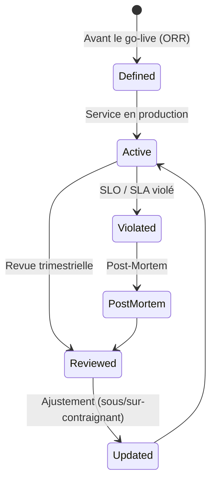

# SLA / SLO / SLI

> 📁 Phase : ⑤ Operations / Risk / Safety · 🏷️ Acronyme : **SLA / SLO / SLI** · 🔤 EN : _Service Level Agreement / Objective / Indicator_

---

## 1. Définition & objectif

Trois concepts étroitement liés, souvent confondus :

| Acronyme | Nom                     | Définition                                                                      | Qui l'engage            |
| -------- | ----------------------- | ------------------------------------------------------------------------------- | ----------------------- |
| **SLI**  | Service Level Indicator | **Mesure** d'une caractéristique de service (métrique réelle)                   | — (observation)         |
| **SLO**  | Service Level Objective | **Objectif** cible pour un SLI (ce qu'on vise en interne)                       | Équipe product/tech     |
| **SLA**  | Service Level Agreement | **Engagement contractuel** envers un client (avec conséquences si non respecté) | Fournisseur vers client |

> **Pyramide** : SLI → mesure réelle. SLO → objectif interne. SLA → contrat externe (plus souple que le SLO pour avoir une marge).

La hiérarchie : `SLA ≤ SLO` (le SLO interne est plus strict que l'engagement client, sinon on viole le SLA avant de le détecter).

Ils répondent à « **Quelle est la fiabilité attendue du service, comment la mesurons-nous, et qu'engageons-nous envers nos clients ?** »

---

## 2. Usage & utilité

- **Alignement** : toute l'équipe partage la même définition de la disponibilité et de la performance.
- **Error budget** : SLO = 99,9% → erreur budget = 0,1% = 43,8 min/mois de downtime autorisé.
- **Décision technique** : l'error budget guide les trade-offs (release rapide vs stabilité).
- **Confiance client** : le SLA est une promesse contractuelle mesurable.
- **On-call** : les alertes sont calibrées sur les SLO (pas les bonnes pratiques génériques).

---

## 3. Périmètre (in / out of scope)

**In scope**

- Définition des SLI (métriques, méthode de mesure).
- Définition des SLO (cibles, périodes de mesure, exclusions).
- SLA client (engagements, pénalités/crédits, exclusions).
- Error budget et politique de dépense.

**Out of scope**

- Mesure des performances par composant → **Performance Baseline**.
- Procédures de réponse aux incidents → **Playbooks / Runbooks**.

---

## 4. Cycle de vie du document



- **Naissance** : définis avant le go-live (ORR).
- **Vie** : revus trimestriellement (sont-ils réalistes ? trop faciles ? trop durs ?).
- **Fin** : mis à jour à chaque évolution majeure du service.

---

## 5. Métiers / rôles concernés (RACI)

| Activité                | SRE / Dev | PO / PM | Direction / Legal | Customer Success |
| ----------------------- | :-------: | :-----: | :---------------: | :--------------: |
| Définition SLI / SLO    |   **R**   |    C    |         I         |        I         |
| Définition SLA          |     C     |  **R**  |       **A**       |        C         |
| Mesure & reporting      |   **R**   |    I    |         I         |        I         |
| Error budget policy     |   **R**   |  **A**  |         I         |        I         |
| Notification SLA breach |     I     |    I    |         I         |      **R**       |

---

## 6. Position & interactions avec les autres documents

```mermaid
flowchart LR
    PB[Performance Baseline] --> SLO[SLO\n(basés sur la baseline)]
    SLO --> SLA
    SLO --> ALERT[Seuils d'alerte\n(calibrés sur SLO)]
    SLO --> ORR[ORR\n(critère go-live)]
    SLA --> CONTRACT[Contrat client]
    SLO_BREACH[Violation SLO] --> PLB[Playbook d'incident]
    SLO_BREACH --> PM[Post-Mortem]
```

---

## 7. Nommage & versionnement

- **Fichier** : `sla-slo-sli-<service>.md` ou section du `README` d'exploitation.
- **SLA** : dans le contrat commercial (document légal versionné).
- **SLO** : dans le repo de configuration ou wiki SRE.
- **Tableau de bord** : SLI mesurés en temps réel (Grafana, Datadog).

---

## 8. Template vierge

```markdown
# SLA / SLO / SLI — <Service>

## 1. Service Level Indicators (SLI)

### SLI-01 : Disponibilité

| Champ      | Valeur                                                                                   |
| ---------- | ---------------------------------------------------------------------------------------- |
| Définition | % de requêtes HTTP ayant reçu une réponse non-5xx                                        |
| Mesure     | `sum(rate(http_requests_total{status!~"5.."}[5m])) / sum(rate(http_requests_total[5m]))` |
| Fenêtre    | Fenêtre glissante 30 jours                                                               |
| Exclusions | Maintenance planifiée (notifiée 48h avant)                                               |

### SLI-02 : Latence

| Définition | % de requêtes satisfaites en < seuil |
| Mesure | p95 latence mesurée à l'API Gateway |
| Fenêtre | Fenêtre glissante 30 jours |

## 2. Service Level Objectives (SLO) — Engagements internes

| SLO    | SLI           | Cible               | Fenêtre  | Error Budget   |
| ------ | ------------- | ------------------- | -------- | -------------- |
| SLO-01 | Disponibilité | 99,9%               | 30 jours | 43,8 min/mois  |
| SLO-02 | Latence p95   | 95% des req < 500ms | 30 jours | 5% req > 500ms |

## 3. Service Level Agreement (SLA) — Engagements clients

| SLA    | Cible                 | Pénalité                                            | Exclusions                           |
| ------ | --------------------- | --------------------------------------------------- | ------------------------------------ |
| SLA-01 | Disponibilité ≥ 99,5% | Crédit 10% facture mensuelle par 0,1% sous le seuil | Maintenance planifiée, force majeure |

## 4. Error Budget Policy

<Quand l'error budget est épuisé à 50% → gel des déploiements non critiques>
<Quand épuisé à 100% → freeze total + post-mortem obligatoire>
```

---

## 9. Exemple rempli

````markdown
# SLA / SLO / SLI — Portail Client Self-Service

## 1. SLI

### SLI-01 : Disponibilité

```promql
avg_over_time(
  (sum(rate(kong_http_requests_total{status!~"5.."}[5m]))
   / sum(rate(kong_http_requests_total[5m])))[30d:5m]
)
```
````

**Exclusions** : maintenances planifiées (annoncées ≥ 48h) + incidents Keycloak tiers.

### SLI-02 : Latence p95

```promql
histogram_quantile(0.95, rate(kong_request_duration_seconds_bucket[5m]))
```

## 2. SLO

| SLO           | Cible           | Error Budget mensuel      |
| ------------- | --------------- | ------------------------- |
| Disponibilité | 99,9%           | 43,8 min                  |
| Latence p95   | 95% req < 500ms | 5% req autorisées > 500ms |

## 3. SLA (contrat clients B2B / partenaires)

| SLA                           | Cible    | Pénalité                                |
| ----------------------------- | -------- | --------------------------------------- |
| Disponibilité                 | 99,5%    | Crédit de service 10% par 0,1% manquant |
| Temps de réponse incidents P1 | < 15 min | —                                       |
| Résolution incidents P1       | < 4h     | Crédit 5% si dépassé                    |

**Marge SLO → SLA** : SLO 99,9% vs SLA 99,5% → 0,4% de marge.

## 4. Error Budget Policy

| Consommation EB | Action                                                  |
| :-------------: | ------------------------------------------------------- |
|      0–50%      | Normal : déploiements libres                            |
|     50–75%      | Caution : déploiements revus en SRE review              |
|     75–99%      | Freeze : déploiements bloqués sauf correctifs critiques |
|      100%       | Freeze total + post-mortem obligatoire + revue SLO      |

````

---

## 10. Checklist de revue

- [ ] Les **SLI** sont précisément définis (formule de calcul, fenêtre, exclusions).
- [ ] Les **SLO** sont **plus stricts** que les SLA (marge de sécurité).
- [ ] L'**error budget** est calculé pour chaque SLO.
- [ ] Une **error budget policy** est définie (que se passe-t-il quand ça approche 0 ?).
- [ ] Les **exclusions** (maintenance planifiée, force majeure) sont documentées.
- [ ] Les SLO sont **mesurés en temps réel** (dashboard Grafana / Datadog).
- [ ] Les **alertes** sont calées sur les SLO (burn rate alerting).

---

## 11. Anti-patterns & pièges

| Anti-pattern | Problème | Correctif |
|--------------|----------|-----------|
| 📊 **SLO basés sur la moyenne** | Masque les queues longues | Utiliser les percentiles (p95, p99) |
| 🔒 **SLA = SLO** | 0 marge → SLA violé avant de le détecter | SLA ≤ SLO - marge |
| 💯 **SLO à 100%** | Impossibilité mathématique, paralysie | Réalisme : 99,9% ou 99,5% selon le contexte |
| 🕳️ **Pas d'error budget policy** | Error budget vidé sans réaction | Politique formelle et connue |
| 🧊 **SLO jamais révisés** | Deviennent irréalistes | Revue trimestrielle |
| 📅 **Fenêtre calendaire** (vs glissante) | Flush le 1er du mois | Fenêtre glissante 30 jours |

---

## 12. Variantes par industrie / contexte

| Contexte | Spécificités |
|----------|--------------|
| **Cloud providers** | AWS/GCP/Azure publient leurs SLA par service (~99,9% à 99,99%). |
| **B2B SaaS** | SLA contractuels avec crédits de service automatiques. |
| **Finance (DORA EU)** | RTO/RPO réglementaires stricts ; reporting incidents. |
| **Télécoms** | SLA en millièmes (99,999% = « 5 nine », 5,26 min/an). |

---

## 13. Standards & normes

- **Google SRE Book** — *Service Level Objectives* (chapitres 4-5), *Error Budgets*.
- **ITIL 4** — *Service Level Management Practice*.
- **ISO/IEC 20000** — gestion des niveaux de service.
- **DORA EU (2022)** — *Digital Operational Resilience Act* : RTO/RPO réglementaires (finance).

---

## 14. Outillage recommandé

| Besoin | Outils |
|--------|--------|
| Mesure SLI | Grafana (SLO plugin), Datadog SLOs, Prometheus |
| Dashboard SLO | Grafana, Datadog SLOs, Nobl9, Sloth |
| Burn rate alerting | Prometheus Alertmanager, Grafana Alerting |
| Status page | Statuspage.io, BetterUptime |
| Error budget | Nobl9, Sleuth |

---

## 15. Diagramme — Relations SLI / SLO / SLA et Error Budget

```mermaid
flowchart TD
    METRICS[Métriques en temps réel\n(Prometheus / Grafana)] --> SLI[SLI\nDisponibilité = 99,92%]
    SLI --> SLO_CHECK{SLI ≥ SLO ?\n99,92% ≥ 99,9%}
    SLO_CHECK -->|Oui| OK[✅ SLO respecté\nError budget 12,4 min restants]
    SLO_CHECK -->|Non| BURN[🔥 Error budget brûlé\n(burn rate élevé)]
    BURN --> POLICY{Error budget\npolicy}
    POLICY -->|50-75%| REVIEW[SRE review\navant déploiement]
    POLICY -->|>100%| FREEZE[Freeze déploiements\n+ Post-Mortem]
    SLA_CHECK{SLI ≥ SLA ?\n99,92% ≥ 99,5%} --> SLA_OK[✅ SLA respecté]
    SLI --> SLA_CHECK
    SLI -.marge.-> NOTE["Marge SLO→SLA : 0,4%\n(SLO violé avant SLA)"]
````

---

> 🔎 **En une phrase** : SLI mesure, SLO engage en interne, SLA contractualise en externe — ensemble ils transforment « on fait de notre mieux » en **engagements mesurables**, et l'error budget en outil de décision d'équipe.

⬅️ [Safety Case](./10-safety-case.md) · ➡️ Suivant : [DRP/PCA](./12-drp-pca-disaster-recovery.md)
