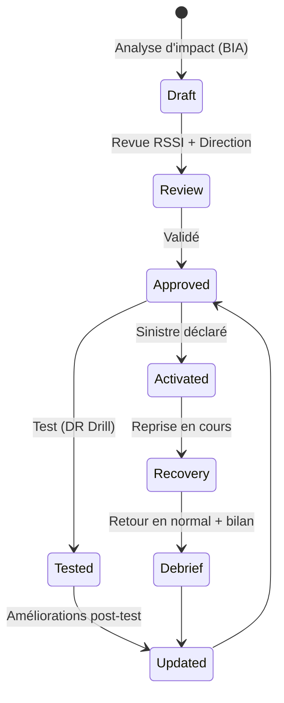
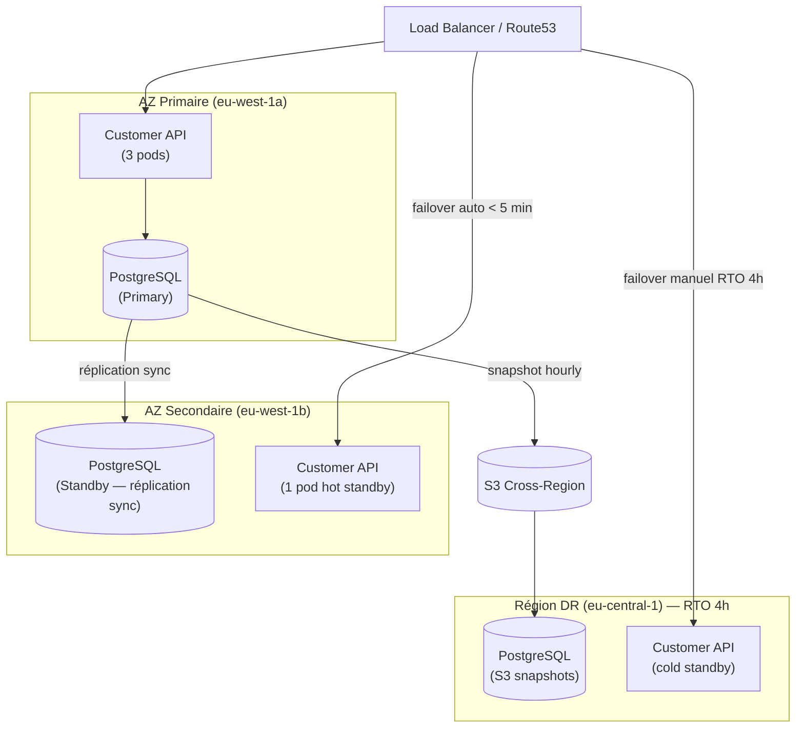

# DRP / PCA — Disaster Recovery Plan / Plan de Continuité d'Activité

> 📁 Phase : ⑤ Operations / Risk / Safety · 🏷️ Acronyme : **DRP / PCA** · 🔤 EN : _Disaster Recovery Plan (DRP) / Business Continuity Plan (BCP)_

---

## 1. Définition & objectif

Le **DRP** (_Disaster Recovery Plan_) et le **PCA** (_Plan de Continuité d'Activité_ / _Business Continuity Plan_) décrivent **comment l'organisation reprend ses opérations après un sinistre majeur**. Bien que connexes, ils ont des niveaux différents :

|          | **DRP**                                              | **PCA / BCP**                                        |
| -------- | ---------------------------------------------------- | ---------------------------------------------------- |
| Portée   | Systèmes informatiques                               | Activité métier globale (IT + processus + personnes) |
| Question | _Comment restaurer les systèmes après un sinistre ?_ | _Comment l'entreprise continue-t-elle à opérer ?_    |
| Audience | IT / SRE                                             | Direction + métier + IT                              |
| Résultat | Systèmes restaurés                                   | Activité maintenue (même dégradée)                   |

Métriques clés :

- **RTO** (_Recovery Time Objective_) : temps maximum toléré pour restaurer le service.
- **RPO** (_Recovery Point Objective_) : perte de données maximale tolérée (jusqu'à quand remonte-t-on ?).

---

## 2. Usage & utilité

- **Réduire l'impact** d'un sinistre (incendie, inondation, cyberattaque, panne datacenter).
- **Garantir la continuité** des services critiques (même en mode dégradé).
- **Conformité réglementaire** : DORA EU (finance), ISO 22301, PCI-DSS, SOC 2 exigent un BCP/DRP.
- **Assurance** : souvent exigé pour les cyber-assurances.
- **Confiance** : les clients et partenaires savent que vous avez un plan.

---

## 3. Périmètre (in / out of scope)

**In scope**

- Scénarios de sinistre couverts (et exclus).
- RTO et RPO par service/fonction.
- Stratégie de reprise (failover, backup, site de repli).
- Procédures de restauration détaillées.
- Équipes de crise et contacts.
- Tests réguliers du plan.

**Out of scope**

- Incidents courants (→ **Playbooks / Runbooks**).
- Réponse aux incidents de sécurité (→ **Incident Response Playbook**).

---

## 4. Cycle de vie du document



- **Naissance** : en amont du go-live ; souvent suite à une analyse d'impact (_Business Impact Analysis, BIA_).
- **Vie** : testé au minimum annuellement (_DR Drill_) ; mis à jour après chaque test ou évolution majeure.
- **Fin** : mis à jour à chaque changement d'infrastructure ou d'organisation.

---

## 5. Métiers / rôles concernés (RACI)

| Activité                  | SRE / DevOps | RSSI  | Direction | Métier | Juridique |
| ------------------------- | :----------: | :---: | :-------: | :----: | :-------: |
| Définition RTO/RPO        |      C       |   C   |   **A**   | **R**  |     I     |
| Rédaction DRP (technique) |    **R**     |   C   |     I     |   I    |     I     |
| Rédaction PCA (métier)    |      I       |   C   |   **R**   | **R**  |     C     |
| Test (DR Drill)           |    **R**     |   C   |     I     |   C    |     I     |
| Activation en sinistre    |    **R**     | **R** |   **A**   |   C    |     C     |

---

## 6. Position & interactions avec les autres documents

```mermaid
flowchart LR
    RISK[Risk Register] --> DRP
    SLA[SLA/SLO\nRTO/RPO] --> DRP
    ORR --> DRP
    DRP -.procédures.-> RUN[Runbooks DR]
    DRP -.scénarios.-> PLB[Playbooks\n(sinistre majeur)]
    DRP -.audit.-> ISO22301[ISO 22301 / SOC 2]
```

---

## 7. Nommage & versionnement

- **Fichier** : `DRP-<système>.md` + `PCA-<organisation>.md`.
- **Confidentialité** : accès restreint (contient les contacts de crise, les accès de repli).
- **Test** : DR Drill minimum annuel avec compte-rendu.
- **Version** : mise à jour après chaque test ou évolution infra.

---

## 8. Template vierge

```markdown
# DRP — <Système / Organisation>

## 1. Objectifs de reprise (RTO / RPO)

| Service | RTO | RPO | Priorité |
| ------- | :-: | :-: | :------: |

## 2. Scénarios couverts

| Scénario | Probabilité | DRP applicable |
| -------- | :---------: | -------------- |

## 3. Architecture de reprise

<Schéma de l'infrastructure de reprise : site secondaire, cloud failover, backups>

### 3.1 Sauvegardes

| Donnée | Fréquence | Rétention | Stockage | Test restauration |
| ------ | :-------: | :-------: | -------- | :---------------: |

### 3.2 Failover

| Composant | Stratégie | RTO | Manuel / Auto |
| --------- | --------- | :-: | :-----------: |

## 4. Équipe de crise

| Rôle | Responsabilité | Contact | Backup |
| ---- | -------------- | ------- | ------ |

## 5. Procédures de reprise

### Scénario A : Perte d'un datacenter / AZ

### Scénario B : Ransomware / corruption des données

### Scénario C : Perte de l'équipe (indisponibilité clé)

## 6. Plan de test (DR Drill)

| Date | Type | Scénario | Résultat | RTO mesuré | RPO mesuré |
| ---- | ---- | -------- | -------- | :--------: | :--------: |

## 7. Plan de communication de crise
```

---

## 9. Exemple rempli (extrait)

```markdown
# DRP — Portail Client Self-Service

## 1. RTO / RPO

| Service                   | RTO | RPO | Priorité |
| ------------------------- | :-: | :-: | :------: |
| Portail (pages commandes) | 4h  | 1h  | Critique |
| Génération PDF factures   | 24h | 4h  |  Haute   |
| Notifications e-mail      | 4h  | 1h  |  Haute   |
| Base de données client    | 4h  | 1h  | Critique |

## 2. Scénarios couverts

| Scénario                              | Probabilité | Plan                                                |
| ------------------------------------- | :---------: | --------------------------------------------------- |
| Perte de l'AZ primaire AWS eu-west-1a |   Faible    | Failover vers eu-west-1b (auto, < 5 min)            |
| Perte de la région AWS eu-west-1      | Très faible | Basculement vers eu-central-1 (manuel, RTO 4h)      |
| Corruption de la base de données      | Très faible | Restauration depuis backup S3 (RPO 1h)              |
| Attaque ransomware                    |   Faible    | Isolation + restauration depuis snapshots immuables |

## 3.1 Sauvegardes

| Donnée               |            Fréquence            | Rétention | Stockage        |  Test   |
| -------------------- | :-----------------------------: | :-------: | --------------- | :-----: |
| PostgreSQL (RDS)     | Continu (WAL) + snapshot hourly | 30 jours  | S3 cross-region | Mensuel |
| Redis (cache)        | Pas de sauvegarde (reconstruit) |     —     | —               |    —    |
| Fichiers PDF générés |  Non (regénérés à la demande)   |     —     | —               |    —    |

## 6. DR Drill historique

| Date       | Scénario        | RTO mesuré | RPO mesuré | Résultat         | Actions                                  |
| ---------- | --------------- | :--------: | :--------: | ---------------- | ---------------------------------------- |
| 2026-01-20 | Failover AZ     |   4 min    |   0 min    | ✅               | Documenter le runbook auto-failover      |
| 2025-07-15 | Restauration DB |    3h45    |   47 min   | ⚠️ RTO trop long | Optimiser restauration (lecture des WAL) |
```

---

## 10. Checklist de revue

- [ ] Les **RTO et RPO** sont définis par service et validés par le métier.
- [ ] Tous les **scénarios significatifs** sont couverts.
- [ ] L'**architecture de reprise** est documentée et à jour.
- [ ] Les **sauvegardes** sont testées (restauration vérifiée, pas juste écriture).
- [ ] L'**équipe de crise** avec contacts (et backups) est à jour.
- [ ] Le plan a été **testé** (DR Drill) dans les 12 derniers mois.
- [ ] Le **plan de communication** (clients, direction, régulateurs) est prêt.

---

## 11. Anti-patterns & pièges

| Anti-pattern                          | Problème                          | Correctif                          |
| ------------------------------------- | --------------------------------- | ---------------------------------- |
| 💾 **Sauvegardes non testées**        | Impossible de restaurer le jour J | Test de restauration mensuel       |
| 🕳️ **RTO/RPO non définis**            | Pas de critère de succès          | Définir avec le métier avant       |
| 📚 **DRP jamais testé**               | Dysfonctionnel en vrai sinistre   | DR Drill minimum annuel            |
| 🏃 **Site secondaire pas à jour**     | Restauration sur données périmées | Réplication continue vérifiée      |
| 🔐 **Plan confidentiel** inaccessible | Introuvable en cas de sinistre    | Copie hors-ligne, accès distribués |

---

## 12. Variantes par industrie / contexte

| Contexte         | Norme                                                                                       |
| ---------------- | ------------------------------------------------------------------------------------------- |
| **Général**      | ISO 22301 — _Business Continuity Management Systems_.                                       |
| **Finance (EU)** | DORA — _Digital Operational Resilience Act_ (RTO/RPO réglementaires).                       |
| **Cloud**        | AWS/Azure/GCP : Architecture multi-AZ, Cross-Region replication, Disaster Recovery options. |
| **PCI-DSS**      | Requirement 12.10 — Incident Response Plan incluant le DRP.                                 |

---

## 13. Standards & normes

- **ISO 22301:2019** — _Business Continuity Management Systems_.
- **NIST SP 800-34** — _Contingency Planning Guide for Federal Information Systems_.
- **DORA EU (2022)** — _Digital Operational Resilience Act_ (finance, RTO/RPO réglementaires).
- **ITIL 4** — _IT Service Continuity Management_.

---

## 14. Outillage recommandé

| Besoin                | Outils                                                       |
| --------------------- | ------------------------------------------------------------ |
| Sauvegardes           | AWS Backup, Azure Backup, Velero (K8s), pg_dump/pgBackRest   |
| Failover auto         | AWS Route53, Azure Traffic Manager, Kubernetes multi-cluster |
| Tests de restauration | Chaos Engineering (Gremlin), AWS Fault Injection Simulator   |
| Documentation DR      | Confluence, Notion (avec version hors-ligne)                 |

---

## 15. Diagramme — Architecture de reprise multi-AZ



---

> 🔎 **En une phrase** : le DRP/PCA transforme « espérons que ça n'arrive pas » en **plan d'action éprouvé** — parce que les sinistres arrivent, et l'équipe qui les surmonte en < 4h est celle qui a répété le scénario à froid.

⬅️ [SLA/SLO/SLI](./11-sla-slo-sli.md) · ➡️ Suivant : [DPIA](./13-dpia-data-protection-impact-assessment.md)
