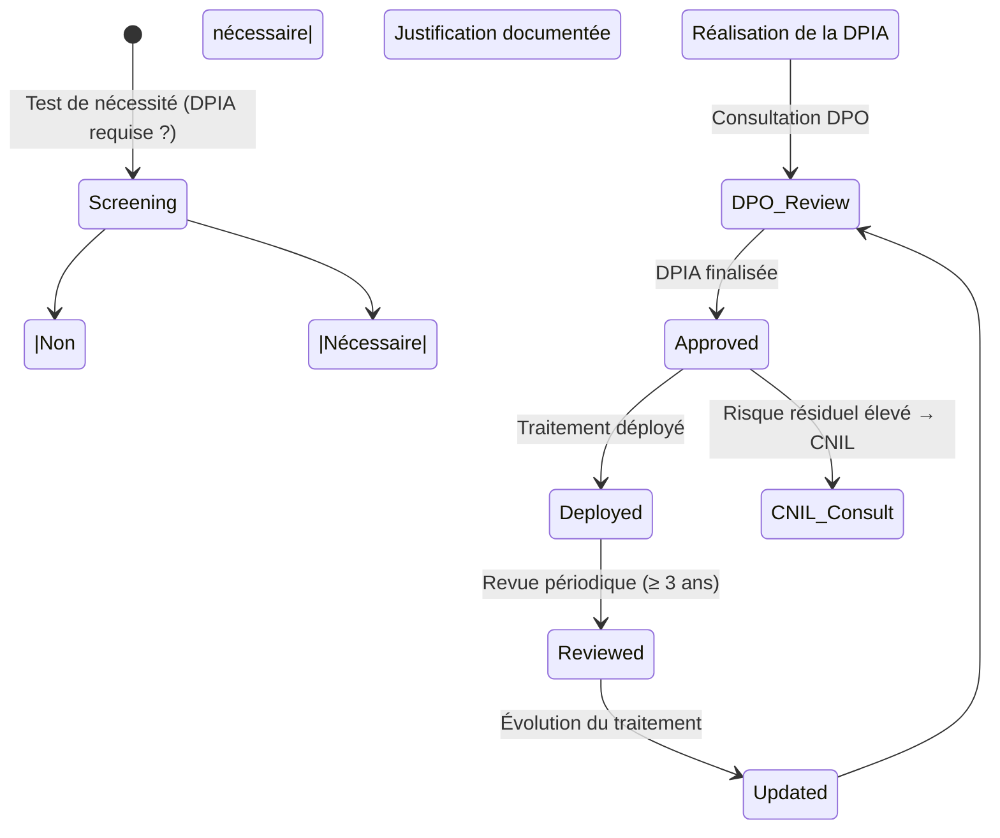

# DPIA — Data Protection Impact Assessment

> 📁 Phase : ⑤ Operations / Risk / Safety · 🏷️ Acronyme : **DPIA** · 🔤 EN : _Data Protection Impact Assessment_

---

## 1. Définition & objectif

La **DPIA** (_Data Protection Impact Assessment_ — Analyse d'Impact relative à la Protection des Données) est une **analyse des risques spécifiquement liés au traitement de données personnelles**, obligatoire dans certains cas sous le RGPD (Règlement Général sur la Protection des Données). Elle répond à « **Ce traitement de données personnelles présente-t-il des risques pour les droits et libertés des personnes concernées, et comment les atténuer ?** »

La DPIA est à la fois un **outil de conformité** (RGPD art. 35) et un **outil de gestion des risques** appliqué à la vie privée.

| Ce qu'elle EST                                       | Ce qu'elle N'EST PAS                  |
| ---------------------------------------------------- | ------------------------------------- |
| Analyse des risques pour les personnes               | Un audit de sécurité informatique     |
| Obligatoire sous certaines conditions (RGPD art. 35) | Un document générique sur les cookies |
| Réalisée avant le déploiement                        | Une formalité à cocher                |

---

## 2. Usage & utilité

- **Conformité légale** : obligatoire si le traitement est « à risque élevé » (RGPD art. 35).
- **Privacy by design** : identifier et corriger les risques vie privée _avant_ le déploiement.
- **Responsabilité (accountability)** : preuve que les risques ont été évalués (RGPD art. 5.2).
- **Confiance** : les clients et partenaires savent que leur vie privée est prise au sérieux.

**Quand une DPIA est obligatoire (RGPD art. 35)** :

- Traitement à grande échelle de données sensibles (santé, origine ethnique, opinions politiques…).
- Surveillance systématique d'espaces accessibles au public.
- Profilage ou scoring à large échelle.
- Décisions automatisées avec effet légal.
- Nouvelles technologies dont l'impact est incertain.

---

## 3. Périmètre (in / out of scope)

**In scope**

- Description précise du traitement (données, finalités, acteurs).
- Évaluation de la nécessité et de la proportionnalité.
- Identification des risques pour les personnes (confidentialité, intégrité, disponibilité des données, discrimination, perte de contrôle).
- Mesures de mitigation.
- Avis du DPO ; consultation de l'autorité de contrôle si risque résiduel élevé.

**Out of scope**

- Sécurité des systèmes en général → **Security Requirements / Threat Model**.
- RGPD en général → politique de protection des données.
- Données non personnelles.

---

## 4. Cycle de vie du document



- **Naissance** : **avant** le déploiement du traitement (art. 35 RGPD : « avant le traitement »).
- **Vie** : révisée si le traitement change ; revue périodique recommandée (tous les 3 ans).
- **Consultation CNIL** : si le risque résiduel reste élevé après mesures → consultation préalable obligatoire.

---

## 5. Métiers / rôles concernés (RACI)

| Activité               | Équipe projet |  DPO  | RSSI | Direction | Autorité (CNIL) |
| ---------------------- | :-----------: | :---: | :--: | :-------: | :-------------: |
| Rédaction              |     **R**     |   C   |  C   |     I     |        I        |
| Évaluation des risques |     **R**     | **R** |  C   |     I     |        I        |
| Validation DPO         |       C       | **A** |  C   |     I     |        I        |
| Consultation autorité  |       I       | **R** |  I   |   **A**   |        I        |
| Tenue du registre      |       C       | **R** |  I   |     I     |        I        |

**R**esponsible · **A**ccountable · **C**onsulted · **I**nformed.

---

## 6. Position & interactions avec les autres documents

```mermaid
flowchart LR
    DM[Data Model\n(données PII)] --> DPIA
    AUTH[AUTH Doc\n(accès aux PII)] --> DPIA
    SBOM[SBOM\n(libs traitant PII)] --> DPIA
    TM[Threat Model\n(risques sécu)] --> DPIA
    DPIA --> SR[Security Requirements\n(mesures DPIA)]
    DPIA -.registre traitements.-> REG[Registre des\ntraitements RGPD]
    DPIA -.consultation.-> CNIL[CNIL / Autorité]
```

---

## 7. Nommage & versionnement

- **Fichier** : `DPIA-<traitement>-v<x.y>.md`.
- **Registre** : la DPIA alimente le registre des activités de traitement (art. 30 RGPD).
- **Conservation** : obligatoire (preuve accountability) ; accessible à l'autorité de contrôle sur demande.
- **Confidentialité** : les DPIA peuvent contenir des informations sensibles (vulnérabilités, données PII) → accès restreint.

---

## 8. Template vierge (CNIL — recommandations)

```markdown
# DPIA — <Nom du traitement>

| Champ                     | Valeur                              |
| ------------------------- | ----------------------------------- |
| Responsable de traitement |                                     |
| DPO                       |                                     |
| Version                   | v1.0                                |
| Date                      | AAAA-MM-JJ                          |
| Statut                    | Draft / Approuvé / À consulter CNIL |

## 1. Description du traitement

### 1.1 Finalité(s)

### 1.2 Base légale (art. 6 RGPD)

### 1.3 Données personnelles traitées

| Catégorie de données | Personnes concernées | Volume estimé | Sensibles ? |
| -------------------- | -------------------- | :-----------: | :---------: |

### 1.4 Acteurs

| Acteur | Rôle | Sous-traitants |
| ------ | ---- | -------------- |

### 1.5 Durées de conservation

| Données | Durée | Justification |
| ------- | ----- | ------------- |

### 1.6 Transferts hors UE

## 2. Évaluation de la nécessité & proportionnalité

### 2.1 La finalité est-elle légitime et explicite ?

### 2.2 Les données collectées sont-elles limitées au minimum nécessaire ?

### 2.3 Les durées sont-elles proportionnées ?

## 3. Risques pour les droits et libertés des personnes

### 3.1 Identification des risques

| ID  | Risque | Cause | Impact | Probabilité | Niveau |
| --- | ------ | ----- | ------ | :---------: | ------ |

### 3.2 Mesures de mitigation

| Risque | Mesure | Résidu |
| ------ | ------ | ------ |

## 4. Avis du DPO

## 5. Décision & consultation CNIL (si nécessaire)
```

---

## 9. Exemple rempli (Portail Client)

```markdown
# DPIA — Portail Client Self-Service — Gestion des comptes et réclamations

| Responsable | Example Corp |
| DPO | M. Rousseau |
| Date | 2026-03-01 |

## 1.3 Données personnelles traitées

| Données                           | Personnes | Volume  |   Sensibles   |
| --------------------------------- | --------- | :-----: | :-----------: |
| Prénom, nom                       | Clients   | ~50 000 |      Non      |
| Adresse e-mail                    | Clients   | ~50 000 |      Non      |
| Historique commandes              | Clients   | ~50 000 |      Non      |
| Réclamations (contenu)            | Clients   | ~2 000  | Indirectement |
| Logs de connexion (IP, timestamp) | Clients   | ~50 000 |      Non      |

## 1.5 Durées de conservation

| Données              | Durée                        | Justification                   |
| -------------------- | ---------------------------- | ------------------------------- |
| Compte client actif  | Durée de la relation + 3 ans | Obligation légale (facturation) |
| Logs de connexion    | 90 jours                     | Sécurité / investigation        |
| Réclamations fermées | 5 ans                        | Prescription légale             |

## 3.1 Risques identifiés

| ID  | Risque                                         | Impact | Prob.  | Niveau |
| --- | ---------------------------------------------- | :----: | :----: | ------ |
| R1  | Accès non autorisé aux données (IDOR)          | Élevé  | Faible | Moyen  |
| R2  | Fuite de données (breach)                      | Élevé  | Faible | Moyen  |
| R3  | Conservation excessive des données             | Moyen  | Moyen  | Moyen  |
| R4  | Difficulté exercice droits (accès, effacement) | Moyen  | Faible | Faible |

## 3.2 Mesures

| Risque | Mesure                                               | Résidu |
| ------ | ---------------------------------------------------- | ------ |
| R1     | Row-level security + tests TC-SEC-01                 | Faible |
| R2     | Chiffrement TLS + accès RBAC + logs audit            | Faible |
| R3     | Purge automatique après délai + procédure effacement | Faible |
| R4     | Interface self-service export/suppression            | Faible |

## 4. Avis DPO

Le traitement est proportionné à la finalité. Les mesures de mitigation ramènent
le risque résiduel à un niveau acceptable. Pas de consultation CNIL requise.
**Avis favorable — 2026-03-05 — M. Rousseau (DPO)**
```

---

## 10. Checklist de revue

- [ ] La **nécessité d'une DPIA** a été évaluée (test de nécessité documenté).
- [ ] La **base légale** (art. 6 RGPD) est identifiée pour chaque traitement.
- [ ] Les **données** collectées sont limitées au minimum nécessaire (_data minimization_).
- [ ] Les **durées de conservation** sont justifiées.
- [ ] Les **risques pour les personnes** (pas juste les risques techniques) sont évalués.
- [ ] Les **mesures de mitigation** sont concrètes et vérifiables.
- [ ] L'**avis du DPO** est documenté.
- [ ] La **consultation CNIL** est prévue si risque résiduel élevé.

---

## 11. Anti-patterns & pièges

| Anti-pattern                                        | Problème                                                    | Correctif                                            |
| --------------------------------------------------- | ----------------------------------------------------------- | ---------------------------------------------------- |
| ⏰ **DPIA réalisée après le déploiement**           | Non-conformité RGPD ; mesures impossibles à mettre en place | Avant le traitement, toujours                        |
| 📋 **DPIA générique copier-coller**                 | Ne reflète pas le traitement réel                           | Personnalisée à chaque traitement                    |
| 🎭 **Risques = risques IT seulement**               | Les risques pour les personnes ignorés                      | Se mettre à la place des personnes                   |
| 🔒 **Sans le DPO**                                  | Non-conformité ; DPO contourné                              | Consultation DPO obligatoire                         |
| 🌫️ **Mesures vagues** (« nous appliquons le RGPD ») | Non vérifiables                                             | Mesures concrètes (chiffrement AES-256, accès RBAC…) |

---

## 12. Variantes par industrie / contexte

| Contexte                          | Spécificités                                                                |
| --------------------------------- | --------------------------------------------------------------------------- |
| **Médical / HIPAA**               | DPIA + consentement éclairé ; données de santé = catégorie spéciale art. 9. |
| **Assurances / banque**           | Profilage → DPIA obligatoire + droit d'opposition.                          |
| **Recherche scientifique**        | Dérogations spécifiques + mesures de pseudonymisation.                      |
| **Enfants (COPPA / RGPD art. 8)** | Consentement parental, protections renforcées.                              |

---

## 13. Standards & normes

- **RGPD art. 35** — obligation de DPIA.
- **CNIL — Lignes directrices DPIA** (guide méthodologique).
- **CNIL — PIA Software** (outil open source de réalisation de DPIA).
- **ENISA — Privacy and Data Protection by Design** (guide technique).
- **ISO/IEC 29134:2017** — _Privacy impact assessment_ (PIA) — équivalent international.

---

## 14. Outillage recommandé

| Besoin                   | Outils                                                  |
| ------------------------ | ------------------------------------------------------- |
| Réalisation DPIA         | CNIL PIA (outil open source), OneTrust, Didomi, Axeptio |
| Registre des traitements | OneTrust, Didomi, tableur CNIL, Privacy Bee             |
| Conformité RGPD          | Cookiebot, Truendo, privacy.com                         |

---

## 15. Diagramme — Processus DPIA (CNIL)

```mermaid
flowchart TD
    PROJET[Nouveau traitement / évolution] --> TEST{Test de nécessité\n(art. 35 RGPD)\nTraitement à risque élevé ?}
    TEST -->|Non| DOCJUSTIF[Documenter la\njustification\n→ Registre art. 30]
    TEST -->|Oui| DPIA_START[Réaliser la DPIA]

    DPIA_START --> DESC[1. Décrire le traitement\n(données, finalités, acteurs)]
    DESC --> NECESS[2. Évaluer nécessité\net proportionnalité]
    NECESS --> RISKS[3. Identifier et évaluer\nles risques pour les personnes]
    RISKS --> MITIG[4. Définir les mesures\nde mitigation]
    MITIG --> DPO_AVIS[5. Consulter le DPO]
    DPO_AVIS --> RESIDUAL{Risque résiduel\nencore élevé ?}
    RESIDUAL -->|Non| APPROVED[✅ DPIA approuvée\nDéploiement autorisé]
    RESIDUAL -->|Oui| CNIL[Consultation CNIL\n(art. 36 RGPD)\n(délai : 8 semaines)"]
    CNIL --> APPROVED
```

---

> 🔎 **En une phrase** : la DPIA est l'**analyse des risques côté personnes** — elle oblige à se demander non pas « est-ce que nos serveurs sont sécurisés ? » mais « est-ce que les droits des personnes dont nous traitons les données sont respectés ? »

⬅️ [DRP/PCA](./12-drp-pca-disaster-recovery.md) · ➡️ Suivant : [FMEA](./14-fmea-failure-mode-effects-analysis.md)
