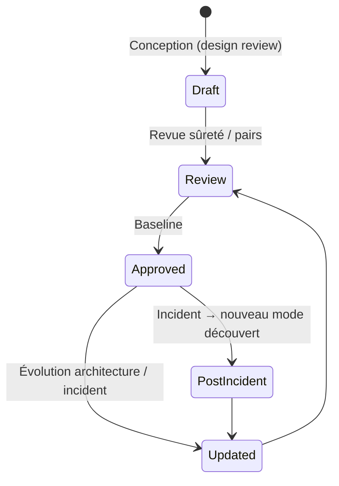
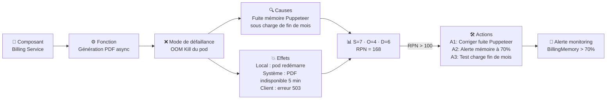

# FMEA — Failure Mode and Effects Analysis

> 📁 Phase : ⑤ Operations / Risk / Safety · 🏷️ Acronyme : **FMEA** · 🔤 EN : _Failure Mode and Effects Analysis_

---

## 1. Définition & objectif

La **FMEA** (_Failure Mode and Effects Analysis_ — Analyse des Modes de Défaillance et de leurs Effets) est une méthode systématique qui identifie, pour chaque composant, **comment il peut tomber en panne (mode de défaillance), quels effets cette panne produit, et comment la prévenir ou la détecter**. Elle répond à « **Comment chaque composant peut-il échouer, avec quels effets, et quelle est la criticité de ces défaillances ?** »

La criticité est calculée via le **RPN** (_Risk Priority Number_) :

$$\text{RPN} = \text{Sévérité (S)} \times \text{Occurrence (O)} \times \text{Détection (D)}$$

où S, O, D sont notés de 1 à 10 (RPN max = 1000).

| Ce qu'elle EST                            | Ce qu'elle N'EST PAS                    |
| ----------------------------------------- | --------------------------------------- |
| Analyse bottom-up (composant → effet)     | Un Risk Register général                |
| Focalisée sur les défaillances techniques | Une Hazard Analysis (top-down, dangers) |
| Priorisée par RPN                         | Un pentest                              |

> **FMEA vs Hazard Analysis** : la FMEA part de la défaillance technique pour remonter aux effets (_bottom-up_) ; la Hazard Analysis part du danger (conséquence) pour identifier les causes (_top-down_). Les deux sont complémentaires.

---

## 2. Usage & utilité

- **Identifier les points de défaillance critiques** avant qu'ils se produisent.
- **Prioriser** les efforts de prévention / détection (RPN élevé = priorité).
- **Alimentation des tests** : les modes de défaillance critiques → cas de test prioritaires.
- **Base du monitoring** : les modes de défaillance critiques → alertes en production.
- **Certification** : exigée en systèmes critiques (IEC 61508, ISO 26262, médical, avionique).

---

## 3. Périmètre (in / out of scope)

**In scope**

- Composants et fonctions du système.
- Modes de défaillance possibles (comment ça peut échouer).
- Effets locaux et effets sur le système/utilisateur.
- Causes probables (pourquoi ça échouerait).
- Contrôles existants (prévention + détection).
- RPN et actions correctives.

**Out of scope**

- Risques non-défaillance (réglementation, marché) → Risk Register.
- Dangers liés à l'usage → Hazard Analysis.
- Incidents passés → RCA / Post-Mortem.

---

## 4. Cycle de vie du document



- **Naissance** : en phase de conception (HLD / LLD), idéalement avant l'implémentation.
- **Vie** : mise à jour à chaque évolution architecturale et après chaque incident révélant un mode inconnu.
- **Fin** : archivée avec le système.

---

## 5. Métiers / rôles concernés (RACI)

| Activité                 | Ingénieur / Dev | Tech Lead | Architecte | QA / Test |  SRE  |
| ------------------------ | :-------------: | :-------: | :--------: | :-------: | :---: |
| Identification des modes |      **R**      |     C     |   **R**    |     C     |   C   |
| Évaluation (S, O, D)     |      **R**      |     C     |     C      |     C     |   C   |
| Actions correctives      |        C        |   **R**   |   **R**    |     C     |   C   |
| Tests dérivés            |        I        |     I     |     I      |   **R**   |   I   |
| Alertes dérivées         |        I        |     C     |     I      |     I     | **R** |

---

## 6. Position & interactions avec les autres documents

```mermaid
flowchart LR
    HLD --> FMEA
    LLD --> FMEA
    FMEA --> HA[Hazard Analysis\n(effets graves)]
    FMEA -.modes critiques.-> TC[Test Cases\npriorisés]
    FMEA -.modes critiques.-> ALERT[Alertes monitoring]
    FMEA -.risques.-> RR[Risk Register]
    PM[Post-Mortem] -.nouveau mode.-> FMEA
```

---

## 7. Nommage & versionnement

- **Fichier** : `FMEA-<système>-v<x.y>.md` ou tableur contrôlé.
- **Versionnement** : versionné avec l'architecture ; mis à jour après chaque Post-Mortem révélant un mode inconnu.

---

## 8. Template vierge

```markdown
# FMEA — <Système> (v1.0)

## Grille d'évaluation

| Score | Sévérité (S)           | Occurrence (O)               | Détection (D)                   |
| :---: | ---------------------- | ---------------------------- | ------------------------------- |
|   1   | Aucun effet notable    | Défaillance quasi-impossible | Détection certaine (test auto)  |
|   5   | Dégradation partielle  | Défaillance occasionnelle    | Détection probable (log/alerte) |
|  10   | Perte totale / dommage | Défaillance fréquente        | Non détectable                  |

## Tableau FMEA

| ID     | Composant | Fonction | Mode de défaillance | Effets (local / système) | Causes |  S  |  O  |  D  | RPN | Contrôles existants | Actions recommandées |
| ------ | --------- | -------- | ------------------- | ------------------------ | ------ | :-: | :-: | :-: | :-: | ------------------- | -------------------- |
| FM-001 |           |          |                     |                          |        |     |     |     |     |                     |                      |
```

---

## 9. Exemple rempli (Portail Client — extrait)

```markdown
# FMEA — Portail Client Self-Service (v1.1)

| ID     | Composant          | Fonction              | Mode de défaillance    | Effets                                  | Causes                              |  S  |  O  |  D  | RPN | Contrôles             | Actions                                        |
| ------ | ------------------ | --------------------- | ---------------------- | --------------------------------------- | ----------------------------------- | :-: | :-: | :-: | :-: | --------------------- | ---------------------------------------------- |
| FM-001 | Billing Service    | Génération PDF async  | OOM — pod crashe       | PDF indisponibles pour tous les clients | Fuite mémoire Puppeteer sous charge |  7  |  4  |  6  | 168 | Alerte PagerDuty      | Corriger fuite (A1), alerte mémoire à 70% (A2) |
| FM-002 | PostgreSQL         | Stockage réclamations | Connexions pool saturé | API timeout, réclamations non créées    | Requêtes lentes + pic concurrent    |  8  |  2  |  5  | 80  | Alerte pool > 18/20   | Optimiser requêtes lentes, augmenter pool      |
| FM-003 | Redis (cache)      | Cache données OMS     | Redis indisponible     | Latence OMS × 5 (pas de cache)          | Mémoire saturée / éviction          |  5  |  3  |  4  | 60  | Alerte hit rate < 70% | Failover gracieux (requête OMS directe)        |
| FM-004 | API Gateway (Kong) | Authentification JWT  | Keycloak timeout       | 100% des utilisateurs déconnectés       | Keycloak surchargé                  | 10  |  2  |  3  | 60  | Circuit breaker       | Keycloak HA (2 instances)                      |
| FM-005 | Customer API       | Appel CRM SOAP        | Timeout > 30s          | Page réclamations bloquée               | CRM indisponible ou lent            |  6  |  4  |  5  | 120 | Cache TTL 5 min       | Mode dégradé : afficher données cachées        |

**Priorités d'action (RPN > 100) :**

1. FM-001 : RPN 168 — fuite mémoire (✅ traité en A1/A2 post-INC-2026-042)
2. FM-005 : RPN 120 — CRM timeout
3. FM-002 : RPN 80 — pool DB
```

---

## 10. Checklist de revue

- [ ] Tous les **composants critiques** sont couverts.
- [ ] Pour chaque composant : **au moins 2 modes de défaillance** sont identifiés.
- [ ] Les **notes S, O, D** sont justifiées avec des exemples.
- [ ] Les **modes à RPN élevé** (>100 typiquement) ont des actions correctives.
- [ ] Les actions ont un **responsable et une deadline**.
- [ ] La FMEA a été **confrontée aux incidents passés** (Post-Mortems).
- [ ] Les modes critiques sont liés à des **alertes de monitoring** et à des **tests**.

---

## 11. Anti-patterns & pièges

| Anti-pattern                            | Problème                             | Correctif                                         |
| --------------------------------------- | ------------------------------------ | ------------------------------------------------- |
| 📊 **Inflation des scores** (tout à 10) | RPN sans signification               | Échelle calibrée avec exemples concrets           |
| 🕳️ **Effets non tracés au système**     | Sévérité sous-évaluée                | Tracer l'effet jusqu'à l'utilisateur final        |
| 📋 **FMEA seule, sans actions**         | Analyse sans amélioration            | Actions correctives obligatoires pour RPN > seuil |
| 🧊 **Jamais mise à jour**               | Modes découverts en incident absents | Mise à jour systématique post-incident            |
| 🎭 **Réalisée seul**                    | Angles morts inévitables             | Exercice collectif (dev + SRE + QA)               |

---

## 12. Variantes par industrie / contexte

| Contexte       | Variante                                                    |
| -------------- | ----------------------------------------------------------- |
| **Logiciel**   | Software FMEA : fonctions logicielles + états/transitions.  |
| **Processus**  | PFMEA (Process FMEA) : étapes de processus de production.   |
| **Matériel**   | DFMEA (Design FMEA) : composants électroniques, mécaniques. |
| **Avionique**  | FMECA (FMEA + Criticality Analysis) — MIL-STD-1629A.        |
| **Automobile** | AIAG-VDA FMEA (2019) — méthode harmonisée industrie auto.   |

---

## 13. Standards & normes

- **IEC 60812:2018** — _Failure Mode and Effects Analysis (FMEA and FMECA)_.
- **MIL-STD-1629A** — FMECA (militaire/avionique).
- **AIAG-VDA FMEA** (2019) — automobile (harmonisation globale).
- **IEC 61508 / ISO 26262** — FMEA comme méthode de démonstration de sûreté.

---

## 14. Outillage recommandé

| Besoin             | Outils                                                                   |
| ------------------ | ------------------------------------------------------------------------ |
| FMEA logiciel      | Tableur Excel/Sheets (le plus répandu), ITEM ToolKit, Relyence, Isograph |
| Visualisation      | draw.io (block diagrams), Mermaid                                        |
| Systèmes critiques | ITEM ToolKit, Fault Tree+ (Isograph), BQR                                |

---

## 15. Diagramme — Du mode de défaillance au RPN et à l'action



---

> 🔎 **En une phrase** : la FMEA est le **bilan de santé préventif** du système — elle répertorie toutes les façons de tomber malade _avant_ de le faire, pour que l'équipe sache exactement où mettre ses efforts de prévention.

⬅️ [DPIA](./13-dpia-data-protection-impact-assessment.md) · ➡️ Suivant : [Catalogue des Interfaces](./15-catalogue-des-interfaces.md)
